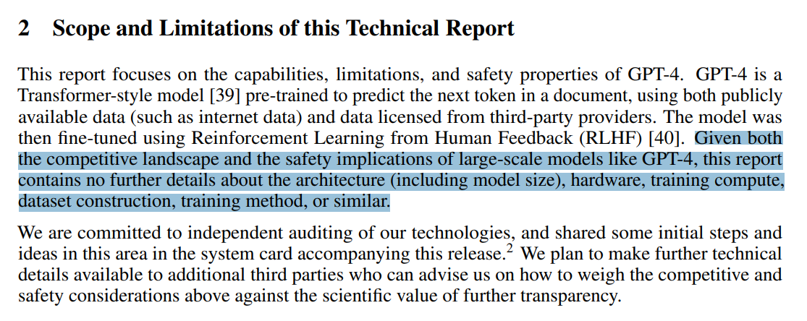

# CS336: 从头开始构建语言模型 (2026春季)


...为您带来第三次开设的 CS336 课程。

第二次开设（2025春季）的讲座已上传至 [YouTube](https://www.youtube.com/playlist?list=PLoROMvodv4rOY23Y0BoGoBGgQ1zmU_MT_)。

**有什么新内容？**
- 同样“从零开始”的理念
- 优先选择高时间价值的概念，不因树木而失去森林
- 更多覆盖现代语言模型要素（混合专家模型、长上下文、智能体）

## 为什么开设这门课程？

**问题**：研究人员正逐渐与底层技术**脱节**。
- **2016年**：研究人员自己实现并训练模型。
- **2018年**：研究人员下载模型（如 BERT）并进行微调。
- **今天**：研究人员直接调用 API 模型（如 GPT/Claude/Gemini）。

虽然提高抽象层次可以提高生产力，但：
- 这些抽象是有漏洞的（与编程语言或操作系统相比）。
- 仍然需要进行一些必须撕开抽象层、修改底层的根本性研究。

**全面理解**底层技术对于**根本性研究**是必不可少的。

本课程的哲学：**通过构建来理解**。

但还有一个小问题……

## 语言模型的工业化


前沿模型的训练成本非常高：
- **2023年**：据传 GPT-4 的训练成本达 1 亿美元。[Wired 报道](https://www.wired.com/story/openai-ceo-sam-altman-the-age-of-giant-ai-models-is-already-over/)
- **2025年**：xAI 建造了包含 23 万张 GPU 的集群用于训练 Grok。[Elon Musk 发布的帖子](https://x.com/elonmusk/status/1947701807389515912)

目前没有关于如何构建前沿模型的公开细节。来自 [GPT-4 技术报告](https://arxiv.org/pdf/2303.08774.pdf)：


前沿模型对我们来说是遥不可及的。我们可以构建小型语言模型（参数量 < 1B），但这可能无法代表超大型语言模型。

- **例子 1**：随着参数规模变化，注意力（attention）与 MLP 中消耗的 FLOPs 比例也会发生改变。[Stephen Roller 发布的帖子](https://x.com/stephenroller/status/1579993017234382849)
  
- **例子 2**：行为随参数规模增长的涌现现象。[Emergent Abilities of Large Language Models (Wei et al., 2022)](https://arxiv.org/pdf/2206.07682)
  

## 我们能在这门课中学到哪些可以迁移到前沿模型的知识？
有三种知识：
- **机制 (Mechanics)**：事物是如何工作的（如什么是 Transformer、模型并行是如何工作的）
- **心态 (Mindset)**：最大化榨干硬件性能、认真对待扩展（scaling）
- **直觉 (Intuitions)**：哪些数据和建模决策会带来良好的准确率

我们能够教授机制和心态（这两者可以迁移）。我们只能部分教授直觉（直觉不一定能跨参数规模迁移）。

## 直觉？ 🤷
有些设计决策在当时是无法被（理论上）证实的，而仅仅是来自于实验。
例如：Noam Shazeer 介绍 SwiGLU 的论文 [GLU Variants Improve Transformer (Shazeer, 2020)](https://arxiv.org/pdf/2002.05202.pdf)：


## 苦涩的教训 (The bitter lesson)
- **错误的解读**：参数规模决定一切，算法不重要。
- **正确的解读**：能够随着规模扩展而扩展的算法才是重要的。

### 准确率 = 效率 x 资源

实际上，在更大的参数规模下，效率变得更加重要（承受不起任何浪费）。
[Scaling Laws for Neural Language Models (Kaplan et al., 2020)](https://arxiv.org/abs/2005.04305) 展示了 2012 年至 2019 年间 ImageNet 上 44 倍的算法效率提升。

核心出发点：在给定的计算和数据预算下，最大化模型效率！

## 预神经网络时代 (2010年代之前)
- 测量英语熵的语言模型 [Prediction and Entropy of Printed English (Shannon, 1950)](https://www.princeton.edu/~wbialek/rome/refs/shannon_51.pdf)
- N-gram 语言模型（用于机器翻译和语音识别系统） [Language Models in Machine Translation (Brants et al., 2007)](https://aclanthology.org/D07-1090.pdf)

## 神经网络要素 (2010年代)
- 长短期记忆网络 (LSTM) [Long Short-Term Memory (Hochreiter & Schmidhuber, 1997)](https://www.bioinf.jku.at/publications/older/2604.pdf)
- 第一个神经语言模型 [A Neural Probabilistic Language Model (Bengio et al., 2003)](https://www.jmlr.org/papers/volume3/bengio03a/bengio03a.pdf)
- 序列到序列建模（用于机器翻译） [Sequence to Sequence Learning with Neural Networks (Sutskever et al., 2014)](https://arxiv.org/pdf/1409.3215.pdf)
- Adam 优化器 [Adam: A Method for Stochastic Optimization (Kingma & Ba, 2014)](https://arxiv.org/pdf/1412.6980.pdf)
- 注意力机制（用于机器翻译） [Neural Machine Translation by Jointly Learning to Align and Translate (Bahdanau et al., 2015)](https://arxiv.org/pdf/1409.0473.pdf)
- Transformer 架构（用于机器翻译） [Attention Is All You Need (Vaswani et al., 2017)](https://arxiv.org/pdf/1706.03762.pdf)
- 混合专家模型 (MoE) [Outrageously Large Neural Networks: The Sparsely-Gated Mixture-of-Experts Layer (Shazeer et al., 2017)](https://arxiv.org/pdf/1701.06538.pdf)
- 模型并行 [GPipe (Huang et al., 2018)](https://arxiv.org/pdf/1811.06965.pdf), [ZeRO (Rajbhandari et al., 2019)](https://arxiv.org/pdf/1910.02054.pdf), [Megatron-LM (Shoeybi et al., 2019)](https://arxiv.org/pdf/1909.00325.pdf)

## 早期基座模型 (2010年代末)
- ELMo：使用 LSTM 进行预训练，微调改善下游任务 [Deep contextualized word representations (Peters et al., 2018)](https://arxiv.org/abs/1802.05365)
- BERT：使用 Transformer 进行预训练，微调改善下游任务 [BERT: Pre-training of Deep Bidirectional Transformers for Language Understanding (Devlin et al., 2018)](https://arxiv.org/abs/1810.04805)
- Google 的 T5 (11B)：将所有任务都转换为文本到文本形式 [Exploring the Limits of Transfer Learning with a Unified Text-to-Text Transformer (Raffel et al., 2019)](https://arxiv.org/pdf/1910.10683.pdf)

## 拥抱扩展 (Scaling)
- OpenAI 的 GPT-2 (1.5B)：流畅的文本，首次显现 Zero-shot 状态 [Language Models are Unsupervised Multitask Learners (Radford et al., 2019)](https://cdn.openai.com/better-language-models/language_models_are_unsupervised_multitask_learners.pdf)
- 扩展法则 (Scaling laws)：为参数量扩张提供预测性和信心 [Scaling Laws for Neural Language Models (Kaplan et al., 2020)](https://arxiv.org/pdf/2001.08361.pdf)
- OpenAI 的 GPT-3 (175B)：上下文内学习 (In-context learning) [Language Models are Few-Shot Learners (Brown et al., 2020)](https://arxiv.org/pdf/2005.14165.pdf)
- Google 的 PaLM (540B)：超大规模，但未完全训练充分 [PaLM: Scaling Language Modeling with Pathways (Chowdhery et al., 2022)](https://arxiv.org/pdf/2204.02311.pdf)
- DeepMind 的 Chinchilla (70B)：计算最优的扩展定律 [Training Compute-Optimal Large Language Models (Hoffmann et al., 2022)](https://arxiv.org/pdf/2203.15556.pdf)

## 开放模型 (Open Models)
早期的复现尝试（尝试复现 GPT-3）：
- EleutherAI 的开放数据集 (The Pile) 和模型 (GPT-J) [The Pile (Gao et al., 2020)](https://arxiv.org/pdf/2101.00027.pdf), [GPT-J (Wang & Komatsuzaki, 2021)](https://github.com/kingoflolz/mesh-transformer-jax)
- Meta 的 OPT (175B)：GPT-3 的复现，但遇到了许多硬件稳定性问题 [OPT (Zhang et al., 2022)](https://arxiv.org/pdf/2205.01068.pdf)
- Hugging Face / BigScience 的 BLOOM (176B)：侧重于数据来源的多样性 [BLOOM (Scao et al., 2022)](https://arxiv.org/pdf/2211.05100.pdf)

可信赖的开放权重模型（权重 + 论文）：
- Meta 的 Llama 模型 [LLaMA (Touvron et al., 2023)](https://arxiv.org/pdf/2302.13971.pdf), [Llama 2 (Touvron et al., 2023)](https://arxiv.org/pdf/2307.09288.pdf), [Llama 3 (Meta, 2024)](https://arxiv.org/pdf/2407.21783.pdf)
- Mistral 的模型 [Mistral 7B (Jiang et al., 2023)](https://arxiv.org/pdf/2310.06825.pdf), [Mixtral of Experts (Jiang et al., 2024)](https://arxiv.org/pdf/2401.04088.pdf)
- DeepSeek 的模型 [DeepSeek LLM (2024)](https://arxiv.org/pdf/2401.02954.pdf), [DeepSeek-V2](https://arxiv.org/pdf/2405.04434.pdf), [DeepSeek-V3](https://github.com/deepseek-ai/DeepSeek-V3), [DeepSeek-R1](https://github.com/deepseek-ai/DeepSeek-R1), [DeepSeek-V3.2](https://github.com/deepseek-ai/DeepSeek-V3.2)
- 阿里巴巴的 Qwen 模型 [Qwen2.5 (2024)](https://arxiv.org/pdf/2412.12345.pdf), [Qwen3 (2025)](https://arxiv.org/pdf/2502.12345.pdf)
- 月之暗面的 Kimi 模型 [Kimi 1.5 (2025)](https://arxiv.org/pdf/2501.12345.pdf), [Kimi K2.5 (2026)](https://arxiv.org/pdf/2601.12345.pdf)
- 智谱的 GLM 模型 [GLM-4.5 (2025)](https://arxiv.org/pdf/2501.12345.pdf), [GLM-5 (2026)](https://arxiv.org/pdf/2601.12345.pdf)
- Minimax 的模型 [MiniMax-M2.5 (2026)](https://arxiv.org/pdf/2601.12345.pdf)
- 小米的 MIMO 模型 [Xiaomi MIMO v2 (2026)](https://arxiv.org/pdf/2602.12345.pdf)

这些开放权重模型正逐步逼近闭源模型（GPT, Claude, Gemini 等）。

开源模型（权重 + 论文 + 代码 + 数据）：
- AI2 的 Olmo 模型 [OLMo (Groeneveld et al., 2024)](https://arxiv.org/pdf/2402.00838.pdf), [OLMo 2 (2025)](https://arxiv.org/pdf/2502.00838.pdf), [OLMo 3 (2025)](https://arxiv.org/pdf/2510.00838.pdf)
- NVIDIA 的 Nemotron 模型 [Nemotron 15B (2024)](https://arxiv.org/pdf/2402.12345.pdf), [Nemotron-3 (2025)](https://arxiv.org/pdf/2502.12345.pdf)
- Marin 的模型（开放式开发） [Marin 8B (2025)](https://github.com/marin-project/marin), [Marin 32B (2025)](https://github.com/marin-project/marin)

开放性对于信任和创新非常重要 [The Openness of Foundation Models (2024)](https://arxiv.org/abs/2403.07918)。来自开放模型的想法使得我们能够开设 CS336 这门课。

什么是语言模型？
- **2018年 (BERT)**：你需要微调的东西
- **2020年 (GPT-3)**：你需要提示（prompt）的东西
- **2022年 (ChatGPT)**：你与其交谈的东西 [对话示例](https://huggingface.co/datasets/HuggingFaceTB/smoltalk/viewer/all/train?row=72&conversation-viewer=72)
- **2026年 (智能体)**：可以自主行动的东西 [运行轨迹示例](https://huggingface.co/datasets/nebius/SWE-rebench-openhands-trajectories/viewer/default/train?conversation-viewer=1)

虽然规格有所不同（更长上下文，推理效率变得极其重要），但其基本原理是完全相同的（注意力、算子核、优化算法）。

## 什么是可执行讲座？
这是一个*可执行讲座*，一个通过运行来传递讲座内容的程序。
可执行讲座使得以下操作成为可能：
- 查看并运行代码（因为一切都是代码！）

```python
total = 0  # 检查 total 的值
for x in [1, 2, 3]:  # 检查 x 的值
    total += x  # 检查 total 的值
```

- 查看讲座的层次结构

## 课程事务
所有信息均在网上公布：[课程官方网站](https://stanford-cs336.github.io/spring2026/)

这是一门 5 学分的课程。
来自 2024 年春季课程评估的评论：
> *整个作业的工作量大约相当于 CS 224n 所有 5 个作业加上最终项目的总和。而这仅仅是第一个作业。*

### 为什么你应该选这门课
- 你有一种偏执的渴望去理解事物背后的工作原理。
- 你想锻炼自己的研究工程能力。

### 为什么你不应该选这门课
- 你真的想在这学期做科研发论文。（去和你的导师谈谈。）
- 你对学习 AI 中最新最热的技术（如多模态、RAG 等）感兴趣。（你应该选一门研讨课。）
- 你想在自己的应用领域取得好成果。（你应该直接提示或微调现有模型。）

### 如何在家里跟着学习
- 所有讲义和作业都会发布在网上，欢迎自行跟着学习。
- 讲座会通过 [CGOE](https://cgoe.stanford.edu/) 进行录制。

### 课程作业
- 5 次作业（基础、系统、扩展定律、数据、对齐）。
- 没有脚手架代码，但我们提供单元测试 and 适配器接口，帮助你检查正确性。
- 在本地实现并测试正确性，然后在集群上运行进行基准测试（准确率与速度）。
- 排行榜：在给定训练预算下最小化困惑度。

### AI 使用政策
- 编码智能体可以解决所有作业，但你将学不到任何东西。
- AI 在解答疑问和辅导方面可以发挥巨大作用。
- 你必须使用我们提供的 `AGENTS.md` 文件，该文件会要求 AI 具有教学思维。
- 请阅读我们的 [AI 政策指南](https://docs.google.com/document/d/1SZAlExB1qAc9izHt54gwunNpjKE6wXb8Y7yA_e-baK8/edit?tab=t.0)。

### 算力
- 感谢 [Modal](https://modal.com/) 提供算力支持。🙏
- 请阅读[算力使用指南](https://docs.google.com/document/d/1cHE0iKVyXLJ3XpIs2XuXTmZ-HMmPk2hIPeCvy-AydMg/edit?tab=t.otis27tacaef)，了解如何访问和使用算力。

---

## 课程大纲

我们将覆盖以下几个方向：
- **基础 (Basics)**：分词、模型架构、训练（作业 1）
- **系统 (Systems)**：算子核、并行化、推理（作业 2）
- **扩展定律 (Scaling Laws)**：扩展定律（作业 3）
- **数据 (Data)**：评估、筛选、清洗、去重、数据配比（作业 4）
- **对齐 (Alignment)**：RLHF、强化学习算法、RL 系统（作业 5）

请记住，一切都与**效率**有关：
- 资源：数据 + 硬件（算力、内存、通信带宽）
- 在固定资源预算下，如何训练出最好的模型？

如今我们受到计算资源的限制，因此设计决策将反映出如何最大化压榨给定的硬件性能。
- **系统**：显然是关于效率的。
- **分词**：直接对原始字节进行操作虽然优雅，但在当下的模型架构下计算效率较低。
- **模型架构**：许多改动的动机在于减少显存或 FLOPs（例如共享 KV 缓存、滑动窗口注意力）。
- **数据筛选**：避免在糟糕/无关的数据上更新梯度，浪费宝贵的算力。
- **扩展定律**：在更小规模的模型上使用更少的计算来进行超参数调优。

明天，我们将面临数据的限制……

## 作业 1：基础 (Basics)

目标：能够训练一个基础语言模型。
组件：分词、模型架构、训练。

### 分词 (Tokenization)
模型操作的基本原子是什么？
形式上：分词器在原始输入（字节）与整数序列（Token）之间进行转换。


流行的分词器：**字节对编码 (Byte-Pair Encoding, BPE)** [Neural Machine Translation of Rare Words with Subword Units (Sennrich et al., 2015)](https://arxiv.org/abs/1508.07909)
直觉：将输入切分为高频出现的块。

从效率的角度来看：
- 缩短上下文长度（1000 字节 -> ~250 Token）
- 自适应计算（在感兴趣的输入部分分配更多的模型容量）

梦想：免分词的模型架构，直接对字节进行操作 [ByT5 (Xue et al., 2021)](https://arxiv.org/pdf/2105.13626.pdf), [MEGABYTE (2023)](https://arxiv.org/pdf/2305.07185.pdf), [BLT: Byte-Latent Transformer (2024)](https://arxiv.org/pdf/2412.09876.pdf), [Token-Free Autoregressive Language Modeling (2024)](https://arxiv.org/pdf/2406.12345.pdf), [HNet: Hierarchical Byte-level Transformer (2025)](https://arxiv.org/pdf/2501.12345.pdf)
这些方案虽然有前景，但目前尚未扩展到前沿模型的规模。

### 模型架构 (Model architecture)
起点：原始 Transformer [Attention Is All You Need (Vaswani et al., 2017)](https://arxiv.org/pdf/1706.03762.pdf)


改进细化：
- **激活函数**：ReLU, SwiGLU [GLU Variants Improve Transformer (Shazeer, 2020)](https://arxiv.org/pdf/2002.05202.pdf)
- **位置编码**：正弦、RoPE [RoFormer (Su et al., 2021)](https://arxiv.org/pdf/2104.09864.pdf)
- **归一化**：LayerNorm, RMSNorm, QK norm, 前归一化（pre-norm）对比后归一化（post-norm） [Layer Normalization (Ba et al., 2016)](https://arxiv.org/pdf/1607.06450.pdf), [Root Mean Square Layer Normalization (Zhang & Sennrich, 2019)](https://arxiv.org/pdf/1910.07467.pdf), [Query-Key Normalization (2023)](https://arxiv.org/pdf/2302.10323.pdf), [On Layer Normalization in Transformer (Xiong et al., 2020)](https://arxiv.org/pdf/2002.04745.pdf)
- **注意力**：全局注意力、稀疏/局部注意力、分组查询注意力 (GQA)、多头潜在注意力 (MLA) [Sparse Transformers (Child et al., 2019)](https://arxiv.org/pdf/1904.10509.pdf), [GQA (Ainslie et al., 2023)](https://arxiv.org/pdf/2305.13245.pdf), [DeepSeek-V2 (2024)](https://arxiv.org/pdf/2405.04434.pdf)
- **循环/状态空间模型/线性注意力**：Mamba, Gated DeltaNet [Transformers are RNNs (Katharopoulos et al., 2020)](https://arxiv.org/pdf/2006.16236.pdf), [Transformers are SSMs (Dao & Gu, 2024)](https://arxiv.org/pdf/2405.21060.pdf), [Gated Delta Networks (2024)](https://arxiv.org/pdf/2409.12356.pdf), [Mamba-3 (2026)](https://arxiv.org/pdf/2601.12345.pdf)
- **MLP**：稠密、混合专家模型 (MoE) [Mixture-of-Experts (Shazeer et al., 2017)](https://arxiv.org/pdf/1701.06538.pdf), [Switch Transformers (Fedus et al., 2021)](https://arxiv.org/pdf/2101.03961.pdf)
- **维度形状**：（隐藏维度、深度、头数、专家数）

### 训练 (Training)
如何设置模型参数？
- **损失函数**：如多 Token 预测 [Multi-Token Prediction (2024)](https://arxiv.org/pdf/2404.19737.pdf), [DeepSeek-V3](https://github.com/deepseek-ai/DeepSeek-V3)
- **优化器**：如 AdamW, SOAP, Muon [Adam (Kingma & Ba, 2014)](https://arxiv.org/pdf/1412.6980.pdf), [Decoupled Weight Decay (Loshchilov & Hutter, 2017)](https://arxiv.org/pdf/1711.05101.pdf), [SOAP (2024)](https://arxiv.org/pdf/2409.11321.pdf), [Muon (2024)](https://github.com/KellerJordan/Muon)
- **初始化规模**：如 Xavier 初始化、muP [Xavier init (Glorot & Bengio, 2010)](https://proceedings.mlr.press/v9/glorot10a/glorot10a.pdf), [muP (Yang et al., 2022)](https://arxiv.org/pdf/2203.03466.pdf)
- **学习率表**：如余弦、WSD [Stochastic Gradient Descent with Warm Restarts (Loshchilov & Hutter, 2016)](https://arxiv.org/pdf/1608.03983.pdf), [MiniCPM (Hu et al., 2024)](https://arxiv.org/pdf/2404.06395.pdf)
- **正则化**：如 dropout、权重衰减 (weight decay)
- **批大小**：如临界批大小 [Empirical Model of Large-Batch Training (McCandlish et al., 2018)](https://arxiv.org/pdf/1812.06162.pdf)
- **MoE 特有**：负载均衡（如 aux-free） [Auxiliary-Loss-Free Load Balancing (Wang et al., 2024)](https://arxiv.org/pdf/2408.15664.pdf), [DeepSeek-V3](https://github.com/deepseek-ai/DeepSeek-V3)

### 作业 1 (基础)
[GitHub 代码仓](https://github.com/stanford-cs336/assignment1-basics) | [作业 PDF](https://github.com/stanford-cs336/assignment1-basics/blob/main/cs336_spring2026_assignment1_basics.pdf)
- 实现 BPE 分词器
- 实现 Transformer、交叉熵损失、AdamW 优化器、训练循环
- 进行资源审计 (resource accounting)
- 在 TinyStories 和 OpenWebText 上训练模型
- 排行榜：在 B200 上训练 45 分钟，最小化 OpenWebText 上的困惑度 [去年排行榜](https://github.com/stanford-cs336/spring2025-assignment1-basics-leaderboard)

高层原则：一切都是为了权衡以下三点：
- **表达能力 (Expressivity)**：能表示数据中复杂的依赖关系
- **稳定性 (Stability)**：将参数和梯度范数保持在合适区间
- **效率 (Efficiency)**：在硬件上运行快速，不论是训练还是推理

## 作业 2：系统 (Systems)

目标：榨干硬件（GPU 或 TPU）的性能。
组件：算子核、并行化、推理。

### 基础
- 资源核算：模型的显存与计算特征。
  * 训练 70B 参数模型在 1T Token 上 = $6 \times 70\text{B} \times 1\text{T} = 4.2 \times 10^{23}$ FLOPs。
  
- 模型参数必须从内存 (HBM) 移动到计算单元 (SMs)。
- 例如：B200 可以执行 2.25 PFLOP/sec (bf16)，内存带宽为 8TB/sec。
- 顶线分析 (Roofline analysis)：确定我们是计算受限 (compute-bound) 还是显存受限 (memory-bound)。
- 基准测试和分析 (nsight)：看实际运行情况。

[DGX B200 系统拓扑](https://docs.nvidia.com/dgx/dgxb200-user-guide/introduction-to-dgxb200.html)：


### 算子核 (Kernels)
- 算子核是在 GPU 上运行的函数。
- 使用 PyTorch 时，每个原始操作都会启动一个标准算子核。
- 可以编写自定义核函数让 GPU “飞起来”。
- 原则：组织计算以最小化数据传输。
  * 朴素方案：读 HBM -> 计算 A -> 写 HBM -> 读 HBM -> 计算 B -> 写 HBM
  * 融合方案：读 HBM -> 计算 A 和 B -> 写 HBM
- 策略：算子融合（矩阵乘法 + 激活函数）、分块（FlashAttention）。
- 扭曲分歧 (Warp divergence)、内存合并 (memory coalescing)、银行冲突 (bank conflicts)、占用率 (occupancy)、大容量异步内存传输。
- 用 CUDA/**Triton**/CUTLASS/ThunderKittens 编写算子核。

### 并行化 (Parallelism)
- 如果我们有 1024 张 GPU 怎么办？
- GPU 之间的数据传输甚至更慢，但“最小化数据传输”的原则依然适用。
- 使用经典的集合通信操作（如 gather, reduce, all-reduce）。
- 将内存（参数、激活值、梯度、优化器状态）分片存储在不同的 GPU 上。
- 如何拆分计算：{数据、张量、流水线、序列、专家} 并行。

### 推理 (Inference)
目标：在给定提示（prompt）下生成 Token（实际使用模型时所需！）。
强化学习、测试时计算（test-time compute）、评估同样需要推理。
两个阶段：首字生成 (prefill) 和后续生成 (decode)。

- Prefill（类似于训练）：Token 已给出，可以一次性处理（计算受限）。
- Decode：需要一次生成一个 Token（显存受限）。
加速解码的方法：
- 使用更轻量级的模型（通过模型剪枝、量化、蒸馏）。
- 投机解码 (Speculative decoding)：使用轻量级的“草稿”模型生成多个 Token，然后使用完整模型并行进行验证（无损加速！）。
- 系统级优化：融合算子核、连续批处理 (continuous batching)。

### 作业 2 (系统)
[GitHub 代码仓](https://github.com/stanford-cs336/assignment2-systems) | [2025春季 PDF](https://github.com/stanford-cs336/assignment2-systems/blob/spring2025/cs336_spring2025_assignment2_systems.pdf)
- 用 Triton 实现一个融合的 RMSNorm 算子核
- 实现分布式数据并行训练 (DDP)
- 实现优化器状态分片 (ZeRO-1)
- 对实现进行基准测试和性能分析

推荐阅读书籍：[《How to Scale Your Model》](https://jax-ml.github.io/scaling-book/)

## 作业 3：扩展定律 (Scaling Laws)

设定：如果你拥有 $10^{25}$ FLOPs 的算力，你会使用什么超参数来训练一个好模型？
在全尺寸上进行超参数调优的成本太高了！

核心概念转变：与其考虑单一规模，不如考虑**扩展配方 (scaling recipe)**（FLOPs -> 超参数）
对于扩展配方：
- 运行实验，在各种更小的规模上（如最高 $10^{24}$ FLOPs）计算损失。
- 拟合扩展定律，以预测目标规模（如 $10^{25}$ FLOPs）下的扩展配方损失。

现在你可以：
1. 运行小规模实验，来优化针对更大规模的扩展配方。
2. 在实际运行实验前，就能预测目标规模下的损失！

扩展定律不会自动发生，它们需要精心设计扩展配方。 
以能够实现**超参数迁移 (hyperparameter transfer)** 的方式来参数化模型 [muP (Yang et al., 2022)](https://arxiv.org/pdf/2203.03466.pdf)
可预测性至少与最优性同样重要！

问题：在给定 FLOPs 预算下（$C = 6 N D$），是用更大的模型（N）还是在更多数据上训练（D）？
经典的计算最优扩展定律：[Scaling Laws (Kaplan et al., 2020)](https://arxiv.org/pdf/2001.08361.pdf), [Chinchilla (Hoffmann et al., 2022)](https://arxiv.org/pdf/2203.15556.pdf)
- 等 FLOPs 曲线 (ISOFLOP curves)：针对多个小型 FLOP 预算，找到最优的 N。
- 然后拟合扩展定律，外推到大规模 FLOP 预算。


结论：$D = 20 N$ 大致是最优的（例如，70B 参数的模型应当训练在约 1.4T Token 上）。
注意：这没有考虑推理成本（如果考虑推理成本，我们更希望模型参数量小一些，进行超量训练）。

来自 Marin 的真实案例 [Percy Liang 发布的帖子](https://x.com/percyliang/status/2034367256277533100)

本周应该能训练完，来看看我们与预注册损失的匹配程度！

### 作业 3 (扩展定律)
[GitHub 代码仓](https://github.com/stanford-cs336/assignment3-scaling) | [2025春季 PDF](https://github.com/stanford-cs336/assignment3-scaling/blob/master/cs336_spring2025_assignment3_scaling.pdf)
- 我们根据先前的运行定义了一个训练 API（超参数 -> 损失）
- 在固定 FLOPs 预算下提交“训练作业”，并收集数据点
- 对数据点拟合扩展定律
- 提交外推的超参数与损失预测
- 排行榜：在给定 FLOPs 预算下最小化损失

## 作业 4：数据 (Data)

问题：我们希望模型拥有哪些能力？
多语言？擅长对话？智能体编码能力？

### 评估 (Evaluation)
评估的目的是什么？
1. 内部评估：指导模型开发（跨规模的平滑性，相对表现更为重要）
2. 外部评估：衡量真实用例的绝对质量（生态有效性更为重要）
评估的例子：
1. 困惑度 (Perplexity)：最好在互联网上不存在的私人文档上运行（避免数据污染）
2. 高级用例：GPQA, HLE, SWE-Bench, Terminal-Bench
大语言模型是通用工具，需要多样化的评估集合！

### 数据整理 (Data curation)
- 数据不会凭空掉下来。
- 来源：从互联网爬取的网页、书籍、arXiv 论文、GitHub 代码等。

- 诉诸合理使用（fair use）来在版权数据上进行训练？[Talkin' 'Bout AI Generation (2023)](https://arxiv.org/pdf/2303.15715.pdf)
- 可能需要对数据进行授权（例如 Google 与 Reddit 达成的协议）[路透社报道](https://www.reuters.com/technology/reddit-ai-content-licensing-deal-with-google-sources-say-2024-02-22/)
- 原始数据是 HTML, PDF, 目录（而非纯文本），需要进行处理。

### 数据处理 (Data processing)
- 转换：将 HTML/PDF 转换为文本（提取主体内容）
- 过滤：保留高质量数据，去除有害内容（通过分类器）
- 去重：节省计算资源，避免死记硬背；使用布隆过滤器 (Bloom filters) 或 MinHash
- 数据混合：如何对各个数据源进行加权/降权？[RegMix (2025)](https://arxiv.org/pdf/2501.05432.pdf), [OLMix (2026)](https://arxiv.org/pdf/2602.05432.pdf)
- 重写 / 合成数据：使用大语言模型增强真实数据，使其更接近下游任务 [WRAP (2024)](https://arxiv.org/pdf/2401.12345.pdf)

数据的类型：
- 预训练数据：规模庞大且多样化
- 中期训练数据：高质量，包括长上下文数据
- 后期训练数据：监督微调（对话、带工具调用的智能体轨迹）

### 作业 4 (数据)
[GitHub 代码仓](https://github.com/stanford-cs336/assignment4-data) | [2025春季 PDF](https://github.com/stanford-cs336/assignment4-data/blob/spring2025/cs336_spring2025_assignment4_data.pdf)
- 将 Common Crawl HTML 转换为文本
- 训练分类器以过滤质量并去除有害内容
- 使用 MinHash 进行去重
- 排行榜：在给定 Token 预算下最小化困惑度

## 作业 5：对齐 (Alignment)

到目前为止，我们已经在完全监督下训练了模型（预测下一个 Token）。
既然模型已经比较合理，我们可以通过**弱监督**来进一步提升它。
为什么用弱监督？因为给出评价比起直接生成要容易得多。

基本步骤：
1. 从模型中生成回复。
2. 用 {人类、校验器、大模型裁判} 来对回复进行评分。
3. 更新模型以使其更偏好高分回复。

对齐算法：
- 近端策略优化 (PPO)：来自强化学习 [PPO (Schulman et al., 2017)](https://arxiv.org/pdf/1707.06347.pdf), [InstructGPT (Ouyang et al., 2022)](https://arxiv.org/pdf/2203.02155.pdf)
- 直接偏好优化 (DPO)：针对偏好数据，形式更为简单 [DPO (Rafailov et al., 2023)](https://arxiv.org/pdf/2305.18290.pdf)
- 集团相对偏好优化 (GRPO)：省去了价值函数网络 [DeepSeekMath / GRPO (Shao et al., 2024)](https://arxiv.org/pdf/2402.03300.pdf)

挑战：
- 强化学习算法通常不稳定且难以调优
- 在大规模下，这需要大量的新架构支持（带异步 rollout 的推理）
- 不断在系统效率 and 同分布策略 (on-policyness) 之间进行权衡

### 作业 5 (对齐)
[GitHub 代码仓](https://github.com/stanford-cs336/assignment5-alignment) | [2025春季 PDF](https://github.com/stanford-cs336/assignment5-alignment/blob/spring2025/cs336_spring2025_assignment5_alignment.pdf)
- 实现直接偏好优化 (DPO)
- 实现集团相对偏好优化 (GRPO)

# 第一单元：分词 (Tokenization)

本单元受到了 Andrej Karpathy 关于分词视频的启发，推荐观看！[Andrey Karpathy 的 YouTube 视频](https://www.youtube.com/watch?v=zduSFxRajkE)

原始文本通常表示为 Unicode 字符串。我们需要一个分词器在 Unicode 字符串与整数序列（Token）之间进行转换。

```python
# 定义抽象接口和所有分词器实现

from abc import ABC
from dataclasses import dataclass
from collections import defaultdict
import os
import regex
import tiktoken

class Tokenizer(ABC):
    """分词器的抽象接口。"""
    def encode(self, string: str) -> list[int]:
        raise NotImplementedError

    def decode(self, indices: list[int]) -> str:
        raise NotImplementedError


class CharacterTokenizer(Tokenizer):
    """将字符串表示为 Unicode 码点序列。"""
    def encode(self, string: str) -> list[int]:
        return list(map(ord, string))

    def decode(self, indices: list[int]) -> str:
        return "".join(map(chr, indices))


class ByteTokenizer(Tokenizer):
    """将字符串表示为字节序列。"""
    def encode(self, string: str) -> list[int]:
        string_bytes = string.encode("utf-8")  # 字节表示
        indices = list(map(int, string_bytes))  # 整数索引
        return indices

    def decode(self, indices: list[int]) -> str:
        string_bytes = bytes(indices)  # 还原字节
        string = string_bytes.decode("utf-8")  # 还原字符串
        return string


def merge(indices: list[int], pair: tuple[int, int], new_index: int) -> list[int]:
    """返回 indices，但将其中所有出现的 pair 替换为 new_index。"""
    new_indices = []
    i = 0
    while i < len(indices):
        if i + 1 < len(indices) and indices[i] == pair[0] and indices[i + 1] == pair[1]:
            new_indices.append(new_index)
            i += 2
        else:
            new_indices.append(indices[i])
            i += 1
    return new_indices


@dataclass(frozen=True)
class BPETokenizerParams:
    """指定 BPETokenizer 所需的全部参数。"""
    vocab: dict[int, bytes]     # 索引 -> 字节
    merges: dict[tuple[int, int], int]  # (索引1, 索引2) -> 新索引


class BPETokenizer(Tokenizer):
    """给定合并规则和词表的 BPE 分词器。"""
    def __init__(self, params: BPETokenizerParams):
        self.params = params

    def encode(self, string: str) -> list[int]:
        indices = list(map(int, string.encode("utf-8")))
        # 注意：这是一种非常慢的实现方式
        for pair, new_index in self.params.merges.items():
            indices = merge(indices, pair, new_index)
        return indices

    def decode(self, indices: list[int]) -> str:
        bytes_list = list(map(self.params.vocab.get, indices))
        string = b"".join(bytes_list).decode("utf-8")
        return string


def get_compression_ratio(string: str, indices: list[int]) -> float:
    """给定被编码为 indices 的 string，返回每个 Token 对应的 UTF-8 字节数。"""
    num_bytes = len(bytes(string, encoding="utf-8"))
    num_tokens = len(indices)
    return num_bytes / num_tokens


def get_gpt5_tokenizer():
    return tiktoken.get_encoding("o200k_base")


def output_tokenizer(tokenizer, path: str):
    """将 tokenizer 的词表写入 path，每行一个 Token。"""
    if not os.path.exists(path):
        vocab = [b.decode("utf-8", errors="replace") for b in tokenizer.token_byte_values()]
        os.makedirs(os.path.dirname(path), exist_ok=True)
        with open(path, "w") as f:
            for token in vocab:
                f.write(token + "\n")


def train_bpe(string: str, num_merges: int) -> BPETokenizerParams:
    # 从字符串的字节列表开始
    indices = list(map(int, string.encode("utf-8")))
    merges = {}  # (索引1, 索引2) => 合并后的新索引
    vocab = {x: bytes([x]) for x in range(256)}  # 索引 -> 字节

    for i in range(num_merges):
        # 统计每对相邻 Token 的出现次数
        counts = count_adjacent_pairs(indices)
        if not counts:
            break
        # 找出最常见的一对
        pair = max(counts, key=counts.get)
        # 合并这一对
        new_index = 256 + i
        merges[pair] = new_index
        vocab[new_index] = vocab[pair[0]] + vocab[pair[1]]
        indices = merge(indices, pair, new_index)
    return BPETokenizerParams(vocab=vocab, merges=merges)


def count_adjacent_pairs(indices: list[int]) -> dict[tuple[int, int], int]:
    """返回一个字典，映射 indices 中每对相邻 Token 的出现次数。"""
    counts = defaultdict(int)
    for index1, index2 in zip(indices, indices[1:]):
        counts[(index1, index2)] += 1
    return counts
```

## 体验分词器

为了直观感受分词器是如何工作的，你可以体验这个 [Tiktokenizer 交互式网站](https://tiktokenizer.vercel.app/?encoder=gpt2)。

### 观察结果
- 一个词和它前面的空格是同一个 Token 的一部分（例如 `" world"`）。
- 位于开头和中间的同一个词的表示方式是不同的（例如 `"hello hello"`）。
- 数字被切分为每几位数字一个 Token。

下面是 OpenAI 的 GPT-5 分词器 (tiktoken) 的实际运行效果：

```python
tokenizer = get_gpt5_tokenizer()
string = "Hello, 🌍! 你好!"
```

检查 `encode()` 和 `decode()` 是否能完好无损地复原（roundtrip）：

```python
indices = tokenizer.encode(string)
reconstructed_string = tokenizer.decode(indices)
print("Token indices:", indices)
print("Reconstructed string:", reconstructed_string)
assert string == reconstructed_string
```

### 压缩率：每个 Token 对应的字节数
压缩率越大，序列越短（这是好事，因为注意力计算量随序列长度呈二次方增长）。
可以通过增加**词表大小**（词表中可选的 Token 值的数量）来提高压缩率，但这会导致嵌入层参数增加与稀疏性。

```python
compression_ratio = get_compression_ratio(string, indices)
vocabulary_size = tokenizer.n_vocab
print(f"Compression ratio: {compression_ratio:.2f} bytes per token")
print("Vocabulary size:", vocabulary_size)
output_tokenizer(tokenizer, "var/gpt5_tokenizer_vocab.txt")
```

## 字符分词器 (Character Tokenizer)

Unicode 字符串是 Unicode 字符的序列。每个字符都可以使用 `ord` 转换为整数（码点），再用 `chr` 还原。

```python
assert ord("a") == 97
assert ord("🌍") == 127757
assert chr(97) == "a"
assert chr(127757) == "🌍"

tokenizer = CharacterTokenizer()
string = "Hello, 🌍! 你好!"
indices = tokenizer.encode(string)
reconstructed_string = tokenizer.decode(indices)
assert string == reconstructed_string

vocabulary_size = max(indices) + 1
compression_ratio = get_compression_ratio(string, indices)
print("Character Tokenizer indices:", indices)
print("Vocabulary size (lower bound):", vocabulary_size)
print(f"Compression ratio: {compression_ratio:.2f} bytes per token")
```

全世界大约有 15 万个 Unicode 字符。
- **问题 1**：词表非常大。
- **问题 2**：许多字符非常罕见（例如 🌍），这导致词表的利用率很低。

因此，字符分词器集两者的劣势于一身（词表庞大，且压缩率低）。

## 字节分词器 (Byte Tokenizer)

Unicode 字符串可以表示为字节序列，每个字节的值在 0 到 255 之间。最常见的 Unicode 编码是 [UTF-8](https://en.wikipedia.org/wiki/UTF-8)。
- 某些 Unicode 字符由一个字节表示，例如 `bytes("a", encoding="utf-8") == b"a"`。
- 其他的字符则占用多个字节，例如 `bytes("🌍", encoding="utf-8") == b"\xf0\x9f\x8c\x8d"`。

```python
tokenizer = ByteTokenizer()
string = "Hello, 🌍! 你好!"
indices = tokenizer.encode(string)
reconstructed_string = tokenizer.decode(indices)
assert string == reconstructed_string

vocabulary_size = 256
compression_ratio = get_compression_ratio(string, indices)
print("Byte Tokenizer indices:", indices)
print("Vocabulary size:", vocabulary_size)
print(f"Compression ratio: {compression_ratio:.2f} bytes per token")
assert compression_ratio == 1.0
```

字节分词器的词表非常小（仅 256 个值）。但是压缩率极低（始终为 1 字节/Token），这意味着序列会很长。考虑到 Transformer 的上下文长度受限，这个方案同样不太理想。

## 单词分词器 (Word Tokenizer)

另一种经典方法是将字符串按单词切分。

```python
string = "I'll say supercalifragilisticexpialidocious!"
chunks = regex.findall(r"\w+|.", string)
print("Word chunks:", chunks)
compression_ratio = get_compression_ratio(string, chunks)
print(f"Compression ratio: {compression_ratio:.2f} bytes per word-token")
```

**优势**：每个 Token 都有明确的语义（因为单词是人类发明的）。

**劣势**：
- 词表大小会非常巨大（取决于训练数据中不同单词的数量）。
- 许多单词非常罕见，模型难以充分学习它们。
- 遇到训练中没见过的单词时，需要使用一个尴尬的 `UNK` Token 来代替，这会影响概率计算。

## 字节对编码 (BPE)

BPE 算法由 Philip Gage 于 1994 年提出，用于数据压缩。后来被引入 NLP 领域用于机器翻译 [Sennrich et al., 2015](https://arxiv.org/abs/1508.07909)，并被 GPT-2 采纳。[GPT-2 论文](https://cdn.openai.com/better-language-models/language_models_are_unsupervised_multitask_learners.pdf)

**基本思想**：在原始文本上*训练*分词器，构建一个量身定制的词表。高频出现的字节序列合并为一个单独的 Token，而稀有的字节序列保持拆分状态。

**简要算法描述**：从每个字节作为一个单独的 Token 开始，依次将最常出现的相邻 Token 对合并为一个新 Token。

```python
# 训练 BPE 分词器并测试
string = "the cat in the hat"
params = train_bpe(string, num_merges=3)

tokenizer = BPETokenizer(params)
test_string = "the quick brown fox"
indices = tokenizer.encode(test_string)
reconstructed_string = tokenizer.decode(indices)
print("BPE indices for test string:", indices)
print("Reconstructed:", reconstructed_string)
assert test_string == reconstructed_string
```

在作业 1 中，你将在以下几个方面对该实现进行扩展：
- 优化 `encode()`，避免遍历所有规则，仅循环与编码相关的合并规则。
- 检测并保留特殊 Token（例如 `<|endoftext|>`）。
- 采用预分词正则规则（如 GPT-2 的正则表达式，防止合并不同字符类型的词）。
- 极尽所能加速你的代码实现。
