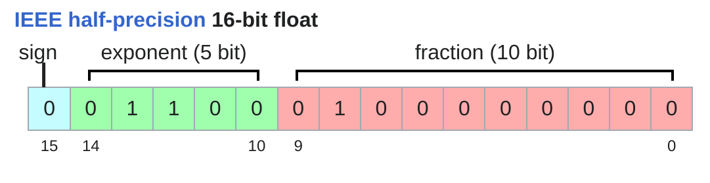
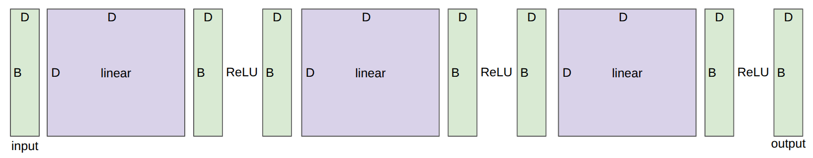

```python
import math
import torch.nn.functional as F
import timeit
from typing import Iterable
import torch
from torch import nn
from einops import rearrange, einsum, reduce
from edtrace import text, image, link
from lecture_util import article_link
from gpu_util import cuda_if_available, get_max_memory_usage
from facts import h100_flop_per_sec, h100_bytes_per_sec
from references import deepseek_v3_2_2025, adagrad_2011, nemotron_3_super_2026
```

# CS336: 从头开始构建语言模型 (2026春季)

# 第二讲：资源核算 (Resource Accounting)

### 课程公告

- 加入 CS336 Slack 频道

- 使用你的 **Stanford** 邮箱注册并加入 Modal 算力平台

- 阅读 [AI 政策指南](https://docs.google.com/document/d/1SZAlExB1qAc9izHt54gwunNpjKE6wXb8Y7yA_e-baK8/edit?tab=t.0)

- 阅读 [集群使用指南](https://docs.google.com/document/d/1cHE0iKVyXLJ3XpIs2XuXTmZ-HMmPk2hIPeCvy-AydMg/edit?tab=t.otis27tacaef)

Marin $10^{23}$ FLOPs 的模型预训练已顺利完成，并且[非常完美地符合我们的预测损失](https://x.com/WilliamBarrHeld/status/2039373983632814318)！


上一讲内容回顾：课程概述与分词 (Tokenization)。

今天主题：**系统底座的资源核算 (Resource Accounting)**。

> **核心出发点**：在硬件资源（算力、显存）固定的情况下，如何训练出最好的模型？

> 也就是说，要最大化**计算效率**。

> **前提条件**：准确分析和核算给定计算任务的资源消耗。

### 辅助工具函数 (Utility Helper Functions)

在正式开始本节课的实验前，我们先定义一些底层的辅助工具函数（计算张量显存大小、查询 GPU 理论峰值 FLOPS、基准测试测速套件等）。这些辅助函数将在后续各章节中被直接调用。

---
### 💡 知识拓展与沉淀：浮点精度、GPU 算力架构与基准测速

#### 1. 大模型训练与推理中的浮点数精度体系
任何 IEEE 754 浮点数均由 **符号位 (S)**、**指数位 (E，决定动态范围)** 和 **尾数位 (M，决定精度/有效数字)** 构成：

| 精度格式 | 总位数 (字节) | 构成 (S+E+M) | 动态范围 | 典型应用场景与优缺点 |
| :--- | :--- | :--- | :--- | :--- |
| **FP32** (单精度) | 32-bit (4B) | 1 + 8 + 23 | ~ $10^{\pm 38}$ | **基准精度**。用于优化器状态 (AdamW 动量)、主权重副本、Softmax/LayerNorm 等数值敏感算子。 |
| **FP16** (半精度) | 16-bit (2B) | 1 + 5 + 10 | ~ $6\times 10^{-5} \sim 65504$ | 早期混合精度训练（易下溢归零，需 Loss Scaling）；现主要用于推理。 |
| **BF16** (Brain Float) | 16-bit (2B) | 1 + 8 + 7 | ~ $10^{\pm 38}$ | **当前 LLM 预训练绝对主力**。拥有与 FP32 相同的动态范围，彻底避免下溢，无需复杂缩放。 |
| **FP8 (E4M3)** | 8-bit (1B) | 1 + 4 + 3 | [-448, 448] | **前向传播与推理**（精度相对高，动态范围适中）。 |
| **FP8 (E5M2)** | 8-bit (1B) | 1 + 5 + 2 | [-57344, 57344] | **反向传播梯度计算**（动态范围大，防止梯度爆炸/消失）。 |
| **FP4 / NVFP4** | 4-bit (0.5B) | 块缩放微精度 | 极小范围 (配合 Scale) | Blackwell 架构新特性，用于极端极致的吞吐加速与超低比特推理/训练。 |

> **混合精度训练 (Mixed Precision Training / AMP) 范式**：
> - **BF16**：用于模型参数、前向激活值、反向梯度及 GEMM 矩阵乘法（省 50% 显存，跑满 Tensor Core 算力）。
> - **FP32**：用于优化器内部的主权重更新与一阶/二阶动量累积，保证极小更新步长不被舍入截断。

---

#### 2. 服务器/数据中心 GPU 代际与算力标称定位
数据中心级 GPU 配备超高带宽 HBM 显存与专属 Tensor Core 矩阵乘法加速核心：
- **A100 (Ampere 架构, 2020)**：FP32 峰值 19.5 TFLOP/s，BF16/FP16 Tensor Core 密集算力 **312 TFLOP/s**。
- **H100 (Hopper 架构, 2022)**：FP32 峰值 67.5 TFLOP/s，BF16/FP16 官方宣传 1979 TFLOP/s（但此为 **2:4 结构化稀疏** 下的指标，稠密无稀疏矩阵乘法的真实算力为其一半，即 **`1979e12 / 2 = 989.5 TFLOP/s`**）。引入 Transformer Engine 原生支持 FP8。
- **B200 (Blackwell 架构, 2024+)**：双芯封装，BF16/FP16 稠密算力达 **2250 TFLOP/s (2.25 PFLOP/s)**，原生支持 NVFP4。

---

#### 3. 辅助函数的设计逻辑与 CUDA 异步陷阱
- **`get_memory_usage(x)`**：利用 `x.numel()`（元素总数）乘以 `x.element_size()`（单元素字节数）计算真实显存占用。
- **`get_promised_flop_per_sec(dtype)`**：根据 GPU 型号与数据精度查表返回**硬件理论峰值算力**，作为计算 **MFU (Model FLOPs Utilization)** 的理论分母。
- **`benchmark(func)` 与 CUDA 异步陷阱**：PyTorch 在 GPU 上执行算子是**异步非阻塞**的（CPU 发送 kernel 指令后立即返回）。必须在执行前后调用 `torch.cuda.synchronize()` 强制阻塞等待 GPU 真正运算完毕，并取多次重复实验平均值，才能测得真实准确的物理耗时。
---

```python
def get_memory_usage(x: torch.Tensor):
    # x.numel() 即 number of elements，返回张量中元素的总个数（等于各维度尺寸相乘）
    # 乘以每个元素的字节大小 (x.element_size())，即可得到张量占用的总显存/内存字节数
    return x.numel() * x.element_size()
```

```python
def get_promised_flop_per_sec(dtype: torch.dtype) -> float:
    """根据 GPU 型号与数据精度，返回官方标称的理论峰值浮点算力 (FLOP/s)，作为计算 MFU 的分母"""
    if not torch.cuda.is_available():
        # 无 CUDA 设备可用，返回基准值 1 防止除以零
        return 1
    properties = torch.cuda.get_device_properties(cuda_if_available())

    # 1. NVIDIA A100 (Ampere 架构)
    if "A100" in properties.name:
        # 标准 FP32 CUDA Core 单精度向量算力: 19.5 TFLOP/s
        if dtype == torch.float32:
            return 19.5e12
        # FP16 / BF16 Tensor Core 稠密半精度矩阵算力: 312 TFLOP/s
        if dtype in (torch.bfloat16, torch.float16):
            return 312e12
        raise ValueError(f"Unknown dtype: {dtype}")

    # 2. NVIDIA H100 SXM (Hopper 架构)
    if "H100" in properties.name:
        # 标准 FP32 算力: 67.5 TFLOP/s
        if dtype == torch.float32:
            return 67.5e12
        # 官方标称 1979 TFLOP/s 是 2:4 结构化稀疏算力；
        # 常规密集矩阵乘法 (Dense MatMul) 为无稀疏算力，正好是标称的一半 (989.5 TFLOP/s)
        if dtype in (torch.bfloat16, torch.float16):
            return 1979e12 / 2
        raise ValueError(f"Unknown dtype: {dtype}")

    # 3. NVIDIA B200 (Blackwell 架构)
    if "B200" in properties.name:
        if dtype == torch.float32:
            return 75e12
        # 官方标称 4.5 PFLOP/s (稀疏)，稠密模式为 2.25 PFLOP/s
        if dtype in (torch.bfloat16, torch.float16):
            return 4.5e15 / 2
        raise ValueError(f"Unknown dtype: {dtype}")

    # 未知 GPU 型号：返回 None 由调用方进行优雅降级处理
    return None
```

```python
def benchmark(func, num_trials: int = 5) -> float:
    """精确测量执行 func 闭包所需的平均物理耗时（秒）"""

    # 1. 测量前同步：等待 GPU 任务队列中之前的所有任务执行完毕，防止干扰
    if torch.cuda.is_available():
        torch.cuda.synchronize()

    def run():
        # 执行目标计算（如矩阵乘法）
        func()
        # 2. 关键同步点：GPU 是异步发射任务的，必须强制同步阻塞等待 GPU 真正计算完成
        # 否则测得的时间仅仅是 CPU 发射指令给 GPU 的微秒级时间，会导致算力计算虚高几千倍
        if torch.cuda.is_available():
            torch.cuda.synchronize()

    # 3. 重复执行 num_trials 次，消除单次抖动与冷启动误差，取平均值
    total_time = timeit.timeit(run, number=num_trials)
    return total_time / num_trials
```

```python
def get_num_parameters(model: nn.Module) -> int:
    # 通过 param.numel() 统计每个参数张量的元素总数并累加，得到整个模型的总参数量
    return sum(param.numel() for param in model.parameters())
```

1. **问题**：在 1024 张 H100 GPU 上，训练一个 70B 参数的模型（在 15T Token 上预训练）需要多久？

```python
# 1. 估算训练总 FLOPs: 6 * 参数量 (70B) * Token数 (15T)
#    前向 2 FLOPs/参数/token + 反向 4 FLOPs/参数/token = 6 FLOPs/参数/token
total_flops = 6 * 70e9 * 15e12

# 2. H100 标称 1979 TFLOP/s (带稀疏)，密集稠密矩阵真实硬件物理上限除以 2: 989.5 TFLOP/s
h100_flop_per_sec = 1979e12 / 2

# 3. MFU (模型算力利用率) = 0.5，扣除分布式跨卡通信、访存瓶颈及调度损耗
mfu = 0.5

# 4. 计算 1024 张卡每天实际产出的有效 FLOPs 并得出所需训练天数
flops_per_day = h100_flop_per_sec * mfu * 1024 * 60 * 60 * 24
days = total_flops / flops_per_day
```

---
### 💡 核心推导与概念辨析：预训练耗时估算 (Napkin Math)

#### 1. 总算力消耗公式 $\text{Total FLOPs} \approx 6 \times N \times D$
- **为什么 $N$（参数量 70B）与 $D$（Token 数 15T）相乘？**
  每个 Token 无论在前向还是反向传播中，都要流经模型的全部参数并参与矩阵乘法。
- **常数 6 的推导来源（按 1 个 Token 与 1 个参数计算）**：
  - **前向传播 (Forward Pass)**：每个参数对应 1 次乘法 + 1 次加法 $\rightarrow \mathbf{2}$ FLOPs。
  - **反向传播 (Backward Pass)**：计算对输入的梯度需 1 次矩阵乘法（$2$ FLOPs），计算对权重的梯度需另 1 次矩阵乘法（$2$ FLOPs），合计 $\mathbf{4}$ FLOPs（反向计算量恰好是前向的 2 倍）。
  - **单步训练总计**：前向 + 反向 $= 2 + 4 = \mathbf{6}$ FLOPs/参数/Token。
- **估算性质**：忽略了计算占比很小（通常 <3%）的自注意力 $QK^T$ 及 LayerNorm/Softmax 等，误差在 1%~5% 以内，是业界通用的经典标准估算。

#### 2. MFU 与 `get_promised_flop_per_sec` 中“除以 2”的本质区别（两级算力打折）
- **硬件物理标称打折 (`h100_flop_per_sec = 1979e12 / 2`)**：
  - 官方宣称的 1979 TFLOP/s 是指 **2:4 结构化稀疏 (Sparsity)** 模式下的指标；
  - LLM 预训练全为**稠密矩阵 (Dense)**，硬件真实的稠密物理极限为其一半，即 **989.5 TFLOP/s**（这是 100% 跑满硬件时的物理天花板）。
- **系统运行时效率打折 (`mfu = 0.5`)**：
  - **MFU (Model FLOPs Utilization)** 衡量系统在实际分布式训练中能够发挥出硬件物理天花板的百分比；
  - 受限于多卡网络通信开销、访存瓶颈（Softmax/LayerNorm）及调度气泡，经过良好优化的工业级系统 MFU 通常在 **45%~55%**（此处取基准 50%）。
- **二者关系**：处于不同层面，共同构成真实有效算力：$1979\text{ TFLOPS} \xrightarrow{\div 2} 989.5\text{ TFLOPS (硬件极限)} \xrightarrow{\times 0.5} 494.75\text{ TFLOPS (实际有效吞吐)}$。
---

2. **问题**：在 8 张 H100 (80GB) GPU 上，使用 AdamW 优化器，能训练的最大模型参数量是多少？

```python
h100_bytes = 80e9  # 单张 H100 显存容量 80GB

# 单个参数的静态显存占用 = 12 字节 (BF16混合精度训练下的标准配置)：
# - 参数 (Parameters): 2 字节 (BF16)
# - 梯度 (Gradients): 2 字节 (BF16)
# - AdamW 优化器状态: 4 字节一阶动量 m (FP32) + 4 字节二阶动量 v (FP32) = 8 字节
bytes_per_parameter = 2 + 2 + (4 + 4)  # 2 + 2 + 8 = 12 Bytes/parameter

# 8 张卡总显存 (640GB) 除以单参数 12 字节，得到最大可容纳模型参数量 (约 53.33B)
num_parameters = (h100_bytes * 8) / bytes_per_parameter
```

说明：这里未计算激活值显存（它取决于批大小和序列长度），因此这仅是模型参数量的上限。

这是一个非常粗略的估算（Napkin Math）。

但它能让你体会到通过物理账本快速估算资源占用和训练耗时的方法。

本讲的核心知识：

- **机制 (Mechanics)**：基础操作（PyTorch 语法）

- **心态 (Mindset)**：学会进行资源核算，凡事量化分析

- **直觉 (Intuitions)**：对资源如何被消耗有一个大致的概念（这里没有 ML 魔法，只有 Napkin Math 物理账本）

张量（Tensor）是存储一切的底层基本构建模块：

- 数据 (Data)

- 参数 (Parameters)

- 梯度 (Gradients)

- 优化器状态 (Optimizer state)

- 激活值 (Activations)

例如：DeepSeek v3.2 模型的参数。[DeepSeek-V3.2 (DeepSeek-AI, 2025)](https://arxiv.org/abs/2512.02556)

[DeepSeek v3.2 model on Hugging Face](https://huggingface.co/deepseek-ai/DeepSeek-V3.2?show_file_info=model.safetensors.index.json)

每个张量都有一个秩（Rank），即它的维度数量。

```python
x = torch.zeros(4)        # 秩为 1 的张量（向量）
x = torch.zeros(4, 8)     # 秩为 2 的张量（矩阵）
x = torch.zeros(4, 8, 2)  # 秩为 3 的张量
```

在 Transformer 中，我们经常会看到秩为 4 的张量：

```python
B = 32   # 批大小
S = 16   # 序列长度
H = 16   # 注意力头数
D = 64   # 每个头的隐藏层维度
x = torch.zeros(B, S, H, D)
```

张量的元素通常是浮点数。

## fp32 (单精度)

[Wikipedia](https://en.wikipedia.org/wiki/Single-precision_floating-point_format)


fp32 数据类型（也称为 float32 或单精度）是默认的格式。

传统上，在科学计算中，fp32 是基线，甚至在某些情况下会使用双精度（fp64）。

但在深度学习中，我们可以对精度“粗心”得多。

让我们看看这些张量的显存占用情况。

显存占用是由（1）数值的个数 和（2）每个数值的数据类型 共同决定的。

```python
x = torch.zeros(4, 8)
assert x.dtype == torch.float32  # 默认数据类型
assert x.numel() == 4 * 8
assert x.element_size() == 4  # float32 占用 4 字节
assert get_memory_usage(x) == 4 * 8 * 4  # 128 bytes
```

GPT-3 前馈层（FFN）中的一个矩阵的大小：

```python
assert get_memory_usage(torch.empty(12288 * 4, 12288)) == 2304 * 1024 * 1024  # 2.3 GB
```

## fp16 (半精度)

[Wikipedia](https://en.wikipedia.org/wiki/Half-precision_floating-point_format)



fp16 数据类型（也称为 float16 或半精度）可以将内存减半。

```python
x = torch.zeros(4, 8, dtype=torch.float16)
assert x.element_size() == 2
```

然而，fp16 的动态范围（尤其是针对极小数值）并不够大。

```python
x = torch.tensor([1e-8], dtype=torch.float16)
assert x == 0  # 数值下溢！
```

如果在训练过程中发生这种情况，很容易导致数值不稳定（训练崩溃）。

## bf16 (Bfloat16)

[Wikipedia](https://en.wikipedia.org/wiki/Bfloat16_floating-point_format)


Google Brain 研发的 bfloat16 格式，每个数值占用 2 字节。它具有与 fp32 相同的动态范围，但尾数精度较低。在大型模型训练中，bf16 可以免去 fp16 易发生下溢的梯度缩放操作。

bf16 与 fp16 占用相同的内存，但具有与 fp32 相同的动态范围！

唯一的妥协是其精度分辨率稍差，但这在深度学习中往往不是问题。

```python
x = torch.tensor([1e-8], dtype=torch.bfloat16)
assert x != 0  # 未发生下溢！
```

## 混合精度 (Mixed precision)

这对训练的影响：

- 用 fp32 训练最稳定，但需要非常庞大的显存。

- 全程使用 fp16 甚至 bf16 存在极高的不稳定性风险。

解决方案：混合精度训练 (Mixed precision training)[https://arxiv.org/pdf/1710.03740.pdf](https://arxiv.org/pdf/1710.03740.pdf)

- 参数、激活值和梯度使用 bf16 存储与计算

- 优化器状态（一阶、二阶动量）使用 fp32 存储与累加

PyTorch 提供了自动混合精度 (AMP) 库。[docs](https://pytorch.org/docs/stable/amp.html)

它会在安全的情况下自动将操作（例如矩阵乘法而非指数操作）转换为 bf16 计算。

```python
with torch.amp.autocast("cuda", dtype=torch.bfloat16):
    x = torch.zeros(4, 8)
```

## fp8

2022年，受机器学习工作负载的推动，fp8 得到了标准化。


H100 GPU 支持两种 FP8 变体：E4M3（动态范围 [-448, 448]）和 E5M2（动态范围 [-57344, 57344]）。

参考资料：[https://arxiv.org/pdf/2209.05433.pdf](https://arxiv.org/pdf/2209.05433.pdf)

## fp4

2025年，NVIDIA 推出了针对超高效率推理的 [nvfp4](https://developer.nvidia.com/blog/introducing-nvfp4-for-efficient-and-accurate-low-precision-inference/)。

每个值仅占用 4 比特！

可选数值：-6, -4, -3, -2, -1.5, -1.0, -0.5, 0.0, 0.5, 1.0, 1.5, 2, 3, 4, 6

在每个块内使用独立的缩放因子，从而在小范围内获得更高的动态范围（但无法脱离块内邻居随意变化）。

Nemotron 3 Super 是使用 NVFP4 进行训练的。[Nemotron 3 Super: Open, Efficient Mixture-of-Experts Hybrid Mamba-Transformer Model for Agentic Reasoning (NVIDIA, 2026)](https://research.nvidia.com/labs/nemotron/files/NVIDIA-Nemotron-3-Super-Technical-Report.pdf)

其中许多底层的量化操作都是由 NVIDIA 底层库在后台完成的，对普通用户是不透明的。

默认情况下，张量是存储在 CPU 内存中的。

```python
x = torch.zeros(32, 32)
assert x.device == torch.device("cpu")
```

然而，对于 GPU 呢？


```python
device = cuda_if_available()
```

为了利用 GPU 庞大的并行计算能力，我们需要将它们移动至 GPU 显存中。

```python
x = x.to(device)
```

或者直接在 GPU 上创建张量：

```python
with torch.device(device):
    x = torch.zeros(32, 32)
    assert x.device == device
```

传统的 PyTorch 代码：

```python
x = torch.ones(2, 2, 3)      # 批大小 序列长度 隐藏维度
y = torch.ones(2, 2, 3)      # 批大小 序列长度 隐藏维度
z = x @ y.transpose(-2, -1)  # 批大小 序列长度 序列长度
```

传统的写法非常容易搞错维度（到底 -2 和 -1 代表什么维度？）……

Einops 是一个极其强大且直观的张量操作库，允许我们直接给维度命名。

它的设计灵感来源于爱因斯坦求和约定 (Einstein, 1916)。

[Einops tutorial](https://einops.rocks/1-einops-basics/)

Einsum 是包含维度簿记的泛化矩阵乘法。

```python
x = torch.ones(3, 4)  # 序列1 (3), 隐藏维度 (4)
y = torch.ones(4, 3)  # 隐藏维度 (4), 序列2 (3)

# 传统矩阵乘法: (3, 4) @ (4, 3) -> (3, 3)
z = x @ y

# einops einsum 写法: 具名指定输入输出维度
# 左侧输入出现、右侧输出消失的维度 (hidden) 会被自动相乘并求和缩并 (Contract)
z = einsum(x, y, "seq1 hidden, hidden seq2 -> seq1 seq2")
```

让我们来看一个更复杂的例子……

```python
x = torch.ones(2, 3, 4)  # 批大小(2), 序列1(3), 隐藏维度(4)
y = torch.ones(2, 3, 4)  # 批大小(2), 序列2(3), 隐藏维度(4)

# 传统写法: 必须手动将 y 的最后两维转置为 (2, 4, 3) 才能用 @ 进行批量矩阵乘法
z = x @ y.transpose(-2, -1)  # (2, 3, 4) @ (2, 4, 3) -> (2, 3, 3)

# einops einsum 写法: 语义明确，无需显式 transpose
z = einsum(x, y, "batch seq1 hidden, batch seq2 hidden -> batch seq1 seq2")
```

---
### 💡 核心概念沉淀：Einops Einsum 维度命名与计算法则

#### 1. 什么是“直接给维度命名 (Named Dimensions)”？
传统 PyTorch 中维度是抽象数字索引（如 `dim=-1`, `dim=-2`），极易混淆。而在 `einops.einsum` 中：
- 字符串中的 `batch`、`seq1`、`seq2`、`hidden` 是我们为各轴自定义的**语义化名称**；
- 逗号 `,` 分隔各个输入张量，`->` 后面声明输出张量的目标维度排列。

#### 2. 爱因斯坦求和缩并规则 (Einstein Summation Convention)
- **核心规则**：**凡是在输入（左侧）出现、但在输出（右侧）消失的维度，都会沿着该维度进行元素逐项相乘并累加求和（Contract / Sum）**。
  - `"seq1 hidden, hidden seq2 -> seq1 seq2"`：
    - `hidden` 轴在右侧消失，执行 $z_{i, j} = \sum_{k} x_{i, k} \cdot y_{k, j}$，即标准二维矩阵乘法 $(3 \times 4) \times (4 \times 3) \rightarrow (3 \times 3)$。
  - `"batch seq1 hidden, batch seq2 hidden -> batch seq1 seq2"`：
    - 沿着 `hidden` 轴做内积求和，保留 `batch`、`seq1`、`seq2`，即批量计算 Token 之间的注意力相似度矩阵。

#### 3. `einsum` 相比传统 `@` + `transpose` 的优势
- **所见即所得与自解释性**：无需在大脑中推算 `transpose(-2, -1)` 后张量形状的变化；
- **告别显式转置**：底层自动对齐并执行最优矩阵乘法，无需手动 `permute` / `transpose` / `unsqueeze`；
- **统一表达能力**：内积（Dot product）、批量矩阵乘（BMM）、多头注意力（Multi-head Attention）计算均可统一表达。
---

在输出部分未被命名的维度，将在计算时被自动求和缩并。

```python
z = einsum(x, y, "... seq1 hidden, ... seq2 hidden -> ... seq1 seq2")
```

你可以通过某些操作（如求和、均值、最大值、最小值）来对单个张量的某些维度进行规约（Reduce）。

```python
x = torch.ones(2, 3, 4)  # 批大小 序列长度 隐藏维度
y = x.sum(dim=-1)
y = reduce(x, "... hidden -> ...", "sum")
```

有时，一个物理维度实际上代表了两个逻辑维度。

……而你希望只对其中一个维度进行操作。

```python
x = torch.ones(3, 8)  # 序列 隐藏维度总和
```

……其中 `total_hidden` 是 `heads * hidden1` 平铺展开后的表示。

```python
w = torch.ones(4, 4)  # 隐藏维度1 隐藏维度2
x = rearrange(x, "... (heads hidden1) -> ... heads hidden1", heads=2)
x = einsum(x, w, "... hidden1, hidden1 hidden2 -> ... hidden2")
x = rearrange(x, "... heads hidden2 -> ... (heads hidden2)")
```

了解了这些基础操作后，接下来让我们深入核算它们的计算开销（FLOPs）。

浮点运算次数 (FLOP) 是指最基础的浮点数学运算（如一次加法 $x+y$ 或一次乘法 $x \cdot y$）。

两个非常容易混淆的英文缩写（读音完全相同）：

- **FLOPs**：浮点运算次数，是衡量执行的**总计算量**的度量。

- **FLOP/s**（或 FLOPS）：每秒浮点运算次数，用于衡量**硬件计算速度**的性能指标。

## 直觉感受

训练 GPT-3 (2020) 消耗了约 $3.14 \times 10^{23}$ FLOPs 的总计算量。 [相关文章](https://lambdalabs.com/blog/demystifying-gpt-3)

据估算，训练 GPT-4 (2023) 消耗了约 $2 \times 10^{25}$ FLOPs。 [相关文章](https://patmcguinness.substack.com/p/gpt-4-details-revealed)

H100 标称的半精度稀疏峰值性能为 1979 TFLOPS，无稀疏时减半。[spec](https://resources.nvidia.com/en-us-tensor-core/nvidia-tensor-core-gpu-datasheet)

```python
h100_flop_per_sec = 1979e12 / 2
```

用 8 张 H100 GPU 连续训练两星期能提供的最大算力容量：

```python
total_flops = 8 * 2 * (60 * 60 * 24 * 7) * h100_flop_per_sec
```

## 线性模型 (Linear Model)

```python
if torch.cuda.is_available():
    B = 16384  # 样本数量
    D = 32768  # 样本维度
    K = 8192   # 输出维度
else:
    B = 1024
    D = 256
    K = 64
x = torch.ones(B, D, device=cuda_if_available())
w = torch.randn(D, K, device=cuda_if_available())
y = x @ w
```

该矩阵乘法（matmul）共包含多少次浮点运算 (FLOPs)？

> **推导分析 (两种等价视角)**：
> 1. **输出矩阵元素视角**：输出矩阵 $Y \in \mathbb{R}^{B \times K}$ 共有 $B \times K$ 个元素。每个元素 $Y_{i,k} = \sum_{j=1}^D X_{i,j} W_{j,k}$ 由 $D$ 维向量点积得到，需要执行 $D$ 次乘法与 $D-1$ 次加法（精确值为 $2D-1 \approx 2D$ 次浮点运算）。总运算量即为 $(B \times K) \times 2D = \mathbf{2 B D K}$。
> 2. **三元组索引视角**：对于每一个下标三元组 $(i, j, k)$（共 $B \times D \times K$ 个），都需要执行 1 次乘法 ($X_{i,j} \cdot W_{j,k}$) 与 1 次累加，每次消耗 2 FLOPs，总计 $\mathbf{2 B D K}$。

```python
# 矩阵乘法总 FLOPs = 2 * B * D * K
# (B*K 个输出元素，每个元素经 D 次乘法与 D-1 次加法 ≈ 2D 次运算得到)
actual_num_flops = 2 * B * D * K
```

我们也可以对这个操作进行测速。

```python
actual_time = benchmark(lambda: x @ w)
```

该操作的实际每秒浮点运算速度 (FLOP/s)：

```python
actual_flop_per_sec = actual_num_flops / actual_time
```

每款 GPU 都有对应的规格表来提供它的峰值理论性能指标。

- 例如：[H100 spec](https://resources.nvidia.com/en-us-gpu-resources/h100-datasheet-24306)

需要注意的是，FLOP/s 在极大程度上取决于所使用的数据类型精度！

```python
promised_flop_per_sec = get_promised_flop_per_sec(x.dtype)
```

## 模型算力利用率 (Model FLOPs Utilization, MFU)

定义：$\text{MFU} = \frac{\text{实际吞吐 FLOP/s}}{\text{硬件峰值 FLOP/s}}$（不含通信和框架冗余）。

```python
mfu = actual_flop_per_sec / promised_flop_per_sec if promised_flop_per_sec else None
```

在实际大规模模型预训练中，MFU $\ge 0.5$ 就已经是非常不错的硬件利用效率了！

为什么 MFU 难以接近 1.0？

为了回答这个问题，我们需要更深入地了解数据是如何在 GPU 的硬件层面上流转和计算的……


硬件执行一次计算的基本步骤：

1. 将输入数据从全局显存 (HBM) 加载至计算核心 (Core / Register)

2. 核心执行实际的浮点计算

3. 将计算完成的输出写回全局显存 (HBM)

整个过程需要多少时间？

这取决于两个关键的硬件指标：

1. 运算核心的速度 (FLOP/s)

2. 全局显存的带宽 (Bytes/s)

```python
assert h100_flop_per_sec == 1979e12 / 2  # Half without sparsity
assert h100_bytes_per_sec == 3.35e12
```

```python
n = 1024 * 1024
x = torch.ones(n, dtype=torch.bfloat16, device=cuda_if_available())
y = torch.relu(x)
bytes = (2 * n) + (2 * n)  # 读取 x, 写入 y (bf16 为 2 字节)
flops = n  # n 次比较
communication_time = bytes / h100_bytes_per_sec
computation_time = flops / h100_flop_per_sec
```

假设我们能将数据传输与浮点计算完美地重叠进行。

```python
total_time = max(communication_time, computation_time)
```

什么是瓶颈所在？

- **显存带宽受限 (Memory-bound)**：传输数据所花的时间长于核心计算的时间。

- **算力受限 (Compute-bound)**：核心计算的时间长于数据传输的时间。

在这种情况下，单独的 ReLU 操作显然是显存带宽受限（Memory-bound）的。

另一种等价的分辨方法：

硬件计算强度 (Accelerator Intensity)：硬件每秒传输一个字节的数据，计算核心理论上能做多少次计算？

```python
h100_accelerator_intensity = h100_flop_per_sec / h100_bytes_per_sec
```

算法的算术强度 (Arithmetic Intensity)：当前算子中，平均每传输一个字节的数据，实际执行了多少次浮点运算？

```python
arithmetic_intensity = flops / bytes  # ~1/4
```

什么是瓶颈所在？

- Memory-bound: arithmetic intensity < accelerator intensity

- Compute-bound: arithmetic intensity > accelerator intensity

```python
assert arithmetic_intensity < h100_accelerator_intensity
```

你会发现，在许多元素级操作中，我们都处于显存受限（Memory-bound）状态。

我们能设法提高算术强度吗？

```python
n = 1024 * 1024
x = torch.ones(n, dtype=torch.bfloat16, device=cuda_if_available())
y = F.gelu(x)  # GELU(x) = 0.5 x (1 + tanh(sqrt(2/pi) (x + 0.044715 x^3)))
bytes = (2 * n) + (2 * n)  # 读取 x, 写入 y (bf16 为 2 字节)
flops = 20 * n  # tanh 可以通过多项式等多种方式进行近似
arithmetic_intensity = flops / bytes
h100_accelerator_intensity = h100_flop_per_sec / h100_bytes_per_sec
assert arithmetic_intensity < h100_accelerator_intensity
```

我们注意到，由于 GeLU 包含复杂的 tanh/立方项计算，它在每移动一个字节的数据时执行了更多计算，因而其算术强度要显著高于 ReLU。

但它依然处于显存受限阶段！

换言之，单独执行时，ReLU 并不比 GeLU 跑得更快（因为瓶颈全都在读写显存上）。

```python
n = 1024 * 1024
x = torch.ones(n, dtype=torch.bfloat16, device=cuda_if_available())
w = torch.ones(n, dtype=torch.bfloat16, device=cuda_if_available())
y = x @ w
bytes = (2 * n) + (2 * n) + 2  # 读取 x, 读取 w, 写入 y
flops = 2 * n - 1  # n 次乘法，n-1 次加法
arithmetic_intensity = flops / bytes  # ~1/2
h100_accelerator_intensity = h100_flop_per_sec / h100_bytes_per_sec
assert arithmetic_intensity < h100_accelerator_intensity
```

显存带宽受限！

```python
n = 1024
x = torch.ones(n, dtype=torch.bfloat16, device=cuda_if_available())
w = torch.ones(n, n, dtype=torch.bfloat16, device=cuda_if_available())
y = x @ w
bytes = (2 * n) + (2 * n * n) + (2 * n)  # 读取 x, 读取 w, 写入 y
flops = n * (2 * n - 1)  # n 次点积
arithmetic_intensity = flops / bytes  # ~1
h100_accelerator_intensity = h100_flop_per_sec / h100_bytes_per_sec
assert arithmetic_intensity < h100_accelerator_intensity
```

显存带宽受限！

```python
n = 1024
x = torch.ones(n, n, dtype=torch.bfloat16, device=cuda_if_available())
w = torch.ones(n, n, dtype=torch.bfloat16, device=cuda_if_available())
y = x @ w
bytes = (2 * n * n) + (2 * n * n) + (2 * n * n)  # 读取 x, 读取 w, 写入 y
flops = n * n * (2 * n - 1)  # n^2 次点积
arithmetic_intensity = flops / bytes  # ~n/3
h100_accelerator_intensity = h100_flop_per_sec / h100_bytes_per_sec
assert arithmetic_intensity > h100_accelerator_intensity
```

终于，进入算力受限（Compute-bound）状态！

只要矩阵维度足够大，乘法操作就能彻底掩盖显存传输开销，进入算力受限状态（榨干 GPU 算力）。

这就是为什么在训练 Transformer 时，我们主要处于算力受限（矩阵乘法为主），这很有利于压榨硬件性能。

而在大模型推理（生成 Token）时，由于一次只处理一个 Token，矩阵乘法退化为矩阵-向量乘法，这也正是为什么大模型推理极度依赖显存带宽。

注：算术强度与硬件计算强度的权衡，同样也高度依赖于我们选用的数值精度类型（例如 bf16 的硬件计算强度明显高于 fp32）。

我们可以利用 Roofline 模型（屋顶图）非常直观地展现算法算术强度与硬件实际性能之间的关系。


- 横坐标 $x$ 代表算法的算术强度（每字节传输对应的计算次数）

- 折线图代表特定硬件在当前算术强度下能发挥的最大实际性能

- 折弯处的拐点（Kink）正是硬件计算强度（标志着从显存受限向算力受限的过渡）

此时，我们将这与 MFU 关联起来：

MFU = min(1, arithmetic-intensity / accelerator-intensity)

[reference](https://jax-ml.github.io/scaling-book/roofline/)



考查一个具有 $L$ 层，且输入、输出及中间激活值均为 $D$ 维的深度 MLP 网络模型。

```python
class Block(nn.Module):
    """Simple block that applies a linear transformation followed by a ReLU nonlinearity."""
    def __init__(self, dim: int):
        super().__init__()
        self.weight = nn.Parameter(torch.randn(dim, dim) / math.sqrt(dim))

    def forward(self, x: torch.Tensor) -> torch.Tensor:
        x = x @ self.weight  # 线性变换
        x = F.relu(x)        # 激活函数
        return x
```

```python
class DeepNetwork(nn.Module):
    """Map `dim`-vector to a `dim`-vector."""
    def __init__(self, dim: int, num_layers: int):
        super().__init__()
        self.layers = nn.ModuleList([Block(dim) for i in range(num_layers)])

    def forward(self, x: torch.Tensor) -> torch.Tensor:
        # 顺次应用所有层
        for layer in self.layers:
            x = layer(x)
        return x
```

```python
D = 8  # 输入、激活和输出的维度
L = 3  # 网络层数
model = DeepNetwork(dim=D, num_layers=L).to(cuda_if_available())
num_parameters = get_num_parameters(model)
assert num_parameters == (D * D) * L
B = 4  # 批大小
x = torch.randn(B, D, device=cuda_if_available())
y = model(x)
```

到目前为止，我们已经创建了各种张量并让它们执行前向传播。

现在，我们要开始计算梯度，即执行反向传播 (backward)。

作为一个极其简单的例子，让我们考查一个一维的线性模型：

$$y = 0.5 (x \cdot w - 5)^2$$

前向传播：计算 Loss

```python
x = torch.tensor([1., 2, 3])
w = torch.tensor([1., 1, 1], requires_grad=True)  # Want gradient
pred_y = x @ w
loss = 0.5 * (pred_y - 5).pow(2)
```

反向传播：计算梯度

```python
loss.backward()
assert torch.equal(w.grad, torch.tensor([1, 2, 3]))
```

接下来，我们来精确计算求解梯度所需的 FLOPs 开销。


```python
B = 1024  # 样本数量
D = 256   # Dimension
```

定义一个简化的 2 层线性网络模型：

```python
x = torch.ones(B, D, device=cuda_if_available())
w1 = torch.randn(D, D, device=cuda_if_available(), requires_grad=True)
w2 = torch.randn(D, D, device=cuda_if_available(), requires_grad=True)
h1 = einsum(x, w1, "batch in, in out -> batch out")  # x @ w1
h2 = einsum(h1, w2, "batch in, in out -> batch out")  # h1 @ w2
loss = (h2.mean() - 0)**2  # Regress everything to 0 (arbitrary)
h1.retain_grad()  # 仅供调试检查使用
h2.retain_grad()  # 仅供调试检查使用
loss.backward()
```

## 聚焦于单个层级

我们重点分析第二层：$h_2 = h_1 W_2$

**前向传播**：回想一下前向矩阵乘法的 FLOPs 数量：

```python
num_forward_flops = 2 * B * D * D
```

**反向传播**：执行反向梯度计算需要多少 FLOPs？

我们需要计算：

- 相对输入激活值的梯度 `h1.grad`（$\frac{\partial L}{\partial h_1}$）

- 相对权重参数的梯度 `w2.grad`（$\frac{\partial L}{\partial W_2}$）

```python
h1_grad = einsum(h2.grad, w2, "batch out, in out -> batch in")
assert torch.allclose(h1.grad, h1_grad)
w2_grad = einsum(h2.grad, h1, "batch out, batch in -> in out")
assert torch.allclose(w2.grad, w2_grad)
num_backward_flops = (2 * B * D * D) + (2 * B * D * D)
```

我们非常清楚地看到，单个层的反向传播计算开销恰好是前向传播的 2 倍。

## 考虑网络的所有层

上面只考查了 $W_2$，反向传播必须贯穿整个神经网络的所有参数。

总结前向与反向的算力配比：

- **前向传播**：$2 \times \text{数据样本数} \times \text{模型参数量}$ FLOPs

- **反向传播**：$4 \times \text{数据样本数} \times \text{模型参数量}$ FLOPs

- **单步训练总计**：$6 \times \text{数据样本数} \times \text{模型参数量}$ FLOPs

这个极其著名的 “6 倍参数量” 经验法则同样也对多层感知机（MLP）和 Transformer 在短上下文下非常适用。

……并且它也给后面的作业中预估大规模预训练算力开销提供了最核心的理论依据。

回顾我们刚刚定义的深度神经网络。

```python
B = 2  # 批大小
D = 4  # 输入、激活和输出的维度
L = 3  # 网络层数
model = DeepNetwork(dim=D, num_layers=L).to(cuda_if_available())
```

让我们定义一个 AdaGrad 优化器（作为实现定制优化器的展示）：

- 动量法 (Momentum) = SGD + 梯度的一阶指数移动平均

- AdaGrad = SGD + 累加梯度历史平方和进行自适应缩放

- RMSProp = AdaGrad + 梯度的二阶指数移动平均

- Adam = RMSProp + Momentum（结合一阶与二阶动量，当下大模型最常用的优化器）

AdaGrad 论文参考：[Adaptive Subgradient Methods for Online Learning and Stochastic Optimization (Duchi et al., 2011)](https://www.jmlr.org/papers/volume12/duchi11a/duchi11a.pdf)

```python
class AdaGrad(torch.optim.Optimizer):
    def __init__(self, params: Iterable[nn.Parameter], lr: float = 0.01):
        # 将参数和默认超参数注册到 Optimizer 基类
        super(AdaGrad, self).__init__(params, dict(lr=lr))

    def step(self):
        for group in self.param_groups:
            lr = group["lr"]
            for p in group["params"]:
                state = self.state[p]            # 获取该参数专属的优化器状态字典
                grad = p.grad.data               # 获取反向传播计算得到的梯度张量

                # 获取上一时刻累计的平方梯度 G_{t-1}（首次调用时初始化为同形状 0 张量）
                g2 = state.get("g2", torch.zeros_like(grad))

                # 累加当前步梯度平方: G_t = G_{t-1} + g_t^2
                g2 += torch.square(grad)
                state["g2"] = g2                 # 存回状态字典（必须用 FP32 保证数值稳定性）

                # 参数自适应更新: θ = θ - lr * grad / sqrt(G_t + eps)
                p.data -= lr * grad / torch.sqrt(g2 + 1e-5)
```

```python
optimizer = AdaGrad(model.parameters(), lr=0.01)
state = model.state_dict()

# 模拟一次前向传播与反向求导
x = torch.randn(B, D, device=cuda_if_available())
y = torch.tensor([4., 5.], device=cuda_if_available())
pred_y = model(x).mean()
loss = F.mse_loss(input=pred_y, target=y)
loss.backward()
optimizer.step()

# optimizer.state 是一个底层字典: {nn.Parameter对象: {"g2": Tensor(...)}}。
# 这里的推导式使用 enumerate 将不易阅读的 Parameter 对象键转换为整数索引 (0, 1, 2...)，方便查看各层状态
optimizer_state = {i: dict(p_state) for i, (p, p_state) in enumerate(optimizer.state.items())}
optimizer.zero_grad(set_to_none=True)
```

---
### 💡 核心推导与知识沉淀：自适应优化器原理与训练显存核算

#### 1. AdaGrad 优化器数学公式
- **核心思想**：根据历史梯度的累计大小自适应调节每个参数的学习率（梯度大的参数步长变小，稀疏更新的参数步长相对更大）。
- **更新步骤**：
  1. 计算当前梯度：$g_t = \nabla_\theta L(\theta_t)$
  2. 累加历史梯度平方和（二阶动量）：$G_t = G_{t-1} + g_t^2 = \sum_{\tau=1}^t g_\tau^2$
  3. 参数自适应更新：$\theta_{t+1} = \theta_t - \frac{\eta}{\sqrt{G_t + \epsilon}} \odot g_t$
- **AdaGrad 缺陷**：$G_t$ 单调递增，导致分母持续增大，后期学习率无限衰减趋向于 0，容易过早停止学习。

#### 2. 大模型的主力优化器：Adam 与 AdamW 详细公式
为了解决 AdaGrad 的早停问题，**Adam (Adaptive Moment Estimation)** 同时结合了 **一阶动量（惯性方向）** 与 **二阶动量（自适应步长）**：

在第 $t$ 步迭代中（超参数通常取 $\beta_1 = 0.9, \beta_2 = 0.95 \sim 0.999, \epsilon = 10^{-8}$）：
1. **计算当前梯度**：$g_t = \nabla_\theta L(\theta_t)$
2. **一阶动量更新（梯度的指数移动平均 EMA）**：
   $$m_t = \beta_1 m_{t-1} + (1 - \beta_1) g_t$$
3. **二阶动量更新（梯度平方的指数移动平均 EMA）**：
   $$v_t = \beta_2 v_{t-1} + (1 - \beta_2) g_t^2$$
4. **偏差修正 (Bias Correction)**（消除初始时刻 $m_0=0, v_0=0$ 带来的向零偏置）：
   $$\hat{m}_t = \frac{m_t}{1 - \beta_1^t}, \quad \hat{v}_t = \frac{v_t}{1 - \beta_2^t}$$
5. **参数更新**：
   - **标准 Adam**：$$\theta_{t+1} = \theta_t - \frac{\eta}{\sqrt{\hat{v}_t} + \epsilon} \odot \hat{m}_t$$
   - **AdamW (解耦权重衰减，LLM 实际采用)**：$$\theta_{t+1} = \theta_t - \underbrace{\eta \lambda \theta_t}_{\text{权重衰减}} - \frac{\eta}{\sqrt{\hat{v}_t} + \epsilon} \odot \hat{m}_t$$

> **优化器显存对比**：
> - **AdaGrad**：每个参数存 1 个 FP32 状态（$G_t$） $\rightarrow \mathbf{4 \text{ 字节/参数}}$；
> - **Adam / AdamW**：每个参数需同时存 2 个 FP32 状态（一阶动量 $m_t$ 和二阶动量 $v_t$） $\rightarrow 4 + 4 = \mathbf{8 \text{ 字节/参数}}$。

#### 3. 中间激活值 (Activations) 的本质与显存核算
- **什么是激活值**：前向传播中每一层网络计算输出的中间特征图（$h_1, h_2, \dots, h_L$）。
- **为什么每层输出形状是 $(B, D)$**：输入 $x \in \mathbb{R}^{B \times D}$ 与权重 $W \in \mathbb{R}^{D \times D}$ 做矩阵乘法，输出特征张量形状恒为 $(B, D)$。共 $L$ 层，总元素数为 $B \times D \times L$。
- **为什么训练时必须缓存在显存中**：反向传播通过链式法则计算各层权重梯度时，公式为 $\frac{\partial L}{\partial W^{(l)}} = (h^{(l-1)})^T \cdot \frac{\partial L}{\partial z^{(l)}}$，**必须用到前向传播存下来的上一层输入激活值 $h^{(l-1)}$**。因此前向传播必须缓存所有层的激活值，待反向求导完成后才能释放。
- **显存构成总览 (4 项之和)**：
  - **参数显存**：$2 \times (D \times D \times L)$（BF16 占 2B）
  - **梯度显存**：$2 \times (D \times D \times L)$（BF16 占 2B）
  - **优化器状态**：$4 \times (D \times D \times L)$（AdaGrad 需 4B；若 AdamW 则为 $8 \times \text{参数量}$）
  - **激活值显存**：$2 \times (B \times D \times L)$（BF16 占 2B，随 Batch Size $B$ 线性增长）
---

## 显存核算 (Memory Accounting)

```python
num_parameters = D * D * L                     # 总权重参数量 = D^2 * L
parameter_memory = 2 * num_parameters          # 模型参数: 2 字节/参数 (BF16)
gradient_memory = 2 * num_parameters           # 反向梯度: 2 字节/参数 (BF16)
optimizer_state_memory = 4 * num_parameters    # 优化器状态: 4 字节/参数 (AdaGrad 仅存 FP32 的 G_t)
activation_memory = 2 * (B * D * L)            # 中间激活值: 2 字节/元素 (BF16，每层输出 B*D，共 L 层)
```

为了数值更新稳定性，优化器的状态（如平方梯度和、动量）通常必须使用高精度 (fp32) 存储。

优化器状态的显存占用：

- AdaGrad：每个参数 4 字节（仅需存储二阶动量值 $g^2$）

- Adam：每个参数 8 字节（需要存储一阶动量 $m$ 和二阶动量 $v$）

```python
total_memory = parameter_memory + activation_memory + gradient_memory + optimizer_state_memory
```

## 单步训练计算开销

```python
num_parameters = D * D * L                     # 总权重参数量 = D^2 * L
parameter_memory = 2 * num_parameters          # 模型参数: 2 字节/参数 (BF16)
gradient_memory = 2 * num_parameters           # 反向梯度: 2 字节/参数 (BF16)
optimizer_state_memory = 4 * num_parameters    # 优化器状态: 4 字节/参数 (AdaGrad 仅存 FP32 的 G_t)
activation_memory = 2 * (B * D * L)            # 中间激活值: 2 字节/元素 (BF16，每层输出 B*D，共 L 层)
```

## 在 Transformer 中的资源核算

Transformer 里的资源账本核算要复杂一些（需要考虑多头注意力、KV 缓存等），但核心方法完全一致。

作业 1 将要求你亲手完成 Transformer 的资源核算。

有关 Transformer 训练显存分析的优秀博客： [相关文章](https://erees.dev/transformer-memory/)

有关 Transformer 训练算力 FLOPs 计算的优秀博客： [相关文章](https://www.adamcasson.com/posts/transformer-flops)

```python
D = 16  # 特征维度
true_w = torch.arange(D, dtype=torch.float32, device=cuda_if_available())  # 模拟的真实规律权重 (Ground Truth Weights)
B = 4  # 批大小

def get_batch() -> tuple[torch.Tensor, torch.Tensor]:
    x = torch.randn(B, D).to(cuda_if_available())
    true_y = x @ true_w  # 模拟的真实标签 (Ground Truth Targets)
    return (x, true_y)

L = 2  # 网络层数
model = DeepNetwork(dim=D, num_layers=L).to(cuda_if_available())
optimizer = AdaGrad(model.parameters(), lr=0.01)

num_train_steps = 3
for t in range(num_train_steps):
    # 提取数据 batch
    x, y = get_batch()

    # Forward (compute loss)
    pred_y = model(x).mean()
    loss = F.mse_loss(pred_y, y)

    # Backward (compute gradients)
    loss.backward()

    # 更新模型参数
    optimizer.step()
    optimizer.zero_grad(set_to_none=True)
```

大批大小（Large batch sizes）能够平滑梯度，提升分布式训练的稳定性。

然而，前向中间激活值的显存随 Batch size 线性增加，很容易导致显存溢出（OOM）。

```python
B = 64     # 批大小
D = 1024   # Dimensionality
L = 16     # 网络层数
activation_memory = 2 * B * D * L  # (2 bytes for bf16)
```

**梯度累加 (Gradient Accumulation)** 的工作原理：

- 在更小的 Micro batch 上分别执行前向和反向，但不执行权重更新；

- 将梯度累加在参数的 `.grad` 中；

- 每隔若干步后（当有效 batch size 到达预期目标），让优化器步进更新一次权重，随后清空梯度。

---
### 💡 核心机制沉淀：梯度累加 (Gradient Accumulation) 的底层原理

#### 1. 核心前提澄清：什么是“反向传播”与“优化器更新”的分离？
- **反向传播 (`loss.backward()`)**：**仅负责根据链式法则计算参数梯度**。在 PyTorch 中，`backward()` 默认采用**累加操作**（即 `param.grad += 本次新梯度`）。此时**优化器完全未介入**，不计算 Adam 动量，也**不修改任何权重参数**。
- **优化器更新 (`optimizer.step()`)**：读取此时 `param.grad` 中的累积梯度值，计算动量并真正更新权重参数 `param.data`。

#### 2. 数学等价性：大批次 Loss 与分步梯度累加
假设目标全局大批次为 $B=64$，拆分为 4 个微批次（每个 $\text{micro\_batch\_size} = 16$）：
$$L_{\text{total}} = \frac{1}{64}\sum_{i=1}^{64} \ell_i = \frac{1}{4} \sum_{k=1}^4 \left(\frac{1}{16}\sum_{j=1}^{16} \ell_{k, j}\right) = \frac{1}{4}\left(L_{\text{micro}_1} + L_{\text{micro}_2} + L_{\text{micro}_3} + L_{\text{micro}_4}\right)$$
根据求导的线性可加性：
$$\nabla_\theta L_{\text{total}} = \frac{1}{4}\nabla_\theta L_{\text{micro}_1} + \frac{1}{4}\nabla_\theta L_{\text{micro}_2} + \frac{1}{4}\nabla_\theta L_{\text{micro}_3} + \frac{1}{4}\nabla_\theta L_{\text{micro}_4}$$
因此，分 4 次小批次前向反向累加梯度，在数学上与一次性跑大批次 $B=64$ 完全等价。

#### 3. 为什么能大幅节省显存？
- 每一个 Micro-batch 反向传播计算完毕后，该微批次的**前向中间激活值立即从显存中释放**；
- 显存中仅保留占用极小的参数梯度 `param.grad`（充当蓄水池）；
- 直到攒齐 4 次微批次后，调用 `optimizer.step()` 更新一次权重并 `optimizer.zero_grad()` 清空梯度，从而成功**将激活值显存峰值降低至原本的 1/4**。
---

```python
# 将全局大批次 B 拆分为 4 个更小的微批次 (Micro-batch)，分 4 次前向反向累加梯度，将激活值显存峰值降为 1/4
micro_batch_size = B / 4
activation_memory = 2 * micro_batch_size * D * L  # (2 bytes for bf16)
```

在进行模型训练时，反向传播必须使用前向的所有激活值以求解梯度，因而需将其保留在显存中。

而在模型推理时不需要求解梯度，因而前向之后可以直接释放前面的激活值，仅保留当前层级的信息即可。


此时的显存开销对比：

```python
B = 64     # 批大小
D = 1024   # Dimensionality
L = 16     # 网络层数
x = torch.randn(B, D, device=cuda_if_available(), requires_grad=True)
activation_memory = 2 * B * D * L
model = DeepNetwork(dim=D, num_layers=L).to(cuda_if_available())
memory = get_max_memory_usage(lambda: model(x).sum().backward())
```

我们能进一步压缩前向激活值占用的显存吗？

**激活值检查点 (Activation Checkpointing)**（又称梯度检查点或重算机制）：

核心思想：

- 前向传播：只保存极少数“检查点”层（如每段 Block 的输入）的激活值，丢弃中间结果；

- 反向传播：当某层计算梯度需要中间激活值时，从最近的检查点层出发重新运行一次前向重算（Rematerialization），复原所需激活值。

其核心本质是以少量的“重算时间”来换取海量的“显存空间”。

```python
class DeepNetworkCheckpointed(nn.Module):
    """Same as DeepNetwork, but with activation checkpointing."""
    def __init__(self, dim: int, num_layers: int):
        super().__init__()
        self.layers = nn.ModuleList([Block(dim) for i in range(num_layers)])

    def forward(self, x: torch.Tensor) -> torch.Tensor:
        # 顺次应用所有层
        for layer in self.layers:
            # 核心：仅在检查点处保留激活值，其余计算通过重算复原
            x = torch.utils.checkpoint.checkpoint(layer, x)
        return x
```

```python
model = DeepNetworkCheckpointed(dim=D, num_layers=L).to(cuda_if_available())
checkpointed_memory = get_max_memory_usage(lambda: model(x).sum().backward())
```

对于超深的网络（$L$ 很大），我们能继续减少激活显存吗？

我们应该以多大的频率（间隔）设置检查点？

- **保存所有层**：激活显存为 $O(L)$，无重算开销。

- **完全不保存**：激活显存为 $O(1)$，但重算时间复杂度退化至 $O(L^2)$。

- **每隔 $\sqrt{L}$ 层保存一次**：实现完美折中，激活显存降低至 $O(\sqrt{L})$，重算开销仅为 $O(L)$。

## 第二讲总结

- 深度学习底层的计算全部都是围绕张量进行的（参数、梯度、中间激活、优化器状态、训练数据）。

- **Einops** 库提供了一种更健壮、不易出错且更清晰的张量维度管理和变换方式。

- 每次梯度更新需要执行大约 **$6 \times N \times D$** 次浮点运算（FLOPs）。

- 通过**算术强度与 Roofline 拓扑分析**，我们可以判断硬件当前的运行状态究竟是受限于显存带宽还是计算算力。

- 大型矩阵乘法往往是**算力受限 (Compute-bound)** 的；而逐元素（Element-wise）操作或矩阵-向量乘法往往是**显存带宽受限 (Memory-bound)** 的。

- 我们可以通过**梯度累加**和**激活值检查点**这两大常用机制，以微小的时间牺牲，成倍降低训练时的显存峰值要求，从而能够训练更大规模的模型。
