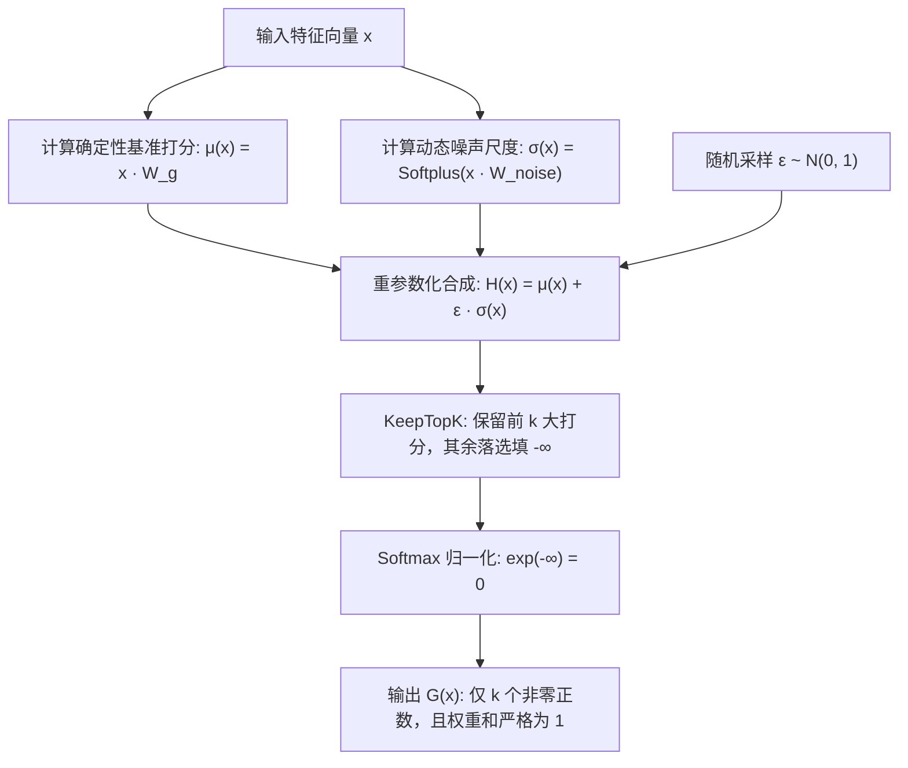

# 第 4 讲：注意力机制替代方案与混合专家模型 (Attention Alternatives and Mixtures of Experts)

CS336
Tatsu H

---

## 第 1 页 (Page 1)

# 第 4 讲
## 注意力机制替代方案与混合专家模型

CS336
Tatsu H

---

## 第 2 页 (Page 2)

### 注意力机制替代方案 (Attention alternatives)
随着上下文窗口的增大，注意力机制的开销也随之增加……我们该如何控制这些开销？
[了解增加LLM上下文窗口的影响 (meibel.ai)](https://www.meibel.ai/post/understanding-the-impact-of-increasing-llm-context-windows)

---

## 第 3 页 (Page 3)

### “基础”工具箱 (The ‘basic’ toolkit)
- 结合局部（Local）与全局（Global）注意力机制
- 系统工程优化 (Systems engineering)

**但如果我们想要更彻底、潜在收益更大的提升呢？**

---

## 第 4 页 (Page 4)

### 线性注意力机制 (Linear attention)
考虑常见的注意力机制操作：
$$Q \in \mathbb{R}^{n \times d_k}, \quad K \in \mathbb{R}^{n \times d_k}, \quad V \in \mathbb{R}^{n \times d_v}$$

$$\operatorname{Attn}(Q, K, V) = \rho(Q K^\top) V$$

由于存在 $Q K^\top$ 的计算，其复杂度是二次方的（即 $\mathcal{O}(n^2 d_k)$）。当 $\rho$ 为恒等映射（Identity）时，我们能做得更好吗？
$$(Q K^\top) V = Q (K^\top V)$$

虽然这看起来非常简单，但却出乎意料地重要。我们成功将计算复杂度从 $\mathcal{O}(n^2 d_k + n^2 d_v)$ 降低到了 $\mathcal{O}(2 n d_v d_k)$。

*(参考文献：Shen et al. 2018，Katharopoulos 2020（核函数版本）。这也与快速权重程序设计器 (fast weight programmers) 等概念相关。)*

---
### 💡 核心机制沉淀：从 Softmax 注意力到线性注意力（Linear Attention）的本质跨越

#### 1. 为什么课件要讨论“$\rho$ 为恒等映射”？（探寻线性注意力的理论源头）

##### (1) 传统 Softmax 注意力的计算瓶颈
在标准 Transformer 中，计算第 $i$ 个 Token 的输出向量 $y_i$（忽略分母归一化常数）为：
$$y_i = \sum_{j=1}^n \exp\left(\frac{q_i^\top k_j}{\sqrt{d_k}}\right) v_j$$
- **不可拆解的非线性整体**：指数函数 $\exp(q_i^\top k_j)$ 将查询向量 $q_i$ 与键向量 $k_j$ 紧紧耦合在一起。你**无法**把 $\exp(q_i^\top k_j)$ 拆解为单一关于 $q_i$ 的函数与单一关于 $k_j$ 的函数的乘积。
- **结合律失效**：因为无法将 $q_i$ 提到求和符号外面，必须对所有 $(i, j)$ 对逐一计算点积并存下 $n \times n$ 的完整矩阵，强制带来了 $O(n^2)$ 的二次方计算与显存开销。

##### (2) 讲师的“恒等映射”假想实验
讲师提出“当 $\rho$ 为恒等映射时”，并非指实际大模型直接用恒等映射，而是一个启发式的**理论假想**：
> “如果我们把阻挡结合律的非线性外壳 Softmax 拿掉（即令 $\rho(X) = X$），看看能带来多大的计算量降维？”

结果就是：**矩阵乘法的结合律瞬间被激活！**
$$(Q K^\top) V = Q (K^\top V)$$

##### (3) 真实的工程落地：核函数特征映射（Kernel Trick）
直接使用恒等映射会使模型退化为纯线性网络，失去对关键 Token 的聚焦能力。因此学者们（Shen et al. 2018, Katharopoulos et al. 2020）提出了**特征映射函数 $\phi(\cdot)$**（例如 $\phi(x) = \text{elu}(x) + 1$ 或 $\text{ReLU}(x)$，确保相似度非负）：
- 将两向量的相似度定义为**各自经过 $\phi$ 变换后的内积**：
  $$\text{相似度}(q_i, k_j) = \phi(q_i)^\top \phi(k_j)$$
- 代入第 $i$ 个 Token 的输出计算中：
  $$y_i = \sum_{j=1}^n \Big(\phi(q_i)^\top \phi(k_j)\Big) v_j$$
- **奇迹发生**：因为 $\phi(q_i)^\top$ 仅与当前查询 $i$ 有关、与循环求和下标 $j$ 无关，我们可以根据乘法分配律将 $\phi(q_i)^\top$ **直接提到求和号外面**：
  $$y_i = \phi(q_i)^\top \underbrace{\left( \sum_{j=1}^n \phi(k_j) v_j^\top \right)}_{S \in \mathbb{R}^{d_k \times d_v}}$$
- 括号内的 $\sum_{j=1}^n \phi(k_j) v_j^\top$ 累加出了一个尺寸仅为 **$d_k \times d_v$ 的固定状态矩阵 $S$**！这正是矩阵形式中 $Q (K^\top V)$ 的标量本质。

---

#### 2. 两个计算复杂度的严格数学推导与维度对比

根据矩阵乘法算力定理：矩阵 $A_{m \times n}$ 乘矩阵 $B_{n \times k}$ 所需浮点运算量为 **$2 \times m \times n \times k$ FLOPs**。

张量形状定义：
- $Q \in \mathbb{R}^{n \times d_k}$（序列长 $n$，Query 维度 $d_k$）
- $K \in \mathbb{R}^{n \times d_k} \implies K^\top \in \mathbb{R}^{d_k \times n}$
- $V \in \mathbb{R}^{n \times d_v}$（Value 维度 $d_v$）

##### (1) 结合律变换前：$(Q K^\top) V$（先左后右）
1. **第 1 步**：计算 $M = Q K^\top$
   - 形状：$(n \times d_k) \times (d_k \times n) \longrightarrow \mathbf{n \times n}$（生成随序列长度平方暴涨的巨大注意力矩阵）
   - 计算量：$2 \cdot n \cdot d_k \cdot n = \mathbf{2 n^2 d_k}$ FLOPs
2. **第 2 步**：计算 $Y = M \cdot V$
   - 形状：$(n \times n) \times (n \times d_v) \longrightarrow \mathbf{n \times d_v}$
   - 计算量：$2 \cdot n \cdot n \cdot d_v = \mathbf{2 n^2 d_v}$ FLOPs

👉 **总算术复杂度**：
$$\text{FLOPs} = 2 n^2 d_k + 2 n^2 d_v = \mathbf{\mathcal{O}(n^2 d_k + n^2 d_v)}$$

##### (2) 结合律变换后：$Q (K^\top V)$（先右后左）
1. **第 1 步**：计算 $S = K^\top V$（全局上下文信息压缩）
   - 形状：$(d_k \times n) \times (n \times d_v) \longrightarrow \mathbf{d_k \times d_v}$
   - 计算量：$2 \cdot d_k \cdot n \cdot d_v = \mathbf{2 n d_k d_v}$ FLOPs
   - **核心特征**：中间状态矩阵 $S$ 的尺寸为 **$d_k \times d_v$（例如 $128 \times 128$），完全与序列长度 $n$ 脱钩**！
2. **第 2 步**：计算 $Y = Q \cdot S$（用当前 Query 读取状态矩阵）
   - 形状：$(n \times d_k) \times (d_k \times d_v) \longrightarrow \mathbf{n \times d_v}$
   - 计算量：$2 \cdot n \cdot d_k \cdot d_v = \mathbf{2 n d_k d_v}$ FLOPs

👉 **总算术复杂度**：
$$\text{FLOPs} = 2 n d_k d_v + 2 n d_k d_v = 4 n d_k d_v = \mathbf{\mathcal{O}(2 n d_v d_k)}$$

---

#### 3. 核心对比总结

| 特性 | 标准注意力 $(Q K^\top) V$ | 线性注意力 $Q (K^\top V)$ |
| :--- | :--- | :--- |
| **计算顺序** | 先计算 Token 与 Token 间的两两关系 | 先将整个上下文的 Key 与 Value 压缩聚合为状态矩阵 $S$ |
| **中间矩阵尺寸** | **$n \times n$**（严重依赖序列长度 $n$） | **$d_k \times d_v$**（固定微小常数，如 $128 \times 128$） |
| **对长度 $n$ 的复杂度** | **$O(n^2)$（二次方爆炸）** | **$O(n)$（严格线性）** |
| **物理意义** | 全局点对点全连接图 | 具有有限记忆容量的递归状态更新（引向 RNN / Mamba） |
---

## 第 5 页 (Page 5)

### 线性注意力机制的循环形式 (Recurrent form of linear attention)
回想在纯线性注意力中，我们对计算顺序重新排列：
$$(Q K^\top) V = Q (K^\top V)$$

这虽然是线性时间复杂度（非常棒），但更妙的是，它看起来非常像一个循环神经网络（RNN）：
$$S_t = S_{t-1} + k_t v_t^\top \quad \text{和} \quad y_t = q_t^\top S_t$$

这种“对偶性”（Duality）使我们能够利用并行的二次方形式进行高效训练，并利用串行的线性形式进行高效推理。

*(注意：如果用 $\gamma$ 对 $S_{t-1}$ 进行加权，就会得到 RetNet。)*

---
### 💡 核心机制沉淀：线性注意力循环递推公式（RNN 形式）的严格数学推导

#### 1. 向量维度与符号约定
- $q_t \in \mathbb{R}^{d_k}$：当前时刻 $t$ 的 Query 向量
- $k_j \in \mathbb{R}^{d_k}$：历史时刻 $j$ 的 Key 向量
- $v_j \in \mathbb{R}^{d_v}$：历史时刻 $j$ 的 Value 向量
- $y_t \in \mathbb{R}^{d_v}$：当前时刻 $t$ 的输出向量

---

#### 2. 从自回归因果注意力到递推状态更新的逐步推导

##### 步骤 ①：写出因果因果注意力在时刻 $t$ 的标量加权形式
在因果掩码（Causal Mask）下，时刻 $t$ 只能关注历史所有时刻及当前自身（$1 \le j \le t$）：
$$y_t = \sum_{j=1}^t \underbrace{(q_t^\top k_j)}_{\text{内积相似度（标量）}} v_j$$

##### 步骤 ②：利用标量乘向量转置，将 $q_t$ 提取到求和号外
考虑输出向量的转置行向量 $y_t^\top \in \mathbb{R}^{d_v}$：
$$y_t^\top = \sum_{j=1}^t (q_t^\top k_j) v_j^\top = \sum_{j=1}^t q_t^\top \big( k_j v_j^\top \big)$$
其中 $k_j \in \mathbb{R}^{d_k}$ 与 $v_j \in \mathbb{R}^{d_v}$ 的外积构成矩阵 $k_j v_j^\top \in \mathbb{R}^{d_k \times d_v}$。  
由于 $q_t^\top$ 与求和循环下标 $j$ 无关，根据矩阵乘法分配律，可将 $q_t^\top$ **直接提取到求和号左侧**：
$$y_t^\top = q_t^\top \underbrace{\left( \sum_{j=1}^t k_j v_j^\top \right)}_{\text{定义为时刻 } t \text{ 的全局记忆状态 } S_t}$$

##### 步骤 ③：定义隐状态 $S_t$ 并拆解出马尔可夫递推关系
定义时刻 $t$ 的隐状态矩阵 $S_t \in \mathbb{R}^{d_k \times d_v}$：
$$S_t \triangleq \sum_{j=1}^t k_j v_j^\top$$
将求和序列拆分为“前 $t-1$ 项历史”与“第 $t$ 项当前输入”：
$$S_t = \left( \sum_{j=1}^{t-1} k_j v_j^\top \right) + k_t v_t^\top = S_{t-1} + k_t v_t^\top$$

结合输出读取方程，即严格推导出课件公式：
$$\begin{cases}
S_t = S_{t-1} + k_t v_t^\top & \text{（状态更新方程：将当前信息外积写入记忆矩阵）} \\
y_t^\top = q_t^\top S_t & \text{（输出读取方程：用当前 Query 在记忆矩阵中检索）}
\end{cases}$$

---

#### 3. 为什么“对偶性”（Duality）是新一代架构的核心利器？

| 执行模式 | 计算形式 | 适用阶段 | 核心优势 |
| :--- | :--- | :--- | :--- |
| **并行模式 (Parallel Form)** | 分块矩阵乘 / 关联前缀和 (Parallel Scan) | **模型训练阶段** | 能够一次性将整段文本送入 GPU，充分发挥 Tensor Core 的高算力吞吐，避免传统 RNN 串行训练缓慢的致命缺陷。 |
| **循环递推模式 (Recurrent Form)** | 逐步状态更新：$S_t = S_{t-1} + k_t v_t^\top$ | **自回归推理阶段 (Decode)** | 无论上下文生成到 1 万字还是 100 万字，显存中**仅需存储尺寸固定的矩阵 $S_t$（如 $128 \times 128$）**，彻底告别了随序列无限膨胀的 KV Cache（显存占用从 $O(N)$ 降至 $O(1)$ 常数）。 |
---

## 第 6 页 (Page 6)

### Minimax M1
Minimax M1（以及 minimax-text-01）采用了一种 7:1 的混合线性注意力机制（即 7 层线性注意力层结合 1 层全注意力层）。
整体性能非常强劲，且在上下文长度上展现出线性缩放的特性。

---

## 第 7 页 (Page 7)

### 从线性注意力到 Mamba-2 (From linear attention to Mamba-2)
让我们对线性注意力做一些泛化，加入位置权重（per-position weights）：
- 线性注意力：
  $$S_t = S_{t-1} + k_t v_t^\top \quad \text{和} \quad y_t = q_t^\top S_t$$
- Mamba-2：
  $$S_t = \gamma_t S_{t-1} + k_t v_t^\top \quad \text{和} \quad y_t = q_t^\top S_t + v_t^\top D \quad \text{其中} \quad \gamma_t = f_1(x_t)$$

对此有更多的理论支撑与论证（可以去阅读 Mamba-2 的论文），但在机制上，我们能够通过门控机制（gating）让线性注意力具备更强的表达能力（门控是个好东西！）。
这也同样保持了对偶属性（可以并行计算 $\gamma$，然后应用对偶性）。

---

## 第 8 页 (Page 8)

### Nemotron 3
采用了 Mamba-Attention 混合架构（比例大概在 3:1 左右）——与其它同类模型相比，其性能表现相当或甚至更优。

---

## 第 9 页 (Page 9)

### 门控 Delta 网络及相关架构 (Gated delta net (and friends))
让我们进一步做泛化——对输入进行门控，并选择性地抹去（erase）状态。
- Mamba-2：
  $$S_t = \gamma_t S_{t-1} + k_t v_t^\top \quad \text{和} \quad y_t = q_t^\top S_t + v_t^\top D \quad \text{其中} \quad \gamma_t = f_1(x_t)$$
- Gated Delta Net：
  $$S_t = \gamma_t (I - \beta_t k_t k_t^\top) S_{t-1} + \beta_t k_t v_t^\top \quad \text{和} \quad y_t = q_t^\top S_t \quad \text{其中} \quad \gamma_t = f_1(x_t), \beta_t = f_2(x_t)$$

门控 Delta 网络加入了一个“无输入操作”门控 ($\beta = 0$)，并抹去在当前键（Key）方向上的任何内容（即通过 $I - \beta_t k_t k_t^\top$ 过滤）。
这与多种快速权重编程（Fast Weight Programming）以及测试时训练（Test Time Training）思想有非常紧密的联系。

---
### 💡 核心机制沉淀：状态衰减门 $\gamma_t$ 与定向擦除门 $\beta_t$ 的深度剖析

#### 1. 符号辨析与物理含义
- **输入特征向量 $x_t \in \mathbb{R}^d$**：表示序列在第 $t$ 个位置（时刻）的 **Token Embedding 或隐藏层特征向量**（而非位置索引数字 $t$）。
  - 所谓“位置权重（per-position weights）”，本质是**输入依赖（Input-dependent / Data-dependent）**的动态门控，即根据当前读入的 Token 内容自适应计算权重。
- **独立映射函数 $f_1, f_2$**：
  - $\gamma_t = f_1(x_t)$ 与 $\beta_t = f_2(x_t)$ 是由 $x_t$ 通过**相互独立的投影网络**预测出的动态门控参数，具有完全不同的物理角色。

---

#### 2. 常见的门控映射函数 $f(x)$
为了保证状态更新的数值稳定性并防止记忆无限累加发散，门控值通常需约束在 $(0, 1]$ 或 $[0, 1]$ 范围内：
1. **Sigmoid 门控（Gated Attention / RetNet 变体）**：
   $$f(x_t) = \sigma(W x_t + b) = \frac{1}{1 + e^{-(W x_t + b)}} \in (0, 1)$$
2. **状态空间离散化步长（Mamba / Mamba-2 风格）**：
   $$f(x_t) = \exp\big( - \Delta_t \cdot \alpha \big), \quad \text{其中 } \Delta_t = \text{softplus}(W x_t + b) > 0, \; \alpha > 0 \implies f(x_t) \in (0, 1]$$

---

#### 3. $\gamma_t$ 与 $\beta_t$ 的功能对比与协同机制

$$S_t = \underbrace{\gamma_t}_{\text{全局遗忘门}} \cdot \underbrace{(I - \beta_t k_t k_t^\top) S_{t-1}}_{\text{基于 Key 的定向擦除}} + \underbrace{\beta_t k_t v_t^\top}_{\text{新关联对写入}}$$

| 门控参数 | 核心角色 | 数学作用 | 现实语义与典型场景 |
| :--- | :--- | :--- | :--- |
| **$\gamma_t = f_1(x_t) \in (0, 1)$** | **全局时间衰减门 (Global Decay Gate)** | 对旧记忆矩阵 $S_{t-1}$ 进行整体等比例衰减缩放。 | **“随时间淡化久远记忆”**：如读到句号/分隔符时让 $\gamma_t \to 0$，快速重置历史状态。 |
| **$\beta_t = f_2(x_t) \in [0, 1]$** | **关联更新与定向擦除门 (Selective Erase & Write Gate)** | ① 控制当前键值对 $k_t v_t^\top$ 写入记忆的强度；<br>② 通过正交投影 $(I - \beta_t k_t k_t^\top)$ 精准抹除旧记忆中与 $k_t$ **同方向**的分量。 | **“针对特定概念精准覆写”**：<br>- 若 $\beta_t = 0$（**No-op 无操作**）：不擦除也不写入，跳过停用词；<br>- 若 $\beta_t = 1$：精准清除与当前 Key 冲突的旧值，写入新 Value。 |

---

## 第 10 页 (Page 10)

### Qwen 3.5 / Qwen Next
最新的 Qwen 模型是 3:1 的 GDN (Gated DeltaNet) 与 Attention 混合架构。
同样地，它们展现出了相当不错的性能，且具有良好的推理特性。

---

## 第 11 页 (Page 11)

### 混合架构的性能 (Hybrid performance)
虽然目前还没有太多受控的消融实验（controlled ablations），但已有部分证据表明，在较低的混合比例下模型能够实现较低的损失（loss）。

---

## 第 12 页 (Page 12)

### 混合架构的替代方案：稀疏自适应 (Alternative to hybrids: sparse adaptation)
与其对历史中的每一个 Token 都计算完整的注意力（attending to every token），不如引入**稀疏注意力（DSA, DeepSeek Sparse Attention）**。

#### DSA 架构原型 (Prototype of DSA)
DSA 主要由两个核心组件构成：**闪电索引器（Lightning Indexer）** 与 **细粒度 Token 选择机制（Fine-grained Token Selection）**。

1. **闪电索引器 (Lightning Indexer)**：
   计算当前查询 Token $\mathbf{h}_t \in \mathbb{R}^d$ 与任意历史 Token $\mathbf{h}_s \in \mathbb{R}^d$ 之间的索引亲和力评分 $I_{t,s}$，用于快速粗筛出该 Query 需要关注的候选 Token：
   $$I_{t,s} = \sum_{j=1}^{H^I} w_{t,j}^I \cdot \operatorname{ReLU}\left(\mathbf{q}_{t,j}^I \cdot \mathbf{k}_s^I\right)$$
   - $H^I$：索引器的注意力头数（Header 数通常设置得极小，如 1~4 头）；
   - $\mathbf{q}_{t,j}^I \in \mathbb{R}^{d^I}$ 与 $w_{t,j}^I \in \mathbb{R}$：均由当前 Query Token $\mathbf{h}_t$ 线性投影得到；
   - $\mathbf{k}_s^I \in \mathbb{R}^{d^I}$：由历史 Token $\mathbf{h}_s$ 投影得到；
   - **设计考量**：
     - 选择 **$\operatorname{ReLU}$** 作为激活函数以最大化计算吞吐与稀疏度（避免 Softmax 的全局归一化开销）；
     - 索引头数极少且维度小，可直接采用 **FP8 低精度** 高效实现，计算开销相比主注意力可忽略不计。

2. **细粒度 Token 选择机制 (Fine-grained Token Selection)**：
   在获得打分集合 $\{I_{t,s}\}$ 后，仅检索出索引评分排名前 $k$ 的 Key-Value 键值对（$\mathbf{c}_s$），随后仅在这些稀疏选中的条目上执行完整精度的注意力计算：
   $$\mathbf{u}_t = \operatorname{Attn}\left(\mathbf{h}_t, \{\mathbf{c}_s \mid I_{t,s} \in \operatorname{Top-k}(I_{t,:})\}\right)$$

- **核心优势**：
  - 索引器极度轻量（Lightweight Indexer），带来巨大的端到端计算与显存节省；
  - 支持 **“事后自适应”（Post-hoc Adaptation）**：模型可在先进行常规的密集短上下文预训练后，在长上下文微调阶段无缝接入 DSA 索引器，无需推倒从头重训。

---
### 💡 核心机制沉淀：DSA 闪电索引器（Lightning Indexer）的数学与计算经济学深度剖析

#### 1. 符号体系与映射机制
- **上标 $I$ 的含义**：代表 **Indexer（索引器）**。用于在符号上严格区分轻量级索引通路与高维度的主注意力通路（Main Attention）。
- **$\mathbf{h}_t \to \mathbf{q}_{t,j}^I$ 与 $w_{t,j}^I$ 的映射拆解**：
  - **$\mathbf{h}_t \in \mathbb{R}^d$**：当前 Token 的输入隐藏层向量；
  - **$\mathbf{q}_{t,j}^I \in \mathbb{R}^{d^I}$**：第 $j$ 个索引头的低维 Query **向量**（Vector），由 $\mathbf{h}_t$ 经矩阵 $W_{Q,j}^I \in \mathbb{R}^{d \times d^I}$ 投影得到；
  - **$w_{t,j}^I \in \mathbb{R}$**：第 $j$ 个索引头的加权**标量**（Scalar），由 $\mathbf{h}_t$ 经向量 $\mathbf{w}_{w,j}^I \in \mathbb{R}^d$ 内积投影得到；
  - **工程实现（算子融合）**：在 GPU 底层实现中，不会执行 $2 \times H^I$ 次细碎的小矩阵乘法，而是将所有头的参数拼接为大矩阵 $W_{\text{all}}^I \in \mathbb{R}^{d \times (H^I \cdot d^I + H^I)}$，通过**单次 GEMM 矩阵乘法**一次性并行计算出所有头的 Query 向量与加权标量。

---

#### 2. 计算经济学账本：为什么同样扫描 $N$ 个 Token，DSA 却能暴降计算量与显存？
直觉上，索引器为每个历史 Token 计算 $I_{t,s}$ 依然需要遍历长度为 $N$ 的序列。但其能够实现极致加速的核心在于：**“算力常数差异悬殊（$\approx 600\times$ 差距）” 与 “彻底绕过解码阶段的显存带宽瓶颈（Memory-Bound）”**。

##### (1) 浮点算力（FLOPs）量级对比（以单 Token 计算为例）
- **主注意力（Full Attention）**：
  - 拥有 64~128 个注意力头，头维度 128，总维度 $D = 8192 \sim 16384$；
  - 计算全量 $Q K^\top$ 点积并汇总 Value 需消耗约 **$65,000$ FLOPs / Token**。
- **闪电索引器（Lightning Indexer）**：
  - 仅设 $H^I = 1 \sim 2$ 个头，头维度 $d^I = 16 \sim 32$；
  - 计算 $\mathbf{q}^I \cdot \mathbf{k}^I$ 仅需 $2 \times (1 \times 32) = 64$ FLOPs，加上 ReLU 与标量加权总计仅约 **$100$ FLOPs / Token**；
  - **结论**：索引器的算力开销仅为主注意力的 **$100 \div 65,000 \approx \mathbf{0.15\%}$**！

##### (2) 显存搬运带宽（Memory Bandwidth）的解脱
- **主注意力**：每个 Token 的完整 KV 缓存重达数百上千字节，在 128K 长度下自回归生成（Decoding）时，GPU 大量算力空转等待从慢速显存（HBM）搬运庞大的 KV 缓存；
- **闪电索引器**：每个 Token 的索引 Key $\mathbf{k}^I$ 仅 **32 字节（FP8 低精度）**，可完整驻留在极速的片上 L2 Cache / SRAM 中高速扫描。

##### (3) 两阶段粗筛与精算协同
设序列总长 $N = 128\text{K}$，稀疏检索 Top-$k$ 的 $k = 2\text{K}$：
$$\text{总开销} = \underbrace{\text{轻量索引器扫描全部 } 128\text{K Tokens}}_{\text{超微开销（仅占全量 } 0.15\%)} + \underbrace{\text{主注意力精准计算选中的 } 2\text{K Tokens}}_{\text{重度计算量与显存搬运直接缩减为 } 2\text{K}}$$
- 主注意力的重度矩阵乘法与显存搬运开销被直接压缩了 **$128\text{K} \div 2\text{K} = \mathbf{64\times}$**，从而将原本二次方暴涨的计算曲线彻底拉平成平缓的线性增长！

---

## 第 13 页 (Page 13)

### DSA – Deepseek Sparse Attention (v3.2, GLM5)
展示了 DSA 在前沿开源大模型（如 DeepSeek-V3.2、GLM-5 / GLM-4.7-Flash）中的实证表现与评测基准：

- **性能对齐 Dense 模型**：在 AIME 2025、HMMT 2025、SWE-bench Verified、Terminal Bench 等复杂推理与 Agent 任务上，DSA 稀疏注意力模型（DeepSeek-V3.2）与主流 SOTA 稠密/全注意力模型（GPT-5-High, Claude-4.5-Sonnet, Gemini-3.0-Pro）性能完全持平。
- **算力与显存成本压降**：
  - **Prefilling（预填充）与 Decoding（生成）阶段**：随上下文长度从 0K 增加到 128K，DSA 架构的百万 Token 计算成本曲线几乎保持平直（平缓线性增长），而传统 Dense 全注意力架构的成本呈剧烈陡峭上升。
- **RULER 长文本检索基准验证**：
  - GLM-4.7-Flash 在 4K 到 128K 长度下的长文本大海捞针（Needle-in-a-haystack）与检索测试表明：仅通过索引器 Warmup 或联合微调，DSA 在 128K 上下文下依然保持高准确率（~87% - 79%），验证了稀疏检索的无损性。

---

## 第 14 页 (Page 14)

### 混合专家模型 (Mixture of experts)
- GPT-4 (?)
- Grok
- DeepSeek-V3 技术报告
- Llama 4
- OLMoE

---

## 第 15 页 (Page 15)

### 什么是 MoE？ (What’s a MoE?)
- 用多个大型前馈网络（FFN，称为专家 Expert）和一个选择器层（Router）来替代传统的前馈传播层。
- 你可以在不影响计算量（FLOPs）的前提下增加专家的数量。

*(参考文献：Fedus et al. 2022)*

---

## 第 16 页 (Page 16)

### 为什么 MoE 越来越流行？ (Why are MoEs getting popular?)
- **相同的计算量下，参数量越大模型表现越好。**

*(参考文献：Fedus et al. 2022)*

---

## 第 17 页 (Page 17)

### 为什么 MoE 越来越流行？ (续)
- **训练 MoE 的速度更快。**

*(参考文献：OLMoE)*

---

## 第 18 页 (Page 18)

### 为什么 MoE 越来越流行？ (续)
- **与稠密（Dense）等效模型相比极具竞争力。**

---

## 第 19 页 (Page 19)

### 为什么 MoE 越来越流行？ (续)
- **可并行部署在多台设备上。**

---

## 第 20 页 (Page 20)

### 一些西方推出的 MoE 结果 (Some MoE results – from the west)
- MoE 模型占据了开源模型中性能最高的那一梯队，且推理速度非常快。
- 比较模型：Llama 4 (Maverick), Gemini 2.0 Flash, DeepSeek v3.1, GPT-4o 等。

---

## 第 21 页 (Page 21)

### 早先国内团队的 MoE 结果 – Qwen (Earlier MoE results from Chinese groups – Qwen)
中国的大模型公司在较小规模模型上也开展了相当多的 MoE 相关工作。  
- 涉及模型如：Qwen1.5-7B, Qwen1.5-MoE-A2.7B, DeepSeekMoE 16B 等。

---

## 第 22 页 (Page 22)

### 早先国内团队的 MoE 结果 – DeepSeek (Earlier MoE results from Chinese groups - DeepSeek)
关于 MoE 模型也有一些很好的近期消融实验工作，结果表明 MoE 架构通常具有很好的效果。

---

## 第 23 页 (Page 23)

### 近期的 MoE 成果 – DeepSeek v3 (Recent MoE results – DeepSeek v3)
*(展示了 DeepSeek-V3 的性能指标，例如 MMLU-Pro、GPQA、MATH 500、AIME 2024 等指标)*

---

## 第 24 页 (Page 24)

### 为什么以前 MoE 没有那么流行？ (Why haven’t MoEs been more popular?)
- **基础设施非常复杂**：在多节点环境下的优势更明显，但实现难度高。
- **训练目标有些偏启发式**（有时不太稳定）。

*(参考文献：Zoph et al. 2022, Fedus et al. 2022)*

---

## 第 25 页 (Page 25)

### 常见的 MoE 架构长什么样 (What MoEs generally look like)
- **典型做法**：用 MoE 层替代 MLP / FFN 层。
- **较少见做法**：对注意力头（Attention Heads）使用 MoE。

*(参考文献：ModuleFormer, JetMoE)*

---

## 第 26 页 (Page 26)

### MoE – 变化体现在哪里？ (MoE – what varies?)
- 路由函数 (Routing function)
- 专家大小 (Expert sizes)
- 训练目标 (Training objectives)

---

## 第 27 页 (Page 27)

### 路由函数概览 (Routing function - overview)
许多路由算法最终都归结为“选择前 K 个 (choose top k)”：
- **Token 选择专家** (Token chooses expert)
- **专家选择 Token** (Expert chooses token)
- **通过优化进行全局路由** (Global routing via optimization)

*(参考文献：Fedus et al. 2022)*

---

## 第 28 页 (Page 28)

### 路由类型 (Routing type)
几乎所有的 MoE 都采用标准的“Token选择 Top-K (token choice topk)”路由。这里展示了一些近期的消融实验结果。

---

## 第 29 页 (Page 29)

### 常见路由变体详解 (Common routing variants in detail)
- **Top-k 路由** (在绝大多数 MoE 中使用)：
  - Switch Transformer ($k=1$)
  - GShard ($k=2$), Grok ($k=2$), Mixtral ($k=2$), Qwen ($k=4$), DBRX ($k=4$), DeepSeek ($k=7$)
- **哈希路由** (Hashing)：
  - 常用的 baseline 方案。

*(参考文献：Fedus et al. 2022)*

---

## 第 30 页 (Page 30)

### 其它路由方法 (Other routing methods)
- **通过强化学习（RL）来学习路由路径**：曾在一些极早期工作中使用（如 Bengio 2013），但现在已不常用。
- **求解匹配问题**（BASE 路由）：
  - 将路由视为线性分配（Linear Assignment）问题，在 Clark ‘22 等论文中有所应用。

*(参考文献：Fedus et al. 2022)*

---

## 第 31 页 (Page 31)

### Top-K 路由详解 (Top-K routing in detail)
大多数论文都采用经典且古老的 top-k 路由。它是如何工作的？
- 输入表示为 $\mathbf{h}_t^l$：
  $$\mathbf{h}_t^l = \sum_{i=1}^N \left( g_{i,t} \operatorname{FFN}_i \left( \mathbf{u}_t^l \right) \right) + \mathbf{u}_t^l$$
- 门控系数 $g_{i,t}$ 计算公式：
  $$g_{i,t} = \begin{cases} s_{i,t}, & s_{i,t} \in \operatorname{Topk}(\{s_{j,t} | 1 \le j \le N\}, K), \\ 0, & \text{otherwise} \end{cases}$$
  $$s_{i,t} = \operatorname{Softmax}_i \left( \mathbf{u}_t^{l\top} \mathbf{e}_i^l \right)$$
- 门控参数由一个逻辑回归器（logistic regressor）选择。
- 这是 DeepSeek (V1-2) 所采用的路由器架构（Grok, Qwen 也采用这种方式）。
- Mixtral, DBRX, DeepSeek v3 则是在 TopK 选择之后再进行 softmax 计算。

*(参考文献：Dai et al. 2024)*

---
### 💡 核心机制沉淀：Top-$K$ 门控路由的数学定义、变量剖析与归一化策略演进

#### 1. 概念澄清与核心执行流
- **非随机抽样**：Top-$K$ 路由**不是**在排名前 $K$ 的专家中随机抽选 1 个，而是**同时激活全部 $K$ 个专家**并进行并行前向计算，最后对它们的输出向量进行**门控加权求和（Weighted Sum）**。
- **端到端流程**：输入 Token $\mathbf{u}_t^l \to$ 路由器打分与门控截断 $\to$ 激活 $K$ 个专家并行计算 $\operatorname{FFN}_i(\mathbf{u}_t^l) \to$ 加权求和 $\to$ 残差连接输出 $\mathbf{h}_t^l$。

---

#### 2. 公式各个变量的严格物理含义

| 变量 / 符号 | 数学维度 / 归属 | 物理角色与功能说明 |
| :--- | :--- | :--- |
| **$l$** | $\mathbb{Z}_{\ge 1}$ | 当前 Transformer 层的层数索引。 |
| **$t$** | $\mathbb{Z}_{\ge 1}$ | 当前 Token 在输入句子序列中的位置/时间步索引。 |
| **$\mathbf{u}_t^l$** | $\mathbb{R}^d$ | **MoE 层的输入隐藏状态**（通常来自本层自注意力与 LayerNorm 后的输出）。 |
| **$N$** | $\mathbb{Z}^+$ | 当前 MoE 层的**专家总数**（例如 8、64 或 256）。 |
| **$K$** | $\mathbb{Z}^+$ ($K \ll N$) | **单 Token 激活专家数**（如 $K=2$ 或 $K=8$），实现 $\frac{K}{N}$ 的计算稀疏度。 |
| **$\operatorname{FFN}_i(\cdot)$** | $\mathbb{R}^d \to \mathbb{R}^d$ | 第 $i$ 个专家的前馈神经网络（标准 MLP，如两层线性变换加 SwiGLU）。 |
| **$\mathbf{e}_i^l$** | $\mathbb{R}^d$ | 第 $i$ 个专家的**路由特征嵌入向量（Router Centroid）**。全部 $N$ 个专家的向量构成路由矩阵 $W_g \in \mathbb{R}^{d \times N}$。 |
| **$\mathbf{u}_t^{l\top} \mathbf{e}_i^l$** | $\mathbb{R}$ | 输入向量与专家向量的**内积点积**，代表该 Token 与专家 $i$ 的**原始匹配亲和力（Logit）**。 |
| **$s_{i,t}$** | $[0, 1]$ | 全局 Softmax 归一化后的亲和力打分（$\sum_{i=1}^N s_{i,t} = 1$）。 |
| **$g_{i,t}$** | $\mathbb{R}_{\ge 0}$ | 最终分配给专家 $i$ 的**门控加权系数**。未被选中的专家 $g_{i,t} = 0$（不触发计算）。 |
| **$\mathbf{h}_t^l$** | $\mathbb{R}^d$ | 当前 MoE 层输出的最终隐藏状态向量。 |

---

#### 3. 专家评分与选择的两大主流归一化策略

围绕“何时进行 Softmax 归一化”，工业界主流大模型演进出了两种不同的实现策略：

- **策略 1：Top-K 前全局 Softmax（Softmax-then-TopK）**
  - **计算流程**：先对所有 $N$ 个专家的原始 Logits $z_i = \mathbf{u}_t^\top \mathbf{e}_i$ 做全局 Softmax 得到概率分布 $s = \operatorname{Softmax}(z) \in \mathbb{R}^N$，然后直接截取排名前 $K$ 大的得分 $s_i$ 作为门控权重 $g_{i,t}$，其余置 0。
  - **权重特征**：由于截断丢弃了后 $N-K$ 个专家的概率，导致最终激活专家的门控权重和**小于 1**（即 $\sum_{i \in \operatorname{TopK}} g_{i,t} < 1$）。
  - **代表模型**：DeepSeek (V1-2)、Grok-1、早期 Qwen MoE 等。
  - **局限性**：当专家总数 $N$ 极大（如 64、256）时，尾部专家的概率之和不可忽视，导致激活专家的门控权重被过度稀释。

- **策略 2：Top-K 后局部重新归一化（TopK-then-Softmax / Re-normalization）**
  - **计算流程**：先直接从所有专家的原始 Logits $z_i$ 中筛选出得分最高的 $K$ 个专家集合 $\mathcal{T} = \operatorname{TopK}(z, K)$，然后**仅在这 $K$ 个入选专家内部**重新做 Softmax 归一化：
    $$g_{i,t} = \begin{cases} \frac{\exp(z_i)}{\sum_{j \in \mathcal{T}} \exp(z_j)}, & i \in \mathcal{T} \\ 0, & \text{otherwise} \end{cases}$$
  - **权重特征**：确保被选中的 $K$ 个专家的门控权重之和**严格恒等于 1**（即 $\sum_{i \in \operatorname{TopK}} g_{i,t} = 1$）。
  - **代表模型**：Mixtral 8x7B、DBRX、DeepSeek-V3、LLaMA 4 等。
  - **工程优势**：数值稳定性更高，反向传播梯度更平滑，是大规模细粒度专家池（大 $N$）的主流标配策略。

---

## 第 32 页 (Page 32)

### DeepSeek 及其他国内语言模型近期的路由变体 (Recent variations from DeepSeek and other Chinese LMs)
- **核心思想**：采用更小、数量更多的专家，配合少量始终处于开启状态的共享专家（Shared Experts）。
- （该方案应用在 DeepSeek / Qwen 模型中，最初起源于 DeepSpeed MoE）。

---

## 第 33 页 (Page 33)

### DeepSeek 论文中的多项消融实验 (Various ablations from the DeepSeek paper)
实验表明，更多的专家以及共享专家设计通常都有助于提升模型的整体性能。

---

## 第 34 页 (Page 34)

### OLMoE 中的消融实验 (Ablations from OlMoE)
- 细粒度专家带来了性能增益，但共享专家没有带来额外收益。

---

## 第 35 页 (Page 35)

### 近期 MoE 的专家路由配置汇总 (Expert routing setups for recent MoEs)

| 模型 | 总路由专家数 (Routed) | 激活专家数 (Active) | 共享专家数 (Shared) | 细粒度专家比例 (Fine-grained ratio) |
| :--- | :---: | :---: | :---: | :---: |
| GShard | 2048 | 2 | 0 | - |
| Switch Transformer | 64 | 1 | 0 | - |
| ST-MoE | 64 | 2 | 0 | - |
| Mixtral | 8 | 2 | 0 | - |
| DBRX | 16 | 4 | 0 | - |
| Grok | 8 | 2 | 0 | - |
| DeepSeek v1 | 64 | 6 | 2 | 1/4 |
| Qwen 1.5 | 60 | 4 | 4 | 1/8 |
| DeepSeek v3 | 256 | 8 | 1 | 1/14 |
| OLMoE | 64 | 8 | 0 | 1/8 |
| MiniMax | 32 | 2 | 0 | ~1/4 |
| Llama 4 (maverick) | 128 | 1 | 1 | 1/2 |

---

## 第 36 页 (Page 36)

### 我们如何训练 MoE？ (How do we train MoEs?)
- **主要挑战**：为了训练效率，我们需要稀疏性……但是稀疏门控的决策过程是**不可微**的！
- **解决方案？**
  1. 强化学习（RL）以优化门控策略。
  2. 随机扰动（Stochastic perturbations）。
  3. 启发式“负载均衡”损失（Heuristic ‘balancing’ losses）。
- 猜猜大家在实际应用中用的是哪一种？

---

## 第 37 页 (Page 37)

### 面向 MoE 的强化学习 (RL for MoEs)
- 基于 REINFORCE 算法的强化学习确实有效，但相比其他方案并没有明显优势，因此没有绝对胜出。
- 强化学习是“正确的数学解法”，但由于梯度方差大且实现极其复杂，因而并未被广泛使用。

*(参考文献：REINFORCE baseline 方案, Clark et al. 2020)*

---

## 第 38 页 (Page 38)

### 随机近似 (Stochastic approximations)
$$G(x) = \operatorname{Softmax}(\operatorname{KeepTopK}(H(x), k))$$
$$H(x)_i = (x \cdot W_g)_i + \operatorname{StandardNormal}() \cdot \operatorname{Softplus}((x \cdot W_{noise})_i)$$
$$\operatorname{KeepTopK}(v, k)_i = \begin{cases} v_i & \text{if } v_i \text{ is in the top } k \text{ elements of } v, \\ -\infty & \text{otherwise}. \end{cases}$$

- 路由决策是通过高斯扰动进行随机化处理的。
- 1. 这能自然而然地训练出更具鲁棒性的专家模型。
- 2. Softmax 的引入使得模型能够学会如何对前 K 个专家进行排序。

*(参考文献：Shazeer et al. 2017)*

---
### 💡 核心机制沉淀：Noisy Top-K 随机近似门控与变量执行流剖析

#### 1. 变量与参数定义字典

| 变量 / 符号 | 数学类型 / 维度 | 物理角色与功能说明 |
| :--- | :--- | :--- |
| **$x$** | $\mathbb{R}^d$ | **当前 Token 的输入特征向量**（Hidden State）。 |
| **$W_g$** | $\mathbb{R}^{d \times N}$ | **主路由权重矩阵**。$(x \cdot W_g)_i$ 为第 $i$ 个专家的**确定性基准得分（Logit 均值 $\mu_i$）**。 |
| **$W_{\text{noise}}$** | $\mathbb{R}^{d \times N}$ | **可学习的噪声权重矩阵**。用于根据输入 $x$ 动态自适应预测各专家的噪声标准差尺度。 |
| **$\operatorname{Softplus}(z)$** | $\log(1 + e^z)$ | 平滑非负激活函数，确保预测出的噪声标准差 $\sigma_i > 0$。 |
| **$\operatorname{StandardNormal}()$** | $\epsilon \sim \mathcal{N}(0, 1)$ | 从标准正态分布中独立采样的随机高斯噪声样本。 |
| **$H(x)_i$** | $\mathbb{R}$ | 第 $i$ 个专家的**带噪综合得分**，满足 $H(x)_i \sim \mathcal{N}\big((x \cdot W_g)_i, \operatorname{Softplus}((x \cdot W_{\text{noise}})_i)^2\big)$。 |
| **$k$** | 整数常数 | **单 Token 激活专家数量**（如 $k=2$）。 |
| **$\operatorname{KeepTopK}(v, k)$** | 截断算子 | 保留前 $k$ 个最大打分，**其余 $N-k$ 个落选专家强制填充为 $-\infty$**。 |
| **$G(x)$** | $\mathbb{R}^N$ | 最终输出的**稀疏门控权重向量**（仅选中的 $k$ 个专家权重非零且和为 1）。 |

---

#### 2. 算法总体执行流程



- **步骤 ①：预测均值与方差**：分别计算确定性得分 $\mu_i(x) = (x \cdot W_g)_i$ 和噪声标准差 $\sigma_i(x) = \operatorname{Softplus}\big((x \cdot W_{\text{noise}})_i\big)$。
- **步骤 ②：重参数化可微加噪**：采样 $\epsilon \sim \mathcal{N}(0, 1)$，得到带噪得分 $H(x)_i = \mu_i(x) + \epsilon \cdot \sigma_i(x)$。
- **步骤 ③：$-\infty$ 掩码屏蔽**：保留前 $k$ 个最大值，其余 $N-k$ 个落选专家的得分全部填为 $-\infty$。
- **步骤 ④：Softmax 局域自动归一化**：经过 Softmax 后，落选项 $e^{-\infty}=0$，而入选的 $k$ 个专家自动完成局部重新归一化。
- **步骤 ⑤：推理部署**：推理阶段直接关闭噪声（令 $\epsilon=0$），纯依靠确定性的 $x \cdot W_g$ 进行路由。

---

## 第 39 页 (Page 39)

### 随机近似（续）
```python
if is_training:
    # 增加噪声以促进跨专家的探索
    router_logits += mtf.random_uniform(shape=router_logits.shape, minval=1-eps, maxval=1+eps)
# 将输入转化为 float32 进行 softmax 以保证数值稳定性
router_logits = mtf.to_float32(router_logits)
# 每个 token 被分发到各个专家的概率
router_probs = mtf.softmax(router_logits, axis=-1)
```
- Fedus et al. 2022 中引入了**随机抖动（Stochastic jitter）**。这种方法通过均匀的乘性扰动来减少专家模型的脆性，不过后来在 Zoph et al. 2022 中被移除了。

---

## 第 40 页 (Page 40)

### 启发式负载均衡损失 (Heuristic balancing losses)
另一个关键问题是——为了提高系统效率，我们需要尽量均匀地使用各个专家。
$$\operatorname{loss}_{\text{aux}} = \alpha \cdot N \cdot \sum_{i=1}^N f_i \cdot P_i$$
其中 $f_i$ 是分发到专家 $i$ 的 Token 比例：
$$f_i = \frac{1}{T} \sum_{x \in \mathcal{B}} \mathbb{1}\{\operatorname{argmax} p(x) = i\}$$
而 $P_i$ 是分配给专家 $i$ 的路由器概率分量：
$$P_i = \frac{1}{T} \sum_{x \in \mathcal{B}} p_i(x)$$

损失对 $p_i(x)$ 的导数为 $\frac{\alpha N}{T^2} \sum \mathbb{1}_{\operatorname{argmax} p(x)=i}$，这意味着越频繁被使用的专家，受到的下调惩罚越重。

*(参考文献：Switch Transformer [Fedus et al. 2022])*

---
### 💡 核心机制沉淀：第一代辅助损失（Switch Transformer）的变量剖析与偏导推导

#### 1. 变量与函数定义字典
- **$\alpha$**：辅助损失权重超参数（如 0.01），控制均衡惩罚的强度。
- **$N$**：当前层的专家总数。乘以 $N$ 使得在完全均匀状态下（$f_i = P_i = \frac{1}{N}$），总损失项 $\alpha N \sum \frac{1}{N^2} = \alpha$ 恒定归一。
- **$\mathcal{B}$ 与 $T$**：当前训练批次（Batch）以及其中的 Token 总数 $T = |\mathcal{B}|$。
- **$p_i(x) \in (0, 1)$**：路由器对 Token $x$ 预测的专家 $i$ 连续 Softmax 概率（**可微项**）。
- **$P_i \in [0, 1]$**：专家 $i$ 在当前批次上的平均预测概率质量（**可微项**）。
- **$f_i \in [0, 1]$**：实际分发到专家 $i$ 的 Token 比例（**离散计数的硬统计量**）。
  - 其中的 $\mathbb{1}\{\cdot\}$ 是指示函数（条件成立为 1，否则为 0）。
  - **关键常数约定**：在反向传播中，指示函数无法求导，底层通过 `.detach()`（或 `stop_gradient`）截断梯度。因此在求偏导时，**$f_i$ 严格视为与 $p_i(x)$ 无关的常数标量**。

---

#### 2. 将 Loss 展开并求偏导的严格数学推导
我们考察特定 Token $x$ 在专家 $i$ 上的概率 $p_i(x)$，将总损失展开：
$$\mathcal{L}_{\text{aux}} = \alpha \cdot N \sum_{j=1}^N f_j \cdot P_j = \frac{\alpha N}{T} \sum_{j=1}^N f_j \left( p_j(x) + \sum_{x' \neq x} p_j(x') \right)$$

将目标专家 $j = i$ 的相关项单独提出来，其余不包含 $p_i(x)$ 的项归为常数 $C$：
$$\mathcal{L}_{\text{aux}}(p_i(x)) = \left( \frac{\alpha N}{T} f_i \right) \cdot p_i(x) + C$$

对连续变量 $p_i(x)$ 求偏导：
$$\frac{\partial \mathcal{L}_{\text{aux}}}{\partial p_i(x)} = \frac{\alpha N}{T} f_i = \frac{\alpha N}{T^2} \sum_{x' \in \mathcal{B}} \mathbb{1}\{\operatorname{argmax} p(x') = i\}$$

#### 3. 梯度物理机制与动态自平衡原理
- **当专家 $i$ 过载时**（$f_i$ 很大）：偏导数是一个很大的正数。在梯度下降（$-\eta \cdot \nabla$）中，会产生一个强大的**下砸力**，大幅压低分配给专家 $i$ 的概率 $p_i(x)$。
- **当专家 $i$ 饥饿时**（$f_i \approx 0$）：偏导数接近 0，几乎不受惩罚。
- **自平衡闭环**：结合 Softmax 概率和为 1 的约束，热门专家的概率被打压后，省出来的概率空间被**自动平摊给冷门专家**，迫使系统从失衡走向均衡。

---

## 第 41 页 (Page 41)

### 来自 DeepSeek (v1-2) 的负载均衡实例 (Example from deepseek (v1-2))
- **每个专家的负载均衡（Per-expert balancing）**：与 Switch Transformer 一致。
  $$\mathcal{L}_{\text{ExpBal}} = \alpha_1 \sum_{i=1}^{N'} f_i P_i$$
  $$f_i = \frac{N'}{K' T} \sum_{t=1}^T \mathbb{1}(\text{Token } t \text{ 选择 Expert } i)$$
  $$P_i = \frac{1}{T} \sum_{t=1}^T s_{i,t}$$
- **每个设备的负载均衡（Per-device balancing）**：将上述目标按设备（Device）进行聚合。
  $$\mathcal{L}_{\text{DevBal}} = \alpha_2 \sum_{i=1}^D f'_i P'_i$$
  $$f'_i = \frac{1}{|\mathcal{E}_i|} \sum_{j \in \mathcal{E}_i} f_j \quad \text{和} \quad P'_i = \sum_{j \in \mathcal{E}_i} P_j$$

---
### 💡 核心机制沉淀：第二代双层级损失（DeepSeek V1/V2）的偏导与通信协同

#### 1. 变量含义与双层级设计动机
- **$N'$ 与 $K'$**：路由专家总数与单 Token 激活专家数；$\frac{N'}{K' T}$ 为归一化系数，使理想均匀时的 $f_i = 1$。
- **$D$ 与 $\mathcal{E}_i$**：物理 GPU 设备总数，以及部署在第 $i$ 台 GPU 设备上的所有专家集合。
- **设计动机**：单个专家均匀并不代表物理设备通信均匀。若某张 GPU 上的所有专家恰好都偏热，跨节点 All-to-All 网络通信就会堵塞，因此引入设备级聚合项 $\mathcal{L}_{\text{DevBal}}$。

#### 2. 双重梯度的叠加推导与物理效果
同理将实际流量项 $f_i, f'_{d(i)}$ 视为常数，对门控得分 $s_{i,t}$（设专家 $i$ 部署在设备 $d(i)$ 上）求偏导：
$$\frac{\partial \mathcal{L}_{\text{total}}}{\partial s_{i,t}} = \frac{\alpha_1}{T} f_i + \frac{\alpha_2}{T} f'_{d(i)}$$
- **双重协同**：若某张 GPU 网络拥堵（$f'_{d(i)}$ 很大），第二项会无差别地对该卡上的所有专家施加向下的惩罚梯度，强制将集群通信流量从硬件拓扑上分流。

---

## 第 42 页 (Page 42)

### DeepSeek V3 的变体：专家偏置机制 (DeepSeek v3 variation – per-expert biases)
为每个专家设置一个偏置（使得某些专家更容易分到 Token），并使用在线学习（online learning）调整偏置。
$$g'_{i,t} = \begin{cases} s_{i,t}, & s_{i,t} + b_i \in \operatorname{Topk}(\{s_{j,t} + b_j \vert 1 \le j \le N_r\}, K_r), \\ 0, & \text{otherwise.} \end{cases}$$

他们称这套机制为 **“无辅助损失负载均衡” (auxiliary loss free balancing)** （不过实际上它并非完全不包含辅助损失……）

**互补的序列级辅助损失（Complementary Sequence-Wise Auxiliary Loss）：**
$$\mathcal{L}_{\text{Bal}} = \alpha \sum_{i=1}^{N_r} f_i P_i$$
$$f_i = \frac{N_r}{K_r T} \sum_{t=1}^T \mathbb{1}(s_{i,t} \in \operatorname{Topk}(\{s_{j,t} \vert 1 \le j \le N_r\}, K_r))$$
$$s'_{i,t} = \frac{s_{i,t}}{\sum_{j=1}^{N_r} s_{j,t}} \quad \text{和} \quad P_i = \frac{1}{T} \sum_{t=1}^T s'_{i,t}$$

---
### 💡 核心机制沉淀：第三代动态偏置（DeepSeek V3）与零梯度语义无损

#### 1. 变量含义与工作原理
- **$b_i \in \mathbb{R}$**：第 $i$ 个专家的动态门槛偏置（Bias）。
- **零梯度无损机制**：
  - 在选路时看带偏置的得分 $s_{i,t} + b_i$（过载专家 $b_i$ 减小提高门槛，空闲专家 $b_i$ 增大降低门槛）；
  - 在输出加权时仍使用纯净得分 $s_{i,t}$；
  - **对主任务偏导为 0**：$\frac{\partial \mathcal{L}_{\text{aux}}}{\partial s_{i,t}} = 0$。偏置不参与反向传播计算图，完全消除了前两代辅助 Loss 强行扭曲专家语义的性能代价。

#### 2. 互补序列级损失求导（微观兜底）
同理对单序列内归一化概率 $s'_{i,t}$ 求偏导：
$$\frac{\partial \mathcal{L}_{\text{Bal}}}{\partial s'_{i,t}} = \frac{\alpha}{T} f_i$$
- 在单条长文本（Prompt）内部发生局部极端扎堆时，即时提供局部的微观惩罚梯度。

---

## 第 43 页 (Page 43)

### 去除负载均衡损失会发生什么？ (What happens when removing load balancing losses?)
实验结果表明，在完全不添加负载均衡损失（LBL）的情况下，模型的专家分配会在训练早期极快地收敛到少数几个专家（形成垄断），导致系统资源严重倾斜，而加入负载均衡损失则能引导专家分配走向平稳。

---

## 第 44 页 (Page 44)

### 训练 MoE —— 系统层面 (Training MoEs – the systems side)
- MoE 在并行化上表现良好——因为每个前馈网络（FFN / Expert）可以独立装载在单台设备上。
- 这为训练带来了额外的并行化维度（如专家并行 Expert Parallelism）。

---

## 第 45 页 (Page 45)

### 训练 MoE —— 系统层面（续）
- MoE 路由虽然允许高度并行化，但也会引入额外的计算与调度复杂度。
- 现代大模型开源库（如 MegaBlocks）通常会使用更聪明的**块稀疏矩阵乘法**（Block-Sparse MMs）来优化整体的计算吞吐。

---

## 第 46 页 (Page 46)

### MoE 并行化与架构调整 (MoE parallelism and architecture modifications)
- **来自 Nemotron 3 的新思路（LatentMoE）**：在执行跨 GPU 节点的 All-to-All 集合通信前，先将高维激活值下投影（Down-projection）压缩至低维潜空间传输，并在接收聚合后升维恢复（Up-projection），以极小的本地计算代价大幅削减跨节点网络通信带宽瓶颈。

---

## 第 47 页 (Page 47)

### 有趣的边缘问题——MoE 模型的随机性 (Fun side issue – stochasticity of MoE models)
MoE 模型可能会比普通模型引入额外的随机性。

**为什么 MoE 会有额外的随机性？**
路由中的 **Token 丢弃 (Token dropping)** 是在批次（Batch）级别发生的——这意味着**其他人的查询（Queries）有可能会挤掉属于你的 Token！**

---

## 第 48 页 (Page 48)

### MoE 的稳定性问题 (Issues with MoEs - stability)
- **解决方案**：仅在专家路由器（Expert Router）上使用 Float 32 进行计算（有时会搭配辅助 $z$-loss 进行约束）。
  $$L_z(x) = \frac{1}{B} \sum_{i=1}^B \left( \log \sum_{j=1}^N e^{x_j^{(i)}} \right)^2$$

*(参考文献：Zoph 2022)*

---
### 💡 核心机制沉淀：Router $z$-loss 解决训练数值不稳定的机理剖析

#### 1. 痛点根源：Softmax 平移不变性与 Logits 无限漂移
- **平移不变性**：$\operatorname{Softmax}(\mathbf{z}) = \operatorname{Softmax}(\mathbf{z} - c)$。
  - 语言模型的主损失和负载均衡损失**只关心 Logits 之间的相对差值**，而不约束其绝对数值大小。
  - 在长周期训练中，路由器线性投影权重范数不断增大，导致输出的原始 Logits $x_j$ 不断向上漂移膨胀（如漂移到 $50 \sim 120+$）。

#### 2. 致命隐患：浮点舍入误差被指数运算剧烈放大
- **低精度尾数截断**：例如 `bfloat16` 仅有 7 位有效尾数，当 Logit 达到 $128.5$ 时，会被硬件四舍五入为 $128.0$（产生 $0.5$ 的绝对误差）。
- **指数放大效应（Exponential Amplification）**：
  - 经过 Softmax 的指数运算 $\exp(0.5) \approx 1.65$，这一微小舍入误差会导致**最终门控概率发生超过 36% 的剧烈突变**！
  - 门控权重的突变向后传播产生巨大的错误梯度，直接诱发如第 49 页所示的**严重训练损失尖峰（Loss Spikes）乃至训练崩溃**。

#### 3. $z$-loss 的数学解法：将 Logits 锚定在原点附近
- **公式物理含义**：$\sum_{j=1}^N e^{x_j^{(i)}} = Z^{(i)}$ 是 Softmax 的分母配分函数，其对数 $\log Z \approx \max_j x_j$ 是最大 Logit 的光滑近似。
- **正则化弹性拉力**：
  $$\min L_z \implies \min (\log Z)^2 \implies \text{迫使 } \log \sum_{j=1}^N e^{x_j^{(i)}} \to 0 \implies \text{迫使所有 Logits 保持在接近 0 的紧凑区间}$$
- **效果**：将所有专家的 Logits 始终牢牢限制在浮点数精度最充裕、舍入误差最小的线性安全区间内，彻底根除了数值突变，保证了 MoE 训练的极致稳定性。

---

## 第 49 页 (Page 49)

### 路由器的 Z-loss 稳定性 (Z-loss stability for the router)
消融实验对比了添加路由器 $z$-loss（权重为 0.001）与不添加的情况。去除 $z$-loss 会导致训练过程中出现严重的损失尖峰（instability）。

---

## 第 50 页 (Page 50)

### MoE 模型微调问题 (Issues with MoEs – fine-tuning)
- 稀疏的 MoE 容易在较小规模的微调数据上发生**过拟合**。
- **Zoph et al. 解决方案**：仅微调非 MoE 部分的 MLP 层。
- **DeepSeek 解决方案**：使用大量的微调数据（例如 1.4M 的有监督微调数据 SFT）。

---

## 第 51 页 (Page 51)

### 其它训练方法——向上回收 (Other training methods - upcycling)
我们是否可以利用预训练好的稠密语言模型（Dense LM）来初始化一个 MoE 模型？

- **初始化机制**：
  - **自注意力层与归一化层**：直接 1:1 复制预训练 Dense 模型的成熟权重；
  - **专家前馈层（MoE MLP Experts）**：直接将 Dense 模型的**单个前馈网络（MLP/FFN）克隆复制多份（$E$ 份）**，分别作为初始阶段各个专家的初始权重；
  - **路由器（Router）**：随机初始化。
- **持续预训练与专家分化（Specialization）**：
  - 初始化完成后，在海量数据上进行**持续预训练（Continual Pre-training）**。由于路由器随机分流与各专家接收到的 Token 差异，这 $E$ 个原本相同的克隆副本会逐步打破对称性，在参数空间上分道扬镳，演化为各具专长的高质量专家池。
- **保障专家持续分化的常见策略**：
  - **路由探索噪声**（如 Noisy Top-K / 随机抖动，防止训练初期单专家垄断）；
  - **强制负载均衡**（强迫 Token 均匀流向不同专家，促使其消化不同领域数据）；
  - **设置共享专家**（由共享专家吸收通用基础语言规律，解放路由专家专攻特化任务）；
  - **差异化学率与分阶段训练**（如早期先微调路由器或给路由器更高的学习率）。

---

## 第 52 页 (Page 52)

### 向上回收案例——MiniCPM (Upcycling example - MiniCPM)
- 采用了 MiniCPM 模型进行实验（配置为 Topk=2, 8 个专家，对应约 4B 激活参数）。
- 这种简单的 MoE 架构在约 520B Token 的持续训练下，相较于基准 Dense 模型展示出了显著的性能提升。

---

## 第 53 页 (Page 53)

### 向上回收案例——Qwen MoE (Upcycling example – Qwen MoE)
- Qwen MoE：基于 Qwen 1.8B 模型初始化，配置为 Top-k=4，总共 60 个专家，其中 4 个为共享专家。
- 架构设计上与 DeepSeekMoE 相似，这也是最早被证实能够成功通过 Upcycling 获得成效的模型之一。

---

## 第 54 页 (Page 54)

### DeepSeek MoE v1-v2-v3 架构演进
让我们以 DeepSeek MoE 的架构细节来收尾。

#### V1 版本 (16B 总参数，单 Token 激活 2.8B)：
- 采用标准的 Top-K 路由。
- 架构设计：2 个共享专家 + 64 个细粒度专家（激活其中 4 个）。
- 采用标准的辅助损失负载均衡机制（专家级 + 设备级）。

---

## 第 55 页 (Page 55)

### DeepSeek MoE v2
#### V2 版本 (236B 总参数，单 Token 激活 21B)：
- 架构设计：2 个共享专家 + 160 个细粒度专家（共激活 6 个）。
- **新增特性**：
  - Top-M 设备路由。
  - 通信负载均衡损失——平衡各个设备的流入和流出通信量。

---

## 第 56 页 (Page 56)

### DeepSeek MoE v3
#### V3 版本 (671B 总参数，单 Token 激活 37B)：
- 架构设计：1 个共享专家 + 258 个细粒度专家（共激活 8 个）。
- **新增特性**：
  - Sigmoid + Softmax 结合的 Top-K 和 Top-M 路由。
  - 无辅助损失负载均衡（Aux-loss-free）与序列级辅助损失（Seq-wise Aux）。

---

## 第 57 页 (Page 57)

### 彩蛋：构建 DeepSeek MoE v3 还需要什么？ (Bonus: What else do you need to make DeepSeek MoE v3?)
#### MLA：多头潜变量注意力机制 (Multihead Latent Attention)
- **核心思想**：将 Query (Q)、Key (K)、Value (V) 投影表达为低维“潜变量 (latent)”激活值的函数。

---

## 第 58 页 (Page 58)

### 构建 DeepSeek MoE v3 还需要什么？（续）
- **核心公式**：
  $$\mathbf{c}_t^{KV} = W^{DKV} \mathbf{h}_t, \quad \mathbf{k}_t^C = W^{UK} \mathbf{c}_t^{KV}, \quad \mathbf{v}_t^C = W^{UV} \mathbf{c}_t^{KV}$$
- **收益**：在进行 KV 缓存时，我们只需要存储 $\mathbf{c}_t^{KV}$，它能比传统形式小得多。其中 $W^{UK}$ 可以融合进 Q 投影矩阵。
  $$\mathbf{c}_t^Q = W^{DQ} \mathbf{h}_t, \quad \mathbf{q}_t^C = W^{UQ} \mathbf{c}_t^Q$$
- **复杂度**：RoPE（旋转位置编码）会与 MLA 式的缓存产生冲突。
  - 没有 RoPE 时：$\langle Q, K \rangle = \langle h W^Q, W^{UK} c_t^{KV} \rangle = \langle h W^Q W^{UK}, c_t^{KV} \rangle$
  - 引入 RoPE 后：$\langle Q R_q, R_k K \rangle = \langle h W^Q R_q, R_k W^{UK} c_t^{KV} \rangle$ 导致两边位置矩阵不匹配。
  - **解决方案**：预留少量不进行潜变量投影的 Key 维度用于直接旋转计算。

---
### 💡 核心机制沉淀：MLA（多头潜变量注意力）与 MHA/GQA 的本质对比及前向流拆解

#### 1. MLA 与传统 MHA / GQA / MQA 的本质区别
- **MHA（标准多头注意力）**：$H$ 个 Q 头对应 $H$ 个独立的 K 头与 V 头（1:1 比例）。表达能力最强，但推理时 KV Cache 显存消耗极其庞大。
- **GQA / MQA（物理砍头法）**：强制让多个 Q 头（如 8 个 Q 头）共享同一组 K/V 头（甚至所有 Q 头共享 1 个 K/V 头）。虽然压缩了显存，但因严重剥夺了不同 Query 捕获差异化键值的自由度，**明显牺牲了模型的表达能力与长文本检索精度**。
- **MLA（低秩潜变量联合压缩）**：
  - **保留满血多头**：在数学表征上依然保留完整的 128 个 Q 头、128 个 K 头和 128 个 V 头，具有比肩甚至超越 MHA 的强大表达能力；
  - **联合潜变量压缩**：通过低秩矩阵 $W^{DKV}$ 将 128 个头的全部 K/V 信息联合压缩为一个尺寸极小的潜向量 $\mathbf{c}_t^{KV}$（如 512 维）。推理时**仅需在 KV Cache 中存储该低维潜向量**，缓存显存占用甚至低于 GQA！

#### 2. 公式在前向传播链路中的执行流程
- **KV 压缩链路（第一组公式）**：输入特征 $\mathbf{h}_t$ 经 $W^{DKV}$ 降维压缩为 $\mathbf{c}_t^{KV}$（**存入 KV Cache**），需要计算时再通过 $W^{UK}, W^{UV}$ 升维还原出多头语义键值 $\mathbf{k}_t^C, \mathbf{v}_t^C$。
- **Query 压缩链路（第二组公式）**：输入特征 $\mathbf{h}_t$ 经 $W^{DQ}$ 降维为 $\mathbf{c}_t^Q$ 再经 $W^{UQ}$ 升维为 $\mathbf{q}_t^C$，旨在大幅降低训练期间反向传播所需的激活值显存。
- **矩阵吸收与解耦 RoPE 协同**：
  - 无 RoPE 时，利用结合律将 $W^{UK}$ 提前乘入 Query 中（$\mathbf{q}_{\text{absorbed}} = \mathbf{q}_t^C W^{UK}$），解码时**无需解压历史 Key，直接拿 $\mathbf{q}_{\text{absorbed}}$ 与缓存的 $\mathbf{c}_s^{KV}$ 做点积**；
  - 为解决 RoPE 破坏矩阵吸收的难题，将 Q/K 拆为“不带 RoPE 的低秩语义分量”与“带 RoPE 的独立轻量位置分量”，兼顾了位置感知与免解压极致吞吐。

---

## 第 59 页 (Page 59)

### 构建 DeepSeek MoE v3 还需要什么？（续）
#### MTP：多 Token 预测机制 (Multi-Token Prediction)
- 采用一些轻量级的小模型来同时预测未来的多个步骤。
- 比较架构：DeepSeek V3 相比于 EAGLE 架构（但 DeepSeek V3 目前仅进行向前 1 个 Token 的预测）。
- 公式：
  $$\mathbf{h}_i^{\prime k} = M_k[\operatorname{RMSNorm}(\mathbf{h}_i^{k-1}); \operatorname{RMSNorm}(\operatorname{Emb}(t_{i+k}))]$$
  $$\mathbf{h}_{1:T-k}^k = \operatorname{TRM}_k(\mathbf{h}_{1:T-k}^{\prime k})$$
  $$p_{i+k+1}^k = \operatorname{OutHead}(\mathbf{h}_i^k)$$

---

## 第 60 页 (Page 60)

### MoE 总结 (MoE summary)
- ❖ MoE 能够有效利用**稀疏性**——并不是所有的输入都需要激活模型全部的参数。
- ❖ 离散的路由选择极其困难，但 Top-K 启发式机制在实践中非常有效。
- ❖ 现阶段有大量的实验数据表明，MoE 机制高度可行，且拥有极高的高性价比。
