# 第 5 讲：图形处理器 (GPUs)

CS336  
Tatsu H  

---

## 第 1 页 (Page 1)

# 第 5 讲
## GPUs

CS336  
Tatsu H  

---

## 第 2 页 (Page 2)

### 大纲与目标 (Outline and goals)
- **让 CUDA 和 GPU 不再神秘 (Make CUDA and GPUs less magic)**
- **理解 GPU 变慢的场景 (Understand when GPUs get slow)**
- **理解如何编写快速算法 (Understand how to make fast algorithms)**

---

## 第 3 页 (Page 3)

### 在开始之前 (Before we start..)
我们要对以下几项优秀的内容来源致以诚挚的感谢：
- Horace He 的个人博客
- CUDA Mode 工作组
- TPU（以及现在的 GPU）书籍 (!!)
- 其它资料来源，包括：[nichijou.co](https://nichijou.co/)，[jonathan-hui.medium.com](https://jonathan-hui.medium.com/)

---

## 第 4 页 (Page 4)

### 今日内容组织 (Organization today)
- **第一部分**：深入探究 GPU —— 它们是如何工作的以及重要组成部分
- **第二部分**：理解 GPU 的性能表现
- **第三部分**：融会贯通 —— 剖析 FlashAttention 机制

---

## 第 5 页 (Page 5)

### 引入主题：计算量带来可预测的性能提升 (Setting the stage: compute leads to predictable perf)
- 通常情况下，计算量为语言模型带来可预测的性能增益。
- 仅靠更快的硬件、更好的利用率、以及更优的并行手段即可推动技术进步（就目前而言）。

*(参考文献：Kaplan et al. Neural Scaling Laws)*

---

## 第 6 页 (Page 6)

### 我们如何获得算力规模的扩充？早期——唐纳德缩放定律 (How do we get compute scaling? Early on – Dennard scaling)
- 传统的芯片缩放模式（Dennard 缩放定律）在 1980 至 2000 年代就已经走到尽头。
- 我们该如何继续满足大语言模型（LLMs）对算力无止境的胃口？

---

## 第 7 页 (Page 7)

### 并行缩放仍在继续 (Parallel scaling continues)
- 基于 GPU 的并行算力在过去 10 年里提升了超过 1000 倍。
- **没有 GPU 算力的提升，就没有 LLM 的规模扩展。**

*(引自 Bill Dally，HotChips 主题演讲)*

---

## 第 8 页 (Page 8)

### GPU 与 CPU 有什么区别？ (How is a GPU different from a CPU?)
- **CPU** 针对少数且高速执行的线程进行优化；而 **GPU** 针对海量的并发线程进行优化。
- GPU 拥有很多个微型计算单元（ALUs）。对分支结构（control、cache）的支持则少得多。
- **CPU 优化延迟**（确保每个线程能以最快速度完成）。
- **GPU 优化吞吐量**（追求在单位时间内处理的总数据量）。

---
### 💡 核心机制与图解复刻：CPU vs GPU 硬件哲学与延迟隐藏机制

#### 1. 架构设计哲学对比

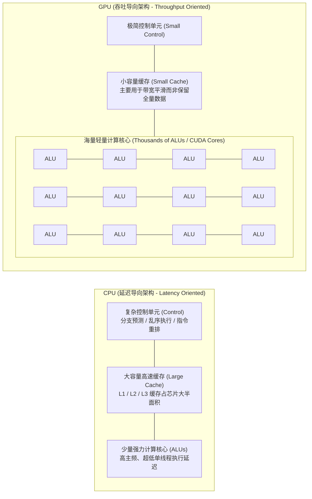

#### 2. GPU 核心秘诀：通过海量线程切换实现“延迟隐藏”（Latency Hiding）

- **CPU 的应对方式**：当遇到耗时几百周期的内存读写指令时，CPU 依赖巨大的 Cache 减少访存，或通过复杂预测逻辑让单线程尽快返回。
- **GPU 的应对方式（零开销线程切换）**：GPU 内部维护数以万计的并发轻量线程上下文（直接保存在海量寄存器堆中）。当线程组 A 遇到慢速显存读取而停顿（Stall）时，硬件调度器**零周期开销**瞬间切换到就绪的线程组 B 投入计算，彻底填平算力空窗期。

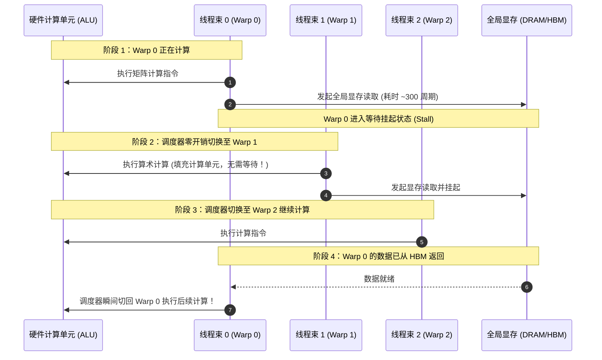

---

## 第 9 页 (Page 9)

### GPU 内部剖析：执行单元 (Anatomy of a GPU (execution units))
- 每个流式多处理器（SM）中包含许多个流处理器（SPs），它们能并行地执行各个“线程 (threads)”。
- GPU 拥有许多流式多处理器（SMs），它们能独立地去执行各个“线程块 (blocks)”（即分配的工作任务）。

---

## 第 10 页 (Page 10)

### GPU 内部剖析：内存 (Anatomy of a GPU (memory))
- **内存距离 SM 越近，其存取速度就越快** —— L1 缓存与共享内存（shared memory）位于流式多处理器（SM）的内部。L2 缓存集成在芯片上，而全局内存（Global memory，在现代高性能 GPU 上也称作 **HBM**，完全位于 GPU 板载体系内，与 CPU 内存无关）则是 GPU 旁边的内存颗粒。
- SRAM（共享/缓存内存）极其昂贵（贵约 100 倍），但比 DRAM（全局内存）快大约 8 倍。

#### 各种内存访问延迟（TABLE IV）
- **全局内存 (Global memory / HBM)**：290 周期 (cycles)
- **L2 缓存 (L2 cache)**：200 周期 (cycles)
- **L1 缓存 (L1 cache)**：33 周期 (cycles)
- **共享内存 (Shared Memory (ld/st))**：(23/19) 周期 (cycles)

---

## 第 11 页 (Page 11)

### GPU 执行模型 (Execution model of a GPU)
GPU 执行模型中有三个核心角色：
- **线程 (Threads)**：线程在并行计算中“实际干活” —— 所有线程执行相同的指令，但接受不同的输入（单指令多线程 SIMT 模式）。
- **线程块 (Blocks)**：线程块是线程的分组。每个线程块在流式多处理器（SM）上运行，并拥有它专属的共享内存（shared memory）。
- **线程束 (Warp)**：线程束由 32 个连续编号的线程组成。它们总是作为一个整体进行协同执行。

---
### 💡 核心机制与图解复刻：GPU 硬件微架构与 CUDA 软硬件 1:1 映射流

#### 1. 软件编程实体到物理硬件单元的严格映射

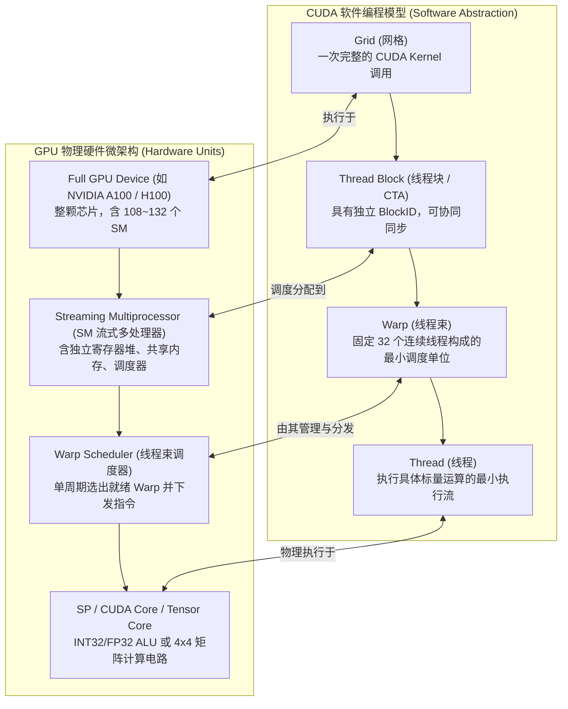

---

#### 2. Thread, Block, Warp, Grid 的概念辨析与绝对层级关系

从大到小的绝对包含层级关系为：
$$\mathbf{Grid（网格）} \;\;>\;\; \mathbf{Block（线程块）} \;\;>\;\; \mathbf{Warp（线程束）} \;\;>\;\; \mathbf{Thread（线程）}$$

- **绝非“Warp 包含 Block”，而是“Block 包含若干个 Warp”！**
- **形象类比（工厂组织架构）**：
  - **Grid（网格）**：整座总工厂 / 总项目，代表一次完整的 CUDA Kernel 调用。
  - **Block（线程块）**：**生产车间**。由程序员在代码中显式指定大小（例如包含 256 或 512 个线程）。同一个 Block 内的所有线程共享片上高速共享内存（Shared Memory），并可通过 `__syncthreads()` 同步。
  - **Warp（线程束）**：**生产班组**。**硬件固定写死：每 32 个线程组成一个 Warp**。当一个 256 线程的 Block 被分配到 SM 上时，硬件会自动将其切分为 $256 \div 32 = 8$ 个 Warp。Warp 是 GPU 硬件单指令发射与调度的最小物理单位。
  - **Thread（线程）**：**单个工人**。负责具体标量数据的最小执行流。

---

#### 3. 硬件约束与同步保障：为什么 Block 内线程过多仍能保证同步？

程序员在指定 Block 内线程数量时，GPU 从以下三道防线确保了物理可行性与同步正确性：

1. **硬件物理硬上限（1024 线程）**：
   - 所有现代 NVIDIA GPU 架构中，单 Block 允许的最大线程数被硬件死死限定为 **1024 线程**（即最多 32 个 Warp）。
   - 若程序员指定超出 1024（如 `blockDim.x = 2048`），CUDA 驱动会直接抛出 `cudaErrorInvalidConfiguration` 错误，内核**完全拒绝启动**。
2. **物理空间绑定（Block 绝不跨 SM）**：
   - 硬件保证：一个 Block 必须作为一个不可分割的整体，完整驻留在**同一个物理 SM** 上。
   - 这最多 1024 个线程（32 个 Warp）面对的是当前 SM 内部**同一块物理片上 SRAM（Shared Memory）芯片**，物理上天然连通共享。
3. **硬件级栅栏计数器（Hardware Barrier）**：
   - `__syncthreads()` 并非慢速软件锁，而是 SM 内部的**纯硬件电路计数器**。
   - 当 Block 内的 Warp 陆续到达栅栏时硬件计数器累加，当所有 Warp 全部到达后，硬件在**单周期内广播唤醒信号**瞬间同时释放全部线程，确保了极致高效的纳秒级同步。

---

## 第 12 页 (Page 12)

### GPU 内存模型 (Memory model of a GPU)
- 每个线程均能访问其专属的寄存器（register），以及当前线程块内的共享内存。
- **跨越线程块的数据交互需要通过全局内存（global memory）进行读写，这非常慢。**

#### 设备端代码（Device code）可以：
- 读写线程专属的寄存器 (registers)
- 读写线程专属的局部内存 (local memory)
- 读写线程块专属的共享内存 (shared memory)
- 读写网格（grid）专属的全局内存 (global memory)
- 只读网格（grid）专属的常量内存 (constant memory)

#### 主机端代码（Host code）可以：
- 在主机与网格全局内存及常量内存之间进行数据流传输

---
### 💡 核心机制与图解复刻：GPU 内存层级金字塔与 CUDA 访问作用域

#### 1. 内存层级金字塔与访问延迟对比

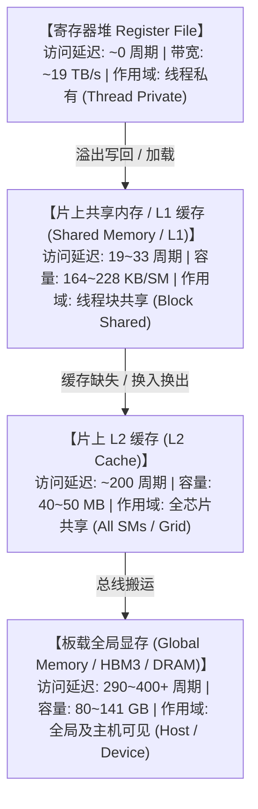

---

## 第 13 页 (Page 13)

### 支线讨论：TPU 怎么样？ (Side thread – What about TPUs?)
- 从宏观上看，GPU、TPU 以及许多其他加速器都是相似的。
- **核心架构**：轻量级控制系统、巨大且高速的矩阵乘法单元（matmul unit）、高速内存。
- **不同点**：加速器之间的互连组网方式（将在并行计算章节展开）；没有线程束（Warp）的概念，只有线程块（Blocks）—— 这在矩阵乘法与非矩阵乘法任务中存在折衷。
- **GPU 拥有更多的 SM，TPU 拥有更少的 Tensor Core (但二者的 matmul 性能接近)。**

---

## 第 14 页 (Page 14)

### 支线讨论：TPU 与 GPU 对应关系

| GPU | TPU | 说明 |
| :--- | :--- | :--- |
| 流式多处理器 (SM) | Tensor Core (张量核心) | 包含其他计算单元的核“单元” |
| 线程束调度器 (Warp Scheduler) | VPU 槽 (slots) | SIMD 向量算术单元 |
| CUDA Core | VPU ALU | SIMD ALU 算术逻辑单元 |
| SMEM (L1 缓存) | VMEM | 片上高速缓存内存 |
| Tensor Core | MXU | 矩阵乘法单元 |
| HBM (即 GMEM) | HBM | 高带宽大容量内存 |

#### 硬件规模对比（NVIDIA H100 vs Google TPU v5p）
- **SM / Tensor Core 数量**：132 vs 2
- **线程束调度器 / VPU 槽数**：528 vs 8
- **SMEM / VMEM 大小**：32MB vs 128MB
- **寄存器 / 向量寄存器大小**：32MB vs 256KB
- **Tensor Core / MXU 数量**：528 vs 8

*(数据源自：[jax-ml.github.io/scaling-book/gpus](https://jax-ml.github.io/scaling-book/gpus/))*

---

## 第 15 页 (Page 15)

### GPU 模型的优势 (Strengths of the GPU model)
- 易于扩展困难的任务负载（仅需增加更多的 SM 即可）。
- 由于采用单指令多线程（SIMT）模型，编程相对简单。
- 线程非常“轻量”，能够实现无摩擦的暂停与启动。

---

## 第 16 页 (Page 16)

### GPU 作为高速矩阵乘法器 (GPUs as fast matrix multipliers)
- 在 NVIDIA GPU 的早期，研究人员通过可编程着色器（Programmable Shaders）以奇技淫巧去实现矩阵乘法（matmul）。

---

## 第 17 页 (Page 17)

### 矩阵乘法硬件的发展带来了专属高速的体验 (New matmul hardware means matmuls are fast and special)
- 张量核心（Tensor Cores，从 V、T 系列 GPU 起引入）是专属的硬件级矩阵乘法电路。
- **矩阵乘法的计算速度比其它普通浮点计算操作要快 10 倍以上！**

---

## 第 18 页 (Page 18)

### 算力增长速度远超内存读写速度的增长 (Compute scaling is faster than memory scaling)
- 算力（FLOPS）扩展速度显著快于内存带宽，我们很难保证有充足的数据持续喂给计算单元！
- [理解内存墙问题 (RiseLab)](https://medium.com/riselab/ai-and-memory-wall-2cb4265cb0b8)
- 硬件 FLOPs 增长率：20 年增长 60000 倍 ($\sim 3.0\times$ 每 2 年)
- DRAM 带宽增长率：20 年增长 100 倍 ($\sim 1.6\times$ 每 2 年)
- 互连带宽增长率：20 年增长 30 倍 ($\sim 1.4\times$ 每 2 年)

---
### 💡 核心机制与理论模型：算力与显存的“剪刀差”——内存墙与 Roofline 性能模型

#### 1. 20 年间硬件算力与显存带宽的差距演化

| 硬件指标 | 20 年前 (2003) | 现代 GPU (2023 / H100) | 20 年累计增长倍数 | 复合年化增速 |
| :--- | :--- | :--- | :--- | :--- |
| **峰值计算算力 (Peak FLOPs)** | ~10 GFLOPs | ~1000 TFLOPs (FP16 TC) | **$60,000\times$** | 每 2 年翻 3.0 倍 |
| **显存带宽 (DRAM Bandwidth)** | ~30 GB/s | ~3.35 TB/s (HBM3) | **$100\times$** | 每 2 年翻 1.6 倍 |
| **互连带宽 (Interconnect BW)** | ~1 GB/s | ~900 GB/s (NVLink 4) | **$30\times$** | 每 2 年翻 1.4 倍 |

- **严峻现实**：算力增速是显存带宽增速的 **600 倍**！芯片上的计算核心经常处于“吃不饱”的饥饿状态。

#### 2. Roofline 性能分析模型（屋顶模型）

算法在硬件上的实际性能上限由以下公式严格限定：
$$\text{Attained Performance} = \min\Big(\text{Peak FLOPs}, \; \text{Arithmetic Intensity} \times \text{Bandwidth}\Big)$$

- **算术强度（Arithmetic Intensity）**：每从显存搬运 1 字节（Byte）数据所能执行的浮点运算次数（FLOPs/Byte）。

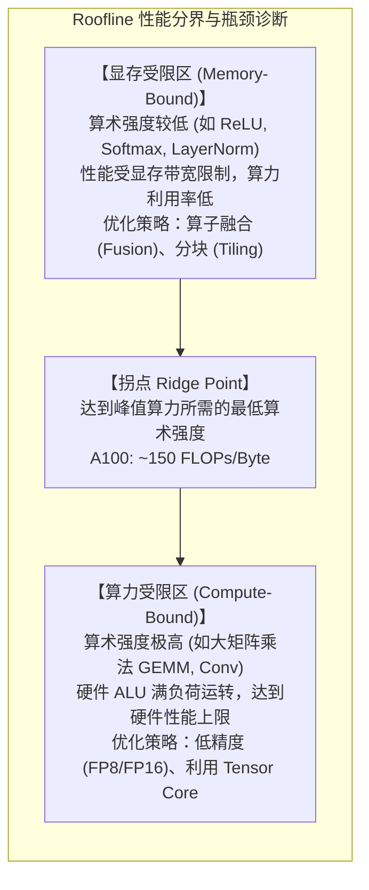

---

## 第 19 页 (Page 19)

### 第一部分回顾：GPU 是什么以及它们是如何工作的
- **GPU 具有极高的并行度**：相同的指令被分发给海量的工作单元同步执行。
- **计算能力（特别是矩阵乘法）的增长速度快于内存存取。**
- 我们**必须尊重并合理利用内存层级结构**，才能让代码飞速运行。

---

## 第 20 页 (Page 20)

## 第二部分：优化 GPU 上的机器学习负载 (Part 2: Making ML workloads fast on a GPU)
即使对于像方阵乘法（Square Matmul）这样看似简单的操作，GPU 上的性能表现也可以非常复杂。

---

## 第 21 页 (Page 21)

### 是什么决定了 ML 任务的运行速度？
#### Roofline 模型 (The roofline model)
- **本节核心内容：我们该如何避免陷入内存受限（memory bound）的瓶颈？**

---

## 第 22 页 (Page 22)

### 我们该如何加速 GPU 的运行？
1. **控制分支控制分流** (Control divergence，这并非内存瓶颈)。
2. **低精度计算** (Low precision computation)。
3. **算子融合** (Operator fusion)。
4. **重计算 / 重算** (Recomputation)。
5. **内存合并访问** (Coalescing memory)。
6. **分块 / 瓦片化** (Tiling)。

---

## 第 23 页 (Page 23)

### 优化 1：控制分支分流 (Control divergence - 非内存瓶颈)
- GPU 按照单指令多线程（SIMT）模型运转 —— 同一个线程束中的每一个线程都必须在同一时刻执行完全相同的指令。
- 允许使用条件分支语句（if-else），但它们会因 GPU 执行机制而引入极大的执行开销。

---
### 💡 核心机制与图解复刻：控制分歧（Control Divergence）与 SIMT 串行化惩罚

#### 1. Warp 分支串行化执行流程

假设一个包含 32 线程的 Warp 执行如下分支代码：
```cuda
if (threadIdx.x < 16) {
    do_branch_A(); // 仅前半 Warp (线程 0~15) 需要执行
} else {
    do_branch_B(); // 仅后半 Warp (线程 16~31) 需要执行
}
do_common_Z();     // 所有 32 个线程共同执行
```

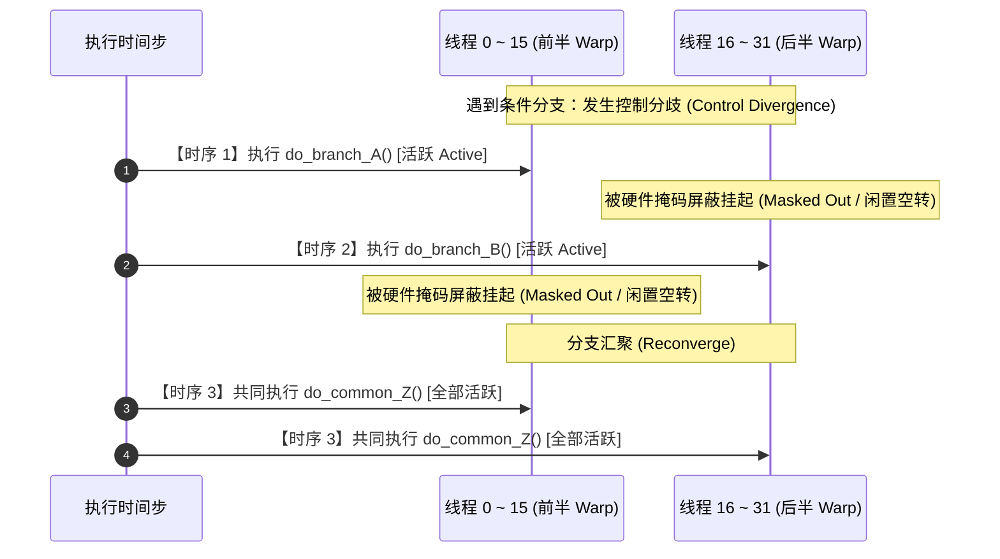

- **性能代价**：在时序 1 与时序 2 中，由于一半的核心被硬件强制屏蔽（Masked Out），**GPU 瞬时算力利用率直接腰斩暴跌 50%**。

---

#### 2. 原文场景实战：如何消除分支分歧？（3 种工程解法与示例代码）

针对课件中的典型场景：
```cuda
// ❌ 原始写法：引发严重的 Warp 内控制分歧
if (threadIdx.x < 4) {
    A();
    B();
} else {
    X();
    Y();
}
Z();
```

##### 方案 ①：按整 Warp 进行任务分工（Warp-Level Assignment，推荐）
- **核心思想**：不要在 32 人的“班组”（Warp）内部切分任务，而是让 **整个 Warp 32 个线程统一执行任务 A/B**，让另一个 Warp 统一执行任务 X/Y。
- **重构代码**：
```cuda
__global__ void example_warp_aligned_kernel(...) {
    // 1. 计算当前线程属于哪一个 Warp (0, 1, 2, ...)
    int warp_id = threadIdx.x / 32;       // 线程 0~31 的 warp_id 恒为 0，32~63 恒为 1
    int lane_id = threadIdx.x % 32;       // 线程在当前 Warp 内的组内索引 (0~31)

    // ✅ 改写为 Warp 级条件分支：整个 Warp 步调 100% 绝对一致！
    if (warp_id == 0) {
        // Warp 0 内全部 32 个线程齐步走，全力并行执行 A 和 B，无任何核心闲置！
        A_parallel(lane_id);
        B_parallel(lane_id);
    } else {
        // Warp 1, 2, ... 全部 32 个线程齐步走，全力并行执行 X 和 Y
        X_parallel(lane_id);
        Y_parallel(lane_id);
    }

    __syncthreads(); // 块内线程同步
    Z();             // 共同执行后续公共任务
}
```

##### 方案 ②：无分支数学化 / 谓词执行（Branchless / Predication）
- **核心思想**：如果 A/B 与 X/Y 只是轻量级算术运算或赋值，直接去除 `if-else`，改用三元条件表达式或数学算式。
- **重构代码**：
```cuda
// ❌ 糟糕写法 (产生分支分歧)：
// if (threadIdx.x < 4) val = val * 2.0f + 1.0f; else val = val * 0.5f;

// ✅ 无分支写法 (编译器直接翻译为硬件级的单周期条件选择指令 selp / FMA)：
val = (threadIdx.x < 4) ? (val * 2.0f + 1.0f) : (val * 0.5f);
```

##### 方案 ③：数据预重排与分桶（Data Reorganization / Binning）
- **核心思想**：如果分支是由输入数据的取值决定的（例如正数走分支 A，负数走分支 B），在送入 GPU 计算前先进行一次**基数排序或分桶重排**，使同属性数据在显存中连续存放。连续 32 个线程读取到相同类型的数据，自然走入相同分支。

---

#### 3. 补充辨析：Warp 内部 vs Warp 之间调度的独立性

- **Warp 内部（Intra-Warp）**：同一个 Warp 的 32 个线程绑定在同一个指令发射器上（SIMT），一旦发生 `if-else` 分支，硬件必须将未中选的线程屏蔽休眠，**串行排队**执行两条路径。
- **Warp 之间（Inter-Warp）**：Warp 0 与 Warp 1 是**完全独立的调度实体**。SM 拥有多个独立的 Warp 调度器，Warp 0 执行 `if` 分支（任务 A）时，Warp 1 **完全可以同时并发**执行 `else` 分支（任务 B），**互不阻塞、互不干涉**。只有当显式调用 `__syncthreads()` 时，跑得快的 Warp 才会停下来等待跑得慢的 Warp 到达同步栅栏。

---

## 第 24 页 (Page 24)

### 优化 2：低精度计算 (Low precision computation)
- **数据位数越少，需要移动和搬运的数据量就越小。**

---

## 第 25 页 (Page 25)

### 低精度能显著改善计算强度 (Low precision improves arithmetic intensity)
以长度为 $n$ 的向量进行逐元素 ReLU 操作 ($x = \max(0, x)$) 为例：

#### Float 32 情况：
- **内存读写**：1 次读取 ($x$)，如果 $x < 0$ 则有 1 次写入。Float 32 每次操作需要移动 4 字节。
- **计算操作**：1 次比较操作，1 次 FLOP。
- **计算强度**：8 字节 / FLOP。

#### Float 16 情况：
- **内存读写**：1 次读取 ($x$)，如果 $x < 0$ 则有 1 次写入。Float 16 每次操作需要移动 2 字节。
- **计算操作**：1 次比较操作，1 次 FLOP。
- **计算强度**：4 字节 / FLOP。

---

## 第 26 页 (Page 26)

### 低精度推动矩阵乘法大幅提速 (Low precision drives faster matrix multiplies)
现代 GPU 中的绝大多数计算任务，都是通过低精度或混合精度（Mixed Precision）操作在张量核心（Tensor Cores）上完成提速的。

---

## 第 27 页 (Page 27)

### 低精度的前沿发展 (Frontiers in low precision)
- **超低精度（FP8）**带来的不同取舍。
- 引入**多重缩放因子 MXFP8 (Blackwell 架构)**：
  - 采用 E4M3（保留更多尾数位）和更多的缩放因子以保持精度。
  - 缩放因子本身也是 FP8 (E8M0) 类型，且每 32 个元素共享 1 个缩放因子。
  - 在此架构下，矩阵转置操作变得不再平凡（nontrivial）！

---
### 💡 核心机制与图解复刻：低精度数据格式演进与微缩放（Microscaling）机制

#### 1. 主流浮点数格式位排布对比

| 数据格式 | 总位数 | 符号位 (Sign) | 指数位 (Exponent) | 尾数位 (Mantissa) | 数值动态范围 | 精度分辨率 | 适用场景 |
| :--- | :---: | :---: | :---: | :---: | :---: | :---: | :--- |
| **FP32** | 32 bit | 1 bit | 8 bit | 23 bit | $10^{\pm 38}$ | 极高 ($2^{-23}$) | 主权重更新、高精度累加 |
| **FP16** | 16 bit | 1 bit | 5 bit | 10 bit | $10^{\pm 4.5}$ | 高 ($2^{-10}$) | 早期深度学习（需搭配 Loss Scale） |
| **BF16** | 16 bit | 1 bit | 8 bit | 7 bit | $10^{\pm 38}$ | 中 ($2^{-7}$) | 当前 LLM 预训练主流标准（范围同 FP32） |
| **FP8 (E4M3)** | 8 bit | 1 bit | 4 bit | 3 bit | $\pm 448$ | 相对高 ($2^{-3}$) | 前向推理与前向激活值计算（关注精度） |
| **FP8 (E5M2)** | 8 bit | 1 bit | 5 bit | 2 bit | $\pm 57344$ | 相对低 ($2^{-2}$) | 反向传播梯度计算（关注动态范围） |

#### 2. Blackwell 架构微缩放格式：MXFP8 机制深度拆解

##### (1) 为什么需要微缩放？（传统 FP8 的致命痛点）
- 传统 FP8（如 E4M3）动态范围极窄（最大仅 448）。若整张矩阵共用一个全局缩放因子（Per-tensor Scaling），一旦矩阵中出现少量的**极大异常值（Outliers）**，为了防止溢出必须将全局 Scale 设得极大；
- 这会导致占据 99% 的微小正常数值在缩小后直接**精度下溢（Underflow）截断为 0**，诱发训练崩溃。

##### (2) MXFP8 的物理编码结构（32 个元素一组）
- **格式本质**：MXFP8 是一种由 OCP 联合制定的**块浮点（Block Floating Point）复合量化格式**，整个矩阵全部由这种微型块无缝拼接而成。
- **微块物理组成（Block Size $k = 32$）**：
  - **数据区**：矩阵中连续的 **32 个元素**，各自采用 **FP8 (E4M3)** 存储（占 $32 \times 1 = 32$ 字节）；
  - **尺度区**：这 32 个元素共同配备 **1 个 8-bit 的专属共享缩放因子（E8M0 格式，纯指数表示 $2^{\text{exp}}$ 倍率）**（占 1 字节）；
  - **总存储**：每 32 个数仅占 $32 + 1 = 33$ 字节。

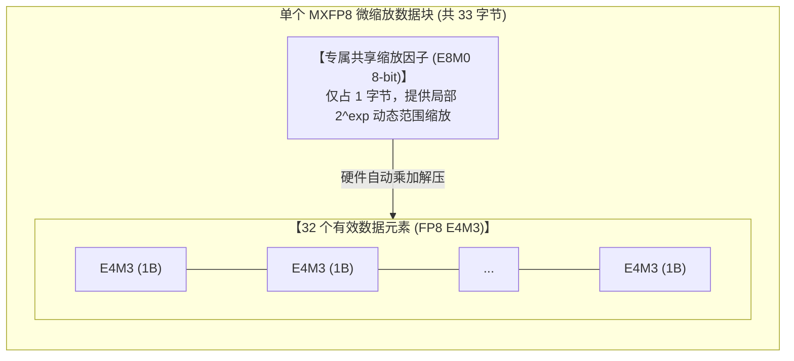

##### (3) 开销与收益核算
- **极低的显存代价**：平均每个元素占用位数仅为 $\frac{33 \times 8}{32} = \mathbf{8.25 \text{ bit / 元素}}$（相比标准 FP8 仅微增 $3.1\%$ 显存）；
- **极高的数值稳定性**：将动态范围隔离在 32 个元素的微小局部，异常值只会影响本块的 Scale，绝不连累其他块，实现了媲美 16-bit 的高保真训练。

##### (4) 为什么矩阵转置变得不再平凡（Nontrivial）？
- **物理原因**：在行优先（Row-Major）存储下，缩放因子是**沿行方向（横向）**以 32 个数为一组绑定的；
- **转置困境**：对矩阵做转置 $A^\top$ 后，原本横向连续的一行变成了纵向的一列，破坏了原有的 32 元素共享边界。因此在反向传播计算梯度时，硬件/编译器**必须重新沿纵向扫描这 32 个数，重新计算并量化一组属于新列的缩放因子**。

---

## 第 28 页 (Page 28)

### 实际开发中的 MXFP8 训练 (MXFP8 training in practice)
在实践中，并非所有的权重都采用 MXFP8 格式，转置操作也需要独立进行量化。

*(数据源自：[arXiv:2506.08027](https://arxiv.org/html/2506.08027v2))*

---

## 第 29 页 (Page 29)

### 低精度的前沿发展 (续)
#### MXFP4：
- 这代表了你能用极小位数表示的所有可能值！每 16 个值共享 1 个缩放因子，使用 E4M3 作为缩放因子的数据格式。

---

## 第 30 页 (Page 30)

### 优化 3：算子融合 (Operator fusion)
- 我们可以将 GPU 想象成一座工厂 —— 所有的计算输入来自仓库（内存），然后搬运至厂房（计算单元）进行加工处理。
- 厂房的加工速度（算力）在不断攀升，但搬运速度（内存）却没有跟上。

*(图表来自 Horace He 的个人博客 [horace.io](https://horace.io/brrr_intro.html))*

---

## 第 31 页 (Page 31)

### 算子融合减少内存读写 (Operator fusion to minimize memory access)
当我们需要执行多项计算任务时，频繁在仓库和厂房之间搬运中间产物会显得十分愚蠢。
- **非融合方案（Naive / Non-fused）**：多次计算，多次往返全局内存。
- **融合方案（Fused Kernel）**：数据加载一次，在片上完成全部计算后一次性写回。

---
### 💡 核心机制与图解复刻：算子融合（Operator Fusion）消除显存往返

#### 1. 朴素多 Kernel 执行 vs 算子融合执行流对比

以计算 $y = \operatorname{GELU}(\operatorname{LayerNorm}(x))$ 为例：

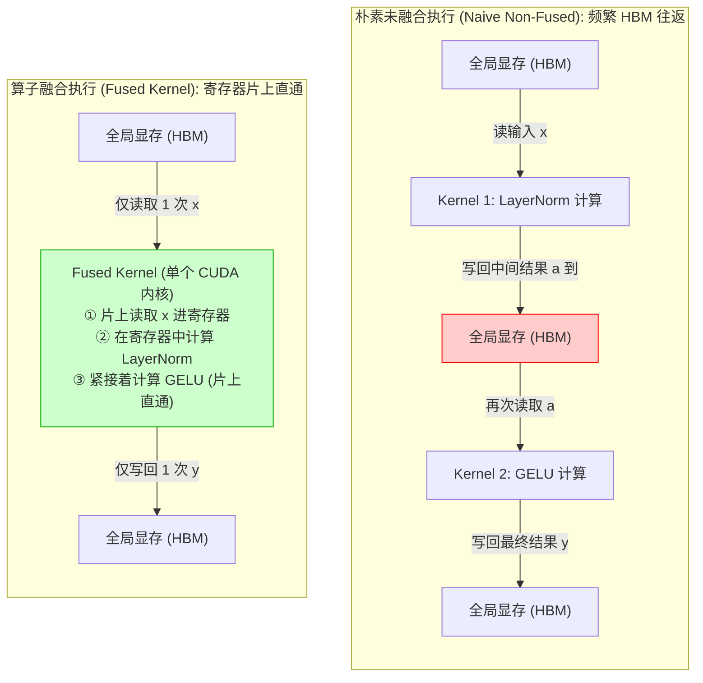

- **收益核算**：显存读写次数从 **4 次（2 读 2 写）骤降到 2 次（1 读 1 写）**，节约了 50% 以上的显存带宽开销，彻底消除中间无用显存分配。

---

## 第 32 页 (Page 32)

### 算子融合实例：正弦与余弦计算 (Example – sines and cosines)
计算 $\sin^2 x + \cos^2 x$ 如果以最直白的方式书写，将会在 GPU 上发起 5 次 CUDA Kernel 的调用，产生大量的中间数据搬运。

*(数据源自：[towardsdatascience.com](https://towardsdatascience.com/how-pytorch-2-0-accelerates-deep-learning-with-operator-fusion-and-cpu-gpu-code-generation-35132a85bd26))*

---
### 💡 核心机制与图解复刻：PyTorch 计算图（FX Graph）与未融合 5 Kernel 的显存灾难

#### 1. 未融合时的计算图（FX Graph IR）与数据流

对于函数 $f(x) = \sin^2(x) + \cos^2(x)$，PyTorch 底层生成的未融合计算图如下：

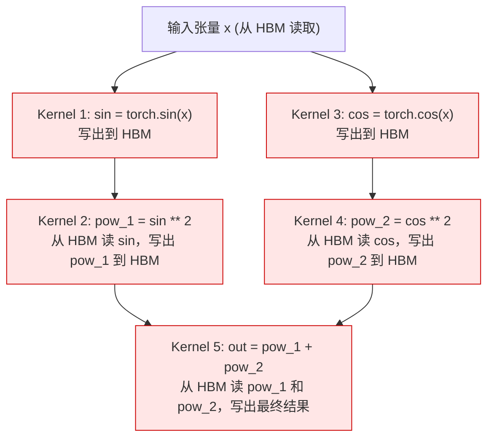

- **严重开销**：仅仅为了计算一个简单的数学恒等式，GPU 被迫发起了 **5 次独立的 CUDA Kernel 启动（Launch）**，并在全局显存（HBM）中产生了 **7 次读取与 5 次写入**（总计 12 次显存 IO 搬运），绝大部分时间都在等显存总线！

---

## 第 33 页 (Page 33)

### 融合示例 (Fusion example)
上述的 5 个逐元素算子可以被完全融合成 1 个 CUDA Kernel 调用。  
这类“简单的”算子融合现在能够通过编译器（如 `torch.compile`）自动完成。

---
### 💡 核心机制与图解复刻：TorchInductor 编译器自动算子融合（5 合 1）

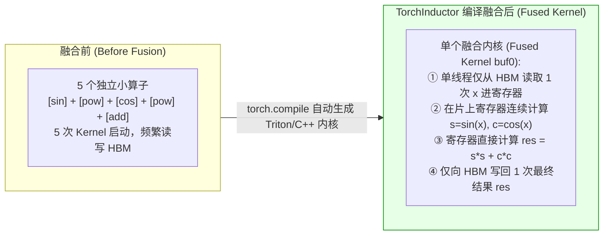

- **收益**：显存读写从 12 次降为 **2 次（1 读 1 写）**，Kernel 启动开销减少 **$80\%$**，执行速度实现数倍提升。

---

## 第 34 页 (Page 34)

### 优化 4：重计算 (Trick 3: recomputation)
- 在反向传播（Backpropagation）算法中，我们需要在内存中保留前向传播计算出的激活值（图中黄色节点），并在后向计算时计算雅可比矩阵（图中绿色节点）。

*(引自 Stanford cs221)*

---
### 💡 核心机制与图解复刻：标准反向传播计算图与激活值暂存困境

#### 1. 经典反向传播计算图（CS221 模型）

以损失函数 $\text{Loss}(x, y, w) = (w \cdot \phi(x) - y)^2$ 为例：

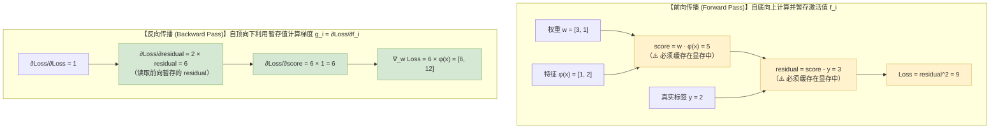

- **核心矛盾**：为了在反向传播时计算链式法则的局部导数（绿色节点），前向传播产生的**所有中间激活值（黄色节点）都必须长期驻留显存**。随着神经网络越来越深、上下文序列越来越长，中间激活值占用的显存迅速突破几十上百 GB，成为大模型训练爆显存（OOM）的头号杀手！
- **引出解法**：这就自然引出了第 35~36 页的 **激活重计算（Activation Recomputation / 梯度检查点）** —— 既然存储代价如此高昂，为何不直接丢弃它们，等反向传播需要时现场重算？

---

## 第 35 页 (Page 35)

### 保存（及调用）激活值可能会极其昂贵！ (Storing (and retrieving) activations can be expensive!)
假设我们将 3 个 Sigmoid 函数层层叠加：
- 每次前向计算和后向计算会频繁对中间层产生的激活值进行读写。
- 这会导致 8 次内存存取操作，计算强度极低，造成严重的性能损耗。

*(数据源自：[PyTorch Dev-Discuss](https://dev-discuss.pytorch.org/t/min-cut-optimal-recomputation-i-e-activation-checkpointing-with-aotautograd/467))*

---

## 第 36 页 (Page 36)

### 丢弃激活值，需要时重新计算！ (Throw away the activations, re-compute them!)
丢弃部分前向传播的激活值并在反向传播时重算，可以让整体的内存存取次数降低至原先的 5/8，在许多场景下这反而是最优的性能选择！

---
### 💡 核心机制与图解复刻：激活重计算（Activation Recomputation）的计算-显存账本

#### 1. 3 层 Sigmoid 网络的前向与反向访存账本对比

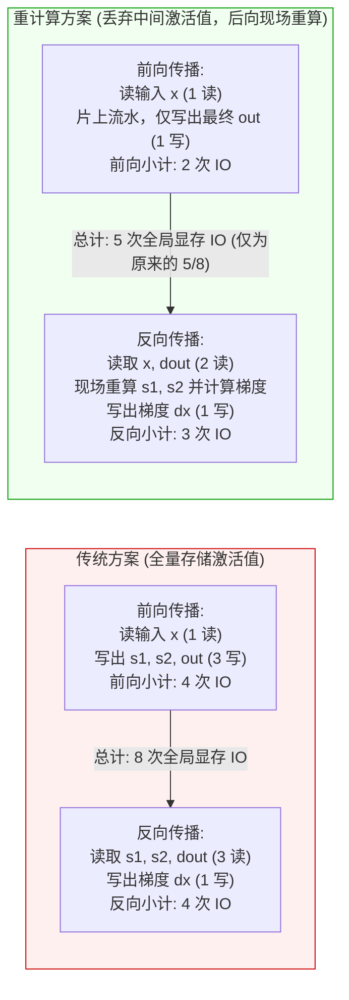

- **深层原理**：由于现代 GPU 的 FLOPs 算力极度充裕（廉价），而 HBM 显存带宽极度昂贵，**“多花一丁点算力重复算一遍，省下慢速显存搬运时间”** 是整体吞吐最优解。

---

## 第 37 页 (Page 37)

### 优化 5：内存合并存取与 DRAM (Memory coalescing and DRAM)
DRAM（全局内存）是以“突发模式 (burst mode)”进行数据读取的 —— 每次读取操作，实际上都会捎带返回许多字节！
- 内存地址空间被划分为不同的突发块（Burst Sections）。
- 无论何时访问其中的某一个地址，该分块内的所有其它地址数据都会被一同送达处理器。
- 在实际应用中，我们拥有至少 4GB 的地址空间，每次突发获取的数据块大小往往在 128 字节或更多。

*(引自 [CSDN 博文](https://blog.csdn.net/xll_bit/article/details/117702476) 及 [YouTube 视频](https://www.youtube.com/watch?v=9BjVUmaXaCQ))*

---

## 第 38 页 (Page 38)

### 内存合并访问 (Memory coalescing)
- 当同一个线程束（Warp）内的所有 32 个线程的访存请求正好落入同一个内存突发块（Burst Section）内时，访存就被成功合并（coalesced）。
- 提示：一个线程束的 32 个线程是在流式多处理器（SM）中协同执行并同步发出访存请求的。
- **定位澄清**：这里的“内存”与“突发块”**特指底层的全局显存（Global Memory / HBM / DRAM）**。因为 DRAM 物理上是以 128 字节为最小突发颗粒度传输的，若 Warp 读取连续地址可 1 次传输搞定（利用率 100%），若跨步离散访问则会触发 32 次独立传输（有效带宽利用率仅 3.1%）。

---

## 第 39 页 (Page 39)

### 矩阵乘法中的合并访问 (Coalescing for matrix multiplication)
对于按行优先（Row-Major）存储的矩阵：
- 如果线程束中的线程沿着矩阵行方向进行非合并访存，将会引发巨大的带宽浪费，因为每次移步都需要从全局内存中加载全新的突发块。

---
### 💡 核心机制与图解复刻：内存合并访问（Memory Coalescing）物理机制

#### 1. 合并访问（Coalesced）vs 离散跨步访问（Uncoalesced）

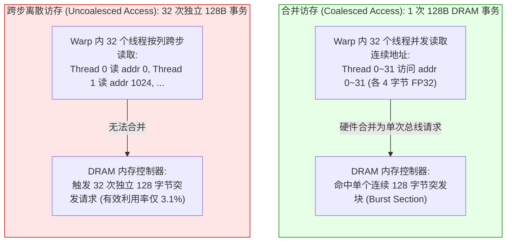

---

## 第 40 页 (Page 40)

### 优化 6：分块技术 (Trick 5: tiling)
**分块（Tiling）是合并与重新排列线程的访存顺序，以此最大程度减少全局内存读取的核心思想。**

- 再次回到矩阵乘法中：
- 简单的乘法计算会导致访存请求杂乱无序且不符合合并访问规范，导致相同的数据（如 $M_{0,0}$ 和 $N_{1,0}$）被重复地从全局内存读取多次。

---

## 第 41 页 (Page 41)

### 分块 —— 在共享内存中存储并复用数据 (Tiling – store and reuse information in shared memory)
将大矩阵切分为更小的“方块 (tiles)”，并在计算时整体一次性读取入共享内存中。  
按照分阶段（Phases）运行矩阵乘法：
1. 将矩阵 $M_{0,0}$ 和 $N_{0,0}$ 切片加载入共享内存（SHM）。
2. 计算生成结果矩阵 $P$ 的部分累加和（完成一个分块）。
3. 接着将 $M_{0,0}$ 和 $N_{2,0}$ 切片加载入共享内存。
4. 依次类推……
- **优势**：重复读取的数据直接在片上共享内存内完成，避免了对慢速全局内存的多次请求。
- **数学原理（分块矩阵乘法定理）**：将大矩阵 $M, N$ 切分为 $T \times T$ 的子块后，结果子矩阵满足 $P_{i, j} = \sum_{k} M_{i, k} \times N_{k, j} = M_{i, 0} N_{0, j} + M_{i, 1} N_{1, j} + \dots$。GPU 中的各个 Phase 实质上就是依次将子块 $M_{i, k}$ 与 $N_{k, j}$ 加载到片上 Shared Memory 中计算局部子矩阵乘法，并逐步在寄存器中累加求和。

---

## 第 42 页 (Page 42)

### 分块背后的数学 (Tiling math)
- **非分块矩阵乘法**：每个输入元素必须从慢速全局内存中重复读取 $N$ 次。
- **分块矩阵乘法**：如果分块尺寸为 $T$，每个输入元素只需从全局内存读取 $N/T$ 次，在共享内存上读取 $T$ 次。这为全局内存存取带来了 $T$ 倍的庞大降幅！

---
### 💡 核心机制与图解复刻：矩阵乘分块瓦片化（Tiling）与数据复用推导

#### 1. 分块矩阵乘法执行流程

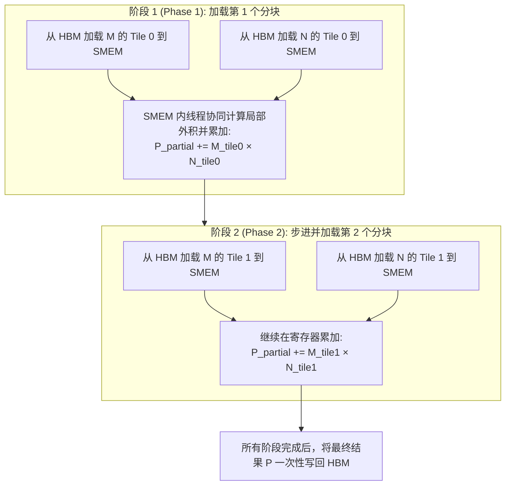

#### 2. 全局内存访问量降低 $T$ 倍的严格数学证明

设矩阵大小为 $N \times N$，分块尺寸为 $T \times T$：
- **朴素矩阵乘法（Naive）**：计算 $P_{ij} = \sum_{k=1}^N M_{ik} N_{kj}$。计算 $P$ 中每个元素需要读取 $M$ 的一行（$N$ 个数）和 $N$ 的一列（$N$ 个数），总计需读取 $2 N$ 次全局内存。
  $$\text{总全局内存读取量} = N^2 \times 2 N = 2 N^3$$
- **分块矩阵乘法（Tiled）**：输出矩阵被切分为 $(N/T) \times (N/T)$ 个输出 Tile。
  - 每个输出 Tile 需迭代 $N/T$ 个阶段，每个阶段从全局内存读取 1 个 $M$ 分块（$T^2$ 个元素）和 1 个 $N$ 分块（$T^2$ 个元素）；
  - 单个输出 Tile 的总全局内存读取量为 $(N/T) \times 2 T^2 = 2 N T$；
  - 全部 $(N/T)^2$ 个输出 Tile 的总全局内存读取量为：
    $$\text{总全局内存读取量} = \left(\frac{N}{T}\right)^2 \times 2 N T = \frac{2 N^3}{T}$$
- **结论**：分块技术将昂贵的全局显存搬运总量**严格降低了 $T$ 倍**！

---

## 第 43 页 (Page 43)

### 分块可能引入的复杂情况 (Complexities with tiling)
- 分块的方块大小（Tile sizes）可能无法整除矩阵的维度，这会导致“尾部块占不满（tile quantization）”而导致硬件利用率降低。
- 影响分块选择的关键要素：
  - 合并访存的物理限制
  - 共享内存空间的总容量
  - 矩阵维度的可除性

*(引自 [NVIDIA 开发者指南](https://docs.nvidia.com/deeplearning/performance/dl-performance-matrix-multiplication/index.html#tile-quant))*

---

## 第 44 页 (Page 44)

### 分块复杂性之二 —— 内存对齐 (Complexities with tiling 2 – memory alignment)
- 内存是以突发数据包（Bursts）为边界进行传输的。
- 只有当分块的内存边界恰好与矩阵在内存中的对齐突发相吻合时，数据加载效率才最高。
- 如果维度没有对齐，可能需要通过向矩阵添加填充（Padding）以辅助实现对齐存取。

---

## 第 45 页 (Page 45)

### 融会贯通：理解一个“矩阵神秘现象” (Putting it together: understanding a matrix mystery)
Andrej Karpathy 在推特上分享道：
> “迄今为止对 nanoGPT 最具戏剧性的优化（实现约 25% 的提速）其实非常简单：仅仅将词表大小从 50257 增大到 50304（最接近 64 的整数倍）。这虽然多算了一些无用维度，但成功让 GPU 走入了一条完全不同的、占用率（occupancy）高得多的算子通道。玩 2 的幂次时请千万保持谨慎。”

**为什么矩阵变大了，运行速度反倒变快了？**

*(本节内容深入剖析：[thonking.ai](https://www.thonking.ai/p/what-shapes-do-matrix-multiplications))*

---

## 第 46 页 (Page 46)

### 矩阵神秘现象 (Matrix mystery)
我们已经理解了其中蕴含的原理（计算强度、分块对齐）。让我们做进一步研究……

---

## 第 47 页 (Page 47)

### 第一部分：分块对齐 (Part 1: tiling)
分块是否能与内存的物理边界合理对齐，会对最终的计算效率产生决定性的影响。

---

## 第 48 页 (Page 48)

### 第二部分：波次量化问题 (Part 2: wave quantization)
为什么会出现周期性的速度波动？
- 例如在 1792 和 1793 的尺寸切换间会出现极大的性能差异。
- **原因分析**：假定使用 $256 \times 128$ 的分块尺寸：
  - 1792 尺寸下：有 $\frac{1792}{256} \times \frac{1792}{128} = 7 \times 14 = 98$ 个任务块。
  - 1793 尺寸下：则需要 $\lceil\frac{1793}{256}\rceil \times \lceil\frac{1793}{128}\rceil = 8 \times 15 = 120$ 个任务块。
- A100 GPU 拥有 108 个流式多处理器（SMs），它能在一个计算波次（Wave）中处理 98 个块，但面临 120 个块时，就必须启动第二波次（Wave 2），让大部分 SM 闲置以等待剩下的 12 个块完成。

---
### 💡 核心机制与图解复刻：波次量化（Wave Quantization）与尾部 SM 空转现象

#### 1. 波次调度（Wave Scheduling）物理实况

在拥有 108 个物理 SM 的 NVIDIA A100 GPU 上运行矩阵乘法：

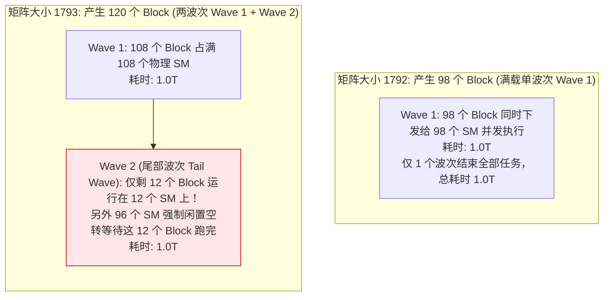

- **算力暴跌真相**：矩阵维度仅仅增加了 1 个元素（从 1792 到 1793），计算耗时却整整**翻倍（从 1.0T 变为 2.0T）**，导致有效 TFLOP/s 算力直接被腰斩！

---

## 第 49 页 (Page 49)

### 第二部分回顾：ML 负载加速秘籍 (Recap of part 2: making ML workloads go fast)
- **减少内存读写**：
  - 合并访存 (Coalescing)
  - 算子融合 (Fusion)
- **将数据置于片上高速共享内存中**：
  - 分块 (Tiling)
- **在内存存取与计算精度/计算量之间进行置换**：
  - 量化 (Quantization)
  - 重计算 (Recomputation)

---

## 第 50 页 (Page 50)

## 第三部分：Flash Attention 注意力机制解析 (Part 3: Understanding Flash Attention)
由 Dao et al. 提出的 Flash Attention 机制极大地加速了注意力机制的计算，这背后的核心原理是什么？

---

## 第 51 页 (Page 51)

### 注意力计算流程回顾 (Recap of attention computation)
标准的注意力机制计算包含 3 个大矩阵乘法（分别对应 $K, Q, V$），并在中间穿插 Softmax 归一化。

---

## 第 52 页 (Page 52)

### 注意力分块之一：对 KQV 矩阵乘法进行分块 (Tiling part 1: tiling for the KQV matrix multiply)
- 论文中的图 1 实质上就是针对注意力机制中矩阵乘法的分块存取流程。
- **但关键在于，我们应该如何对夹在中间的 Softmax 实施分块计算？**

---

## 第 53 页 (Page 53)

### 注意力分块之二：Softmax 的渐进式增量计算 (Tiling part 2: incremental computation of the softmax)
为了能够以方块（Tile-by-Tile）为单位渐进式地计算 Softmax，我们需要采用以下方案：
- **在线 Softmax 算法（Online Softmax）**：在迭代过程中动态更新当前观测到的最大值，并通过数学变形展开为伸缩级数形式进行局部累加。这使我们可以在不需要完整观测所有数据前，就以分块形式完成 Softmax 归一化的中间计算。

*(参考文献：Mikailov and Gimelshein 2018)*

---

## 第 54 页 (Page 54)

### 融会贯通：Flash Attention 的前向传播流程 (Putting it all together – the forward pass of flash attention)
从 Dao 2023 论文中，我们能清晰地提炼出三个优化支柱：
1. **分块计算**：针对中间乘积项（$S$）实施 Tile-wise 级的分块计算。
2. **算子融合**：将指数运算与其它计算操作融为一体。
3. **在线 Softmax**：通过伸缩级数技巧，分块渐进式地完成 Softmax 归一化。
- *(注：本讲中我们不涉及反向传播，但在反向时同样是按分块动态重计算激活值。)*

---
### 💡 核心机制与图解复刻：FlashAttention 前向核心实现——双重分块与在线 Softmax

#### 1. FlashAttention 端到端片上数据流图

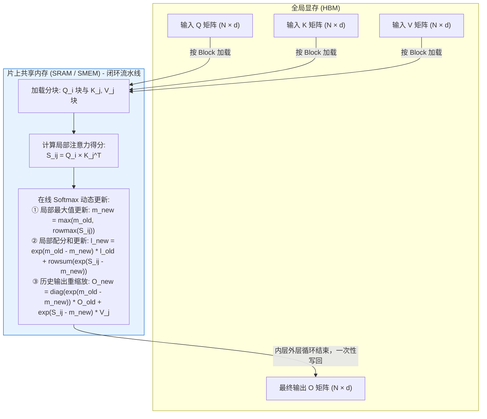

#### 2. 在线 Softmax（Online Softmax）数学递推完整推导

##### (1) 核心本质：Softmax 权重与输出向量 $O$ 的原始数学关系
在标准注意力机制中，对于某一个 Query 产生的得分向量 $x = [x_1, \dots, x_N]$ 以及对应的 Value 向量序列 $v_1, \dots, v_N$：
1. **注意力概率权重**：Softmax 计算出的每个标量就是对应 Value 向量 $v_j$ 的归一化概率权重 $p_j$：
   $$p_j = \text{Softmax}(x_j) = \frac{e^{x_j - m}}{l}, \quad \text{其中 } m = \max_{k=1}^N x_k, \quad l = \sum_{k=1}^N e^{x_k - m}$$
2. **输出向量 $O$ 的本质**：最终的注意力输出向量 $O$（Output）就是所有 Value 向量按权重 $p_j$ 做加权求和：
   $$O = \sum_{j=1}^N p_j v_j = \frac{1}{l} \sum_{j=1}^N e^{x_j - m} v_j$$

---

##### (2) 两个分块（Block 1 与 Block 2）的局部定义
将序列切分为两个分块：$x = [x^{(1)}, x^{(2)}], \; V = [V^{(1)}, V^{(2)}]$。
- **Block 1 的局部统计量与局部输出**：
  - 局部最大值：$m^{(1)} = \max(x^{(1)})$
  - 局部配分和：$l^{(1)} = \sum_{j \in \text{block 1}} e^{x_j - m^{(1)}}$
  - 局部加权输出（仅以第 1 块为全集算出的假想输出）：
    $$O^{(1)} = \frac{1}{l^{(1)}} \sum_{j \in \text{block 1}} e^{x_j - m^{(1)}} v_j \implies \sum_{j \in \text{block 1}} e^{x_j - m^{(1)}} v_j = l^{(1)} O^{(1)}$$
- **Block 2 的局部统计量**：
  - 局部最大值：$m^{(2)} = \max(x^{(2)})$
  - 局部配分和：$l^{(2)} = \sum_{j \in \text{block 2}} e^{x_j - m^{(2)}}$

---

##### (3) 合并两块时的代数恒等递推

1. **新全局最大值**：
   $$m^{\text{new}} = \max\left(m^{(1)}, m^{(2)}\right)$$

2. **新全局配分和（分母）$l^{\text{new}}$ 的推导**：
   $$l^{\text{new}} = \sum_{j \in \text{block 1}} e^{x_j - m^{\text{new}}} + \sum_{j \in \text{block 2}} e^{x_j - m^{\text{new}}}$$
   利用恒等式 $e^{x_j - m^{\text{new}}} = e^{m^{(1)} - m^{\text{new}}} \cdot e^{x_j - m^{(1)}}$：
   $$l^{\text{new}} = e^{m^{(1)} - m^{\text{new}}} \sum_{j \in \text{block 1}} e^{x_j - m^{(1)}} + e^{m^{(2)} - m^{\text{new}}} \sum_{j \in \text{block 2}} e^{x_j - m^{(2)}}$$
   $$\implies \mathbf{l^{\text{new}} = e^{m^{(1)} - m^{\text{new}}} \cdot l^{(1)} + e^{m^{(2)} - m^{\text{new}}} \cdot l^{(2)}}$$

3. **新全局加权输出 $O^{\text{new}}$ 的推导**：
   按照加权求和的原始定义，全局新输出等于各 Value 向量按新全局概率 $p_j^{\text{new}}$ 的加权和：
   $$O^{\text{new}} = \sum_{j} p_j^{\text{new}} v_j, \quad \text{其中 } p_j^{\text{new}} = \frac{e^{x_j - m^{\text{new}}}}{l^{\text{new}}}$$
   将 $p_j^{\text{new}}$ 代入并将公共分母 $\frac{1}{l^{\text{new}}}$ 提至求和号外：
   $$O^{\text{new}} = \sum_{j} \left( \frac{e^{x_j - m^{\text{new}}}}{l^{\text{new}}} \right) v_j = \frac{1}{l^{\text{new}}} \sum_{j} e^{x_j - m^{\text{new}}} v_j$$
   拆分为前两块的求和：
   $$O^{\text{new}} = \frac{1}{l^{\text{new}}} \left( \sum_{j \in \text{block 1}} e^{x_j - m^{\text{new}}} v_j + \sum_{j \in \text{block 2}} e^{x_j - m^{\text{new}}} v_j \right)$$
   对第 1 块提取缩放系数 $e^{m^{(1)} - m^{\text{new}}}$：
   $$\sum_{j \in \text{block 1}} e^{x_j - m^{\text{new}}} v_j = e^{m^{(1)} - m^{\text{new}}} \underbrace{\sum_{j \in \text{block 1}} e^{x_j - m^{(1)}} v_j}_{= l^{(1)} O^{(1)}} = e^{m^{(1)} - m^{\text{new}}} \cdot \Big( l^{(1)} O^{(1)} \Big)$$
   对第 2 块提取 $e^{m^{(2)} - m^{\text{new}}}$：
   $$\sum_{j \in \text{block 2}} e^{x_j - m^{\text{new}}} v_j = e^{m^{(2)} - m^{\text{new}}} \sum_{j \in \text{block 2}} e^{x_j - m^{(2)}} v_j = e^{m^{(2)} - m^{\text{new}}} \cdot \left( e^{x^{(2)} - m^{(2)}} V^{(2)} \right)$$
   代入 $O^{\text{new}}$ 中并拆项，即得 **输出动态重缩放递推式**：
   $$\mathbf{O^{\text{new}} = \frac{l^{(1)} e^{m^{(1)} - m^{\text{new}}}}{l^{\text{new}}} \cdot O^{(1)} + \frac{e^{m^{(2)} - m^{\text{new}}}}{l^{\text{new}}} \cdot \left( e^{x^{(2)} - m^{(2)}} V^{(2)} \right)}$$

- **核心收益**：
  - 第一项系数 $\frac{l^{(1)} e^{m^{(1)} - m^{\text{new}}}}{l^{\text{new}}}$ 即为旧输出的衰减修正因子。当新数据到来时，**完全无需重读旧数据**，只需将寄存器中的 $O^{(1)}$ 乘以该修正因子再加上新块贡献；
  - 彻底消除 $N \times N$ 注意力得分矩阵落盘 HBM，显存开销从 **$\mathcal{O}(N^2)$ 严格降为 $\mathcal{O}(N)$**，端到端提速 **$2\times \sim 4\times$**！

---

## 第 55 页 (Page 55)

### 全课总结 (Recap for the whole lecture)
- **硬件的物理限制决定了规模的上线**：低层级的技术对齐，决定了哪些架构在大规模训练中可行，哪些不可行。
- 现代以 GPU 为基石的算力生态，强力约束着我们必须深入思考 **“矩阵乘法”** 与 **“数据搬运”**。
- 精准尊重并响应 GPU 的硬件本性（内存合并访问、分块复用、算子融合）是获取顶级模型运行效率的唯一通道。
