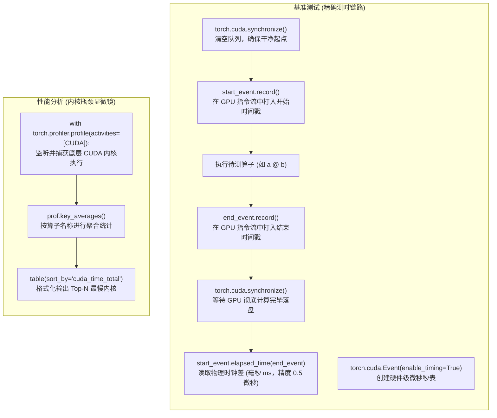
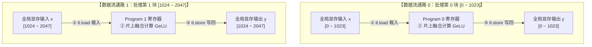

# 第 6 讲：基准测试、性能分析与 Triton 内核编写

**CS336 - 计算机系统与深度学习**  
**讲师：Tatsu H**  

---

### 课程概述与今日目标

- **上节课回顾**：GPU 硬件架构的宏观概述与基本性能特征。
- **今日核心**：
  1. 如何对显卡上的操作进行**基准测试 (Benchmarking)** 与**性能分析 (Profiling)** 以定位瓶颈。
  2. 为什么**算子融合 (Operator Fusion)** 对缓解内存带宽受限极度关键。
  3. 学习编写 **OpenAI Triton 内核**（逐元素 GeLU 激活函数、行归约 Softmax、跨块归约行求和、以及分块矩阵乘法 Matmul）。

```python
import os
import time
from typing import Callable
import torch
from torch.profiler import ProfilerActivity
import triton
import triton.language as tl
from gpu_util import cuda_if_available

print(f"CUDA 可用状态: {torch.cuda.is_available()}")
if torch.cuda.is_available():
    print(f"当前设备: {torch.cuda.get_device_name(0)}")
```

# 1. GPU 硬件与编程模型回顾 (Review of GPUs)

## 1.1 硬件规格规格对比 (Hardware Specs)

| 加速器 (Accelerator) | A100 | H100 | B200 |
| :--- | :---: | :---: | :---: |
| 流式多处理器数量 (# SMs) | 108 | 132 | 148 |
| 寄存器大小 (每个 SM) | 256 KB | 256 KB | 256 KB |
| L1 缓存 + 共享内存 (每个 SM) | 192 KB | 256 KB | 256 KB |
| L2 缓存大小 | 40 MB | 50 MB | 96-126 MB |
| HBM 容量 | 80 GB | 80 GB | 192 GB |
| 寄存器带宽 | ~116 TB/s | ~401 TB/s | ~447 TB/s |
| L1 缓存 + 共享内存带宽 | ~19 TB/s | ~33 TB/s | ~19 TB/s |
| L2 缓存带宽 | ~5-8 TB/s | ~12 TB/s | ~9 TB/s |
| HBM 带宽 | 2 TB/s | 3.35 TB/s | 8 TB/s |

*注：B200s 还具有张量内存 (TMEM) 用于张量核心（介于寄存器和共享内存之间），但它们对程序员是不可见的。*

## 1.2 GPU 编程模型 (Programming Model)

- **线程 (Thread)**：执行具体指令以处理数据的最小单位。
- **线程块 (Thread Block / CTA)**：协同处理同一块数据的线程集合，共享相同的 Shared Memory，并且必定被调度到同一个流式多处理器 (SM) 上运行。
- **网格 (Grid)**：包含多个独立线程块的整体集合。

### 为什么需要分线程块 (Thread Blocks)？
对于普通的逐元素 (elementwise) 算子，每个线程独自读取并处理一个元素就足够了；但是在非逐元素算子（如 Softmax 或矩阵乘法）中，线程间需要共享或累加数据。由于 HBM 访存非常慢，将数据载入流式多处理器本地的**共享内存 (Shared Memory)** 并进行块内通信是加速的关键。

## 1.3 编程模型与硬件交互对性能的影响

- **线程束 (Warps)**：线程块内部线程被划分为以 32 个为一组的 Warp。同一个 Warp 内的所有线程执行指令是完全同步 (lockstep) 的。如果出现分支选择（`if-else`），则需要进行串行排队执行，即**控制流分流分化 (Control Divergence)**，带来性能衰退。
- **线程束占用率 (Warp Occupancy)**：由于寄存器（每个 SM 仅有 256KB）与共享内存资源有限，每个线程如果占用的寄存器过多，会导致 SM 上同时并行的线程束数量变少（即低占用率）。但如果每个线程通过粗化计算了更多元素，低占用率不一定意味着低效率。  
  
下面我们在代码中来实际计算一下占用率：

```python
# 我们想要运行的配置
num_threads_per_block = 128
num_registers_per_thread = 160

# 硬件极限规格 (以 A100 为例)
max_registers = 65536  # 每个 SM 允许的最大寄存器数量
max_warps = 64         # 每个 SM 允许的并发线程束最大数量

# 保证每个线程最多使用 255 个寄存器
assert num_registers_per_thread <= 255
num_registers_per_block = num_threads_per_block * num_registers_per_thread  
num_blocks = max_registers // num_registers_per_block  # 寄存器限制了能同时运行的块数量
num_warps = num_blocks * num_threads_per_block / 32  
occupancy = num_warps / max_warps  

print(f"每个线程块消耗寄存器: {num_registers_per_block} 个")
print(f"每个 SM 并发块数: {num_blocks} 块")
print(f"每个 SM 并发线程束: {num_warps} 个")
print(f"Warp 占用率: {occupancy * 100:.2f}%")
```

- **银行冲突 (Bank Conflicts)**：片上共享内存在物理上被划分为 32 个银行 (Banks)，每周期一个 Bank 只能被一个线程访问。若多个线程同时访问同一个 Bank 且并非同一个地址，会导致硬件执行被串行化，引发银行冲突。
- **内存合并访问 (Memory Coalescing)**：Warp 内 32 个线程的访存请求会被硬件尽可能地合并为 128 字节的单次全局存取。如果每个线程访问跨度极大的非对齐地址，将大幅浪费 HBM 带宽。
- **块占用率 (Block Occupancy / Wave Quantization)**：网格内的线程块是以波次 (Waves) 被调度到各 SM 上的。如果块数不能整除 SM 数量，最后一波只会有极少的块在运行，造成硬件大量 SM 闲置。

# 2. 基准测试与性能分析 (Benchmarking and Profiling)

为了实现高效率优化，我们必须建立一个严谨的“分析-修改-再分析”的迭代闭环。
- **基准测试 (Benchmarking)**：用来测试一段算子操作的端到端耗时。
- **性能分析 (Profiling)**：用来探究底层的内核执行耗时细节，发现性能热点与瓶颈所在。

下面我们在代码中定义我们自己的基准测试与分析实用函数：

```python
def mean(xs: list[float]) -> float:
    return sum(xs) / len(xs)

def benchmark(run: Callable, num_warmups: int = 2, num_trials: int = 5) -> float:
    """通过运行多个 trial 来获取 run 算子的平均 GPU 耗时"""
    # 热身运行，用于排除编译/初始化带来的冷启动误差
    for _ in range(num_warmups):
        run()
    torch.cuda.synchronize()  # 确保热身计算全部落盘完成

    times: list[float] = []
    for trial in range(num_trials):
        # 使用 CUDA Events 进行精确测时，避开 CPU 调度的随机抖动
        start_event = torch.cuda.Event(enable_timing=True)
        end_event = torch.cuda.Event(enable_timing=True)

        start_event.record()
        run()
        end_event.record()

        torch.cuda.synchronize()  # 同步等待 GPU 完成
        times.append(start_event.elapsed_time(end_event))

    return mean(times)

def profile(run: Callable, num_warmups: int = 2):
    """利用 PyTorch 的性能分析器来展示底层内核调用状态"""
    for _ in range(num_warmups):
        run()
    torch.cuda.synchronize()

    with torch.profiler.profile(
        activities=[ProfilerActivity.CUDA],
        experimental_config=torch._C._profiler._ExperimentalConfig(verbose=True)
    ) as prof:
        run()
        torch.cuda.synchronize()

    # 格式化表格显示输出
    table = prof.key_averages().table(
        sort_by="cuda_time_total",
        max_name_column_width=80,
        row_limit=5
    )
    return table

def run_operation2(dim: int, operation: Callable) -> Callable:
    """创建用于测试的闭包，输入两个随机方阵进行操作"""
    a = torch.randn(dim, dim, device=cuda_if_available())
    b = torch.randn(dim, dim, device=cuda_if_available())
    return lambda: operation(a, b)
```

---
### 💡 核心机制与 API 深度剖析：系统级性能工程与 CUDA 测时工具箱

#### 1. 为什么日常模型开发极少见到这批 API？（CPU-GPU 异步发射陷阱）

在常规深度学习建模中，我们主要使用高层建模 API（如 `torch.nn.Module`, `loss.backward()`, `optimizer.step()`）。但在系统性能工程与底层算子优化中，我们必须面对 **GPU 异步发射（Asynchronous Execution）** 的物理事实：
- **异步陷阱**：在 Python 中执行 `c = a @ b` 时，CPU 只是将计算任务放入 GPU 的发射队列中，随后**立刻返回执行下一行代码（耗时仅数微秒）**，此时 GPU 可能尚未真正启动计算。
- **测时失效**：若直接使用 Python 自带的 `time.time()` 进行包裹测时，测得的只是 **CPU 任务发射耗时**，而非 GPU 真实的物理计算耗时。
- **解决方案**：PyTorch 提供了专用于底层硬件测时与内核探查的专用 API 工具链。



---

#### 2. 本节核心 Torch API 逐一精解

##### ① `torch.cuda.synchronize()` —— CPU-GPU 强制栅栏同步
- **核心功能**：阻塞当前 CPU 线程，**强制等待 GPU 设备上的所有未完成任务全部执行完毕**后才允许继续向下推进。
- **使用场景**：
  1. **热身（Warmup）后**：必须调用一次，确保冷启动的内存分配与 JIT 编译全部落盘，清空待测管线；
  2. **计时统计前后**：确保算子真正开始执行与真正完全落盘，消除异步带来的计时偏差。

##### ② `torch.cuda.Event(enable_timing=True)` 体系 —— GPU 硬件级微秒计时器
- **`torch.cuda.Event(enable_timing=True)`**：在 CUDA 流中创建一个硬件时间戳标记桩（Event）。`enable_timing=True` 允许该事件记录 GPU 硬件时钟周期。
- **`start_event.record()` / `end_event.record()`**：将标记桩插入 GPU 的任务队列中，紧随算子前后在硬件流水线上流动。
- **`start_event.elapsed_time(end_event)`**：
  - 由 GPU 驱动直接计算两个硬件事件之间的物理耗时；
  - **返回值单位**：毫秒（ms），测量精度高达 **0.5 微秒（0.0005 ms）**；
  - **优势**：彻底隔离了 Python 解释器 GIL 调度抖动、垃圾回收（GC）和 OS 线程切换的干扰。

##### ③ `torch.profiler.profile(...)` —— 深度透视内核的性能显微镜
- **核心功能**：不仅测试总耗时，更深入分析 GPU 底层具体启动了哪些 CUDA Kernel、各 Kernel 的耗时分布与显存吞吐。
- **参数说明**：
  - **`activities=[ProfilerActivity.CUDA]`**：指定 Profiler 重点监听 GPU 底层的 CUDA Kernel 活动（亦可添加 `ProfilerActivity.CPU` 监控 Python/C++ 调用栈）。

##### ④ `torch._C._profiler._ExperimentalConfig(verbose=True)` —— 底层 C++ 调试开关
- **核心功能**：`torch._C` 为 PyTorch 底层 C++ 绑定接口。开启 `verbose=True` 会使 Profiler 解析出最详尽的底层硬件符号。
- **应用价值**：普通输出可能仅显示 `aten::matmul`，开启后会打印出具体的底底层 cuBLAS 或 Triton 内核名称（如 `ampere_sgemm_128x128_nn`），便于系统工程师精准定位调用了哪套硬件流水线。

##### ⑤ `prof.key_averages().table(...)` —— 性能账本聚合与格式化输出
- **`prof.key_averages()`**：将海量细碎的 Trace 事件按照算子名称（Key）进行聚类，统计该算子的调用次数、总耗时、平均耗时等。
- **`.table(...)`**：生成可读性极高的 ASCII 性能账本表格：
  - `sort_by="cuda_time_total"`：按 **GPU 累计总耗时** 降序排列，直观暴露系统性能瓶颈；
  - `max_name_column_width=80`：加宽算子名称列，防止复杂的 CUDA 模板内核名被省略号截断；
  - `row_limit=5`：仅打印耗时排名前 5 的关键算子。

---

### 2.1 运行矩阵乘法基准测试

```python
# 测试并记录 1024x1024 乘法耗时
matmul_1024 = run_operation2(1024, lambda a, b: a @ b)
print(f"1024 矩阵乘法时间: {benchmark(matmul_1024):.2f} ms")

# 考察维度从 256 到 8192 的立方级复杂度扩展特性
for dim in [256, 512, 1024, 2048, 4096]:
    fn = run_operation2(dim, lambda a, b: a @ b)
    print(f"维度 {dim}x{dim} 耗时: {benchmark(fn):.2f} ms")
```

### 2.2 运行性能分析器 (Profiling)

我们可以查看加法操作与乘法操作调用的具体 CUDA 内核名称：

```python
add_op = run_operation2(2048, lambda a, b: a + b)
print("=== ADD (2048) PROFILER ===")
print(profile(add_op))

matmul_op = run_operation2(2048, lambda a, b: a @ b)
print("\n=== MATMUL (2048) PROFILER ===")
print(profile(matmul_op))
```

# 3. 算子融合与 GeLU 激活函数性能对比 (Naive vs Built-in vs Compiled GeLU)

GeLU 的数学定义为：
$$\operatorname{GeLU}(x) = 0.5x \times (1 + \tanh(0.79788456(x + 0.044715x^3)))$$

如果我们使用 Naive 的 PyTorch 代码书写，会导致每次幂运算、加法、乘法都需要独立调用一个 GPU 内核，产生极其高昂的中间结果写回 HBM 再读出的带宽开销。通过**内核融合 (Kernel Fusion)**，我们可以让整个公式在一次 HBM 读取和写回内完成。

```python
def naive_gelu(x: torch.Tensor):
    return 0.5 * x * (1 + torch.tanh(0.79788456 * (x + 0.044715 * x * x * x)))

def builtin_gelu(x: torch.Tensor):
    return torch.nn.functional.gelu(x, approximate="tanh")

def check_equal_1d(f1, f2):
    x = torch.randn(2048, device=cuda_if_available())
    y1 = f1(x)
    y2 = f2(x)
    assert torch.allclose(y1, y2, atol=1e-6)

def run_operation1(dim: int, operation: Callable) -> Callable:
    x = torch.randn(dim, dim, device=cuda_if_available())
    return lambda: operation(x)

# 确保编译后的行为正确
compiled_gelu = torch.compile(naive_gelu)

check_equal_1d(naive_gelu, builtin_gelu)
check_equal_1d(naive_gelu, compiled_gelu)

# 开展对比基准测试
dim_size = 8192
naive_fn = run_operation1(dim_size, naive_gelu)
builtin_fn = run_operation1(dim_size, builtin_gelu)
compiled_fn = run_operation1(dim_size, compiled_gelu)

print(f"Naive GeLU 运行时间: {benchmark(naive_fn):.4f} ms")
print(f"Builtin GeLU 运行时间: {benchmark(builtin_fn):.4f} ms")
print(f"Compiled GeLU 运行时间: {benchmark(compiled_fn):.4f} ms")
```

---
### 💡 核心机制与原理深潜：torch.compile、算子融合与数值校验

#### 1. `torch.compile` 的核心作用
- **消除解释开销与显存搬运**：PyTorch 默认的 Eager 模式会逐行发射独立内核，频繁向 HBM 读写中间变量。`torch.compile` 通过 TorchDynamo 捕获完整计算图，并由 TorchInductor 后端自动生成高度优化的 **C++ / OpenAI Triton 融合单内核（Fused Kernel）**。
- **开发红利**：开发者只需用最直白的纯 Python 公式编写算法，编译器自动在底层生成媲美手写 CUDA 的极致性能。

#### 2. “算子融合”在代码与底层执行上的真实体现
- **Python 代码层面**：`naive_gelu` 表面上写了乘法、加法、立方与 tanh 等 **8~9 次细碎的基础数学操作**。
- **底层硬件执行对比**：
  - `naive_gelu`：GPU 串行启动 8~9 个独立 CUDA 内核，每次计算都必须将中间产物写入 HBM 再读出，严重受限于显存带宽；
  - `builtin_gelu`：调用 PyTorch 官方底层 C++ 预先手写融合好的单个 CUDA 内核；
  - `compiled_gelu`：编译器自动将上述 8~9 个操作融合成单个 Triton 内核，数据在片上寄存器完成流水线计算，**仅需 1 次 HBM 读取与 1 次最终写回**。
- **Profile 证据**：在性能分析中，`naive_fn` 会产生一长串多行内核调用，而 `compiled_fn` 与 `builtin_fn` 只显示 **1 行单一融合内核**。

#### 3. `check_equal_1d` 正确性校验与浮点容差设计
- **优化前提**：高性能计算的铁律是“算得快必须建立在算得对的基础上”。在基准测速前，必须先验证优化后内核与原生数学实现严格等价。
- **为什么使用 `torch.allclose` 而非 `==`？**
  - 浮点数在经历不同的底层指令优化（如单步硬件乘加 FMA、多项式近似截断）时会产生微小的机器舍入误差；
  - `torch.allclose(y1, y2, atol=1e-6)` 允许在绝对容差 $10^{-6}$ 内判定等价，避免了浮点微差导致的误报崩溃。
- **关于 `(y1 == y2).all()` 语法**：
  `(y1 == y2)` 会通过运算符重载在 GPU 上生成一个布尔张量（`torch.bool`），而 `.all()` 是 `torch.Tensor` 类原生的全量逻辑与（AND）并行归约方法，用于高效检查该张量内所有元素是否“全部为 True”。

---

我们来看看它们的 Profile 信息，编译版和内置版是高度融合的单算子内核：

```python
print("=== Naive GeLU ===")
print(profile(naive_fn))

print("\n=== Compiled GeLU ===")
print(profile(compiled_fn))
```

# 4. OpenAI Triton 简介与内核编写

- 在 CUDA 中：我们需要考虑极其精细的每个**线程**应该读写哪个寄存器，以及如何利用共享内存避开银行冲突，开发难度高。
- 在 Triton 中：我们以**线程块 (Thread Blocks)** 为维度组织逻辑。Triton 编译器会自动帮我们把高级的分块描述翻译为高性能的 PTX 指令，并自动完成硬件资源的调度与对齐优化。

## 4.1 Triton GeLU 激活函数实现

Triton 内核需要使用 `@triton.jit` 修饰。我们在这里实现近似 GeLU 的整个数据流动环节：

```python
@triton.jit
def triton_gelu_kernel(x_ptr, y_ptr, num_elements, BLOCK_SIZE: tl.constexpr):
    # 计算当前处理块的起始绝对索引
    pid = tl.program_id(axis=0)
    start = pid * BLOCK_SIZE

    # offsets 为形状是 (BLOCK_SIZE,) 的一维局部偏移量数组
    offsets = start + tl.arange(0, BLOCK_SIZE)
    
    # 防界限溢出掩码
    mask = offsets < num_elements

    # 1. 数据加载 (HBM -> 寄存器)
    # x_ptr 是标量指针，x_ptr + offsets 利用张量广播运算，生成形状为 (BLOCK_SIZE,) 的绝对地址指针向量
    x = tl.load(x_ptr + offsets, mask=mask)

    # 2. 片上融合数学计算
    # 使用公式: tanh(a) = (exp(2a) - 1) / (exp(2a) + 1)
    a = 0.79788456 * (x + 0.044715 * x * x * x)
    exp = tl.exp(2.0 * a)
    tanh_val = (exp - 1.0) / (exp + 1.0)
    y = 0.5 * x * (1.0 + tanh_val)

    # 3. 数据写回 (寄存器 -> HBM)
    # y_ptr + offsets 同样为广播生成的绝对地址指针向量，将寄存器数据向量 y 批量写回
    tl.store(y_ptr + offsets, y, mask=mask)

def triton_gelu(x: torch.Tensor):
    assert x.is_cuda
    # 必须为连续张量：高维张量在底层物理显存中等价于展开为紧密连续的一维数组，中间无任何填充附加信息
    assert x.is_contiguous()

    y = torch.empty_like(x)
    num_elements = x.numel()  # 直接以一维平坦视角获取总元素数（如形状 (B, S, D) -> 总数 B*S*D）
    BLOCK_SIZE = 1024  # 块尺寸，典型为 1024
    num_blocks = triton.cdiv(num_elements, BLOCK_SIZE)  # 向上整除

    # 使用一维网格调用启动内核
    triton_gelu_kernel[(num_blocks,)](x, y, num_elements, BLOCK_SIZE=BLOCK_SIZE)
    return y

# 正确性检验
x_test = torch.randn(65536, device=cuda_if_available())
y_naive_gelu = naive_gelu(x_test)
y_triton_gelu = triton_gelu(x_test)
print(f"Triton 激活函数正确性: {torch.allclose(y_naive_gelu, y_triton_gelu, atol=1e-6)}")
```

---
### 💡 核心机制与原理深潜：Triton 算子融合本质（片上流水 vs 显存往返）

- **单块局部代码与全局网格并发分发范式**：
  `triton_gelu_kernel` 内部只书写了**单个 Block（1024 个元素）** 的局部计算逻辑；而在 Host 端通过 `[(num_blocks,)]` 将整个拉平的矩阵任务分发给 GPU 硬件调度器，由各个流式多处理器（SM）上的 Program 实例并发执行，将局部计算拓展至整个高维张量（彻底消除了传统的最外层串行 `for` 循环）。
- **高维张量的平坦一维物理存储（Flat 1D Buffer）**：
  只要张量满足 `x.is_contiguous()`（C-连续），无论它是 2D 矩阵还是 4D 张量 `(B, S, H, D)`，在 GPU 物理显存中**本质上就是被平坦展开为一维连续的字节数组，中间绝不包含任何边界元数据或填充信息**。由于 GeLU 是逐元素独立操作（Element-wise），因此可以直接将其视为包含 `x.numel()` 个元素的一维数组，通过简单的线性标量偏移量 `x_ptr + offsets` 进行分块处理。
- **Triton 的核心巧妙之处**：
  在 `tl.load()` 与 `tl.store()` 之间，所有的多项式展开、tanh、指数与乘加运算**全部一次性在 GPU 片上极速寄存器（Registers）中流水线完成，绝不写回慢速全局显存（HBM）**；
- **传统慢方法的本质**：
  在 Python 原生 Eager 模式下，每一步微小的加减乘除都会启动一个独立的 CUDA 内核。其在 GPU 上的执行实质上**等价于在每一步微小计算前后都荒谬地调用 `tl.store()` 存回 HBM 再 `tl.load()` 重新读出**，导致 90% 以上的耗时全部浪费在慢速显存总线的往返搬运上。



---

## 4.2 Triton Softmax 行归约实现

行归约算子需要对整行的元素执行归一化。在下面的算子实现中，我们假定**每一行的元素能够完整塞进单个线程块中 (Row fits in a block)**。

```python
def naive_softmax(x: torch.Tensor):
    # 行的最大值读取
    x_max = x.max(dim=1)[0]
    # 减去最大值后指数化
    numerator = torch.exp(x - x_max[:, None])
    # 计算加和倒数并归一化
    denominator = numerator.sum(dim=1)
    return numerator / denominator[:, None]

@triton.jit
def triton_softmax_kernel(x_ptr, y_ptr, x_row_stride, y_row_stride, num_cols, BLOCK_SIZE: tl.constexpr):
    # 每个网格的 program 代表一整行
    row_idx = tl.program_id(axis=0)
    col_offsets = tl.arange(0, BLOCK_SIZE)

    # 读取行首地址，获取该行所有列的数据
    x_start_ptr = x_ptr + row_idx * x_row_stride
    x_ptrs = x_start_ptr + col_offsets

    # 如果超出当前行的物理列数，填补 -inf 以保证计算指数时不影响最大值提取与加总
    x_row = tl.load(x_ptrs, mask=col_offsets < num_cols, other=float("-inf"))

    # 在共享内存中执行规约
    x_row = x_row - tl.max(x_row, axis=0)
    numerator = tl.exp(x_row)
    denominator = tl.sum(numerator, axis=0)
    y_row = numerator / denominator

    # 写回显存
    y_start_ptr = y_ptr + row_idx * y_row_stride
    y_ptrs = y_start_ptr + col_offsets
    tl.store(y_ptrs, y_row, mask=col_offsets < num_cols)

def triton_softmax(x: torch.Tensor):
    M, N = x.shape
    y = torch.empty_like(x)
    block_size = triton.next_power_of_2(N)  # 寻找最接近的 2 的幂
    
    triton_softmax_kernel[(M,)]( 
        x_ptr=x, y_ptr=y, 
        x_row_stride=x.stride(0), y_row_stride=y.stride(0),
        num_cols=N, BLOCK_SIZE=block_size
    )
    return y

# 正确性检验
x_s = torch.randn(128, 512, device=cuda_if_available())
y_s_torch = torch.nn.functional.softmax(x_s, dim=-1)
y_s_triton = triton_softmax(x_s)
print(f"Triton Softmax 正确性: {torch.allclose(y_s_torch, y_s_triton, atol=1e-6)}")
```

---
### 💡 核心机制与原理深潜：Triton Softmax 行归约与物理内存跨步设计

#### 1. 数值稳定性设计：Safe Softmax（减去最大值防上溢）
- **浮点数上溢危机**：在 FP32 浮点格式中，最大能表示的数约为 $10^{38}$。而自然指数增长极快（$e^{88} \approx 1.6 \times 10^{38}$）。若输入张量中包含较大正数（如 $x = 100$），直接计算 $e^{100}$ 会发生 **浮点数上溢（Overflow）变成 `inf`**，导致分母 $\sum e^x = \text{inf}$，最终 $\frac{\text{inf}}{\text{inf}} = \text{NaN}$ 引发模型训练崩溃。
- **数学等价变形**：利用恒等式 $\text{Softmax}(x_i) = \frac{e^{x_i - m}}{\sum_j e^{x_j - m}}$（其中 $m = \max(x)$），减去最大值后所有元素 $x_i - m \le 0$，指数项严格落在 $(0, 1]$ 之间，**从数学根本上彻底杜绝了浮点上溢**。

#### 2. 跨行步长（Stride）机制与零拷贝切片寻址
- **为什么传 `x.stride(0)` 而非列数 $N$？**
  在 PyTorch 中，张量切片（Slicing）是 **零拷贝视图（Zero-Copy View）**，新张量与原张量共享同一块底层连续显存，因此新矩阵的“列数”与“跳到下一行的物理距离（步长）”并不相等！
- **具象示例对比**：
  假设有一个 $3 \times 4$ 的大矩阵：
  $$\begin{bmatrix} 0 & 1 & 2 & 3 \\ 4 & 5 & 6 & 7 \\ 8 & 9 & 10 & 11 \end{bmatrix}$$
  在物理显存中连续存放为：`[0, 1, 2, 3, 4, 5, 6, 7, 8, 9, 10, 11]`。
  
  若切片取中间两列 `sub_x = big_x[:, 1:3]`，得到 $3 \times 2$ 的子矩阵：
  $$\begin{bmatrix} 1 & 2 \\ 5 & 6 \\ 9 & 10 \end{bmatrix}$$
  - 该子矩阵的逻辑列数 $N = 2$；
  - 第 0 行开头是元素 `1`（物理索引 1），第 1 行开头是元素 `5`（物理索引 5）；
  - 从第 0 行跳到第 1 行，在物理显存中**必须跨过 4 个位置（$5 - 1 = 4$）**，即 `sub_x.stride(0) = 4`！
  - 若在内核中错误使用列数 $N=2$ 寻址：第 1 行会错误定位到索引 $1 + 1 \times 2 = 3$（读出 `[3, 4]` 错乱数据）；
  - 使用 `x.stride(0) = 4` 寻址：第 1 行定位到 $1 + 1 \times 4 = 5$（读出 `[5, 6]`，**100% 精确命中**）。

#### 3. 越界填充技巧：为什么必须填 $-\infty$（`other=float("-inf")`）？
当列数不是 2 的幂（如 $N=500$，而块大小对齐为 512 时），最后 12 个越界位置填充 $-\infty$ 具有精妙的数学协同效应：
- **最大值提取**：$\max(x_1, \dots, x_{500}, -\infty) = \max(x_1, \dots, x_{500})$ $\to$ 最大值不被虚构元素污染；
- **指数配分和**：$e^{-\infty} = 0$ $\to$ 分母求和时虚构元素贡献为 0，配分和绝对纯净；
- **写回屏蔽**：写回显存时配合 `mask=col_offsets < num_cols`，越界数据被准确拦截，不发生越界写。

#### 4. 硬件约束与动态 2 的幂次对齐：`triton.next_power_of_2(N)`
GPU 底层的张量加载指令（如 128-bit 向量指令）与 Warp 调度在硬件上强依赖 2 的幂次尺寸（32, 64, 128, 256, 512, 1024）。通过 `triton.next_power_of_2(N)` 动态向上对齐块大小，是构建通用工业级算子的标准范式。

---

## 4.3 Triton 跨块行归约 (Row doesn't fit in a block)

如果每一行的长度极大，无法一次性塞进同一个线程块（Shared Memory 有物理容量界限）。我们需要采取分块迭代计算并逐步累加的策略：

```python
@triton.jit
def row_sum_kernel(
    x_ptr,                   # 输入矩阵在 HBM 中的物理首地址 (0x1000)
    out_ptr,                 # 输出行和向量在 HBM 中的物理首地址
    N,                       # 当前行实际包含的总列数 (如 4096)
    BLOCK_SIZE: tl.constexpr # 片上滑动窗口大小 (编译期常量，如 1024)
):
    # row: 当前 Program 专属负责的行索引 (0 ~ M-1)
    row = tl.program_id(0)

    # acc: 片上寄存器累加器，Shape 为 (BLOCK_SIZE,)，初始全为 0.0
    acc = tl.zeros([BLOCK_SIZE], dtype=tl.float32)

    # 沿当前行分段滑动：步长为 BLOCK_SIZE，将整行数据分批折叠累加进 acc
    for start in range(0, N, BLOCK_SIZE):
        # cols: 当前滑动窗口在整行中的列全局索引向量，Shape 为 (BLOCK_SIZE,)
        cols = start + tl.arange(0, BLOCK_SIZE)
        # mask: 越界保护掩码，Shape 为 (BLOCK_SIZE,)
        mask = cols < N
        # x: 当前步从 HBM 载入片上寄存器的局部数据切片，Shape 为 (BLOCK_SIZE,)
        x = tl.load(x_ptr + row * N + cols, mask=mask, other=0.0)
        # 原地累加：将当前 1024 个数分段折叠进 acc 对应槽位中
        acc += x

    # result: 对 acc 中累加的 1024 个局部和进行最后一次片上规约，得到整行最终标量总和 (0D float)
    result = tl.sum(acc, axis=0)
    # 单点写回：将标量和写入输出向量对应的第 row 个位置
    tl.store(out_ptr + row, result)

def triton_row_sum(x: torch.Tensor, BLOCK_SIZE: int = 1024):
    M, N = x.shape
    y = torch.empty(M, device=x.device, dtype=x.dtype)
    row_sum_kernel[(M,)](x, y, N, BLOCK_SIZE=BLOCK_SIZE)
    return y

# 正确性检验
x_large = torch.randn(32, 4096, device=cuda_if_available())
y_sum_torch = x_large.sum(dim=1)
y_sum_triton = triton_row_sum(x_large, BLOCK_SIZE=1024)
print(f"Triton 跨块行加总正确性: {torch.allclose(y_sum_torch, y_sum_triton, atol=1e-5)}")
```

---
### 💡 核心机制与原理深潜：跨 Block 分段流式折叠与累加器机制

#### 1. 核心设计本质（等价于 `y = x.sum(dim=1)`）
- **功能定位**：该核函数专门处理**单行超长大数组（如 $N=4096$）的求和规约**，通过 `Grid = (M,)` 并发分发至 $M$ 个 Program，实现整个矩阵所有行的并行求和。
- **执行精髓**：
  在片上开辟一个与 `BLOCK_SIZE`（如 1024）大小相同的累加器 `acc`；每次循环从全局显存加载一个 Block 的数据切片加到 `acc` 中进行分段折叠；循环结束后，通过 `tl.sum(acc)` 对 `acc` 做最终归约，输出 1 个标量和。

#### 2. 具象实例理解 `acc` 的“分段折叠”过程
以本题中**一行有 $N = 4096$ 个数**、分块大小 **`BLOCK_SIZE = 1024`** 为例：
- 片上累加器 `acc` 是一个固定包含 1024 个位置的一维向量；
- 经过 4 轮循环滑动累加后，`acc` 中的每个位置分别累积了模 1024 对应列的和：
  $$\begin{aligned}
  \text{acc}[0] &= x[0] + x[1024] + x[2048] + x[3072] \\
  \text{acc}[1] &= x[1] + x[1025] + x[2049] + x[3073] \\
  &\;\;\vdots \\
  \text{acc}[1023] &= x[1023] + x[2047] + x[3071] + x[4095]
  \end{aligned}$$
- **最终规约**：调用 `tl.sum(acc)`，将 `acc` 里的 1024 个局部和再加总：
  $$\text{result} = \text{acc}[0] + \text{acc}[1] + \dots + \text{acc}[1023] = \sum_{i=0}^{4095} x[i]$$
  一口气精确算出整行全部 4096 个元素的总和！

> 💡 **核心优势**：无论一行有 4096、65536 还是 100 万个数，**片上寄存器永远只占用固定大小（如 1024 个数）的显存空间**，既克服了 GPU 片上容量受限的瓶颈，又最大化利用了显存带宽！

---

## 4.4 Triton 分块矩阵乘法与内核融合 (Matmul ReLU Example)

这里我们通过将结果方阵拆分为多个瓦片/分块大小 ($64 \times 64$)，并在内层循环中迭代加载 $A$ 的行分块与 $B$ 的列分块（分块大小为 $32$），使用 GPU 内置的张量核心进行乘加，最后在写回 HBM 之前直接在片上完成 ReLU 运算（内核融合），实现顶级的算术强度。

```python
@triton.jit
def matmul_relu_kernel(
    a_ptr, b_ptr, c_ptr,          # 输入矩阵 A, B 及输出矩阵 C 在 HBM 中的物理首地址 (标量指针)
    M, N, K,                      # 矩阵实际维度: A 为 (M, K), B 为 (K, N), C 为 (M, N)
    stride_am, stride_ak,         # A 的行跨步与列跨步 (一般行优先连续排布下 stride_ak = 1, stride_am = K)
    stride_bk, stride_bn,         # B 的行跨步与列跨步 (一般行优先连续排布下 stride_bn = 1, stride_bk = N)
    stride_cm, stride_cn,         # C 的行跨步与列跨步 (一般行优先连续排布下 stride_cn = 1, stride_cm = N)
    BLOCK_M: tl.constexpr,        # M 维度的瓦片高度 (编译期常量，如 64)
    BLOCK_N: tl.constexpr,        # N 维度的瓦片宽度 (编译期常量，如 64)
    BLOCK_K: tl.constexpr,        # K 维度的分块步长 (编译期常量，如 32)
):
    # pid_m, pid_n: 当前 Program 在 2D Grid 中的坐标 (0D 标量)，负责输出矩阵 C 中坐标为 (pid_m, pid_n) 的瓦片
    pid_m = tl.program_id(axis=0)
    pid_n = tl.program_id(axis=1)

    # indices_m: 当前瓦片在 M 轴上的 64 个行全局索引向量，Shape: (BLOCK_M,) = (64,)
    # indices_n: 当前瓦片在 N 轴上的 64 个列全局索引向量，Shape: (BLOCK_N,) = (64,)
    # indices_k: K 轴方向初始的 32 个相对索引向量，Shape: (BLOCK_K,) = (32,)
    indices_m = pid_m * BLOCK_M + tl.arange(0, BLOCK_M)
    indices_n = pid_n * BLOCK_N + tl.arange(0, BLOCK_N)
    indices_k = tl.arange(0, BLOCK_K)

    # 构造片上数据存取的 2D 指针矩阵 (张量广播生成):
    # a_ptrs: Shape 为 (BLOCK_M, BLOCK_K) = (64, 32) 的二维指针矩阵
    # b_ptrs: Shape 为 (BLOCK_K, BLOCK_N) = (32, 64) 的二维指针矩阵
    a_ptrs = a_ptr + indices_m[:, None] * stride_am + indices_k[None, :] * stride_ak
    b_ptrs = b_ptr + indices_k[:, None] * stride_bk + indices_n[None, :] * stride_bn

    # acc: 片上矩阵乘法局部累加器，Shape: (BLOCK_M, BLOCK_N) = (64, 64)，初始全 0.0
    acc = tl.zeros([BLOCK_M, BLOCK_N], dtype=tl.float32)

    # 沿 K 维度进行分段滑动加载并累加外积和
    for k in range(0, K, BLOCK_K):
        # a: 从 HBM 载入 A 的分块数据，Shape: (64, 32)
        # b: 从 HBM 载入 B 的分块数据，Shape: (32, 64)
        a = tl.load(a_ptrs, mask=(indices_m[:, None] < M) & (indices_k[None, :] + k < K), other=0.0)
        b = tl.load(b_ptrs, mask=(indices_k[:, None] + k < K) & (indices_n[None, :] < N), other=0.0)
        
        # tl.dot: 调用 GPU Tensor Core 硬件执行矩阵乘加 (64, 32) @ (32, 64) -> (64, 64)
        acc += tl.dot(a, b)
        # 指针沿 K 轴向右 / 向下步进
        a_ptrs += BLOCK_K * stride_ak
        b_ptrs += BLOCK_K * stride_bk

    # 算子融合: 在片上寄存器直接完成 ReLU，不写回 HBM
    acc = tl.maximum(acc, 0.0)

    # c_ptrs: Shape 为 (BLOCK_M, BLOCK_N) = (64, 64) 的输出二维写入指针矩阵
    c_ptrs = c_ptr + indices_m[:, None] * stride_cm + indices_n[None, :] * stride_cn
    # 将 64x64 的最终计算结果写回 HBM
    tl.store(c_ptrs, acc, mask=(indices_m[:, None] < M) & (indices_n[None, :] < N))

def triton_matmul_relu(a: torch.Tensor, b: torch.Tensor):
    assert a.is_cuda and b.is_cuda
    assert a.is_contiguous() and b.is_contiguous()
    assert a.shape[1] == b.shape[0]

    M, K = a.shape
    K, N = b.shape
    c = torch.empty((M, N), device=a.device, dtype=a.dtype)

    # 分块瓦片设置
    BLOCK_M, BLOCK_N, BLOCK_K = 64, 64, 32
    grid = (triton.cdiv(M, BLOCK_M), triton.cdiv(N, BLOCK_N))

    matmul_relu_kernel[grid](
        a, b, c,
        M, N, K,
        a.stride(0), a.stride(1),
        b.stride(0), b.stride(1),
        c.stride(0), c.stride(1),
        BLOCK_M, BLOCK_N, BLOCK_K
    )
    return c

# 正确性检验
a_mat = torch.randn(256, 256, device=cuda_if_available())
b_mat = torch.randn(256, 256, device=cuda_if_available())
y_mat_torch = torch.nn.functional.relu(a_mat @ b_mat)
y_mat_triton = triton_matmul_relu(a_mat, b_mat)
print(f"Triton 融合矩阵乘积正确性: {torch.allclose(y_mat_torch, y_mat_triton, atol=1e-4)}")
```

---
### 💡 核心机制与原理深潜：分块矩阵乘法、片上张量布局与尺寸权衡

#### 1. 变量与二维指针矩阵形状演变速查表

| 变量名 | 数据类型 | 形状（Shape） | 物理意义与说明 |
| :--- | :--- | :---: | :--- |
| `pid_m, pid_n` | 整数标量 | `()` (0D) | 当前 Program 负责的 2D 输出瓦片坐标 $(m, n)$ |
| `stride_ak, stride_bn, stride_cn` | 整数标量 | `()` (0D) | **一般行优先连续排布下恒为 1**（列方向相邻元素物理距离为 1） |
| `indices_m` | 整数向量 | `(BLOCK_M,) = (64,)` | 当前瓦片在 $M$ 轴上的 64 个全局行索引 |
| `indices_n` | 整数向量 | `(BLOCK_N,) = (64,)` | 当前瓦片在 $N$ 轴上的 64 个全局列索引 |
| `indices_k` | 整数向量 | `(BLOCK_K,) = (32,)` | $K$ 轴公共维度的 32 个相对索引 |
| **`a_ptrs`** | **指针矩阵** | **`(64, 32)`** | $A$ 矩阵子块对应的 2D 显存物理地址张量 |
| **`b_ptrs`** | **指针矩阵** | **`(32, 64)`** | $B$ 矩阵子块对应的 2D 显存物理地址张量 |
| `a` | 浮点数据块 | `(64, 32)` | 从 HBM 载入片上寄存器的 $A$ 子块切片（占 8 KB） |
| `b` | 浮点数据块 | `(32, 64)` | 从 HBM 载入片上寄存器的 $B$ 子块切片（占 8 KB） |
| **`acc`** | **浮点数据矩阵** | **`(64, 64)`** | 片上矩阵乘法外积累加器（占 16 KB） |
| **`c_ptrs`** | **指针矩阵** | **`(64, 64)`** | $C$ 矩阵输出子块对应的 2D 显存写入物理地址 |

---

#### 2. 分块尺寸 `BLOCK_M, BLOCK_N, BLOCK_K` 的硬件权衡与设计法则

在当前代码中，我们设定了 `BLOCK_M = 64, BLOCK_N = 64, BLOCK_K = 32`。**为什么不能将分块盲目设得极大？为什么绝不是“一个 Block 内放的操作数越多越好”？**

##### (1) 50% ~ 60% 寄存器安全水位法则（防止寄存器溢出 Register Spilling）
- 单 Block 内部所有活跃张量总显存占用为：
  $$\text{Total} = (\text{BLOCK\_M} \times \text{BLOCK\_K} + \text{BLOCK\_K} \times \text{BLOCK\_N} + \text{BLOCK\_M} \times \text{BLOCK\_N}) \times \text{sizeof(dtype)}$$
  以当前配置（FP32）为例：$(64 \times 32 + 32 \times 64 + 64 \times 64) \times 4\text{B} = 8\text{KB} + 8\text{KB} + 16\text{KB} = \mathbf{32 \text{ KB}}$。
- **黄金准则**：单个 Block 占用的寄存器总量，**一般应严格控制在 SM 物理寄存器堆总大小（256 KB）的 50% ~ 60% 以内**。
- **溢出惩罚**：若分块过大（如 $256 \times 256$，单 `acc` 就占 256 KB），超出分配配额后编译器会触发 **寄存器溢出（Register Spilling）**，将数据退化写入慢速本地显存（Local Memory / DRAM），性能会发生断崖式暴跌 10 倍以上！

##### (2) SM 内多个 Block 的并发驻留与延迟隐藏（Occupancy & Latency Hiding）
- GPU 的核心加速秘诀在于 **海量线程并发切换实现“延迟隐藏”**：单个 SM 通常需要同时并发驻留 **2 ~ 4 个活跃 Block（Active Blocks per SM）**；
- 当 Block 0 因等待 HBM 访存而挂起停顿（Stall）时，SM 硬件调度器可**零开销瞬间切换**去执行就绪的 Block 1，彻底填满计算单元；
- 若单个 Block 贪婪吃光了 SM 的 100% 寄存器，SM 只能串行容纳 1 个 Block，一旦遇到访存等待，整个 SM 的几十个核心就会被强制闲置空转。

##### (3) 波次量化与 SM 间负载均衡（Wave Quantization & Load Balancing）
- 分块过大会导致切分出的总 Block 数量过少：
  $$\text{总 Block 数量} = \left\lceil \frac{M}{\text{BLOCK\_M}} \right\rceil \times \left\lceil \frac{N}{\text{BLOCK\_N}} \right\rceil$$
- 若输入矩阵较小而分块过大，总 Block 数少于 GPU 物理 SM 总数（如 A100 拥有 108 个 SM），会导致只有极少数 SM 在计算，其余绝大多数 SM 全程闲置围观（硬件利用率极低）；
- 合理适中的分块能产生充足的 Block 数量，在所有 SM 之间实现完美的**负载均衡（Load Balancing）**与整波次执行（Full Waves）。

---

---

# 5. 课程总结与重要结论 (Summary)

1. **算术强度与内存限制**：许多逐元素操作受限于 HBM 到寄存器的吞吐速度（Memory-bound）。
2. **算子融合 (Operator Fusion)** 是提升 GPU 算术强度的绝对核心。在 PyTorch 中使用 `torch.compile` 可自动在底层编译出高度融合的内核。
3. **Triton 让我们能手写融合内核**，其采用线程块级抽象，将寄存器与共享内存的管理隐藏，是编写定制高性能算子的最佳搭档。
4. **性能分析三部曲**：合理地执行基准测试定位速率，结合 Profiler 查看底层内核细节，针对性消除对齐不当、分化不均、波次量化等硬件瓶颈。
