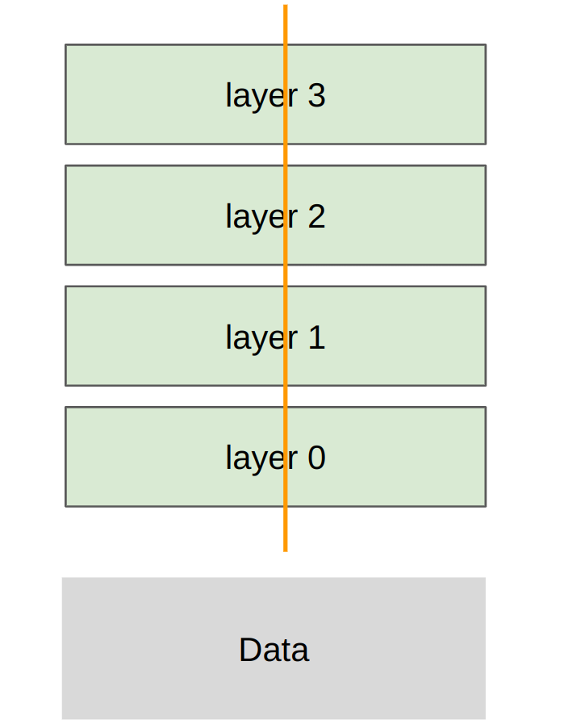

```python
import torch
import time
import math
import sys
import os
from inspect import isfunction
from typing import Callable
from torch import nn, tensor
import torch.nn.functional as F
import torch.distributed as dist
import torch.multiprocessing as mp
from edtrace import text, image, link
from gpu_util import cuda_if_available
from lecture_util import article_link
```

# CS336: 从头开始构建语言模型 (2026春季)

# 第七讲：分布式并行训练 (Parallelism)

# Lecture 7: parallelism

上一讲主题：单块 GPU 内部的计算与内存并行优化。

本讲主题：跨多块 GPU 和多计算节点的分布式并行训练。


在这两种情况下，核心的**计算单元** (ALU / Tensor Core) 距离**数据源** (显存/内存) 都显得相当遥远。

核心思想：精心编排计算与传输的重叠，最大限度避免数据传输成为计算瓶颈。

分布式架构中的数据层级关系：

- 单节点、单 GPU 内部：L1 缓存 / 共享内存 (极快)

- 单节点、单 GPU 显存：HBM 显存

- 单节点、多 GPU 之间：NVLink/NVSwitch 通信总线

- 多节点、多 GPU 之间：Infiniband / 以太网网络连接 (最慢)

单 GPU 层面：利用算子融合与 Tiling 机制减少多余的显存读写。

多 GPU 层面：利用参数复制、分片等策略减少节点间的通信开销。

为什么我们需要采用多 GPU 并行？

1. **显存装不下**：随着模型增大，参数、优化器状态、梯度和中间激活值超出了单张 GPU 的显存容量。

2. **算力不够快**：希望联合更多 GPU (获取更大算力 FLOPs)，从而缩短训练时间。

[stdout for this lecture](var/traces/lecture_07_stdout.txt)

### 第一部分：分布式通信与计算的基本构建块

## 准备工作与分布式辅助函数 (Setup & Helpers)

在正式开始分布式并行编程之前，我们先定义一些底层的进程环境初始化（setup / cleanup）、数据模拟生成以及用于测速和张量缩略的工具函数。这些函数是跨 GPU 并行计算的基线底座。

```python
class DisableDistributed:
    """
    Context manager that temporarily disables distributed functions (replaces with no-ops).
    This is for when we're tracing the lecture, since we can't trace through
    multiprocessing, so we just want to run the function directly without
    distributed communication.
    """
    def __enter__(self):
        self.old_functions = {}
        for name in dir(dist):
            value = getattr(dist, name, None)
            if isfunction(value):
                self.old_functions[name] = value
                setattr(dist, name, lambda *args, **kwargs: None)

    def __exit__(self, exc_type, exc_value, traceback):
        for name in self.old_functions:
            setattr(dist, name, self.old_functions[name])
```

```python
def generate_sample_data():
    batch_size = 128
    num_dim = 1024
    data = torch.randn(batch_size, num_dim)
    return data
```

```python
def setup(rank: int, world_size: int):
    """Initializes the distributed environment (called at start of process)."""
    # 设置主节点 Rank 0 的地址与端口以供分布式协商通信
    os.environ["MASTER_ADDR"] = "localhost"
    os.environ["MASTER_PORT"] = "15623"

    if torch.cuda.is_available():
        dist.init_process_group("nccl", rank=rank, world_size=world_size)
    else:
        dist.init_process_group("gloo", rank=rank, world_size=world_size)
```

```python
def cleanup():
    """Cleans up the distributed environment (called at end of process)."""
    torch.distributed.destroy_process_group()
```

```python
def get_init_params(num_inputs: int, num_outputs: int, rank: int) -> nn.Parameter:
    """Create parameters and put them on the `rank`-th GPU."""
    torch.random.manual_seed(0)  # 设置随机种子以保证实验可复现
    return nn.Parameter(torch.randn(num_inputs, num_outputs, device=cuda_if_available(rank)) / math.sqrt(num_outputs))
```

```python
def int_divide(a: int, b: int):
    """Return a / b and throw an error if there's a remainder."""
    assert a % b == 0
    return a // b
```

```python
def summarize_tensor(tensor: tensor) -> str:
    return "x".join(map(str, tensor.shape)) + "[" + str(round(tensor.view(-1)[0].item(), 4)) + "...]"
```

```python
def render_duration(duration: float) -> str:
    if duration < 1e-3:
        return f"{duration * 1e6:.2f}us"
    if duration < 1:
        return f"{duration * 1e3:.2f}ms"
    return f"{duration:.2f}s"
```

**集体通信操作 (Collective Operations)** 是分布式并行编程中最底层的概念基石。 [相关文章](https://en.wikipedia.org/wiki/Collective_operation)

- 这些操作早在 1980 年代的并行机集群设计文献中就已经成为经典。

- **集体 (Collective)** 意味着你需要在一个通信组内的多台设备间指定一种统一的通信拓扑。

- 相比由用户自己维护繁琐的卡对卡点对点通信，集体通信库往往能提供更为极致的网络拓扑性能优化。

**分布式设置**：


- **Rank**：标识特定的 GPU 设备编号（例如 0, 1, 2, 3 等）

- **World size**：当前通信组内的 GPU 总卡数（例如 4）

主要的通信操作包括：

- Broadcast (广播)、Scatter (分发)、Gather (收集)、Reduce (规约) 等基础操作

- All-Gather、Reduce-Scatter、All-Reduce 等分布式训练的核心顶梁柱原语

- All-to-All (常用于混合专家模型 MoE 中路由数据)

**Broadcast (广播)**：将 Rank 0 卡上的数据完整复制到所有 Rank 卡上。

```python
rank0 = tensor([0., 1, 2, 3])
rank0 = tensor([0., 1, 2, 3])
rank1 = tensor([0., 1, 2, 3])
rank2 = tensor([0., 1, 2, 3])
rank3 = tensor([0., 1, 2, 3])
```

常见用例：Rank 0 负责从磁盘读取初始化检查点，然后 Broadcast 给其余 worker 同步参数状态。

**Scatter (分发)**：将 Rank 0 卡上的一个大张量按维度均匀切分，并分发到各个 Rank 卡上。

```python
rank0 = tensor([0., 1, 2, 3])
rank0 = tensor([0.])
rank1 = tensor([1.])
rank2 = tensor([2.])
rank3 = tensor([3.])
```

注：这对于理解 Reduce-Scatter 很有帮助。

**Gather (收集)**：将各个 Rank 卡上的小张量拼接，收集到 Rank 0 上形成一个大张量（Scatter 的反向操作）。

```python
rank0 = tensor([0.])
rank1 = tensor([1.])
rank2 = tensor([2.])
rank3 = tensor([3.])
rank0 = tensor([0., 1, 2, 3])
```

注：这对于理解 All-Gather 很有帮助。

**Reduce (规约)**：对所有 Rank 卡上的数据对应位置应用某种数学规约操作（如求和、求极值），最后只把结果保存在 Rank 0 上。

```python
rank0 = tensor([0.])
rank1 = tensor([1.])
rank2 = tensor([2.])
rank3 = tensor([3.])
rank0 = tensor([6.])  # Sum of all ranks (0 + 1 + 2 + 3)
```

注：这对于理解 All-Reduce 很有帮助。

**All-Gather**：在各个 Rank 卡上独立执行 Gather，使得最后所有 Rank 卡都拥有完全拼接后的完整大张量。

```python
rank0 = tensor([0.])
rank1 = tensor([1.])
rank2 = tensor([2.])
rank3 = tensor([3.])
rank0 = tensor([0., 1, 2, 3])
rank1 = tensor([0., 1, 2, 3])
rank2 = tensor([0., 1, 2, 3])
rank3 = tensor([0., 1, 2, 3])
```

典型用例：在 ZeRO/FSDP 中，各卡在平时只保存一份参数切片，前向计算时通过 All-Gather 收集并恢复成完整参数。

**Reduce-Scatter**：对数据对应位置执行数学规约，随后将规约结果按 Rank 维度切分分发到各个 Rank 上。

```python
rank0 = tensor([0., 1, 2, 3])
rank1 = tensor([1., 2, 3, 4])
rank2 = tensor([2., 3, 4, 5])
rank3 = tensor([3., 4, 5, 6])
rank0 = tensor([6.])  # Sum along dim 0 (0 + 1 + 2 + 3)
rank1 = tensor([10.]) # Sum along dim 1 (1 + 2 + 3 + 4)
rank2 = tensor([14.]) # Sum along dim 2 (2 + 3 + 4 + 5)
rank3 = tensor([18.]) # Sum along dim 3 (3 + 4 + 5 + 6)
```

典型用例：在反向传播计算出梯度后，通过 Reduce-Scatter 进行梯度均值规约，并让各卡只存储梯度的一部分切片，从而节省显存。

**All-Reduce**：对所有卡上的数据应用数学规约，并将完整规约结果输出到所有卡上（等价于先 Reduce-Scatter 再 All-Gather）。

```python
rank0 = tensor([0., 1, 2, 3])
rank1 = tensor([1., 2, 3, 4])
rank2 = tensor([2., 3, 4, 5])
rank3 = tensor([3., 4, 5, 6])
rank0 = tensor([6., 10, 14, 18])
rank1 = tensor([6., 10, 14, 18])
rank2 = tensor([6., 10, 14, 18])
rank3 = tensor([6., 10, 14, 18])
```

典型用例：在传统数据并行 (DDP) 中，反向传播后通过 All-Reduce 同步各卡的梯度，随后在所有卡上重复更新相同的完整参数。

将 All-Reduce 拆解为 Reduce-Scatter 与 All-Gather，极大促进了 ZeRO/FSDP 等显存友好型数据并行的发展。

**All-to-all**：最通用的多对多通信，每个 Rank 向所有其他 Rank 各自发送特定的张量分片。

```python
rank0 = tensor([0., 1, 2, 3])      # send  0 to rank 0,  1 to rank 1,  2 to rank 2,  3 to rank 3
rank1 = tensor([4., 5, 6, 7])      # send  4 to rank 0,  5 to rank 1,  6 to rank 2,  7 to rank 3
rank2 = tensor([8., 9, 10, 11])    # send  8 to rank 0,  9 to rank 1, 10 to rank 2, 11 to rank 3
rank3 = tensor([12., 13, 14, 15])  # send 12 to rank 0, 13 to rank 1, 14 to rank 2, 15 to rank 3
rank0 = tensor([0, 4, 8, 12])
rank1 = tensor([1, 5, 9, 13])
rank2 = tensor([2, 6, 10, 14])
rank3 = tensor([3, 7, 11, 15])
```

要点说明：

- 它是混合专家模型 (MoE) 的核心通信管道：每张卡持有不同的样本批次，通过 All-to-All 将不同的 Token 路由发送到特定的专家 (Expert) 卡上进行处理。

- 在数据均衡分布时，All-to-All 通信在逻辑上非常类似矩阵的转置。

- 它也能够处理不均衡的数据分片（但通常由于硬件负载考虑，应尽量做到样本均衡分配）。

如何快速记忆这些名词原语：

- **Reduce**：表示对数据应用结合律/交换律的规约运算（求和、最小值、最大值）。

- **Scatter (分发)** 与 **Gather (收集)** 互为逆操作。

- **All-** 前缀：意味着最终数据接收端是所有参与的计算设备，而网络拓扑效率更高。

经典拓扑（家用/个人工作站环境）：


- 同节点内的多张 GPU 通过 PCI(e) 总线完成通信（PCIe 7.0 x16 单向带宽可达 242 GB/s）。 [相关文章](https://en.wikipedia.org/wiki/PCI_Express)

- 跨节点多卡之间使用千兆/万兆以太网进行连接，这往往会带来毁灭性的网络延迟和带宽限制 (~200 MB/s)。

现代拓扑（数据中心高性能集群环境）：


典型多卡网络架构设计：

- **单节点 8 卡**：通过板载 NVLink 高速总线直接互连到 NVSwitch 交换芯片（B200 对应的 NVLink 5.0 可提供高达 1.8 TB/s 的卡间双向带宽，作为对比，HBM 显存带宽约为 8 TB/s）。

- **单 Pod 内 256 个节点**：由 PCIe 扩展出专用网卡 (Infiniband NIC/HCA)，通过 Infiniband 交换机互连，节点间跨网带宽约可达 ~0.05 TB/s。

- **集群/数据中心多 Pod**：采用常规光纤以太网完成超大规模的连接。

绕过 CPU 参与的数据传输：

- 传统的以太网传输需要操作系统 CPU 的频繁干预（需要多次拷贝数据至内核 Socket 缓冲区，建立 TCP 协议栈并打包，最后发送至网卡发送环缓冲区）。

- **远程直接内存访问 (RDMA)** 机制允许一张 GPU 绕过 CPU 控制直接读取或写入另一台机器上 GPU 的显存空间。

- Infiniband 网络天生完美支持 RDMA；而标准商业以太网往往不支持。

最新技术演进：

- **GB200/GB300 NVL72 柜机**：每盘包含 8 颗 GPU，单个机架放入 9 盘，形成由 72 颗 GPU 直接构成的巨大统一 NVLink 域。

- **RoCE 技术**：在常规以太网上承载 RDMA 流量，相比 Infiniband 成本更低，在 Meta 的超大规模集群中得到了极其广泛的应用。

### NVIDIA 集合通信库 (NCCL)

NCCL 负责将顶层的 Collective 集合通信原语（如 All-Reduce）转化为底层硬件网络的数据包进行传输。[talk](https://www.nvidia.com/en-us/on-demand/session/gtcspring21-s31880/)

- 自动感知系统的底层拓扑（有多少张卡、多少个交换机、走 NVLink 还是走 PCIe）。

- 自动匹配并优化跨卡数据流的最佳路径。

- 直接调度定制化的 GPU CUDA Kernel 负责极速收发数据，免去 CPU 开销。

PyTorch 分布式框架 (`torch.distributed`)[documentation](https://pytorch.org/docs/stable/distributed.html)

- 提供了极为整洁的集合通信 API 接口（例如 `all_gather_into_tensor`）。

- 支持对接多种底层硬件后端：gloo (支持 CPU 分布式通信) 和 nccl (支持 GPU 高速通信)。

- 也封装了例如 FSDP 等的高阶接口（本课程暂不涉及，我们从底层写起）。

让我们来看几个实际运行的例子。

```python
"""
Launches `world_size` processes that each calls `func` on world_size, args, kwargs.
Note: if we are being traced (inside edtrace), we just run the function directly without multiprocessing and disable distributed functions.
"""
if not sys.gettrace():
    # 多进程环境下多卡并发计算的通用流程
    args = (world_size,) + args + tuple(kwargs.values())
    mp.spawn(func, args=args, nprocs=world_size, join=True)
else:
    # 当遇到 edtrace 调试追踪时，退化为单卡单进程直行测试
    with DisableDistributed():
        args = (0, world_size,) + args + tuple(kwargs.values())
        func(*args)
```

集群中的卡间通信到底能有多快？

网络性能测试参考资料：

[How to reason about collective operations](https://github.com/NVIDIA/nccl-tests/blob/master/doc/PERFORMANCE.md#allreduce)

[Sample benchmarking code](https://github.com/stas00/ml-engineering/blob/master/network/benchmarks/all_reduce_bench.py)

### 第二部分：分布式训练并行策略

我们将通过多层感知机 (MLP) 的最小化代码实现，逐个解剖不同的并行策略。

这极具代表性，因为 MLP 是 Transformer 模型中最主要的计算开销之一。


切分策略：数据切片分布在各卡上，各卡模型与参数完全一致。

```python
data = generate_sample_data()
```

要点说明：

- **Loss 计算独立**：由于各卡处理的样本（Data shard）不同，前向传播得到的局部 Loss 也完全不同。

- **梯度 All-Reduce 同步**：反向传播后，需要对各卡的梯度进行 All-Reduce 并广播，以保证梯度完全一致。

- **参数完全镜像**：梯度一致，加上优化器以相同步长推进，保证了各卡在每次更新后权重完全相同。

下节预告：FSDP/ZeRO 并行，使用 All-Gather 和 Reduce-Scatter 消除重复持有完整模型参数的显存开销。



切分策略：每一层的参数矩阵被按维度切分到不同的卡上，每次计算时需要卡间通信同步激活值。

```python
data = generate_sample_data()
```


切分策略：将网络深度层均匀分发到不同的 GPU 上，顺次执行前向与反向传输。

```python
data = generate_sample_data()
```

本讲暂未涵盖的议题：

- 通信与计算的深度重叠优化

- 更为复杂的注意力机制并行等

- 其他高级并行形式（如序列并行、专家并行以及混合并行等）

- Jax/TPU 并行：只需在模型中定义张量的分片方式，底层的编译器将自动生成通信拓扑。[levanter](https://crfm.stanford.edu/2023/06/16/levanter-1_0-release.html)

- 但在 PyTorch 中，我们需要手动调用分布式原语，这非常有助于深刻理解底层机制。

### 第七讲总结

- 分布式并行有多种拆分维度：数据并行 (拆分 Batch)、张量/专家并行 (拆分宽度/通道数)、流水线并行 (拆分层深)、序列并行 (拆分序列长度)

- **数据并行**：DDP（借助 All-Reduce 同步梯度）以及 FSDP/ZeRO（结合 All-Gather 与 Reduce-Scatter 消除多余的显存持有）

- **张量并行**：将单层拆分到不同 GPU，由于每层均需同步激活值，因而极度依赖极高速的卡间带宽 (如 NVLink)

- **流水线并行**：将不同层部署到不同 GPU 顺次计算，对网络通信带宽要求低，但必须合理排布流水线以减小空闲泡泡 (Bubble)

- 系统设计的永恒权衡：是用**重算 (Recompute)**、**显存存储 (Memory)** 还是**跨卡通信 (Communicate)** 来解决局部硬件存储限制

- 尽管硬件网络在不断加速，但模型规模的膨胀使得这些多层次 of 分布式并行架构始终是前沿训练的必修课。

```python
def collective_operations_main(rank: int, world_size: int):
    """This function is running asynchronously for each process (rank = 0, ..., world_size - 1)."""
    setup(rank, world_size)

    # ## 集合通信 All-Reduce 同步示例
    dist.barrier()  # Waits for all processes to get to this point (in this case, for print statements)

    data = tensor([0., 1, 2, 3], device=cuda_if_available(rank)) + rank  # 作为输入，同时也作为规约结果 of 输出张量

    print(f"Rank {rank} [before all-reduce]: {data}", flush=True)
    dist.all_reduce(tensor=data, op=dist.ReduceOp.SUM, async_op=False)  # 就地 (in-place) 修改张量内容
    print(f"Rank {rank} [after all-reduce]: {data}", flush=True)

    # ## Reduce-scatter
    dist.barrier()

    input = torch.arange(world_size, dtype=torch.float32, device=cuda_if_available(rank)) + rank  # 输入数据
    output = torch.empty(1, device=cuda_if_available(rank))  # 为输出分配显存空间

    print(f"Rank {rank} [before reduce-scatter]: input = {input}, output = {output}", flush=True)
    dist.reduce_scatter_tensor(output=output, input=input, op=dist.ReduceOp.SUM, async_op=False)
    print(f"Rank {rank} [after reduce-scatter]: input = {input}, output = {output}", flush=True)

    # ## All-gather
    dist.barrier()

    input = output  # 将 Reduce-Scatter 的规约结果作为 All-Gather 的输入
    output = torch.empty(world_size, device=cuda_if_available(rank))  # 为输出分配显存空间

    print(f"Rank {rank} [before all-gather]: input = {input}, output = {output}", flush=True)
    dist.all_gather_into_tensor(output_tensor=output, input_tensor=input, async_op=False)
    print(f"Rank {rank} [after all-gather]: input = {input}, output = {output}", flush=True)

    text("Indeed, all-reduce = reduce-scatter + all-gather!")

    cleanup()
```

```python
def all_reduce(rank: int, world_size: int, num_elements: int):
    setup(rank, world_size)

    # Create tensor
    data = torch.randn(num_elements, device=cuda_if_available(rank))

    # 通信预热操作
    dist.all_reduce(tensor=data, op=dist.ReduceOp.SUM, async_op=False)
    torch.cuda.synchronize()  # 强行同步，等待 CUDA 卡上所有的内核执行完毕
    dist.barrier()            # barrier 强行同步所有进程，确保起始计时点对齐

    # Perform all-reduce
    start_time = time.time()
    dist.all_reduce(tensor=data, op=dist.ReduceOp.SUM, async_op=False)
    torch.cuda.synchronize()  # 强行同步，等待 CUDA 卡上所有的内核执行完毕
    dist.barrier()            # barrier 强行同步所有进程，确保起始计时点对齐
    end_time = time.time()

    duration = end_time - start_time
    print(f"[all_reduce] Rank {rank}: all_reduce(world_size={world_size}, num_elements={num_elements}) took {render_duration(duration)}", flush=True)

    # 计算网络有效带宽
    dist.barrier()
    size_bytes = data.element_size() * data.numel()
    sent_bytes = size_bytes * 2 * (world_size - 1)  # 因为包含发与收的双向通信，且 all-reduce 需要折合 world_size-1 步
    total_duration = world_size * duration
    bandwidth = sent_bytes / total_duration
    print(f"[all_reduce] Rank {rank}: all_reduce measured bandwidth = {round(bandwidth / 1024**3)} GB/s", flush=True)

    # Notes:
    # - Effective bandwidth ~ 2 * size_bytes / total_duration
    # - Independent of world_size
    # - Independent of topology (ring or tree)

    cleanup()
```

```python
def reduce_scatter(rank: int, world_size: int, num_elements: int):
    setup(rank, world_size)

    # 创建输入输出
    input = torch.randn(world_size, num_elements, device=cuda_if_available(rank))  # 各个 rank 各自拥有一份大矩阵
    output = torch.empty(num_elements, device=cuda_if_available(rank))

    # 通信预热操作
    dist.reduce_scatter_tensor(output=output, input=input, op=dist.ReduceOp.SUM, async_op=False)
    torch.cuda.synchronize()  # 强行同步，等待 CUDA 卡上所有的内核执行完毕
    dist.barrier()            # barrier 强行同步所有进程，确保起始计时点对齐

    # Perform reduce-scatter
    start_time = time.time()
    dist.reduce_scatter_tensor(output=output, input=input, op=dist.ReduceOp.SUM, async_op=False)
    torch.cuda.synchronize()  # 强行同步，等待 CUDA 卡上所有的内核执行完毕
    dist.barrier()            # barrier 强行同步所有进程，确保起始计时点对齐
    end_time = time.time()

    duration = end_time - start_time
    print(f"[reduce_scatter] Rank {rank}: reduce_scatter(world_size={world_size}, num_elements={num_elements}) took {render_duration(duration)}", flush=True)

    # 计算网络有效带宽
    dist.barrier()
    data_bytes = input.element_size() * input.numel()  # How much data in the input
    sent_bytes = data_bytes * (world_size - 1)  # How much needs to be sent (no 2x here)
    total_duration = world_size * duration  # Total time for transmission
    bandwidth = sent_bytes / total_duration
    print(f"[reduce_scatter] Rank {rank}: reduce_scatter measured bandwidth = {round(bandwidth / 1024**3)} GB/s", flush=True)

    # Notes:
    # - 全规约 (All-Reduce) = 规约分发 + 全收集
    # - 相比 reduce-scatter，all-reduce 移动 2 倍数据、耗费 2 倍时间，因而带宽表现类似

    cleanup()
```

```python
def data_parallelism_main(rank: int, world_size: int, data: tensor, num_layers: int, num_steps: int):
    setup(rank, world_size)

    # 提取本卡所分到的数据分片（生产中通常由 Dataloader 各自读取）
    # --- B0 ---
    # --- B1 ---
    # --- B2 ---
    # --- B3 ---
    batch_size = data.size(0)
    num_dim = data.size(1)
    local_batch_size = int_divide(batch_size, world_size)
    start_index = rank * local_batch_size
    end_index = start_index + local_batch_size
    data = data[start_index:end_index].to(cuda_if_available(rank))

    # 初始化 MLP 参数（数据并行中各卡均独立初始化相同的完整参数）
    params = [get_init_params(num_dim, num_dim, rank) for layer in range(num_layers)]
    optimizer = torch.optim.AdamW(params, lr=1e-3)  # 各卡独自维护各自的优化器状态 (如动量)

    for step in range(num_steps):
        # 前向传播
        x = data
        for param in params:
            x = x @ param
            x = F.gelu(x)
        loss = x.square().mean()  # Loss function is average squared magnitude

        # 反向传播
        loss.backward()

        # 跨 worker 同步梯度（这是数据并行训练 DDP 与普通单卡训练的唯一差别！）
        for param in params:
            dist.all_reduce(tensor=param.grad, op=dist.ReduceOp.AVG, async_op=False)

        # 更新模型参数
        optimizer.step()

        print(f"[data_parallelism] Rank {rank}: step = {step}, loss = {loss.item()}, params = {[summarize_tensor(params[layer]) for layer in range(num_layers)]}", flush=True)

    cleanup()
```

```python
def tensor_parallelism_main(rank: int, world_size: int, data: tensor, num_layers: int):
    setup(rank, world_size)

    data = data.to(cuda_if_available(rank))  # 所有 worker 卡都会被分配到完整的完整 batch 数据
    batch_size = data.size(0)
    num_dim = data.size(1)
    local_num_dim = int_divide(num_dim, world_size)  # Shard `num_dim`

    # 创建模型，各个 worker 只存模型参数矩阵的 world_size 分之一
    # |  |  |  |
    # W0 W1 W2 W3
    # |  |  |  |
    params = [get_init_params(num_dim, local_num_dim, rank) for layer in range(num_layers)]

    # 前向传播
    x = data
    for layer in range(num_layers):
        # 计算本卡局部前向输出的激活值
        x = x @ params[layer]  # 注：此矩阵乘法只涉及切分参数的计算
        x = F.gelu(x)

        # 为 Gather 后的全量中间激活分片预先分配空间
        activations = [torch.empty(batch_size, local_num_dim, device=cuda_if_available(rank)) for _ in range(world_size)]

        # 卡间通过 All-Gather 同步完整激活值
        dist.all_gather(tensor_list=activations, tensor=x, async_op=False)

        # 顺次拼接获得完整前向激活矩阵
        x = torch.cat(activations, dim=1)

    print(f"[tensor_parallelism] Rank {rank}: forward pass produced activations {summarize_tensor(x)}", flush=True)

    # 反向传播：留作课后作业

    cleanup()
```

```python
def pipeline_parallelism_main(rank: int, world_size: int, data: tensor, num_layers: int, num_micro_batches: int):
    setup(rank, world_size)

    # Use all the data
    data = data.to(cuda_if_available(rank))
    batch_size = data.size(0)
    num_dim = data.size(1)

    # 顺次切分层深
    local_num_layers = int_divide(num_layers, world_size)

    # 各个 worker 各自被分配局部的一部分连续网络层
    local_params = [get_init_params(num_dim, num_dim, rank) for layer in range(local_num_layers)]

    # 前向传播

    # 拆分成 micro batch 隐藏流水线气泡以最大化硬件并发
    micro_batch_size = int_divide(batch_size, num_micro_batches)
    if rank == 0:
        # The data
        micro_batches = data.chunk(chunks=num_micro_batches, dim=0)
    else:
        # Allocate memory for activations
        micro_batches = [torch.empty(micro_batch_size, num_dim, device=cuda_if_available(rank)) for _ in range(num_micro_batches)]

    for x in micro_batches:
        # 如果不是首卡，则通过 dist.recv 接收前一个 worker 卡发过来的前向激活值
        if rank - 1 >= 0:
            dist.recv(tensor=x, src=rank - 1)

        # 执行本 worker 负责的那一部分局部层的前向计算
        for param in local_params:
            x = x @ param
            x = F.gelu(x)

        # 如果不是末卡，则通过 dist.send 发送前向结果至下一个 worker 卡
        if rank + 1 < world_size:
            print(f"[pipeline_parallelism] Rank {rank}: sending {summarize_tensor(x)} to rank {rank + 1}", flush=True)
            dist.send(tensor=x, dst=rank + 1)

    text("Not handled: overlapping communication/computation to eliminate pipeline bubbles")

    # 反向传播：留作课后作业

    cleanup()
```
