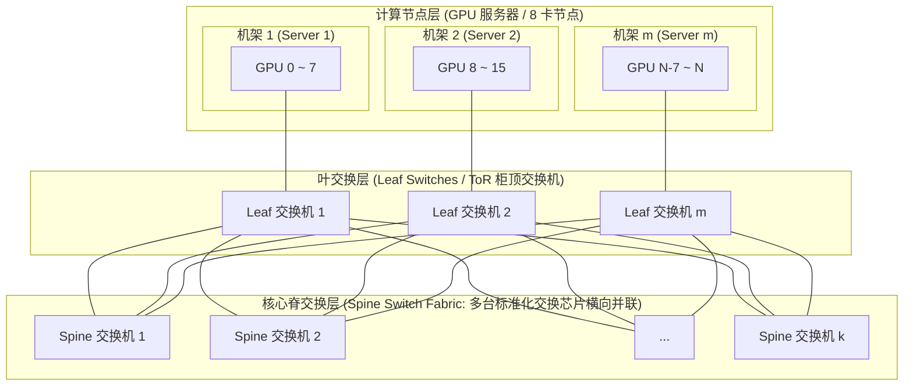
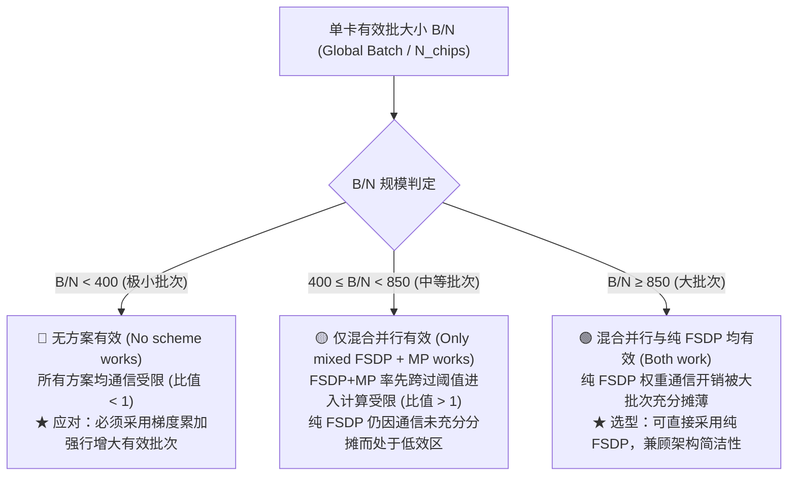

# 第 8 讲：并行化基础 (Lecture 8: Parallelism Basics)

## 第 1 页 (Page 1)
### 标题
* **课程**: CS336
* **讲师**: Tatsu H
* **主题**: 并行化基础 (PARALLELISM BASICS)

---

## 第 2 页 (Page 2)
### 大纲与目标 (Outline and goals)
* 理解训练超大型模型时的系统复杂性。
* 学习不同的并行化范式，以及为什么人们会同时使用多种并行方式。
* 了解大规模训练运行的实际图景。

---

## 第 3 页 (Page 3)
### 内容组织 (Organization today)
* **第一部分**: 针对大语言模型 (LLM) 的网络基础知识
* **第二部分**: 并行的大语言模型训练的各种形式
* **第三部分**: 通过并行化扩展并训练大型语言模型

---

## 第 4 页 (Page 4)
### 基于 GPU 扩展的限制 —— 算力 (Limits to GPU-based scaling – compute)
* 单 GPU 的扩展存在物理限度。
* 目前世界上最快的超级计算机拥有百亿亿次 (exafolps) 级别的计算算力。

---

## 第 5 页 (Page 5)
### 基于 GPU 扩展的限制 —— 内存 (Limits to GPU-based scaling - memory)
* 模型参数量正在变得非常巨大。
* 单个 GPU 的显存无法容纳下大多数此类超大型模型！

---

## 第 6 页 (Page 6)
### 我们该怎么做？多 GPU、多机并行化 (Multi-GPU, multi-machine parallelism)
* **节点内并行**: 通过高速互连接口实现。
* **高速节点间并行**: 在多台机器间建立互连。
* **核心方案**: 将内存与计算需求切分，分摊到不同的 GPU 和机器上。

---

## 第 7 页 (Page 7)
### 集体通信的基础知识 (Basics about collective communication)
介绍分布式训练中常见的几种通信原语：
* **全规约 (All-reduce)**: 汇聚各节点数据计算和，并分发回所有节点。
* **广播 (Broadcast)**: 将单节点数据分发至所有节点。
* **规约 (Reduce)**: 将各节点数据汇总到一个主节点上。
* **全收集 (All Gather)**: 收集所有节点的数据片段，拼接到每个节点。
* **规约散播 (Reduce Scatter)**: 先做规约，然后将结果分块分发给各节点。

---

## 第 8 页 (Page 8)
### 重要细节：All-reduce 对比 Reduce-scatter + All-gather
* 规约 (Reduce) 通信可以分解为两步来实现：**规约散播 (Reduce-scatter)** 和 **全收集 (All-gather)**。
* 重要的是，在**带宽受限 (bandwidth-limited regime)** 的分布式训练中，这种两步法是通信效率最优的实现方式。

---

## 第 9 页 (Page 9)
### TPU 与 GPU —— 通信层面的设计差异
* **TPU 网络**: 采用环形拓扑网格 (Toroidal mesh)。
* **GPU 网络**: 采用全对全 (All-to-all) 拓扑连接（最多支持 256 卡互连域）。

---

## 第 10 页 (Page 10)
### 网格 vs 树形拓扑结构 (Mesh vs tree vs other)
* **网格结构优点 (Pro mesh)**: 运行和构筑成本更低，在局部可以实现极高速度，非常适合进行张量并行 (tensor parallel)。
* **树形/A2A结构优点 (Pro tree/A2A)**: 能够较好地处理不那么结构化的通信，特别适合专家并行 (expert parallel) 等复杂的数据路由情况。

> 💡 **核心概念澄清：网格 (Torus) 与 Lecture 07“环形结构”的物理几何演进**
>
> 1. **网格的几何本质：每一行、每一列依然是首尾相连的环！**
>    - 工业界常说的环形网格（**Toroidal Mesh / Torus**），在物理布线上**对每一行、每一列（乃至 3D 空间的每个高维切面）都实现了首尾闭合互连**。
>    - 例如一个 $4 \times 4$ 的 2D Torus：每行的 4 颗芯片横向成环，每列的 4 颗芯片纵向成环，其整体几何拓扑恰好对应数学上的“甜甜圈表面（环面）”。
>
> 2. **为什么不直接用 Lecture 07 的 1D 大单环？（从逻辑算法到物理升维）**
>    - **1D 环的物理局限**：在 Lecture 07 中我们推导了 Ring All-Reduce 的逻辑效率。但如果在物理机房里把成千上万张卡串成一个超长 1D 物理大环，数据绕一圈需要经过几千次中继转发，延迟与单点故障率不可承受；
>    - **多维升维解法**：Google TPU（v2 ~ v5p）通过将芯片直连扩展为 2D/3D Torus，使得每个局部环的周长极短（如只有 4 或 8 个节点），既保留了芯片直连（无需昂贵中心交换机）的超低成本和局部极速特性，又有效控制了跳数延迟。
>
> 3. **树形交换机 (Fat-Tree) 对比网格结构的核心优势**：
>    - **攻克网格“多跳中继与大堵车”瓶颈**：网格中远距离节点通信需几十跳中继（Multi-hop），随机跨节点传输极易在内部发生严重拥塞（对分带宽瓶颈）；树形（胖树 / 叶脊 Spine-Leaf）实现“任意两卡等距恒定跳数直达（通常严格 2~3 跳）”，集群通信延迟绝对均等对称。
>    - **完美支撑动态乱序通信**：专治混合专家模型 (MoE) 的专家并行 (EP)——各 Token 经 Router 计算后随机分发到全集群任意专家卡，依赖树形交换机高效承载全对全 (`All-to-All`) 动态路由。
>    - **拓扑无关与弹性容灾**：集群调度无需死贴物理几何，在万卡机房中可任意弹性指派 GPU 组，坏卡不影响整体网络拓扑。
>
> 4. **顶层核心脊交换机（Spine）的高负载破解机制（如何抗住万卡并发？）**：
>    - **并联矩阵而非单体神机 (Scale-Out)**：顶层绝非单台脆弱的超级交换机，而是由几十台甚至上百台交换机横向并联组成的**多根交换矩阵（Switch Fabric）**；每个叶交换机与所有脊交换机全互联直连，海量流量通过 ECMP（等价多路径）与自适应路由被均匀打散分摊到所有脊交换机上（单台仅承受 $1/N_{\text{spine}}$ 压力）。
>    - **1:1 无超敛（Non-Blocking / “胖”树的本质）**：向上的总上行带宽严格等于连接 GPU 的总下行带宽；全集群所有卡即使同时以 100% 满负荷打满线速，顶层交换矩阵也能 1:1 完整吞下，杜绝上层物理拥塞。
>    - **标准化芯片堆叠扩展**：顶层 Spine 与底层 Leaf 统一采用同款标准商用交换芯片（如 NVIDIA Quantum-2 / Quantum-X800），集群扩展只需按比例增加核心脊交换机台数即可平滑拼积木扩容。

#### 胖树 (Fat-Tree / Spine-Leaf) 无阻塞多根交换矩阵架构示意：



---

## 第 11 页 (Page 11)
### 拓扑结构的演进 —— TPU8i/t (TPU8i/t)
* **TPU8i 网络**: 更接近树形拓扑（可能是为了更好地支持混合专家模型 MoE 路由？）。
* **TPU8t 扩展网络**: 采用基于交换机的“室女座 (Virgo)”交换网络。

---

## 第 12 页 (Page 12)
### 为什么不把一切都连起来？(Why not connect everything?)
探讨了互连域大小 (Domain sizes) 的设计考量与成本限制。
* 参阅半导体分析文章：[华为 Cloud Matrix 384 与英伟达 GB200 NVL72 对比分析](https://newsletter.semianalysis.com/p/huawei-ai-cloudmatrix-384-chinas-answer-to-nvidia-gb200-nvl72)。

---

## 第 13 页 (Page 13)
### 第一部分回顾 (Part 1 recap)
* 引入了新的计算基本单元 —— **数据中心**。
* 多机扩展的核心期望：
  * **内存的线性扩展**: 最大支持的模型参数量与 GPU 数量呈线性扩展。
  * **算力的线性扩展**: 模型的 FLOPs 随 GPU 数量呈线性扩展。
* 依赖简单的集体通信原语。

---

## 第 14 页 (Page 14)
### 第二部分：标准的大语言模型并行化原语 (Standard LLM parallelization primitives)
大模型并行的 3 类主流路线：
1. **数据并行 (Data parallelism)**
   * 朴素数据并行 (Naïve data parallel)
   * 优化器状态分片 (ZeRO 阶段 1-3)
2. **模型并行 (Model parallelism)**
   * 流水线并行 (Pipeline parallel)
   * 张量并行 (Tensor parallel)
3. **激活值与序列并行 (Activation/Sequence parallelism)**
   * 序列并行 (Sequence parallel)

---

## 第 15 页 (Page 15)
### 朴素数据并行 (Naïve data parallelism)
* **出发点**: 以朴素随机梯度下降 (SGD) 为基础进行分析：
  $$\theta_{t+1} = \theta_t - \eta \sum_{i=1}^B \nabla f(x_i)$$
* **并行方式**: 将大小为 $B$ 的批次 (batch) 分割并分配给 $M$ 台机器。通过在节点间交换梯度来进行同步。
* **特性分析**:
  * **计算扩展**: 每个 GPU 处理 $B/M$ 个样本。
  * **通信开销**: 每个批次需要传输约 $2 \times$ 参数量的数据。在批次足够大时表现较好。
  * **内存扩展**: 差。每张 GPU 仍然至少需要完整地装下一份模型权重参数。

> 💡 **核心概念深化：数据并行通信量公式与计算/通信比本质**
>
> 1. **“$2 \times$ 参数量”的数学由来（继承自 Lecture 07 环形 All-Reduce）**：
>    - **数据等价性**：反向传播后需跨卡同步梯度，梯度的张量尺寸与模型参数量 $P$ 严格一一对应（$S_{\text{grad}} = P$）。
>    - **两阶段环形接力**：同步梯度调用 `dist.all_reduce`，在最优环形通信下分为两阶段：**Scatter-Reduce**（传输 $\frac{M-1}{M}P$）与 **All-Gather**（传输 $\frac{M-1}{M}P$）。
>    - **单卡累计吞吐**：单卡每个批次实际物理发送量为 $2 \times \frac{M-1}{M} \times P$。在多卡集群（$M \ge 8$）中 $\frac{M-1}{M} \approx 1$，因此单卡收发数据量恒定约为 **$2 \times$ 参数量**（详见 [Lecture 07: 硬件与并行加速](lecture_07.md#all_reduce) 的底层推导）。
>
> 2. **为什么“批次足够大时表现较好”？（计算/通信比的本质）**：
>    - **计算耗时随批次线性增长**：单卡计算量约为 $6 \times \frac{B}{M} \times P$ FLOPs（前向 $2P$ + 反向 $4P$），单卡分配的样本数 $\frac{B}{M}$ 越多，计算耗时越长。
>    - **通信耗时恒定不变**：无论本批次处理 1 个样本还是 10,000 个样本，反向传播完后需全规约同步的梯度总量始终固定为 $\approx 2P$ 字节。
>    - **结论**：当单卡有效批次 $\frac{B}{M}$ 足够大时，计算耗时远超固定的通信耗时，通信延迟占比极低且更易与计算实现重叠（Overlap），GPU 硬件算力利用率（MFU）显著提升。

---

## 第 16 页 (Page 16)
### 朴素数据并行有什么问题？
* **内存容量缺陷**: 将模型权重参数复制到每张卡上的做法会带来极大的空间浪费。让我们来仔细拆解其显存构成。

---

## 第 17 页 (Page 17)
### 朴素数据并行中的显存困境
在典型的混合精度训练中，每个参数实际上需要高达 **16 字节 (bytes)** 的显存，我们需要维护 5 份不同的副本：
* **2 字节**: 用于 FP16/BF16 模型权重参数。
* **2 字节**: 用于 FP16/BF16 梯度。
* **4 字节**: 用于 FP32 主权重参数 (master weights)（这是 SGD 迭代累加中不可缺少的高精度副本）。
* **4 字节**: 用于 FP32/BF16 Adam 一阶矩估计（动量项）。
* **4 字节**: 用于 FP32/BF16 Adam 二阶矩估计（方差项）。
* 上述最后三项统称为 **优化器状态 (Optimizer state)**。

---

## 第 18 页 (Page 18)
### ZeRO：解决数据并行中的显存冗余问题 (ZeRO)
* **核心思路**: 将高开销的训练状态（即优化器状态、梯度和权重参数）进行切分，并在反向传播中借助**规约散播 (reduce-scatter)** 与 **全收集 (all-gather)** 通信原语的等价替换，消除存储冗余。

> 💡 **核心机理深度解析：DDP 显存困境、ZeRO 破局逻辑与 Adam 逐元素数学本质**
>
> 1. **朴素 DDP 的核心痛点（单卡 OOM 与多卡显存冗余的矛盾）**：
>    - **单卡 16 字节硬约束**：混合精度 AdamW 下，每个参数需占用 16 字节常驻显存（权重 2B + 梯度 2B + FP32 主权重 4B + 一阶动量 4B + 二阶动量 4B）。对于 10B 规模的模型，仅常驻显存就高达 160 GB，单张 80GB 卡甚至连模型都装不下，直接 OOM。
>    - **多卡镜像冗余的荒谬性**：朴素 DDP 强制要求每张卡都完整保留一份全量模型与状态。在 64 卡集群中，全集群高达 5.1 TB 显存，却把这 160 GB 的数据机械复制了 64 份，白白浪费了近 5 TB 显存，但单卡却依然被困死在“装不下”的瓶颈中。
>
> 2. **ZeRO 解决困境的核心逻辑（通信原语拆解与显存搬运工）**：
>    - **黄金恒等式拆解**：基于 Lecture 07 证明的 $\text{All-Reduce} \equiv \text{Reduce-Scatter} + \text{All-Gather}$，ZeRO 将原本反向传播后一口气执行完的通信“掰为前后两半”：
>      - **反向传播结束（前半截）**：不做 `All-Reduce`，只执行 **`Reduce-Scatter`**。所有卡的梯度完成规约后被分散切片，每张卡仅保留属于自己的 $\frac{1}{N_{\text{gpu}}}$ 梯度分片。
>      - **优化器局部更新**：由于每张卡只负责更新局部的 $\frac{1}{N_{\text{gpu}}}$ 权重，因此优化器状态（占 12 字节的大头）在本地也只需存储 $\frac{1}{N_{\text{gpu}}}$，显存占用瞬间暴降！
>      - **下一次前向前（后半截）**：各卡完成局部权重更新后，执行 **`All-Gather`** 跨卡广播交换各自更新好的分块，拼接恢复出完整的模型参数进行前向传播。
>    - **通信量严格守恒（免费的午餐）**：`Reduce-Scatter`（$1\times$ 参数量）与 `All-Gather`（$1\times$ 参数量）相加依然是严格的 **$2\times$ 参数量**，通信开销与朴素 DDP 完全持平，却以零额外通信代价彻底粉碎了多卡显存冗余。
>
> 3. **为什么分块更新数学上完全可行？—— Adam 优化器的逐元素（Element-wise）本质**：
>    - **矩阵形式全流程公式**：
>      - **一阶矩更新**：$M_t = \beta_1 M_{t-1} + (1 - \beta_1) G_t$
>      - **二阶矩更新**：$V_t = \beta_2 V_{t-1} + (1 - \beta_2) (G_t \odot G_t)$
>      - **偏差校正**：$\hat{M}_t = \frac{M_t}{1 - \beta_1^t}, \quad \hat{V}_t = \frac{V_t}{1 - \beta_2^t}$
>      - **权重更新 (AdamW)**：$\Theta_t = \Theta_{t-1} - \eta \cdot \frac{\hat{M}_t}{\sqrt{\hat{V}_t} + \epsilon} - \eta \lambda \Theta_{t-1}$
>    - **易误解关键点辨析（纯逐元素运算）**：
>      - **梯度平方 $(G_t \odot G_t)$ 是逐元素平方**：此处是阿达马乘积（Hadamard product），即矩阵中每个位置的标量求平方，绝对不是矩阵乘法 $G_t G_t^T$！
>      - **步长缩放是逐元素开方与相除**：分式 $\frac{\hat{M}_t}{\sqrt{\hat{V}_t} + \epsilon}$ 同样是对应位置一一逐元素开方与逐元素除法，不包含任何跨行、跨列的求和（Sum）、均值（Mean）或归一化计算（如 LayerNorm/Softmax）。
>    - **结论**：任意参数位置 $\Theta[i, j]$ 的更新只取决于它自身的历史动量与当前梯度，不同切片之间**零横向依赖**。因此切片分发给各卡独立计算、最后拼接的结果，与在单卡上全量计算的结果在二进制层面 **100% 精确等价（Bit-for-Bit Identical）**！

---

## 第 19 页 (Page 19)
### ZeRO 阶段 1：优化器状态分片 (ZeRO stage 1)
* **原理**: 只将优化器状态（一阶和二阶矩）在多个 GPU 间切分存储。所有 GPU 仍保留完整的参数和梯度。
* 每个 GPU 仅负责更新一个对应切片参数的优化器状态，并执行该部分的更新。

---

## 第 20 页 (Page 20)
### ZeRO 阶段 1 工作流程
1. 每个 GPU 在各自对应的子批次上完成前向和反向传播，计算出完整的梯度。
2. 对所有卡上的梯度执行一次 **规约散播 (ReduceScatter)**，将对应切片权重的梯度汇总到对应 GPU，这带来等同于模型参数量的通信成本。
3. 每个 GPU 使用汇总后的本地梯度与本地分片的优化器状态，更新自己负责的部分参数。
4. 执行一次 **全收集 (All-gather)** 操作将参数同步回所有节点，再次带来一次等同于模型参数量的通信成本。

---

## 第 21 页 (Page 21)
### 朴素 DDP 与 ZeRO 阶段 1 对比
| 指标 | 朴素数据并行 (Naïve DDP) | ZeRO 阶段 1 |
| --- | --- | --- |
| **通信原语** | 一次全规约 (All-reduce) | 一次规约散播 + 一次全收集 |
| **通信开销** | $2 \times$ 参数量 | $2 \times$ 参数量 |
| **内存占用** | $(4 + K) \times$ 参数量 | $(4 + K/N_{gpu}) \times$ 参数量 |
* **结论**: 在高带宽环境下，ZeRO 阶段 1 能够“免费”获得显存节省（通信开销与 DDP 完全一致，即 $2 \times$ 参数量），是极优的数据并行方案。

> 💡 **核心概念深化：显存公式 $(4 + K)$ 与 $(4 + K/N_{\text{gpu}})$ 的参数解构**
>
> 1. **“$4$” 的物理构成（不可切分的基础开销）**：
>    - **$4 = 2\text{B (FP16/BF16 权重参数)} + 2\text{B (FP16/BF16 反向梯度)}$**。
>    - 在 ZeRO 阶段 1 ($P_{\text{os}}$) 中，每张卡仍然全量保留一份完整的模型参数与梯度，因此这 4 字节每张卡都必须实打实占用，无法被均摊。
>
> 2. **“$K$” 的准确定义与泛化特性**：
>    - **定义**：优化器中间状态针对每个参数所占用的显存字节数（Bytes per parameter for optimizer states）。
>    - **典型值（Adam / AdamW，$K = 12$）**：在第 17 页的混合精度 AdamW 中，$K = 4\text{B (FP32 主权重)} + 4\text{B (一阶动量)} + 4\text{B (二阶动量)} = \mathbf{12}$ 字节。代入公式即为 $(4 + 12) = 16$ 字节/参数。
>    - **其他优化器下的变动**：若换用带动量的 SGD（FP32 主权重 4B + 动量 4B），则 $K = \mathbf{8}$；若使用 8-bit Adam，则 $K = 4 + 1 + 1 = \mathbf{6}$。
>
> 3. **ZeRO-1 的显存暴省本质**：
>    - 仅将最吃显存的优化器状态 $K$ 均匀切分（每卡分摊 $\frac{K}{N_{\text{gpu}}}$）。在 64 卡集群下，优化器开销从 12 字节锐减至 $\frac{12}{64} \approx 0.19$ 字节，单卡常驻显存从 16 字节直降至约 4.19 字节（暴省近 74%），且通信开销与朴素 DDP 完全持平（保持 $2\times$ 参数量）。

---

## 第 22 页 (Page 22)
### ZeRO 阶段 2：梯度分片 (ZeRO stage 2)
* **高层思想**: 在阶段 1 的基础上，进一步将梯度（粉色分片）也分布式地保存在不同的工作机器上。
* **复杂度**: 我们不需要在任何单节点实例化完整的梯度向量。但因为是数据并行，每个工作节点还是需要负责计算自己对应的完整梯度。

---

## 第 23 页 (Page 23)
### ZeRO 阶段 2 工作流程
1. 所有工作节点在反向传播计算图中逐步回溯。
   * 步骤 1a：一旦计算完某一层的梯度，立刻利用 **规约 (Reduce)** 发送到负责该梯度的对应工作机器上。
   * 步骤 1b：如果该梯度在反向传播计算图中不再被后续依赖，则在当前显卡上立即将其释放以腾出空间。
2. 负责分片的工作节点使用汇总好的分片梯度和本地分片的优化器状态更新对应的参数。
3. 在下一次前向迭代开始前，通过 **全收集 (All-gather)** 重新同步完整的权重参数。

---

## 第 24 页 (Page 24)
### ZeRO 阶段 3 (FSDP)：完全分片数据并行
* **核心想法**: 既然优化器状态和梯度都可以分片，那么参数权重本身也可以分片（即完全分片 FSDP）。
* 在前向和反向传播中，**按需拉取和请求分片权重**（前向拉取计算、反向拉取计算），用完立即释放。
* **核心挑战**: 在频繁的增量通信和计算之间，如何有效降低并掩盖通信延迟和带宽开销。

---

## 第 25 页 (Page 25)
### ZeRO 阶段 3 工作原理（ baby 版）
* 通信成本：$2 \times$ 全收集 (All-gather) 通信（前向拉权重一次，反向拉权重一次）+ $1 \times$ 规约散播 (Reduce-scatter) 通信（反向规约梯度一次），通信总量相比朴素 DDP 增加了 50%（为 $3 \times$ 参数量）。
* 详见 PyTorch 教程：[FSDP 官方教程](https://pytorch.org/tutorials/intermediate/FSDP_tutorial.html)。

---

## 第 26 页 (Page 26)
### FSDP / ZeRO-3 的增量计算与通信细节
* **增量计算与释放**: 参数和梯度拉取计算完后，立即清空。
* **通信与计算重叠**: 以计算 $(W_1W_0 + W_2W_0)x = y$ 为例，在计算上一层的同时，异步全收集下一层的分片参数，以此掩盖通信耗时。
* 参考论文：[Resolving Recomputation for Large Model Training](https://arxiv.org/pdf/2304.11277.pdf)。

---

## 第 27 页 (Page 27)
### 通信成本总结：DDP 与 ZeRO 阶段的对比
* **DDP**: 通信开销为 $2 \times$ 模型参数。
* **ZeRO 阶段 1**: 通信开销为 $2 \times$ 模型参数 —— 通信无额外代价，建议无脑默认开启。
* **ZeRO 阶段 2**: 通信开销为 $2 \times$ 模型参数 —— 也是“近乎免费”的显存提升。
* **ZeRO 阶段 3 (FSDP)**: 通信开销为 $3 \times$ 模型参数 —— 增加了 50% 的通信量级，但在大显存节省下这完全是可以接受的。

---

## 第 28 页 (Page 28)
### 实战评估：在 8 张 A100 (80G) 显卡上，显存能塞下多大模型？
假设采用纯 BF16 训练（配合 Kahan 累加算法），除主权重外全用 BF16。每参数需要 12 字节显存。
* **朴素基线 (Baseline)**: 最大支持约 **6.66 B** 模型（公式: 12 字节/参数）。
* **ZeRO-1**: 最大支持约 **16 B** 模型（公式: 5 字节/参数）。
* **ZeRO-2**: 最大支持约 **24.62 B** 模型（公式: $2 \text{ (参数)} + 10 \text{ (梯度+状态)} / 8$ 字节/参数）。
* **ZeRO-3**: 最大支持约 **53.33 B** 模型（公式: $12 / 8$ 字节/参数）。

---

## 第 29 页 (Page 29)
### 数据并行仍未解决的问题：计算扩展瓶颈
* 在纯数据并行架构下，**计算节点数量必须小于批次大小 (Batch size)**。一旦两者逼近，通信开销会呈指数级飙升。
* 同时，盲目增大批次大小会面临梯度累加收益递减的问题。

---

## 第 30 页 (Page 30)
### 数据并行仍未解决的问题：显存无法无限制扩展
* ZeRO 阶段 1 和 2 仍需要在单卡内驻留完整的模型参数与梯度，无法扩展更大参数量的模型。
* FSDP (ZeRO-3) 虽然可以对权重分片，但是它**无法降低激活值显存 (activation memory)**。
* 结论：我们必须寻找新的切分模型参数和计算图的并行手段。

---

## 第 31 页 (Page 31)
### 超越数据并行：模型并行 (Model parallelism)
模型并行通过跨 GPU 划分参数来实现大显存扩展。与 ZeRO-3 频繁交换参数不同，模型并行在节点间**交换计算出的激活值**。
本节涵盖三种切分模型的模型并行机制：
1. **流水线并行 (Pipeline parallel)**
2. **张量并行 (Tensor parallel)** 与序列并行 (Sequence parallel)
3. **专家并行 (Expert parallel)**

---

## 第 32 页 (Page 32)
### 按层划分的朴素并行 (Layer-wise parallel)
* 将模型的层切分并分别固定在不同的 GPU 上。
* 前向传播和反向传播中，激活值和局部偏梯度在 GPU 之间来回串行传递。

---

## 第 33 页 (Page 33)
### 朴素按层并行的致命缺点：硬件利用率低下
* 这种串行依赖会导致极大的时间开销。
* 假设有 $n$ 张 GPU 参与，在任意时刻**仅有 $1/n$ 的 GPU 在工作**，其余大部分 GPU 都在等待前向/反向的数据传输，导致极高的时间闲置。

---

## 第 34 页 (Page 34)
### 优化手段：流水线并行 (Pipeline parallel)
* 将输入的大批次切割成若干个**微批次 (micro-batches)**（例如 4 个）。
* 类似于工业装配流水线，当前级工作节点完成第一个微批次的前向计算并发送给后级后，可以立刻拉取并计算第二个微批次。
* 流水线空闲时间（即气泡 Bubble）与有效计算时间之比为：
  $$\text{气泡比} = \frac{n_{stages} - 1}{n_{micro}}$$
* 因此，流水线并行需要足够庞大的微批次数量才能掩盖这个硬件利用率气泡。

> 💡 **核心机理深度解析：流水线甘特图与气泡比的几何推导**
>
> 1. **流水线时钟甘特图（以 $n_{\text{stages}}=4, n_{\text{micro}}=4$ 为例）**：
> ```text
> 时间步 (t) ──►  1     2     3     4     5     6     7   (总时间步 = n_micro + n_stages - 1)
> Stage 1:      [MB1] [MB2] [MB3] [MB4]   -     -     -   (右侧排空气泡: 3 步闲置)
> Stage 2:        -   [MB1] [MB2] [MB3] [MB4]   -     -   (左侧等 1 步，右侧闲 2 步)
> Stage 3:        -     -   [MB1] [MB2] [MB3] [MB4]   -   (左侧等 2 步，右侧闲 1 步)
> Stage 4:        -     -     -   [MB1] [MB2] [MB3] [MB4] (左侧充仓气泡: 3 步闲置)
> ```
> *(注：`-` 代表处于闲置等待状态的硬件气泡 Bubble)*
>
> 2. **符号物理含义与几何面积解构**：
>    - **$n_{\text{stages}}$**：流水线阶段数（即串联的 GPU 卡数，对应甘特图的“高”）；
>    - **$n_{\text{micro}}$**：全局 Batch 被均匀切分的微批次数量（对应有效工作平行四边形的“底”）；
>    - **总时间步长（长）**：第一批数据从 Stage 1 传到末级需 $n_{\text{stages}}$ 步，后续 $(n_{\text{micro}} - 1)$ 批依次流出，端到端总时间为 $T_{\text{total}} = n_{\text{micro}} + n_{\text{stages}} - 1$。
>    - **面积映射与计算**：
>      - **外接大矩形面积（全系统总可用“卡·时间槽”）**：
>        $$S_{\text{矩形}} = n_{\text{stages}} \times (n_{\text{micro}} + n_{\text{stages}} - 1)$$
>      - **平行四边形面积（真正干活的“有效计算槽”）**：
>        每个微批次必须且只能在各阶段分别计算 1 步，底为 $n_{\text{micro}}$、高为 $n_{\text{stages}}$：
>        $$S_{\text{有效}} = n_{\text{stages}} \times n_{\text{micro}}$$
>      - **未被利用的气泡总面积（左右两端白色三角气泡）**：
>        左侧启动充仓三角与右侧排空三角完全对称，各为 $\frac{n_{\text{stages}}(n_{\text{stages}}-1)}{2}$，合计为：
>        $$S_{\text{气泡}} = S_{\text{矩形}} - S_{\text{有效}} = n_{\text{stages}} \times (n_{\text{stages}} - 1)$$
>
> 3. **分母选择与两个经典公式的统一**：
>    - **课件公式（相对开销比 / Bubble Ratio）**：以“有效计算槽”为分母：
>      $$\text{气泡比} = \frac{S_{\text{气泡}}}{S_{\text{有效}}} = \frac{n_{\text{stages}}(n_{\text{stages}} - 1)}{n_{\text{stages}} \times n_{\text{micro}}} = \frac{n_{\text{stages}} - 1}{n_{\text{micro}}}$$
>      *物理含义*：每完成 1 单位有效计算，平均需要额外付出多少比例的闲置开销。
>    - **GPipe 论文公式（气泡占总耗时比 / Bubble Fraction）**：以“全系统总时间槽”为分母：
>      $$F_{\text{bubble}} = \frac{S_{\text{气泡}}}{S_{\text{矩形}}} = \frac{n_{\text{stages}}(n_{\text{stages}} - 1)}{n_{\text{stages}}(n_{\text{micro}} + n_{\text{stages}} - 1)} = \frac{n_{\text{stages}} - 1}{n_{\text{micro}} + n_{\text{stages}} - 1}$$
>      *物理含义*：全生命周期内被白白浪费的硬件算力百分比。
>    - **工程收敛性**：实际训练中通常设置 $n_{\text{micro}} \ge 4 \times n_{\text{stages}}$，分母中的 $n_{\text{stages}}-1$ 相比庞大的 $n_{\text{micro}}$ 可忽略，两公式在数值上高度等价。

---

## 第 35 页 (Page 35)
### 为什么仍然需要流水线并行？
1. **显存扩展**: 相比数据并行，它可以大幅降低每个节点的显存占用。
2. **通信极其友好**: 相比 FSDP，流水线并行的通信频次和总量低很多。它仅依赖前向/反向边界的激活值张量（大小为 $b \times s \times h$），且属于**点对点 (point-to-point) 通信**，不需高频全局同步。
* **结论**: 通常在节点间（如多机慢速网卡互连）部署流水线并行以求低通信瓶颈的模型拆分。

> 💡 **核心机理深度解析：激活张量 $(b, s, h)$ 的物理含义与 PP / TP / DDP 通信特性对比**
>
> 1. **激活值张量尺寸 $(b, s, h)$ 的物理定义**：
>    - **$b$ (micro-batch size)**：当前流水线阶段处理的单个微批次中的样本序列数量（若全局批次大小为 $B$，切分成 $m$ 个 micro-batches，则 $b = B / m$）；
>    - **$s$ (sequence length)**：每个样本所包含的 Token 长度 / 上下文长度（例如 2048、4096）；
>    - **$h$ (hidden dimension)**：Transformer 模型的隐层特征维度 $d_{\text{model}}$（例如 4096、8192）。
>    - 阶段之间传递的隐层表征张量形状为 $(b, s, h)$。在采用 16 位浮点数（BF16/FP16）训练时，每个元素占用 2 字节，单次跨阶段传输的数据量即为 $2 \cdot b \cdot s \cdot h$ 字节。
>
> 2. **三类并行传递数据量与通信机制对比（PP vs TP vs DDP）**：
>    - **DDP（数据并行，仅传参数梯度）**：
>      - **传输内容**：**完全不传递激活值**。各卡拥有完整模型副本，在本地数据上独立完成前向与反向传播。
>      - **通信开销**：反向传播结束后，各卡必须对全部**模型参数梯度 $\nabla W$** 进行全局 All-Reduce。通信量取决于模型总参数量 $P$（Ring All-Reduce 传输量约为 $2P$），且需要全集群所有卡同步，通信开销完全由全局批次大小 $B$ 摊薄。
>    - **TP（张量并行，层内密集通信激活值）**：
>      - **传输内容**：将每层内部的矩阵乘法切开，必须跨卡汇总各卡计算的局部累加和（Partial Sums）得到完整的激活值。
>      - **通信开销**：每个 Transformer 层需要 2 次前向 All-Reduce + 2 次反向 All-Reduce（传输激活梯度）。整网 $L$ 层总计需调用 **$4L$ 次全规约 All-Reduce**，传输的张量大小均为 $(b, s, h)$。通信频次与通信量随层数 $L$ 线性暴增，对带宽极度敏感，通常只能部署在单机内部的超高速 NVLink 上。
>    - **PP（流水线并行，层间稀疏点对点传递激活值）**：
>      - **传输内容**：仅传递相邻阶段切分边界处的输出激活张量 $(b, s, h)$ 与反向激活梯度。
>      - **通信开销**：无论阶段内部包含多少层（例如一个 Stage 负责 16 层），跨阶段之间前向与反向**始终只在边界传输 1 次 $(b, s, h)$**（整网仅 $2 \times (n_{\text{stages}}-1)$ 次传输）。通信量与层数 $L$ 完全脱钩，且仅为两卡间的一对一点对点（P2P `send/recv`）通信，不需要全网全局同步。
>
> 3. **课件所强调优点的工程落地启示**：
>    - **显存扩展突破单卡瓶颈**：相比 DDP 每张卡必须容纳完整模型参数与优化器状态，PP 将模型层切分后，单卡仅需承担 $1/n_{\text{stages}}$ 的静态显存开销。
>    - **跨机低带宽互联的最优解**：相比 TP 极高的通信频次（每层 4 次 All-Reduce）以及 DDP 随参数量增长的全局同步压力，PP 的通信量极小且为点对点单向通信。因此在大规模混合并行中，**流水线并行（PP）是跨机器/跨节点（慢速网卡互连）部署模型并行的绝对首选**。

---

## 第 36 页 (Page 36)
### 流水线性能与批次大小的关系
* 流水线高度依赖大批次训练来掩盖气泡（Bubble）。批次太小时，利用率会骤降。

---

## 第 37 页 (Page 37)
### 通信带宽与利用率的权衡
* 可以引入更复杂的流水线排布和调度模式（如 1F1B 等各种变体）来提升设备利用率，但这通常以增加阶段通信带宽为代价。

---

## 第 38 页 (Page 38)
### “无气泡”流水线设计
* **核心思路**: 将反向传播划分为两部分：
  1. 计算关于输入激活值的梯度（这用于继续向前反传激活 $z, x$）。
  2. 计算关于权重参数的梯度（这用于本地权重更新 $W$）。
* 第二部分权重梯度的计算可以被“延后”或“见缝插针”地排布在任何流水线空闲期，从而将气泡消除。

> 💡 **核心机理与认知澄清：反向解耦机制与“零气泡”概念去魅**
>
> 1. **反向计算解耦机制（$B_x$ 与 $B_w$）**：
>    - **激活梯度 $B_x$（$\nabla X = \nabla Y \cdot W^T$）**：处于流水线的核心关键路径上，上游前级 GPU 必须依赖该梯度才能继续反向计算，因此计算优先级最高，完成后需立即通过网络回传。
>    - **权重梯度 $B_w$（$\nabla W = X^T \cdot \nabla Y$）**：仅用于本卡在单步结束时执行 `optimizer.step()` 更新本地参数，没有其他 GPU 依赖它，因此完全可以作为“算力填缝剂”推迟到任何空闲时隙排布。
>
> 2. **重点警惕：“零气泡 (Zero Bubble)”纯属出于宣传需要的夸大修辞！**：
>    - **前向冷启动气泡物理守恒，绝不可能消除**：在单步严格同步训练中，第 1 个微批次数据必须从 Stage 1 逐级串行流向末级，后级 GPU 在初始阶段除了干等别无他法。因果律决定了**开头的启动气泡（Warmup Bubble）无法仅靠算子调度消除，“零气泡”绝非字面上的 0 气泡**。
>    - **真实效果是“砍掉 2/3 气泡”，核心是消灭反向等待**：其实际贡献是打破了传统反向中 $B_x$ 与 $B_w$ 的捆绑，消除了反向传播中等梯度的阻塞和尾部排空气泡。在实际落地的基础版（ZB-1P）中，气泡仅从约 $\frac{3(n-1)}{m}$ 降至 $\frac{n-1}{m}$（残留着全部的前向启动气泡）。
>    - **所谓“理论真零气泡”代价极高**：论文声称的真正 0 气泡必须依赖跨步流水线（破坏单步严格同步）或虚拟阶段交织（显存直接暴增近一倍），在工业落地中极罕见。复习时切记不可望文生义！

---

## 第 39 页 (Page 39)
### 沿宽度维度分割：张量并行
* 流水线并行是沿着模型的深度维度进行切割，而张量并行则是**沿宽度维度（即矩阵内部维度）**进行切割。
* **数学核心**: 基于矩阵乘法的分块求和：
  $$Y = X \times A = [X \times A_1 , X \times A_2]$$

---

## 第 40 页 (Page 40)
### 张量并行原理 (Tensor parallel)
将权重矩阵 $A$ 按列分割为 $A = [A_1, A_2]$，将 $B$ 按行分割为 $B = \begin{bmatrix} B_1 \\ B_2 \end{bmatrix}$ 分配给不同的 GPU：
* **前向传播**: 第一步执行列分割乘法（恒等算子），第二步执行行分割乘法（需要通过全规约 All-reduce 通信对两部分结果求和）。
* **反向传播**: 传播流向与前向正好相反。

> 💡 **核心机理深度解析：MLP 两层张量并行的线性代数全流程推导**
>
> 1. **物理背景与矩阵变量定义（Transformer MLP 结构）**：
>    - **输入张量 $X$**：形状为 $(b \times h)$（批次大小为 $b$，隐层特征维度为 $h$）；
>    - **第一层权重 $A$（升维投影 Up-projection）**：形状为 $(h \times 4h)$，负责将特征从 $h$ 投影至 $4h$；
>    - **第二层权重 $B$（降维投影 Down-projection）**：形状为 $(4h \times h)$，负责将特征从 $4h$ 投影回 $h$；
>    - 完整的两层前向数学流为：$Y = \text{GeLU}(X A)$，随后 $Z = \text{Dropout}(Y B)$。
>
> 2. **分块矩阵乘法全流程拆解（以 2 卡为例）**：
>    - **第一步：第一层权重 $A$ 做列切分（Column Parallel）**：
>      - $A = [A_1, A_2]$，其中 $A_1, A_2$ 形状均为 $(h \times 2h)$，分别存放在 GPU 1 和 GPU 2；
>      - 前向时输入 $X$ 复制广播到两卡（算子 $f$ 为恒等复制 Identity），各卡在本地独立计算局部激活值：
>        $$\text{GPU 1: } Y_1 = \text{GeLU}(X A_1) \in \mathbb{R}^{b \times 2h}, \quad \text{GPU 2: } Y_2 = \text{GeLU}(X A_2) \in \mathbb{R}^{b \times 2h}$$
>      - 逻辑上完整的中间激活值拼接为 $Y = [Y_1, Y_2] \in \mathbb{R}^{b \times 4h}$。**注意：此步骤完全不需要任何跨卡通信！**
>    - **第二步：第二层权重 $B$ 做行切分（Row Parallel）**：
>      - $B = \begin{bmatrix} B_1 \\ B_2 \end{bmatrix}$，其中 $B_1, B_2$ 形状均为 $(2h \times h)$，分别存放在 GPU 1 和 GPU 2；
>      - 此时输入 $Y$ 恰好是 $(1 \times 2)$ 的行分块，权重 $B$ 恰好是 $(2 \times 1)$ 的列分块，根据标准分块矩阵乘法：
>        $$Z = Y B = [Y_1, Y_2] \begin{bmatrix} B_1 \\ B_2 \end{bmatrix} = Y_1 B_1 + Y_2 B_2$$
>      - **本地分块乘法**：GPU 1 本地计算 $Y_1 B_1 \in \mathbb{R}^{b \times h}$；GPU 2 本地计算 $Y_2 B_2 \in \mathbb{R}^{b \times h}$；
>      - **跨卡求和规约**：两卡计算结果的维度均为 $(b \times h)$，通过 **All-Reduce Sum（算子 $g$）** 将两卡结果相加，即无缝获得最终输出 $Z$！
>
> 3. **“前列后行”组合设计的精妙之处（Megatron-LM 经典范式）**：
>    - 第一层的列分块输出 $Y_1, Y_2$ 恰好分别对应第二层行分块矩阵乘法的局部输入，两层网络之间**通信开销为 0**！
>    - 整个双层 MLP 结构在前向传播中**仅需在第二层输出处执行 1 次 All-Reduce（算子 $g$）**；
>    - 反向传播时求导流向相反：算子 $g$ 变为恒等复制，算子 $f$ 变为 All-Reduce（用于反向汇聚关于激活输入的梯度）。

---

## 第 41 页 (Page 41)
### 典型 Transformer 块中的张量并行设计
* **按列并行 (Column-wise)**: 划分 QKV 映射投影、MLP 块的上投影层 (up-projection)。
* **按行并行 (Row-wise)**: 划分注意力机制的输出投影层、MLP 块的下投影层 (down-projection)。
* **复制存储 (Replicated)**: 包含 Normalization 层 (LayerNorm, RMSNorm) 以及路由 (Router) 层。

> 💡 **核心机理深度解析：自注意力机制张量并行的分块代数与物理切分**
>
> 1. **核心认知澄清：头（Head）是外层独立批次维度，而非矩阵内缩并维度**：
>    - **多头注意力原生定义**：由 $H$ 个相互平行的独立子空间组成，每个头独立计算 $\text{Score}_j = Q_j K_j^T \in \mathbb{R}^{S \times S}$，**这是数学定义本身直接规定的，绝对不是利用分块矩阵乘法性质求和推导出来的结果（即不存在 $Q K^T = \sum Q_j K_j^T$ 的内积累加）**。
>    - 2D 大矩阵 $Q = [Q_1, \dots, Q_H]$ 仅是工程上为了利用 GEMM 高吞吐而在显存中打包的排列形式。在计算注意力时各头互不交叉，因而可以将不同的头天然映射到不同 GPU 上并行计算。
>
> 2. **划分 QKV 映射投影（按列切分 Column-wise）**：
>    - **权重切分**：将 $W_Q, W_K, W_V \in \mathbb{R}^{d \times d}$ 沿列切分给各卡。以 2 卡为例，每卡各分得 $H/2$ 个头对应的列块：
>      $$W_Q = [W_Q^1, W_Q^2], \quad W_K = [W_K^1, W_K^2], \quad W_V = [W_V^1, W_V^2] \quad \left(\text{每块维度 } d \times \frac{d}{2}\right)$$
>    - **物理计算过程**：输入 $X \in \mathbb{R}^{S \times d}$ 恒等广播（算子 $f$），各卡在本地独立做矩阵乘法得到属于本卡的 Query/Key/Value：
>      $$\text{GPU 1: } Q_1 = X W_Q^1, \; K_1 = X W_K^1, \; V_1 = X W_V^1 \in \mathbb{R}^{S \times \frac{d}{2}}$$
>    - **本地独立注意力**：各卡在本地显存独立计算所分配头集合的多头注意力图及加权，生成局部输出 $Y_1, Y_2 \in \mathbb{R}^{S \times \frac{d}{2}}$，**全程跨卡通信量为 0**！
>
> 3. **划分注意力输出投影层（按行切分 Row-wise）**：
>    - **权重切分**：将输出投影矩阵 $W_O \in \mathbb{R}^{d \times d}$ 沿行切分成上下分块，分配给各卡：
>      $$W_O = \begin{bmatrix} W_O^1 \\ W_O^2 \end{bmatrix} \quad \left(\text{每块维度 } \frac{d}{2} \times d\right)$$
>    - **分块矩阵乘法**：将横向拼接的多头输出 $Y = [Y_1, Y_2]$ 与 $W_O$ 相乘：
>      $$Z = Y W_O = [Y_1, Y_2] \begin{bmatrix} W_O^1 \\ W_O^2 \end{bmatrix} = Y_1 W_O^1 + Y_2 W_O^2$$
>    - **物理执行与通信**：GPU 1 本地计算 $Y_1 W_O^1 \in \mathbb{R}^{S \times d}$，GPU 2 本地计算 $Y_2 W_O^2 \in \mathbb{R}^{S \times d}$；最后通过一次 **All-Reduce Sum（算子 $g$）** 将局部矩阵相加，两卡同步获得完整的自注意力模块输出 $Z$。
>
> 4. **“复制存储 (Replicated)”的本质与认知澄清**：
>    - **参数自身极小，切分收益为 0**：LayerNorm / RMSNorm 的权重仅为长度为 $d$ 的缩放向量 $\gamma$（在 16 位浮点下仅占十几 KB），路由层参数量也极小，切分其参数几乎省不下任何显存。
>    - **彻底消除跨卡通信（核心动机）**：LayerNorm 必须沿隐层维度 $d$ 统计均值和方差，若切分则需额外引入高频通信；在每张卡上完整复制参数，各卡利用前序算子已同步好的全量输入在本地独立算完，实现模块间的**零通信无缝衔接**。
>    - **关键警惕（避免与激活值混淆）**：切分不省的是“参数本身”，但其前向产生的**激活值（$b \times s \times h$）其实非常大**并在各卡全量冗余存储，这正是后文第 44 页提出“序列并行”专门对其激活值进行切分的直接诱因。

---

## 第 42 页 (Page 42)
### 张量并行的部署时机
* 由于张量并行在每一层的前向和反向传播中都需要高频、大吞吐的 All-reduce 全规约通信，因此它对通信带宽和延迟有着极其苛刻的要求。
* 一般仅适用于**单节点内（最多支持 8 卡）**通过 NVLink 等极高速硬件总线互连的场景。

---

## 第 43 页 (Page 43)
### 张量并行对流水线并行的优劣对比
* **优点**:
  * **无气泡 (No bubble)**: 只要高速总线带宽足够，无计算等待时间。
  * **架构侵入低**: 仅需在模型层外面“套壳”即可分片，无需底层大改。
  * **批次大小要求低**: 在小批次甚至 Batch size 为 1 的推理中也能保持极高效率。
* **缺点**: 通信量急剧升高。
  * **流水线并行**: 每个微批次只需 $b \times s \times h$ 大小的点对点通信。
  * **张量并行**: 每一层前向/反向都需要 $8 \times b \times s \times h \times \frac{n_{devices}-1}{n_{devices}}$ 的 All-reduce 广播同步通信。
* **核心结论**: 仅在**超高速、极低延迟互连（如单节点内）**时采用张量并行。

> 💡 **核心机理深度解析：通信量公式中系数 8 的因式分解推导**
>
> 课件给出的张量并行单层通信量公式为 $8 \cdot b s h \cdot \frac{n_{\text{devices}}-1}{n_{\text{devices}}}$，其中系数 8 的本质来源为 **$8 = 4 \times 2$**：
>
> 1. **因数 4：单层 Transformer 共有 4 次 All-Reduce（前向 2 次 + 反向 2 次）**：
>    - **前向传播（2 次）**：
>      - 自注意力（Self-Attention）模块：输出投影 $W_O$ 行切分矩阵乘法后，需执行 **1 次 All-Reduce** 汇总各头局部和；
>      - MLP 模块：降维投影 $W_{\text{down}}$ 行切分矩阵乘法后，需执行 **1 次 All-Reduce** 汇总隐层局部和。
>    - **反向传播（2 次）**：
>      - 根据链式法则，求关于输入激活值的梯度时求导流向相反：
>      - MLP 模块反向传播时，需执行 **1 次 All-Reduce** 汇聚关于输入的激活梯度；
>      - 自注意力模块反向传播时，需执行 **1 次 All-Reduce** 汇聚关于输入的激活梯度。
>    - 每次 All-Reduce 传输的张量大小均为单微批次激活值体积：$V = b \times s \times h$。
>
> 2. **因数 2：标准的环形全规约（Ring All-Reduce）包含 2 个传输阶段**：
>    - 在 $n_{\text{devices}}$ 块 GPU 组成的通信环上，规约大小为 $V$ 的张量时：
>      - **阶段 1（Reduce-Scatter）**：每卡累计向邻居发送 $\frac{n_{\text{devices}}-1}{n_{\text{devices}}} \cdot V$ 字节；
>      - **阶段 2（All-Gather）**：每卡累计向邻居发送 $\frac{n_{\text{devices}}-1}{n_{\text{devices}}} \cdot V$ 字节；
>    - 单次 Ring All-Reduce 每张 GPU 的总传输量即为 $2 \cdot V \cdot \frac{n_{\text{devices}}-1}{n_{\text{devices}}}$。
>
> 3. **两者相乘与工程对比**：
>    - 合并即得：$4 \times \left[ 2 \cdot b s h \cdot \frac{n_{\text{devices}}-1}{n_{\text{devices}}} \right] = \mathbf{8} \cdot b s h \cdot \left(\frac{n_{\text{devices}}-1}{n_{\text{devices}}}\right)$。
>    - **对比流水线并行（PP）**：PP 跨 Stage 仅发生 1 次大小为 $b s h$ 的 P2P 通信且与层数脱钩；而 TP 每层都要乘以 8，在 80 层大模型上累积高达 $640 \cdot bsh$ 的海量通信，因此 TP 必须严格限制在单机内部超高速的 NVLink 总线上。

---

## 第 44 页 (Page 44)
### 动态显存困境 —— 激活值显存 (Activation Memory)
* 分布式训练的显存瓶颈除了模型权重的“静态显存”外，在训练进行中生成的“动态激活值显存”往往会更加庞大。

---

## 第 45 页 (Page 45)
### 激活值显存瓶颈
* 张量并行和流水线并行虽然能够线性地切分模型参数权重显存，但在大序列、大批次下，激活值显存会急剧增加。
* 参阅论文：[Korthikanti et al. 2022](https://arxiv.org/abs/2205.05198)。

---

## 第 46 页 (Page 46)
### 单层 Transformer 中的激活值显存计算
如果不采用重计算技术，单层网络的激活值显存大约需要：
$$\text{单层激活值显存} = sbh \left(34 + 5 \frac{as}{h}\right)$$
* 其中带序列二次方项的 $5\frac{as}{h}$ 部分主要来自于自注意力中的 Softmax 和 Dropout 临时状态。
* 与 FlashAttention 的策略类似，在大显卡训练中，我们可以直接通过**重计算 (activation recomputation)** 丢弃该二次方项以节省显存。
* *(参数缩写: $a$ 为注意力头数，$b$ 为微批次大小，$h$ 为隐藏层维度，$L$ 为层数，$p$ 为流水线大小，$s$ 为序列长度，$t$ 为张量并行度，$v$ 为词表大小)*

> 💡 **核心机理深度解析：激活值显存中二次方项 $s^2$ 与 Attention Dropout 的物理本质**
>
> 1. **二次方项 $s^2$ 产生的核心物理原因（注意力全矩阵）**：
>    - **线性张量 vs. 二次方矩阵**：模型中绝大多数张量（输入 Embedding、MLP 隐层、LayerNorm）的维度均为 $(s, b, h)$，其显存仅随序列长度 $s$ 呈**一次方线性增长**。
>    - **点积降维与方阵诞生**：在自注意力计算 $S = \frac{Q K^T}{\sqrt{d_k}}$ 时，Query 与 Key 矩阵乘法将内部特征维度 $d_k$ 缩并抵消，使得计算结果变成了一个形状为 $(b, a, s, s)$ 的注意力得分大方阵。其物理含义是**“序列中的每一个 Token 都要与全句的所有 Token 计算两两关联度”**。
>    - **公式中 $5\frac{as}{h}$ 的还原**：该方阵的单层元素总量正比于 $a \cdot b \cdot s^2$。课件为了提取公因式 $sbh$，在数学上恒等变换为 $sbh \cdot \left(\frac{as}{h}\right)$。因此分子上的 $s$ 与外部的 $sbh$ 相乘，**物理本质严格就是序列长度的二次方 $s^2$**。当上下文从 2K 扩展到 32K 时，这部分显存会发生 $16^2 = 256$ 倍的灾难性膨胀。
>
> 2. **这里的 Dropout 究竟是什么？（Attention Dropout vs. 传统神经元 Dropout）**：
>    - **传统神经元 Dropout**：随机让隐层某个特征通道的值失活（置 0），形状为 $(s, b, h)$（仅含一次方项）。
>    - **注意力矩阵 Dropout（Attention Dropout）**：直接作用在 Softmax 归一化后的 $s \times s$ 注意力概率方阵上，随机将某两个词之间的注意力连接权重置 0（屏蔽交互关系）。
>
> 3. **为什么要对注意力矩阵做 Dropout？**：
>    - **防止注意力过度拟合（核心动机）**：在训练阶段强行打断特定的“词-词注意力连接”，防止注意力头过度依赖某几个固定的上下文 Token（避免注意力机制在局部捷径上过拟合），从而显著提升模型的泛化能力。
>    - **显存常驻的原因**：根据 Autograd 反向链式法则，反向求导计算梯度时必须精准复用正向随机生成的掩码（Mask）。因此 PyTorch 必须在显存中**实打实地完整保留一个同等尺寸 $(b, a, s, s)$ 的二值掩码矩阵**，这不可避免地构成了随 $s^2$ 爆炸的静态常驻显存开销。

---

## 第 47 页 (Page 47)
### 张量并行下的激活值显存公式
在启用张量并行后，每层所需的激活值显存更新为：
$$\text{激活值显存 (TP)} = sbh \left(10 + \frac{24}{t} + 5 \frac{as}{ht}\right)$$
* 注意力机制和 MLP 的输入及层归一化 (LayerNorm, RMSNorm) 对应前方的常数 **10**。这部分常数项（不随张量并行度 $t$ 的增大而分摊）在模型宽度超大时会占据显存主导。

---

## 第 48 页 (Page 48)
### 序列并行 (Sequence parallel)
* **观察**: LayerNorm、Dropout 等逐元素操作对应的 $10sbh$ 的激活项，在空间上是沿着序列维度排列的。
* **做法**: 引入 **序列并行 (Sequence parallel)**，将 LayerNorm 和 Dropout 层在序列 $s$ 维度上进行划分。
  * **前向传播**: 激活值序列经 LayerNorm 分割后，调用 **全收集 (All-gather, g)** 拼回完整序列，执行自注意力/MLP 矩阵乘，再使用 **规约散播 (Reduce-scatter, $\bar{g}$)** 分割回序列片。
  * **反向传播**: 流程相反。

> 💡 **核心概念深化：序列并行 (SP) 的运行机制、切分乒乓交替与 DDP 本质辨析**
>
> 1. **核心定性：针对“序列位置无关层”的局部伴生补丁（非贯穿始终的独立并行）**：
>    - **与 TP 深度绑定**：Megatron 序列并行（SP）并非一个端到端贯穿模型前向/反向始终的独立并行策略，而是作为张量并行（TP）在 Transformer 块内部的伴生增强操作。
>    - **为什么不能贯穿始终？**：自注意力机制（Self-Attention）在计算 $S = Q K^T$ 时，每个 Token 必须看到全句所有 Token 的 Key 才能计算注意力图。因此在进入注意力计算时，序列必须拼回完整的全局长度 $s$，无法全程保持切碎状态。
>
> 2. **块内数据流的“切序列 (SP) ⇋ 切特征 (TP)”动态横跳机制**：
>    - **在 LayerNorm / Dropout 区域（处于 SP 状态）**：此类算子逐 Token 完全独立（Token-wise / Position-wise），因此将数据沿序列切分成 $\frac{s}{t}$ 份，各卡持 $(s/t, b, h)$ 激活在本地无通信独立计算；
>    - **进入线性层前**：调用 **`All-Gather`** 将序列拼回完整 $(s, b, h)$；
>    - **在线性层内部（处于 TP 状态）**：矩阵乘法按隐层维度 $h$ 切分，激活为 $(s, b, h/t)$；
>    - **退出线性层后**：原本 TP 做一次完整的 `All-Reduce`，而在 SP 中改为执行 **`Reduce-Scatter`**，在规约累加的同时顺手将输出重新切回 $(s/t, b, h)$，交还给下一个 LayerNorm。
>    - **通信量守恒（免费的午餐）**：将原本纯 TP 的一次 `All-Reduce` 拆分为前后两次半程通信（`Reduce-Scatter` + `All-Gather`），通信总量严格守恒，但白白砍掉了原本必须全量冗余存储的 $10sbh$ 激活显存！
>
> 3. **序列并行 (SP) vs. 数据并行 (DDP) 的本质区别**：
>    - **切分粒度**：DDP 切分的是“句子与句子之间（Batch 维度 $b$）”，每卡处理独立完整的文章；SP 切分的是“同一句话内部（Sequence 维度 $s$）”，将单条文本切碎为 Token 片段。
>    - **权重持有**：DDP 各卡持有 $100\%$ 全量权重副本；SP 与 TP 绑定，各卡仅持有 $1/t$ 的权重切片。
>    - **通信时序与硬件边界**：DDP 前向无通信，仅在 Step 末尾低频同步梯度（可跨机房以太网）；SP 在每一层前向/反向中均在微秒级高频交换激活切片，**必须死死限制在单机 8 卡内部的超高速 NVLink 总线上（$TP+SP \le 8$）**。

---

## 第 49 页 (Page 49)
### 激活值显存削减路线对比
通过结合不同手段，激活值显存能够实现与机器数量的完全线性扩展：
| 并行组合配置 | 单层 Transformer 激活值显存量级 |
| --- | --- |
| 无并行 | $sbh \left(34 + 5 \frac{as}{h}\right)$ |
| 张量并行 (TP) | $sbh \left(10 + \frac{24}{t} + 5 \frac{as}{ht}\right)$ |
| 张量并行 + 序列并行 (TP + SP) | $sbh \left(\frac{34}{t} + 5 \frac{as}{ht}\right)$ |
| 张量并行 + 选择性重计算 (TP + Selective Recomputation) | $sbh \left(10 + \frac{24}{t}\right)$ |
| 张量并行 + 序列并行 + 选择性重计算 (TP + SP + Selective Recomputation) | $sbh \left(\frac{34}{t}\right)$ |

---

## 第 50 页 (Page 50)
### 专家并行 (Expert parallelism)
针对 MoE (Mixture of Experts) 模型：
* 不同于把矩阵乘法切细的方法，专家并行是将不同的“专家网络”拆分分摊到不同的 GPU 上，并在运行时将输入激活值动态路由分发到目标 GPU。

---

## 第 51 页 (Page 51)
### 为什么需要专家并行？
* 专家并行在 MLP 层的作用机制类似张量并行，但它极大地避免了在每一层都进行高开销的 All-reduce 通信。它转而依赖 **All-to-all 通信**，只分发被路由选中的专家对应的激活值数据，通信开销只与激活值高度相关。
* 经验法则：对 MoE 的专家层，应当**优先选用 EP 专家并行而非 TP 张量并行**。

---

## 第 52 页 (Page 52)
### 混合并行带来的复杂度 (Complexity)
虽然我们在理论上可以将数据并行 (DP)、专家并行 (EP) 等一切方案混合：
* 在混合时，DP 通常与 EP 存在共用 GPU 副本的关系（通常有约束条件 $EP < DP$）。
* 并且 DP 和 TP 之间可能产生冲突，降低实际的计算效率。

> 💡 **核心概念澄清：DP 与 EP 的物理共用本质、两阶段时分复用流水线与 $EP \le DP$ 的数学必然性**
>
> 1. **核心去惑：物理设备“时分复用” vs. 空间割裂误区**：
>    - **绝非物理切分为两拨卡**：很多初学者容易误以为系统划分出 GPU 1~4 专跑 Attention 的数据并行，GPU 5~8 专跑 MoE 的专家并行。这种空间隔离在工程上完全不可行：一方面会导致每层交替有一半 GPU 处于 100% 空转闲置状态；另一方面，大模型有数十层，层层交替会引发灾难性的跨组数据大搬家。
>    - **真实物理机制：同一批 GPU 原地“换马甲”时分复用**：全集群的所有 GPU（GPU 0 ~ k）**既负责算 Attention，又负责算 MoE**。它们在时间维度上顺序前向流转，在计算不同层时动态切换角色。
>
> 2. **真实前向计算两阶段数据流拆解（以 4 卡、4 专家为例）**：
>    - **显存静态排布**：
>      - **Attention 层**：4 张卡各自保存一份完整的 Attention 参数镜像（此时处于标准 DP 状态）；
>      - **MoE 专家层**：4 个专家被切开认领，GPU 0~3 分别仅驻留 Expert 0~3 的参数（此时处于标准 EP 状态）。
>    - **阶段一：运行自注意力层（全员扮演 DP 角色）**：
>      - GPU 0~3 分别持有完全不同的 Batch 样本句子，各自在本地利用全量 Attention 权重独立计算注意力特征。**此阶段各卡互不干扰，跨卡通信量为 0**！
>    - **阶段二：运行 MoE 专家层（全员就地切换为 EP 角色）**：
>      - **路由计算**：各卡上的 Token 通过 Router 算出目标专家卡号（如 GPU 0 上的某个 Token 命中住在 GPU 3 上的 Expert 3）；
>      - **快递大分拣 (`All-to-All`)**：4 张卡同时在网络上按目标卡号定向分发 Token，GPU 0 将相关 Token 寄给 GPU 3，同时接收全网发给本地 Expert 0 的 Token；
>      - **本地专家计算**：GPU 0 汇聚所有发给 Expert 0 的 Token，在本地开足算力进行完整的大矩阵前馈计算；
>      - **原路寄回 (`All-to-All`)**：各卡计算完毕后，通过逆向 `All-to-All` 将特征向量寄回每个 Token 最初所在的 GPU，恢复全句词序。
>    - **阶段三：进入下一层网络（全员切回 DP 角色）**：
>      - 4 张卡拿回自己句子的完整输出向量，无缝进入下一层 Attention 的独立 DP 计算。
>
> 3. **课件约束 $EP \le DP$ 的数学必然性（$DP = EP \times EDP$）**：
>    - **域嵌套关系**：专家并行组（EP Group）在系统架构中是直接从数据并行域（DP Domain）内划分出的子拓扑。
>    - **数学公式**：$DP = EP \times EDP$（其中 $EDP$ 为专家数据并行度，即同一个专家在全集群中被复制的副本数）。
>    - **为什么不能 $EP > DP$？**：如果你手里总共只有 8 张卡在承载数据副本（$DP=8$），专家的分片数 $EP$ 最多只能把卡占满（$EP=8, EDP=1$），绝对不可能划分出 16 组专家，因为你手里根本没有那么多张卡！若专家总数较少（如 4 个专家），则设 $EP=4, EDP=2$（每 4 卡养一套完整专家，全集群克隆 2 套分担负载）。
>
> 4. **引申至第 53 页的系统解耦难题**：
>    - 正因为**同一批 GPU 既要算 Attention 又要算 MoE**，而 Attention 偏好高 TP 切头、MoE 专家偏好低 TP/纯大矩阵，才直接引出了第 53 页中同一批卡在层间必须通过“并行折叠 (Parallel Folding)”进行底层内存动态重排的精妙设计。

---

## 第 53 页 (Page 53)
### 难点: 注意力机制与专家并行的解耦
* MoE 主要应用于 MLP 层，而自注意力机制依然是稠密结构。这导致注意力层和专家层在并行排布上面临着不对称：
  * 注意力层偏向选用 **高张量并行 (High TP)** 以支持超大注意力头分片。
  * MLP 专家层偏向选用 **低张量并行 (Low TP)** 以便更适合部署专家路由 (EP)。
* **应对策略**: 采用诸如 Megatron-Core 中的“并行折叠 (Parallel Folding)”等解耦手段，为注意力层（TP/CP/DP/PP）和专家层（ETP/EP/EDP/PP）配置独立的并行组参数。

> 💡 **核心概念深化：注意力层与 MoE 专家层并行诉求不对称的物理根源**
>
> 1. **MoE 专家层偏好低 TP（核心重点）**：
>    - **参数量与显存占用小**：MoE 通常拆分为大量细粒度的小专家，每个专家的参数规模和显存占用本身就比较小。
>    - **Token 稀疏与批次极小**：经过 Top-$k$ 稀疏路由后，单卡上分配给特定专家的 Token 数量非常少（本地 Batch 极小）。
>    - **高 TP 会导致 GEMM 严重碎片化**：若在小专家内部再强行做高 TP 切分，GPU 上的矩阵乘法将退化为极端窄长细碎的微型运算，无法填满 Tensor Core 算力单元，导致算力利用率（MFU）断崖式下跌。因此 MoE 专家层必须偏向低 TP（甚至 $ETP=1$ 整块矩阵计算），主要依赖专家并行（EP）来分摊算力与显存。
>
> 2. **注意力层偏好高 TP**：
>    - 自注意力机制是全员交互的稠密计算，天然无法使用 EP 路由分发。为了分摊超大注意力头参数以及海量激活值/KV Cache，只能依赖高 TP 将 Head 维度切细分摊到各卡。
>
> 3. **解耦应对（并行折叠）**：
>    - 两层对硬件算力形态的诉求对立，促使系统（如 Megatron-Core）采用“并行折叠（Parallel Folding）”等解耦手段，允许同一批卡在 Attention 层按高 TP 运行，跨入 MoE 层时原地重组为低 TP / 高 EP 运行。

---

## 第 54 页 (Page 54)
### 其他主流并行手段 —— 上下文并行 (Context parallel)
* 针对长文本序列的分布式方案（例如环形注意力 Ring Attention），将单序列的激活值沿着序列长度方向切割并分布到多个 GPU。

---

## 第 55 页 (Page 55)
### LLM 并行方式大汇总表
* 整理总结了 DDP / ZeRO-1、FSDP / ZeRO-3、流水线并行 (PP)、张量并行 (TP)、序列/上下文并行 (SP/CP) 以及专家并行 (EP) 在通信同步时机、参数显存、激活值/KV缓存占用、主要通信带宽开销、是否支持增大全局批次、易用性等方面的权衡（参阅大汇总表格）。

---

## 第 56 页 (Page 56)
### 模型并行 vs 张量并行的算力与通信分析 (TPU book)
* 核心考量指标：**全局批次大小分配到单卡上的有效大小 (Effective Batch Size per GPU: $B/N$)**。

#### 1. 各并行策略单层计算量与通信量代数公式 (以 FFN 层为例)

设全局批大小为 $B$，隐藏层维度为 $D$，FFN 维度为 $F$，数据并行/FSDP 网格维度为 $X$，张量模型并行网格维度为 $Y$：

| 并行策略 (Strategy) | 单层计算量 (Compute per layer) <br> *(前向 + 反向)* | 单层通信量 (Comms per layer) <br> *(字节数，前向 + 反向)* | 批大小 $B$ 依赖特性 |
| :--- | :--- | :--- | :--- |
| **DP (数据并行)** | $\frac{4BDF}{X} + \frac{8BDF}{X}$ | $0 + 8DF$ | 通信只同步梯度，与 $B$ 无关 |
| **FSDP (全切分数据并行)** | $\frac{4BDF}{X} + \frac{8BDF}{X}$ | $4DF + 8DF$ | 通信需收发权重，与 $B$ 无关 |
| **MP (张量/模型并行)** | $\frac{4BDF}{Y} + \frac{8BDF}{Y}$ | $4BD + 4BD$ | 通信传输激活值，**与 $B$ 严格线性成正比** |
| **FSDP + MP (混合并行)** | $\frac{4BDF}{XY} + \frac{8BDF}{XY}$ | $\left(\frac{4BD}{X} + \frac{4DF}{Y}\right) + \left(\frac{8BD}{X} + \frac{8DF}{Y}\right)$ | 激活值与权重在两维网格上分别被分摊 |

#### 2. 批大小缩放行为与策略决策规律 (在 4×4×4 网格拓扑下)

以计算耗时与通信耗时的比值 $\frac{\text{FLOPS time}}{\text{Comms time}}$ 判定系统效率（$> 1$ 为计算受限的高效区，$< 1$ 为通信受限的阻塞区）：



> 💡 **核心机理深度洞察**：
> 1. **MP 恒为水平死线（永远无法靠大 Batch 摆脱通信瓶颈）**：从公式可见，MP 的计算量与通信量分子均含有 $B$。两者相除后 $B$ 被完全抵消，导致其比值恒为常数（约 0.55，始终处于 $<1$ 的通信受限状态）。因此纯 MP 只能用于解决模型塞进单卡显存的问题，绝无法靠增大 Batch 提升通信效率。
> 2. **FSDP 随 Batch 增大线性改善**：FSDP 通信量（$12DF$）与 $B$ 无关，计算量随 $B$ 线性增长，因此增大单卡 Batch 能快速摊薄通信开销，但必须达到足够大的临界值（$B/N > 850$）才能跑满算力。
> 3. **混合并行（FSDP + MP）大幅降低有效批次门槛**：混合并行在两维网格上分别分摊了激活值与权重通信，将跨入计算受限的单卡批次门槛从 850 砍到了 400。

---

## 第 57 页 (Page 57)
### 混合并行的组合经验法则
1. **首先，调整至模型能装入显存**:
   * 在单卡/单节点内部，最大化利用 NVLink 通信，部署 **张量并行 (TP) / 专家并行 (EP)**。
   * 在跨节点（机器）之间，部署 **流水线并行 (PP)**，或者在带宽满足时使用 **ZeRO-3 (FSDP)**。
2. **然后，如果有多余的算力/GPU 资源**:
   * 用 **数据并行 (DP)** 扩满所有的卡，以做进一步扩展。
   * 如果实际批次较小，则应组合使用梯度累加 (gradient accumulation)。

---

## 第 58 页 (Page 58)
### 英伟达 Megatron-Core 推荐配置示例
* **基线准则**:
  * 尽可能减小模型并行度（TP/EP/PP），最大化数据并行。
  * 确保 $EP \times TP$ 的乘积在单节点（通常是 8 卡）内部。
* **进阶准则**:
  * 针对专家层，优先选择 EP 专家并行而非 TP 张量并行。
  * 在序列长度 $\ge 8\text{K}$ 时，必须启用上下文并行 (CP)。

---

## 第 59 页 (Page 59)
### Narayanan 2021 分布式扩展参数考量
* 参数量级从 1.7 B 扩展到 1008 B 的主流配置参数表格：
  * 张量并行度 TP 优先选至 8（达到单节点极限）并固定在 8。
  * 随着模型规模继续变大，逐渐增大流水线并行度 PP 以实现模型装下。
  * 数据并行度 DP 则随着总体规模变大而逐渐调小（例如在 1008 B 的最大模型上，DP 降为 6）。

> 💡 **核心概念澄清：为什么 1008B 大模型的 DP 会降至个位数 6？为什么当时不直接用 ZeRO-3/FSDP？**
>
> 1. **直觉困惑与历史背景（物理副本受限于单模型开销）**：
>    - **反直觉的表象**：直觉上集群规模越大，并行度应全面飙升，DP 为何反降至 6？且为何不用 ZeRO-3/FSDP 将参数切碎均摊到全网？
>    - **历史背景与经典架构**：Narayanan 2021（Megatron-LM 经典 3D 并行 PTD-P）测试集群固定为 3072 卡（A100）。万亿模型（1008B）静态显存超 12 TB，必须依赖单机 $TP=8$ 与跨机 $PP=64$ 联合切分——**仅承载单个完整模型副本就需要 $TP \times PP = 8 \times 64 = 512$ 块 GPU**！
>    - **DP 的物理本质**：该架构采用经典 DDP，数据并行度 $DP$ 严格代表全集群能并排容纳的模型副本总数。因此 3072 卡倾尽全力也只能同时部署 $\frac{3072}{512} = 6$ 套完整模型实体（$DP=6$）。
>
> 2. **为什么即使引入 ZeRO-3/FSDP，在万亿超大集群上也并不合适？（串联第 56 页）**：
>    - **通信带宽瓶颈**：ZeRO-3/FSDP 在每一层前向与反向均需跨机通过网络 `All-Gather` 动态抓取全量权重（单层通信量高达 $12DF$）。在 3072 卡规模下，全网频繁搜集万亿参数会把跨节点网络带宽彻底打爆。
>    - **单卡有效批大小门槛**：正如第 56 页缩放规律所示，纯 FSDP 要求单卡有效批次足够大（$B/N > 850$）才能跨入计算受限；在超大集群上，单卡分配到的有效 Batch 往往较小，会使纯 FSDP 严重陷入通信阻塞（Communication-bound）。
>    - **分层 3D 并行的工程优越性**：Megatron 3D 并行将高频通信死死压在单机内超高速 NVLink（$TP=8$），跨机仅用点对点通信传递激活（$PP=64$），外层仅低频同步梯度（$DP=6$），才是保障万亿超大模型打满算力的最优工程解。

---

## 第 60 页 (Page 60)
### 精准混合并行带来的效率增益
* 只要精心配置 3D 并行参数（如英伟达 PTD-P），随着 GPU 规模扩展，可以实现单 GPU **几乎不变（平坦）的高利用率**。

---

## 第 61 页 (Page 61)
### 张量并行通常以 8 为限 (TP=8)
* 在跨 64 台机器的多卡扩展中，以 $8 \times 8$ 的流水线并行与张量并行配置最容易获得最优性能。

---

## 第 62 页 (Page 62)
### 激活值重计算是性价比极高的权衡 (Activation recomputation)
* 启用选择性激活值重计算会损失极小部分算力用于二次反向重算，但是能释放巨大显存空间，使得能支持更大的批次训练，这反而极大地提升了系统的总吞吐。

---

## 第 63 页 (Page 63)
### 近期大模型的并行化实践
* **Dolma (Allen Institute)**: 7B 模型，在单节点内使用 FSDP。

---

## 第 64 页 (Page 64)
### DeepSeek-V3 的大模型并行设计
* 采用基于带有张量并行、序列并行和流水线并行的 **ZeRO 阶段 1** 框架。
* **DeepSeek-V3 核心排布**: 16 个流水线阶段 (PP=16)，64 路专家并行 (EP=64，分布在 8 个节点上)，底层搭配 ZeRO 阶段 1。专家的 All-to-all 通信使用了高度优化的 1F1B A2A 重叠技术。

---

## 第 65 页 (Page 65)
### 零一万物 (Yi) 的并行路线
* **Yi**: 采用 ZeRO 阶段 1 + 张量并行 + 流水线并行组合。
* **Yi-lightning (2025)**: 将张量并行 TP 用 MoE 的专家并行 (EP) 彻底替代。

---

## 第 66 页 (Page 66)
### Llama 3 405B 的并行配置
在不同训练阶段的并行排布：
* Stage 1（小 batch 训练）/ Stage 2（预训练）：采用 $TP=8, CP=1, PP=16, DP=64/128$。
* Stage 3（长文本微调）：采用 $TP=8, CP=16, PP=16, DP=8$（由于序列长度达到了 131,072，因此将 CP 上下文并行升到了 16）。
* 并行维度从内层到外层依次为 `[TP, CP, PP, DP]`，内层高频通信保证在单节点内。

---

## 第 67 页 (Page 67)
### Llama 3 405B 的多卡故障旁注
* 在 16,384 卡超大规模下进行训练时，系统故障非常频繁（如表中故障分类统计，GPU 和 HBM3 显存故障占大头）。

---

## 第 68 页 (Page 68)
### Gemma 2 的并行配置
* 针对 2B、9B、27B 的全系列模型，采用 **ZeRO-3**、模型并行（张量并行 + 序列并行）以及数据并行配置。

---

## 第 69 页 (Page 69)
### Mixtral 8x22B 的并行方案
* 英伟达 Megatron-Core 官方测试配置：$TP=4, PP=4, CP=1, EP=8, DP=2$。通过此排布扩展到 256 卡。

---

## 第 70 页 (Page 70)
### Nemotron 3 Super 120B-A12B
* 在长文本阶段的混合并行配置：$TP/PP/CP/EP = 2 / 0 / 64 / 64$（上下文并行度与专家并行度设为 64）。

---

## 第 71 页 (Page 71)
### 通义千问 Qwen 3 的并行方案
* **Qwen3-30B-A3B**: 预训练/SFT/LoRA 采用单节点内 $TP=1, PP=1, EP=8$ 并行。
* **Qwen3-235B-A22B**: 在 512 块 GPU 上，采用 $TP=2, PP=8, EP=32$ 组合混合并行。

---

## 第 72 页 (Page 72)
### 模型并行度汇总对比与模式规律
各大主流模型并行方案横向汇总表：
* **张量并行 TP**: 一般局限在单节点内 ($\le 8$)。
* **专家并行 EP**: 规模可以非常庞大（在大卡互联网络上）。
* **上下文并行 CP**: 在处理极长序列的增量阶段必不可少。

---

## 第 73 页 (Page 73)
### 整节课核心总结 (Recap)
* 模型的无限扩展在物理上必须依靠多 GPU、多节点并行计算。
* 分布式并行**没有唯一万能的解法**，大模型的工程落地高度依赖数据并行、流水线并行、张量并行等手段的综合排布。
* 牢记组合并行的经验法则，是系统调优的第一步。
