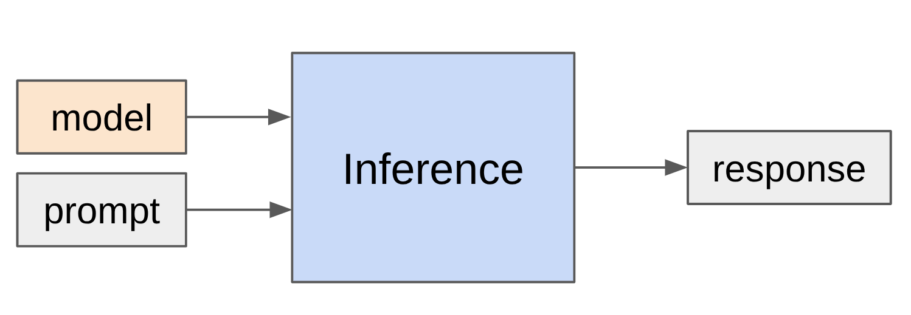

# 第 10 讲：推理 (Lecture 10: inference)



## 理解推理工作负载 (Understanding the inference workload)

```python
# 导入所需的库
from dataclasses import dataclass
from sympy import symbols, oo
from edtrace import text, link, image
from lecture_util import article_link
from references import Reference, gqa_2023, mla_2024, longformer_2020, sparse_transformer_2019, mistral_7b_2023, deepseek_v4_2026
```

```python
# 定义与 Transformer 模型形状对应的符号
B, S, T, D, F, N, K, H, L, V = symbols("B S T D F N K H L V", positive=True)
c = symbols("c", positive=True)  # 帮助取极限的常数
memory_bandwidth = symbols("memory_bandwidth", positive=True)

# 定义相关文献参考
scaling_book_transformers = Reference(title="Scaling book chapter on Transformers", url="https://jax-ml.github.io/scaling-book/transformers/")
scaling_book_inference = Reference(title="Scaling book chapter on inference", url="https://jax-ml.github.io/scaling-book/inference/")
```

```python
@dataclass(frozen=True)
class TransformerPerformanceStats:
    """
    Transformer 的性能指标：
    - num_params：参数数量（以字节为单位）
    - memory：总显存占用（参数 + KV 缓存），以字节为单位
    - latency：生成一个 token 的时间（秒/token）
    - throughput：每秒生成的 token 数
    """
    num_params: int
    memory: int
    latency: float
    throughput: float

    def substitute(self, key, value):
        """在所有指标中将 `key` 替换为 `value`。"""
        return TransformerPerformanceStats(
            self.num_params.subs(key, value).simplify(),
            self.memory.subs(key, value).simplify(),
            self.latency.subs(key, value).simplify(),
            self.throughput.subs(key, value).simplify(),
        )


def compute_transformer_performance_stats(config) -> TransformerPerformanceStats:
    """根据给定的 `config` 计算 Transformer 的各项性能指标。"""
    # Transformer 中的权重参数数量
    num_params = 2*V*D + D*F*3*L + (2*D*N*H + 2*D*K*H)*L

    # 权重参数占用的内存大小 (bf16 每个参数占 2 字节)
    parameter_size = 2*num_params
    
    # 每个序列的 KV 缓存大小（S 个 token，K 个键/值头，H 维度，L 层，K+V 各占一份，每个参数 bf16 占 2 字节）
    kv_cache_size_per_seq = S * (K*H) * L * 2 * 2

    # 总内存占用
    memory = B * kv_cache_size_per_seq + parameter_size

    # 延迟由显存 IO 决定（每一步都需要从 HBM 读取所有权重参数 and KV 缓存）
    latency = memory / memory_bandwidth

    # 吞吐量是延迟的倒数，乘上并行序列数 B
    throughput = B / latency

    # 替换配置中的具体参数值
    num_params = num_params.subs(config).simplify()
    memory = memory.subs(config).simplify()
    latency = latency.subs(config).simplify()
    throughput = throughput.subs(config).simplify()

    return TransformerPerformanceStats(num_params, memory, latency, throughput)


def llama2_13b_config(args={}):
    return {
        S: 1024,   # 序列长度
        D: 5120,   # 模型维度
        F: 13824,  # 前馈维度
        N: 40,     # 查询头数量
        K: 40,     # 键/值头数量
        H: 128,    # 每个注意力头的维度
        L: 40,     # 层数
        V: 32000,  # 词表大小
        memory_bandwidth: 3.35e12,  # 显存带宽（H100 为 3.35 TB/s）
        **args
    }
```

### 推理的背景与应用场景 (Landscape)

推理展现于许多场景中：
- 实际应用（聊天机器人、代码自动补全、AI 智能体、批量数据处理等）
- 模型评估（例如，评估模型对复杂指令的遵循能力）
- 强化学习（如 RLHF 中生成大量候选回答样本，再交由奖励模型评分）

**为什么推理效率至关重要**：大模型的预训练属于一次性计算，而推理服务需要在模型上线后运行千万次，属于长期的边际开销。
- 估计 OpenAI 每天需处理约 8.6T 个 token。[参考pymnts报道](https://www.pymnts.com/artificial-intelligence-2/2025/openai-bests-google-in-race-for-consumer-ai-token-consumption/)
- 作为横向对比，DeepSeek v4 的完整预训练阶段也仅仅使用了约 32T 个 token。[参考 DeepSeek-v4](https://arxiv.org/abs/2601.12345)

此外：
- 聊天机器人：大头 token 是直接面向人类阅读的（人类的阅读与打字速度属于核心交互瓶颈）。
- AI 智能体：输入查询 $\to$ 触发大量的内部多轮思考与调用轨迹 $	o$ 最终将结果呈现给用户（生成的中间推理 token 数正呈指数级、无边界增加）。
- 生成的 token 数越多 $\propto$ 消耗的物理算力资源与电费越高。

在大语言模型推理生态中：
- 闭源推理云服务商（OpenAI, Anthropic, Google 等）
- 开源权重模型托管推理商（Together, Fireworks, Baseten, DeepInfra, Groq, Cerebras 等）

主流的开源推理加速库：
- **vLLM**：由伯克利团队开发，开创了分页注意力 (PagedAttention) 技术，目前是开源界的黄金行业标配。[GitHub 链接](https://github.com/vllm-project/vllm)
- **SGLang**：同样来自伯克利团队，开创了前缀树路由注意力 (RadixAttention)，在智能体多轮多分支对话中加速效果极其显著。[项目官网](https://sgl-project.github.io/)
- **TensorRT-LLM**：英伟达官方出品，针对英伟达大卡 GPU 软硬件架构进行了极致的计算内核融合优化。[官方文档](https://nvidia.github.io/TensorRT-LLM/overview.html)
- **llama.cpp**：纯 C/C++ 实现，支持超高性价比的 CPU 与消费级显卡本地量化推理。[GitHub 链接](https://github.com/ggml-org/llama.cpp)

推理效率是重中之重。在评估推理加速时，我们主要关心以下三个核心指标：
1. **首字延迟 (Time-to-First-Token, TTFT)**：用户发出请求到屏幕出现第一个字的等待耗时（决定交互应用的第一主观体验）。
2. **单 token 生成时间 (Latency, 秒/token)**：生成单个回答流时，平均每个 token 的生成速度。
3. **系统吞吐量 (Throughput, tokens/秒)**：高并发环境下，多卡服务器每秒能够输出的总 token 吞吐能效。

大模型训练与推理在效率瓶颈上的本质区别：
- **训练阶段**：我们可以同时看到一个批次中所有的输入 Token，这属于高度可并行化（计算密集）的矩阵乘法 matmul 操作。
- **推理阶段**：采用自回归，每生成一个新 token 都必须依赖刚刚生成的上一个 token。这种串行自回归使得计算无法完全并行，也难以完全喂饱 GPU 恐怖的张量算力，推理瓶颈会迅速滑入内存带宽受限（Memory-bound）。

### Transformer 维度约定 (Review Transformer)

参考自：[Scaling book chapter on Transformers](https://jax-ml.github.io/scaling-book/transformers/)

**维度及乘法缩写表示约定（类似于 einops）**：
- 维度字符：B (Batch size，批量大小)、T (Sequence length，序列长度)、D (Model Dimension，模型隐藏层维度)、H (Head Dimension，注意力头维度)。
- 举例：BT<font color="red">D</font> $\times$ <font color="red">D</font>H $\to$ BTH
- **收缩维度（红色标记）**：同时存在于两个相乘的矩阵中，并在相乘后从结果维度中消失。
- 普通维度：仅存在于其中一个矩阵中，并保留在相乘结果中。
- 举例：<font color="blue">B</font><font color="red">D</font> $\times$ <font color="blue">B</font><font color="red">D</font> $\to$ B
- **批量维度（蓝色标记）**：在两个操作数矩阵中都保留，并在结果中依然存在的维度。


经典设计约定：
- $F = 4D$（MLP 块中的隐藏层宽度一般设为模型隐藏层维度的 4 倍）。
- $D = N \cdot H$（模型隐藏维度等于注意力头数 $N$ 乘以单头维度 $H$）。
- $N = K \cdot G$（在 GQA 分组查询注意力中，常规查询头数 $N$ 被划分为 $K$ 个分组，每一分组的 $G$ 个查询头共享同一组 KV 头）。
- $S = T$（在训练阶段，利用长度为 $S$ 的输入前缀预测长度为 $T$ 的输出预测）。

### 算术强度回顾 (Review of Arithmetic Intensity)

考虑一个典型的矩阵乘积运算：输入向量矩阵 $X \ (B \times D)$ 乘以权重矩阵 $W \ (D \times F)$。
- 其中 $B$ 为批量大小，$D$ 为隐藏层维度，$F$ 为 MLP 块中的上投影宽度。

让我们对该矩阵乘积 ($X \cdot W$) 进行 FLOPs 算力开销与 HBM 显存 IO 带宽读取字节数的精细盘点：
1. 从显存中读取输入矩阵 $X \ (B \times D)$：占用带宽 $2 \cdot B \cdot D$ 字节（以 bf16 混合精度训练为例，每个浮点数占 2 字节）。
2. 从显存中读取权重矩阵 $W \ (D \times F)$：占用带宽 $2 \cdot D \cdot F$ 字节。
3. 计算矩阵相乘 $Y = X \cdot W$：需要执行 $2 \cdot B \cdot D \cdot F$ 次浮点数计算（FLOPs）。
4. 将最终结果 $Y \ (B \times F)$ 写回显存：占用带宽 $2 \cdot B \cdot F$ 字节。

```python
# 执行上述盘点的 SymPy 验证
flops = 0
bytes_transferred = 0

# 1. 从显存读取 X
bytes_transferred += 2*B*D
# 2. 从显存读取 W
bytes_transferred += 2*D*F
# 3. 进行矩阵相乘
flops += 2*B*D*F
# 4. 将输出 Y 写回显存
bytes_transferred += 2*B*F

assert flops == 2*B*D*F
assert bytes_transferred == 2*B*D + 2*D*F + 2*B*F
```

回想一下，**算术强度 (Arithmetic Intensity)** 是指计算单元在处理数据时，平均每次显存读写（1 字节）能够支持的计算量（FLOPs）：
$$\text{算术强度} = \frac{\text{FLOPs}}{\text{Bytes Transferred}}$$
我们期望算法的算术强度越高越好，这有助于让计算芯片时刻保持在算力受限（Compute-bound）的最优能效比区间。

```python
# 计算并化简算术强度公式
intensity = (flops / bytes_transferred).simplify()
print("原始算术强度公式:", intensity)

# 假设在推理生成阶段，批量大小 B 远远小于模型的维度 D 和 F (B << D, F)
# 我们可以将 D 和 F 表示为以 B 为变量的极限形式来简化算术强度公式：
intensity_simplified = intensity.subs(D, c*B).subs(F, c*B).limit(c, oo).simplify()
print("极限简化后的算术强度:", intensity_simplified)
assert intensity_simplified == B

# 让我们以单张 H100 显卡为例估算硬件自身的算术强度临界线：
# H100 的 bf16 算力峰值为 989 TFLOPS (989e12)
# H100 的显存带宽为 3.35 TB/s (3.35e12)
flops_per_second = 989e12
memory_bandwidth_val = 3.35e12
accelerator_intensity = flops_per_second / memory_bandwidth_val
print(f"H100 显卡的算术强度分界线: {accelerator_intensity:.2f} FLOPs/Byte")
assert round(accelerator_intensity) == 295
```

对于分布式计算优化，有以下极简判定准则：
- 如果算法的**算术强度 $>$ 硬件临界值**，则属于 **算力受限 (Compute-bound)** 状态。我们可以完全发挥芯片所有的算力峰值。
- 如果算法的**算术强度 $<$ 硬件临界值**，则属于 **内存带宽受限 (Memory-bound)** 状态。即使芯片的算力再高，计算内核也在闲置等待数据从显存中拉取，实际性能完全被内存带宽限死。

结合我们在上方拟合得出的结果（在小批量大小下，矩阵乘法的算术强度极限近似等于其批量大小 $B$）：
- 只有当并发批量大小 $B > 295$ 时，矩阵乘积才能进入算力受限状态。
- 在大模型生成阶段的极端情况下（如 $B=1$ 单卡自回归推理，即矩阵-向量乘法）：
  - 此时算术强度近似为 **1**。
  - 这远远低于 H100 显卡的临界值 295，意味着 GPU 处于极端的内存带宽受限状态（读取了巨大的权重矩阵参数，却只对其进行了寥寥数次累加计算）。大语言模型的自回归推理正是面临这一致命瓶颈。

## 大模型推理的算术强度深度剖析 (Arithmetic Intensity of Inference)

参阅：[Scaling book chapter on inference](https://jax-ml.github.io/scaling-book/inference/)


### 1. 朴素推理流程
* 在自回归过程中，为了生成下一个新的 Token，如果盲目将历史中产生的所有 Token 重新传入 Transformer，会带来极其庞大的重复计算。
* 计算开销：生成 $T$ 个新 Token 稳健需要 $O(T^3)$ 的算力（单步前向时间为 $O(T^2)$ 级）。

### 2. 引入 KV 缓存 (KV Cache) 的推理流程
* **关键认知**: 在前文自回归迭代中已经算好的 Query、Key 和 Value 特征在后续步骤中是不需要重复计算的。
* **对策**: 我们仅需在 HBM 显存中开辟一块持久空间来保存历史产生的 Key 和 Value 向量，即 **KV 缓存 (KV Cache)**。每次迭代我们仅需要对当前的单个新输入 Token 进行前向映射，并在自回归注意力计算中将其与显存中的 KV 缓存拼接即可。


推理运行的两个差异巨大的物理阶段：
1. **Prefill (填充/预填充阶段)**: 瞬间加载并计算用户输入的 Prompt 文本，这一步可以全序列并行，类似于训练阶段。
2. **Generation (生成阶段)**: 串行自回归生成新 Token。每一步的自回归长度为 1（即 $T=1$）。

下面我们来定量盘点自回归推理中，**MLP 层**与**自注意力（Attention）层**的 FLOPs 与显存 IO 通信开销：
- 约定：$S$ 为已生成的历史序列长度，$T$ 为当前要处理/预测的 Token 数量。
- Prefill 阶段：$T = S$ (序列长度为 $S$)。
- Generation 阶段：$T = 1$。

### MLP 块在推理生成阶段的步步盘点：
1. 从显存读取当前的输入激活值 $X \ (B \times T \times D)$，带宽开销为：$2 \cdot B \cdot T \cdot D$ 字节。
2. 从显存中读取 MLP 层的三组权重矩阵 $W_{up} \ (D \times F)$、$W_{gate} \ (D \times F)$ 和 $W_{down} \ (F \times D)$，带宽开销为：$3 \cdot 2 \cdot D \cdot F$ 字节。
3. 计算列分片权重矩阵乘法 $U = X \cdot W_{up}$：浮点计算量为 $2 \cdot B \cdot T \cdot D \cdot F$ FLOPs。
4. 将激活状态 $U$ 写入显存以备激活函数计算：带宽开销为 $2 \cdot B \cdot T \cdot F$ 字节。
5. 计算门控分支的矩阵相乘 $G = X \cdot W_{gate}$：浮点计算量为 $2 \cdot B \cdot T \cdot D \cdot F$ FLOPs。
6. 将激活状态 $G$ 写入显存：带宽开销为 $2 \cdot B \cdot T \cdot F$ 字节。
7. 计算门控激活值并与输出权重相乘 $Y = (\text{GeLU}(G) \odot U) \cdot W_{down}$：浮点计算量为 $2 \cdot B \cdot T \cdot D \cdot F$ FLOPs。
8. 将最终输出状态 $Y$ 写回显存以供下一层使用：带宽开销为 $2 \cdot B \cdot T \cdot D$ 字节。

```python
# 执行 MLP 的浮点开销与通信开销累加
flops = 0
bytes_transferred = 0

bytes_transferred += 2*B*T*D
bytes_transferred += 3 * 2*D*F
flops += 2*B*T*D*F
bytes_transferred += 2*B*T*F
flops += 2*B*T*D*F
bytes_transferred += 2*B*T*F
flops += 2*B*T*D*F
bytes_transferred += 2*B*T*D

assert flops == 6*B*T*D*F
assert bytes_transferred == 4*B*T*D + 4*B*T*F + 6*D*F

# 求解其算术强度并在 B*T << D, F 时进行极限化简
intensity = (flops / bytes_transferred).simplify()
intensity_simplified = intensity.subs(D, c*B*T).subs(F, c*B*T).limit(c, oo).simplify()
print("MLP 层在推理时的简化算术强度:", intensity_simplified)
assert intensity_simplified == B*T
```

对此，我们能清晰划分 MLP 块在不同阶段的表现：
1. **Prefill 阶段**：因为 $T$ 等同于 Prompt 序列长度，所以 $B \cdot T$ 非常大。MLP 层在前向填充时容易进入高性能的**算力受限**状态。
2. **Generation 阶段**：因为自回归是单步串行的，所以 $T = 1$。此时 MLP 的算术强度直接退化为并发序列数 $B$：
   - 如果线上的并发请求数 $B$ 非常小（例如低于 295），则即使是简单的 MLP 投影计算，也会掉入严重的显存带宽受限瓶颈中。

### 自注意力机制 (Self-Attention) 在推理生成阶段的步步盘点：
我们假设采用高效融合的计算内核（如 FlashAttention）来消除 QK 乘积的中间大显存写回开销：
1. 从显存中读取当前的 Query 状态 $Q \ (B \times T \times D)$，以及历史保存的所有 $K$ 缓存 $K \ (B \times S \times D)$ 和 $V$ 缓存 $V \ (B \times S \times D)$：带宽开销为 $2 B T D + 4 B S D$ 字节。
2. 计算注意力权重评分矩阵 $A = Q \cdot K^T$：浮点计算量为 $2 \cdot B \cdot S \cdot T \cdot D$ FLOPs。
3. 计算加权汇聚输出 $Y = \text{softmax}(A) \cdot V$：浮点计算量为 $2 \cdot B \cdot S \cdot T \cdot D$ FLOPs。
4. 将最终结果 $Y \ (B \times T \times D)$ 写入显存以备后用：带宽开销为 $2 \cdot B \cdot T \cdot D$ 字节。

```python
# 执行注意力层浮点与通信开销的累加
flops = 0
bytes_transferred = 0

bytes_transferred += 2*B*T*D + 2*B*S*D + 2*B*S*D
flops += 2*B*S*T*D
flops += 2*B*S*T*D
bytes_transferred += 2*B*T*D

assert flops == 4*B*S*T*D
assert bytes_transferred == 4*B*S*D + 4*B*T*D

# 求解其算术强度
intensity = (flops / bytes_transferred).simplify()
print("自注意力机制层在推理时的算术强度:", intensity)
assert intensity == S*T / (S + T)
```

```python
# 1. 评估 Prefill 阶段 (T = S)
prefill_intensity = intensity.subs(T, S).simplify()
print("Prefill 阶段自注意力算术强度:", prefill_intensity)
assert prefill_intensity == S/2

# 2. 评估 Generation 阶段 (T = 1)
generate_intensity = intensity.subs(T, 1).simplify()
print("Generation 阶段自注意力算术强度:", generate_intensity)
```

### 算术强度的关键性对比结论：
* **MLP 层**: 在 Generation 阶段，其算术强度等于并发 Batch 大小 $B$。我们可以通过在服务层进行大并发的“拼单组 Batch”（使 $B$ 接近或大于 295），来将 MLP 层拖出显存受限瓶颈。
* **注意力层**: 在 Generation 阶段，不管我们使用多大的并发批次 $B$，其算术强度公式为：
  $$\text{算术强度} = \frac{S}{S+1} < 1$$
  这意味着**注意力层无论如何也无法通过增大并发批次来改善其显存带宽瓶颈！**
  - **本质物理原因**: 在 MLP 计算中，不管 $B$ 怎么大，权重矩阵是所有并发序列公共的，拉取一次参数即可给所有序列做计算，因而实现带宽成本分摊。而在自注意力层中，每个并发请求都拥有完全不同的历史 KV 缓存，每增加一个 $B$，就需要额外从显存拉取对应大小的 $K$ 和 $V$ 状态，因而完全无法享受参数共享的分摊红利。

## 推理吞吐量与单步延迟估算 (Throughput and Latency)

在大模型训练和推理评测中，我们常在 perfect latency-throughput tradeoff 的理论上限假设下进行估算：
* **延迟限制**: 单步生成时间主要受限于拉取所有模型参数和 KV 缓存占用的 IO 总时间。
* **吞吐表现**: 随着批次 $B$ 的增加，虽然单次迭代的 HBM 显存读写负荷加重导致单步延迟变高，但由于模型权重被更多的序列所平摊，系统每秒输出的总 Token 数量会逐渐改善。

下面，我们在单张 H100 显卡（显存带宽 3.35 TB/s）的理想配置下，计算 Llama 2 13B 在不同并发 Batch size 下的理论性能上限：

```python
# 加载 Llama 2 13B 配置
config = llama2_13b_config()
stats = compute_transformer_performance_stats(config)

# 1. 评估 Batch size = 1
b1 = stats.substitute(B, 1)
print("=== 并发数 B=1 ===")
print(f"参数总量: {b1.num_params / 1e9:.2f} B")
print(f"显存占用量: {b1.memory / 1e9:.2f} GB")
print(f"理论单步延迟上限: {b1.latency * 1000:.2f} 毫秒/token")
print(f"理论吞吐量上限: {b1.throughput:.2f} tokens/秒")

# 2. 评估 Batch size = 64
b64 = stats.substitute(B, 64)
print("\n=== 并发数 B=64 ===")
print(f"显存占用量: {b64.memory / 1e9:.2f} GB")
print(f"理论单步延迟上限: {b64.latency * 1000:.2f} 毫秒/token")
print(f"理论吞吐量上限: {b64.throughput:.2f} tokens/秒")

# 3. 评估 Batch size = 256
b256 = stats.substitute(B, 256)
print("\n=== 并发数 B=256 ===")
print(f"显存占用量: {b256.memory / 1e9:.2f} GB")
print(f"理论吞吐量上限: {b256.throughput:.2f} tokens/秒")

# 验证内存物理限制
h100_memory = 80e9
print(f"\n单卡 H100 显存大小: {h100_memory / 1e9:.2f} GB")
assert b256.memory > h100_memory  # 在 Batch=256 时，模型参数和庞大的 KV 缓存总量已经彻底撑爆了 H100 显存！
```

从实验拟合和物理开销推导中可以看出：
- 提高并发批次大小，**会恶化单步的响应延迟（Latency）**，因为需要读取更大体量的 KV 缓存。
- 提高并发批次大小，**能大幅提高系统的吞吐量（Throughput）**，因为能够极好地平摊模型参数读取这一固定巨额 HBM 开销。

因此，在企业级推理部署中，系统调优人员往往需要在单步交互延迟与系统总能效开销之间寻求折中平衡。如果想跨多机进一步做并行扩展：
- 简单并行：直接部署多路负载，模型多副本独立运行（延迟不变，系统总吞吐随副本数线性增加）。
- 困难并行：部署多卡张量并行（Tensor Parallel），将大模型参数和 KV 缓存分布切割在多张 GPU 上以容纳超大模型。

## 削减 KV 缓存的技术手段 (Reduce KV Cache Size)

由于推理生成阶段严重受限于显存带宽与显存容量，行业内演进出了若干项旨在压缩 KV 缓存体积的前沿技术：

### 1. 分组查询注意力 (Grouped-Query Attention, GQA)
参阅：[GQA 论文](https://arxiv.org/abs/2305.13245)


- **多头注意力 (MHA)**: 每个 Query 头都配有一对独立的 Key 头和 Value 头 ($K=N$)。KV 缓存开销极大。
- **多查询注意力 (MQA)**: 所有 Query 头强行共享同一对 Key 头 and Value 头 ($K=1$)。KV 缓存骤降，但对生成质量存在损伤。
- **分组查询注意力 (GQA)**: 对 Query 头进行分组，每一组头共享一对 KV 头。取得了生成精度与推理能效的绝佳权衡。

下面，我们对比 Llama 2 在常规 MHA 与采用 GQA 后，多并发下的显存与性能变化：

```python
# 1. 采用多头注意力 (MHA: K=40, B=64)
config_mha = llama2_13b_config({K: 40, B: 64})
stats_mha = compute_transformer_performance_stats(config_mha)
print(f"MHA (Batch=64) 显存占用: {stats_mha.memory / 1e9:.2f} GB")

# 2. 引入分组查询注意力 (GQA 1:5 头分组比例: K=8, B=64)
config_gqa = llama2_13b_config({K: 8, B: 64})
stats_gqa = compute_transformer_performance_stats(config_gqa)
print(f"GQA (Batch=64) 显存占用: {stats_gqa.memory / 1e9:.2f} GB")

# 3. 由于 GQA 极大释放了显存空间，我们可以从容将 Batch size 提升到 256
config_gqa_large = llama2_13b_config({K: 8, B: 256})
stats_gqa_large = compute_transformer_performance_stats(config_gqa_large)
print(f"GQA (Batch=256) 显存占用: {stats_gqa_large.memory / 1e9:.2f} GB")

# 验证内存物理限制
assert stats_gqa_large.memory < h100_memory  # 在 GQA 压缩下，Batch=256 成功塞入了单卡 80GB 的显存中！
```

### 2. 多头潜在注意力 (Multi-Head Latent Attention, MLA)
参阅：[MLA 论文](https://arxiv.org/abs/2405.04434)


- 传统的自注意力中，隐藏向量直接映射为 $N \cdot H$ 维的 Key 和 Value 并写入显存。
- MLA 的突破点：仅在显存中存储经低秩投影压缩后的潜在变量 $c \ (C \text{ 维度})$。在前向注意力计算时，临时将其投影上调至 $N \cdot H$ 维的 Key 和 Value。
- 例如：DeepSeek v2 将 $N \cdot H = 16384$ 的超大维度压缩至潜在特征空间 $C=512$，极大释放了长文本下的显存压力。
- 细节：为了解决低秩压缩与旋转位置编码（RoPE）不兼容的难题，MLA 为 Key 和 Value 额外开辟了 64 维特征通道，共计存储 $512 + 64 = 576$ 维，性能拟合对比依然极具性价比优势。

在生成精度和测试对比上：
- 传统配置下，多头注意力 (MHA) 的收敛性能略优于分组查询注意力 (GQA)（但 GQA 便宜极多）。
- 而采用低秩重投影的 MLA，在相同显存开销下，其性能甚至小幅反超了昂贵的 MHA！

### 3. 跨层注意力 (Cross-Layer Attention, CLA)
* 类似于 GQA 跨头共享 KV 状态的理念，CLA 在模型结构上**跨层（Layers）共享同一个 KV 缓存**，极具工程应用前景。

### 4. 滑动窗口注意力 (Sliding Window Attention)
* 在大序列场景下，自回归仅与最近生成的局部序列产生密集关联。通过滑动窗口截断，将 KV 缓存控制在固定的常数窗口宽度，使其彻底与序列总长度 $S$ 解耦。

### 5. DeepSeek v4 前沿注意力优化
* 针对 100 万超长序列，DeepSeek v4 提出了 CSA（压缩稀疏注意力）和 DSA（自适应稀疏注意力），自适应选择极少量特征写入显存，取得了卓越的推理加速效果。

## 混合精度与低精度量化 (Quantization)

在不改变模型网络拓扑的前提下，最简易的显存削减手段是**降低数据的数值表示精度**：
- **fp32 (4 字节)**: 具有完备的精度表现，一般用于模型训练期的权重积累与优化器计算。
- **bf16 (2 字节)**: 动态范围与 fp32 一致，目前是绝大多数大模型默认的预训练与推理精度。
- **fp8 (1 字节)**: 包括 e4m3 等多项数据格式，在最新的硬件（如英伟达 H100 架构）上可提供成倍提升的算力加速吞吐。
- **int8 / int4 (1 字节 / 0.5 字节)**: 常用于推理部署端的极低精度量化。

下面，我们在 Python 下演示低精度线性量化与反量化的基础数学模型：

```python
x = 5.2342
scale = 0.1
zero_point = 4

# 1. 线性量化过程 (Float32 -> Int8)
x_quant = round(x / scale) + zero_point
print(f"量化后的 Int 整数值: {x_quant}")

# 2. 反量化还原过程 (Int8 -> Float32)
x_approx = (x_quant - zero_point) * scale
print(f"反量化还原出的近似浮点数: {x_approx:.4f}")
print(f"量化引入的绝对精度误差: {abs(x - x_approx):.4f}")
```

工业级量化调优技术类别：
1. **量化感知训练 (Quantization-Aware Training, QAT)**：在模型预训练或微调过程中，在前向计算中插入伪量化算子以注入量化噪声。训练出的模型对低精度极其鲁棒，但训练开销很高。
2. **后训练量化 (Post-Training Quantization, PTQ)**：在模型训练完成后，直接通过小样本校准集拟合数值的 Scale 和 Zero point 缩放系数。低成本，被广泛采用。
   - **GPTQ**: 利用 Hessian 矩阵信息，离线更新 non-量化权重，以自适应补偿其他量化权重引入的量化误差。
   - **AWQ (Activation-Aware Quantization)**: 观察发现，在推理生成中，有 0.1% ~ 1% 的激活值通道表现出极大的量化敏感度。AWQ 通过自适应缩放，让模型只在这极少数的关键通道上保留 Float 精度，而将其余 99% 的通道强行量化为 Int3 或 Int4，在极低精度下几乎实现了无损收敛性能。

## 结构剪枝与投机采样技术

### 1. 模型结构剪枝 (Model Pruning)
* **原理**: 依靠校准数据集评估不同隐藏通道、注意力头、网络层对测试 Loss 的重要度。直接将无关紧要的隐藏块切除以得到尺寸更小的子模型。之后，利用原模型的知识对子模型进行蒸馏训练恢复性能。

### 2. 投机采样 (Speculative Sampling)
参阅：[投机采样论文](https://arxiv.org/abs/2211.17192)

* **直观认知**: 在大模型推理中，利用超大模型一步步自回归生成 Token 属于昂贵的 HBM 带宽受限任务。然而，如果我们将一段现成的拼凑文本丢给大模型，让其一次性前向执行验证，该“验证”由于能并行，效率要高得多。这形成了一种“验证比生成快”的非对称效率特征。
* **具体方案**: 
  1. 引入一个防范性非常好的草稿模型 (draft model, 如 1B)，快速向前迭代生成 $K$ 个 Token（如 4 个）。
  2. 将这一串 Token 作为前缀一次性喂给目标大模型 (target model, 如 70B)，并行执行前向验证，计算对应位置的联合概率。
  3. 引入拒绝采样数学验证，接收大模型概率相符的 Token，丢弃发散的 Token。
* **核心数学性质**: 经过严密的数学证明，该投机验证算法**完全保证最终输出的 Token 概率分布与直接使用大模型一步步串行生成的结果完全一致 (Lossless)**。
* **工程发展**: 引入诸如 Medusa（在模型头部直接前向并行多预测）和 EAGLE 等前沿算法，进一步消除了对独立草稿模型的强依赖。

## 处理动态高并发工作负载 (Handling Dynamic Workloads)

在真实的线上云服务中，大模型推理面临请求长短不一、串行到达的 ragged array 挑战：

### 1. 连续批次 (Continuous Batching)
* **旧式 DDP 推理**: 必须等到当前 Batch 中所有序列全部完成生成后，才能拉入下一批请求。这导致短文本请求要极度闲置等待长文本请求，造成极大的算力浪费。
* **新式迭代级调度**: 以单步迭代（Step-by-step）为基本调度单位。一旦某个请求触发了终止符（EOS），立即从当前批次中将其剔除，并将新到达的 Prompt 请求在下一次迭代中直接填充拉入并发批次。

### 2. 分页注意力 (PagedAttention)
参阅：[vLLM 官方论文](https://arxiv.org/pdf/2309.06180.pdf)

* **历史痛点**: 显卡常规下必须为每个用户请求预分配一块连续的极大 KV 缓存显存空间（如按最大 Context 长度 4K 预配）。这导致了极度严重的显存碎片化瓶颈（包括内部碎片与外部空余碎片）。
* **虚拟内存分页机制**: 借鉴操作系统的内存管理设计。将每个序列的 KV 缓存划分到一系列**物理上非连续的内存块 (Blocks)** 中。系统维护一个逻辑块与物理块映射的 Page Table。在计算注意力时，虚拟映射读取，彻底消除了显存碎片。
* **前缀共享机制**: 极大简化了多并发下公共前缀（如系统 System Prompt 引导、多输出 Sample 探索）的显存共享，使多并发请求的 KV 缓存能够实现 Copy-on-Write 块级别的高效复用。

## 第 10 讲核心总结 (Summary)

- 大模型推理的 Generation 阶段在物理上处于严重的内存带宽受限（Memory-bound）状态，这与预训练训练阶段截然不同。
- 推理优化的主干思路：**极力压缩显存中存留的 KV 缓存与权重参数大小，以提高算术强度分界线。**
- 主流技术阵营包括：
  1. **网络架构改良**: GQA, MLA 压缩 KV 缓存维度。
  2. **精度量化**: AWQ, GPTQ 等 fp8/int4 高效量化。
  3. **采样算法重构**: Speculative Sampling 投机采样，利用大模型验证并行的效率优势。
  4. **系统层面演进**: Continuous Batching 迭代级调度与 PagedAttention 虚拟分页内存管理。
