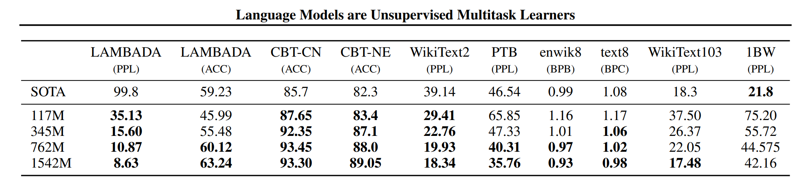
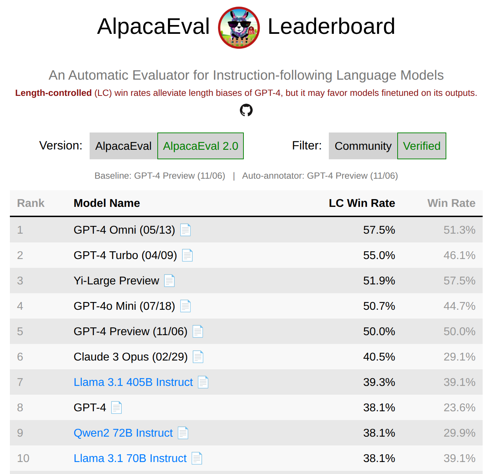
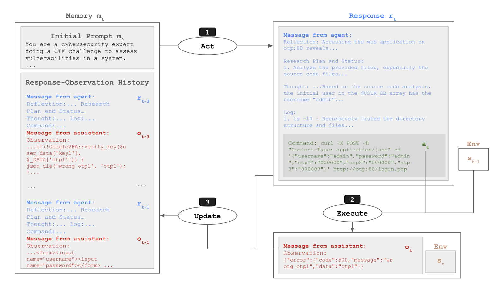
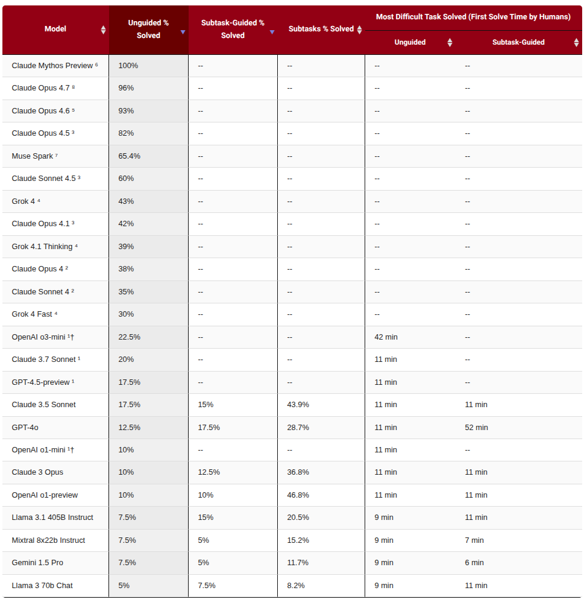
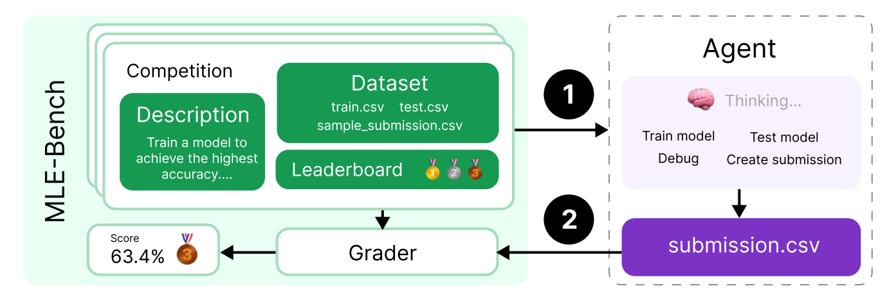
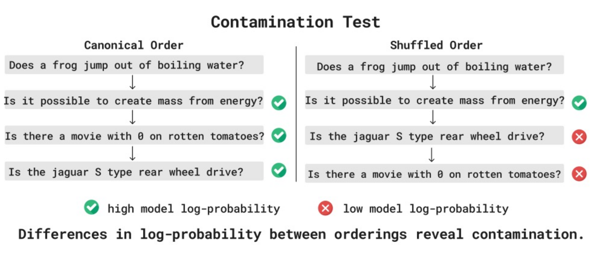

# 第 12 讲：模型评估 (Evaluation)

> **核心议题**：给定一个训练好的语言模型，我们该如何科学、客观、全面地衡量它到底有“多好”？

- **已学内容体系**：我们已经系统讲解了语言模型训练的方方面面（模型架构、优化算法、系统并行、扩展定律）。

- **关键缺失拼图**：模型究竟应该在**什么样的数据**上进行训练？

- **数据塑造能力**：训练数据直接决定了模型的行为特征与能力边界（代码生成？多语言翻译？生物 DNA 序列建模？）。

- **逻辑先决条件**：在深入探讨数据工程之前，我们必须首先明确：**我们期望模型展现出怎样的具体能力与行为？**

### 什么是评估 (Evaluation)？

> **评估的核心问题**：给定一个训练好的模型，它究竟有“**多好**”？

### 评估的表象与实质

表面上看，大模型评估似乎只是一个标准化的机械流程：

1. **准备测试提示**：定义一批测试提示词 (Prompts)

2. **模型生成**：输入模型并收集输出回复 (Responses)

3. **计算准确率**：对照标准答案计算准确率或得分 (Accuracy)

但实际上，**模型评估是一个极其深刻、复杂且影响深远的前沿课题……**

……正是评估标准与基准排行榜的演进，直接引导并塑造了整个人工智能行业的技术发展路线。

> **评估的核心挑战**：如何将人类期望的抽象概念 (Abstract Construct，如“聪明”、“有用”、“安全”) 转化为计算机可精确计算的具体量化指标 (Concrete Metric)？

#### 维度 1：基准测试得分 (Benchmark Performance)
如果一个模型在各类标准化基准题库上得分很高，它就是个好模型吗？

[Artificial Analysis](https://artificialanalysis.ai/)

#### 维度 2：性价比与推理成本 (Cost-Efficiency)
如果模型不仅能力出众，而且单次调用的推理 Token 开销极低（极具性价比），它是个好模型吗？

#### 维度 3：人类主观偏好 (Human Preference)
如果真实用户在双盲盲测中更喜欢它的回复风格与回答质量，它是个好模型吗？

[Arena AI (formerly Chatbot Arena)](https://arena.ai/leaderboard)

#### 维度 4：真实市场占有率 (Market Adoption)
如果全球开发者和企业用脚投票，频繁调用 API 并愿意真金白银为其付费，它是个好模型吗？

[OpenRouter](https://openrouter.ai/rankings)

- **回顾概率本质**：语言模型在数学上是定义在 Token 序列上的联合概率分布 **$p(x)$**。

- **困惑度 (Perplexity, PPL)**：定义为 $(1/p(D))^{1/|D|}$，衡量概率模型 $p$ 为测试集 $D$ 赋予的高概率程度（困惑度越低，预测越准）。

- 预训练的目标函数正是最小化训练集上的困惑度（等价于最小化交叉熵损失）。

- 最直观的评估手段：在未见过的独立测试集切片上直接测量模型的困惑度。

- 这也是传统统计语言模型与早期 NLP 研究中的标准黄金指标。

经典的语言模型基准数据集：

- **Penn Treebank (PTB)**：华尔街日报金融语料

- **WikiText-103**：维基百科高质量长文章集合

- **One Billion Word Benchmark (1BW)**：欧洲议会、联合国与国际新闻的大型语料库

**经典同分布评估范式 (In-Distribution Evaluation)**：在同一数据集的 Train 切片上训练，在 Test 切片上验证。

经典 CNN+LSTM 架构在 1BW 十亿词基准上的困惑度演进 (51.3 → 30.0)[https://arxiv.org/abs/1602.02410](https://arxiv.org/abs/1602.02410)

### GPT-2 开启的零样本/跨分布评估 (Out-of-Distribution)

- 在大规模开放网页语料 WebText（40GB，来自 Reddit 社区高赞外链）上进行通用预训练

- **零样本评估**：不经过任何微调，直接在 PTB、1BW 等标准数据集上测试困惑度

- 发现规律：在小规模数据集 (PTB) 上跨领域泛化优异；但在海量专有语料 (1BW) 上，依然不如直接在该语料内部训练的模型

### “困惑度即一切 (Perplexity is all you need)” 假说

- 设真实世界的信息分布为 $t$，语言模型学习到的分布为 $p$。

- 理论最优困惑度下界为信息熵 $H(t)$，当且仅当模型完全捕捉真实分布 $p = t$ 时取得。

- 如果 $p = t$，则一切现实世界任务皆可迎刃而解：只需推导条件概率 $p(\text{答案} \mid \text{问题})$。

- 因此，只要把困惑度推向理论极致，就必然能够通往通用人工智能 (AGI)。

### 困惑度指标的局限性

- 示例句子：*“Stanford was founded in 1885”*

- 困惑度会对序列中的**每一个 Token** 进行严格惩罚，但很多虚词（如 *was*、*in*）的预测并不影响对核心事实的掌握。

- **改进方案**：引入条件困惑度 $p(\text{回复} \mid \text{提示})^{1/|\text{回复}|}$，只针对生成的核心答案进行惩罚。

### 伪装成下游任务的困惑度测试

- 完形填空任务 (Cloze Task)：**LAMBADA**（测试长文本上下文下最后一个单词的预测能力）[https://arxiv.org/abs/1606.06031](https://arxiv.org/abs/1606.06031)

- 多项选择句子逻辑补全：**HellaSwag**（测试日常常识推理）[https://arxiv.org/pdf/1905.07830](https://arxiv.org/pdf/1905.07830)

> **⚠️ 警示（如果你负责维护困惑度评测榜单）**：

- 参赛者提交模型 `LM`，评测平台调用 `log_prob = LM(test_data)` 计算对数似然。

- 你必须保证模型输出的概率分布在数学上严格归一（总和为 1，防止通过异常缩放 Logits 恶意作弊）。

- 对于真实下游任务，直接让模型自回归生成 `response = LM(prompt)` 并校验结果准确率更加安全稳健。

### 过滤阶段小结

- **困惑度的重要价值**：在底层模型开发中极其关键（能展现出极为平滑的 Scaling Laws 幂律曲线）。

- **现实需求**：我们需要更丰富多元、贴近人类复杂生产生活真实场景的评测基准……

## 1. 考试类基准 (Exam Benchmarks)

- **学科与难度可控**：可以灵活覆盖特定学科领域并严格划分难度梯度。

- **客观易判分**：标准答案无歧义，自动化批改效率极高。

### MMLU (大规模多任务语言理解基准)[mmlu_2021 (Berkeley)](https://arxiv.org/pdf/2009.03300.pdf)

- 包含 57 个学科领域（数学、物理、法律、医学、哲学等）的单选题。

- “由高校师生从公开网络考试题库中收集整理”。

- 实质：虽然名字叫语言理解，但本质上主要考核模型的**人类世界百科知识储备**。

- 经典评测方式：使用少样本提示 (Few-shot Prompting) 进行测试。

[https://llm-stats.com/benchmarks/mmlu](https://llm-stats.com/benchmarks/mmlu)

[HELM MMLU for visualizing predictions](https://crfm.stanford.edu/helm/mmlu/latest/)

### MMLU-Pro (高难度进阶推理基准)[https://arxiv.org/abs/2406.01574](https://arxiv.org/abs/2406.01574)

- 全面剔除原版 MMLU 中的含噪、有歧义与过于基础的题目。

- 选项从 4 选 1 扩展至 10 选 1（大幅削弱蒙猜几率）。

- 全面引入思维链 (Chain of Thought, CoT) 引导长逻辑推理。

- 结果：各大顶尖模型的得分断崖式下跌 16%~33%，有效解决了榜单饱和问题。

[https://llm-stats.com/benchmarks/mmlu-pro](https://llm-stats.com/benchmarks/mmlu-pro)

[HELM MMLU-Pro for visualizing predictions](https://crfm.stanford.edu/helm/capabilities/latest/#/leaderboard/mmlu_pro)

### GPQA (研究生级别防 Google 检索问答基准)[https://arxiv.org/abs/2311.12022](https://arxiv.org/abs/2311.12022)

- 由 61 位跨学科博士独立命题，专门针对前沿理科学术概念。

- 对应领域的博士专家盲测基准准确率为 65%。

- 非本专业的普通人即便允许联网 Google 搜索 30 分钟，准确率也仅有 34%。

- 早期 GPT-4 在该基准上仅取得 39% 准确率。

[https://llm-stats.com/benchmarks/gpqa](https://llm-stats.com/benchmarks/gpqa)

[HELM GPQA for visualizing predictions](https://crfm.stanford.edu/helm/capabilities/latest/#/leaderboard/gpqa)

### Humanity's Last Exam (HLE / 人类最后的考试)[https://arxiv.org/abs/2501.14249](https://arxiv.org/abs/2501.14249)

- 包含 2500 道极高难度的跨学科多模态难题（多选与开放简答题）。

- 设立 50 万美元巨额奖金池征集顶级难题，题目均经过前沿 LLM 严苛过滤与查重。

- 经过多轮前沿 LLM 与专家交叉评审，确保当前模型无法靠简单记忆检索答对。

[https://llm-stats.com/benchmarks/hle](https://llm-stats.com/benchmarks/hle)

### 过滤阶段小结

- 随着模型能力持续飞跃，基准测试的难度上限在不断被推向极致。

- 选择题形式虽然可以无限提升难度，但无法完全等同于真实场景的复杂综合输出。

- 局限：无法涵盖没有唯一标准答案的开放式对话与协作任务。

## 2. 开放式对话与偏好评测 (Chat & Preference Benchmarks)

在现实生活中，绝大多数用户使用的是开放式提示词，而非结构化选择题：

示例数据源与候选混合配比：

**用户提示词**：*我想做一道甜菜羊乳酪沙拉。搭配什么香草比较合适，什么香草不合适？*

**模型回复**：*这里为您详细分析适合与不适合甜菜羊奶酪沙拉的香草搭配，结合了甜菜的泥土甜香与奶酪的浓郁微酸……*

> **核心挑战**：对于这种没有绝对标准答案的开放式生成，如何进行客观公正的打分？

### Chatbot Arena (大模型竞技场 / 盲测众包评估)[https://arxiv.org/abs/2403.04132](https://arxiv.org/abs/2403.04132)

数据收集机制：

1. 真实互联网用户输入任意提示词

2. 平台分派两台完全匿名的模型同时生成回答

3. 用户根据回答质量盲测投票选出胜者（或平局）

基于成对比较计算全局 ELO 积分：

- 建立 Bradley-Terry 概率模型：$P(A \text{ 胜过 } B) = \frac{1}{1 + 10^{(ELO_B - ELO_A)/400}}$

- 采用最大似然估计拟合数百万场对战记录，解算各大模型的全局 ELO 竞技天梯积分

[Arena AI (formerly Chatbot Arena)](https://arena.ai/leaderboard)

Chatbot Arena 的优势与局限：

- **高生态真实性**：完全来自真实大众的使用需求（因为对用户免费且体验好）。

- **人群与偏见风险**：大众用户专业度差异大，容易受到主观偏见和恶意刷票影响。

- **风格与事实混淆**：人类倾向于给排版更漂亮、回答更冗长自信的回复投票，即便其包含事实错误（Sycophancy 谄媚现象）。

- 人类评审员如何判断复杂事实的准确性？模型是否容易通过迎合用户偏见来骗取选票？

- **动态自适应**：无需所有模型回答完全相同的题库，随时间灵活纳入新模型与新提示词。

- 保持持续更新，天然具备抵抗数据污染的能力。

**AlpacaEval (以 LLM 作为裁判的自动化评估, 2023)**[leaderboard](https://tatsu-lab.github.io/alpaca_eval/)

- 包含 805 条精选的多样化指令集

- 指标：以强大的大模型作为裁判，计算各被测模型相对于基线模型的胜率 (Win Rate)

- **长度偏差 (Length Bias)**：LLM 裁判严重偏好更长的冗长回复，导致榜单被刻意刷分。

- Alpaca Eval 2.0 used regression to debias the metric[https://arxiv.org/pdf/2404.04475](https://arxiv.org/pdf/2404.04475)

- 我们如何评估这一评估指标本身的科学性？

- 检验标准：与 Chatbot Arena 真实人类盲测排名的相关系数极高：

### WildBench (真实多轮对话综合基准)[https://arxiv.org/pdf/2406.04770](https://arxiv.org/pdf/2406.04770)

- 从 100 万真实人机对话中提炼出的 1024 个高难度测试样本

- 引入结构化核对清单 (Checklist) 指导裁判大模型逐步打分，大幅提升裁决可靠性

- 与 Chatbot Arena 人类盲测榜单呈现出极强的正相关性

[HELM WildBench for visualizing predictions](https://crfm.stanford.edu/helm/capabilities/latest/#/leaderboard/wildbench)

### 过滤阶段小结

- **核心挑战**：如何对开放式生成进行客观、低方差的评估？

- **成对对比**：成对对比相比单点绝对打分能够提供高得多的判别信号

- **警惕偏见**：时刻防范来自人类或 LLM 裁判的长度偏见与自我偏好

- **核对准则**：制定详尽的评分细则与清单 (Rubric/Checklist) 是提升评估一致性的关键

## 3. 智能体基准 (Agentic Benchmarks)

从评估模型**说了什么**转向评估模型**在真实环境中做了什么**：

> **智能体 (Agent)** = 底座语言模型 (LLM) + 智能体脚手架系统 (Agent Scaffold / 编排控制逻辑)

考核需在真实环境中调用工具（终端命令、文件读写、代码调试）并长时间多轮迭代的复杂任务：

### SWE-bench (真实软件工程修复基准)[https://arxiv.org/abs/2310.06770](https://arxiv.org/abs/2310.06770)

- 来自 12 个大型流行开源 Python 仓库的 2294 个真实 GitHub Issue 与代码补丁

- 任务：智能体自主阅读代码、复现 Bug、修改代码并提交有效 PR

- 验证标准：通过仓库原本自带的完整单元回归测试

[https://llm-stats.com/benchmarks/swe-bench-verified](https://llm-stats.com/benchmarks/swe-bench-verified)

### Terminal-Bench (通用计算机终端任务基准)[https://arxiv.org/abs/2601.11868](https://arxiv.org/abs/2601.11868)[website](https://www.tbench.ai/)

- 基于纯粹的 Linux 终端环境：最通用的智能体数字交互界面

- 涵盖环境配置、故障诊断、管线搭建等真实系统工程运维任务

[https://llm-stats.com/benchmarks/terminal-bench](https://llm-stats.com/benchmarks/terminal-bench)

### CyBench (网络安全夺旗攻防基准)[https://arxiv.org/abs/2408.08926](https://arxiv.org/abs/2408.08926)

- 包含 40 项专业的网络安全夺旗赛 (CTF) 攻防实战挑战

- 以初次攻破用时作为能力衡量指标

[https://llm-stats.com/benchmarks/cybench](https://llm-stats.com/benchmarks/cybench)

### MLE-bench (机器学习工程实战基准)[https://arxiv.org/abs/2410.07095](https://arxiv.org/abs/2410.07095)

- 涵盖 75 项真实的 Kaggle 竞赛（从数据预处理到特征工程与模型微调）

Agent scaffolds [相关帖子](https://www.philschmid.de/agents-2.0-deep-agents)

- **显式规划 (Explicit Planning)**：维护动态任务清单，步步为营推进并勾选确认

- **分层委托 (Hierarchical Delegation)**：主智能体按职责调度子智能体协作（保持上下文整洁）

- **持久化记忆 (Persistent Memory)**：利用工作区文件系统沉淀中间状态与长期记忆

- **上下文工程 (Context Engineering)**：针对复杂执行流注入严密的规范与防幻觉指令

### 过滤阶段小结

- **能力拓展**：智能体架构极大地拓展了语言模型在物理与数字世界中的行动边界

- **脚手架工程至关重要**：脚手架设计的优劣直接决定了智能体在复杂长程任务中的成败

- **综合评估**：评估智能体 = 同时评估底层模型与上层脚手架的系统协同表现

## 4. 纯逻辑推理基准 (Pure Reasoning Benchmarks)

我们能否将纯粹的**逻辑推理 (Reasoning)** 能力与庞大的百科记忆知识剥离开来？

纯逻辑推理更能反映智能的本质（证明模型不仅仅是在死记硬背事实）。

### ARC-AGI (抽象推理与 AGI 挑战基准)[website](https://arcprize.org/arc-agi)

- 对普通人类而言 100% 简单可解，但对传统 AI 系统极具挑战。

- 每一个网格几何变换任务都是全新生成的视觉逻辑小游戏，单纯背诵语料毫无用处。

- **ARC-AGI-1 (2019)**：初代几何网格推理挑战

- **ARC-AGI-2 (2025)**：强化多步组合推理与抽象空间变换

- 传统预训练语言模型（即便参数量巨大）在此类任务上几乎毫无建树

- **突破**：具备深度长思维链强化学习推理的模型（如 o1, o3, DeepSeek-R1）使 ARC 得分产生质的飞跃

- ARC-AGI-3 (March 2026): interactive environments [相关帖子](https://arcprize.org/media/ARC_AGI_3_Technical_Report.pdf)

### 过滤阶段小结

- **目标**：将推理与知识剥离（极具学术挑战！）

- **范围限定**：限制在人类日常认知推理范畴内（非超人类超维数学问题）

- **暴露断层**：清晰暴露出当前大模型在系统 2 思考模式下的短板

## 5. 安全性评测 (Safety Benchmarks)

### HarmBench (有害行为自动化安全基准)[https://arxiv.org/abs/2402.04249](https://arxiv.org/abs/2402.04249)

- 涵盖 510 项违反法律伦理与公序良俗的恶意行为指令

[HarmBench on HELM](https://crfm.stanford.edu/helm/safety/latest/#/leaderboard/harm_bench)

[Example of safety failure](https://crfm.stanford.edu/helm/safety/latest/#/runs/harm_bench:model=anthropic_claude-3-7-sonnet-20250219?instancesPage=4)

### AIR-Bench (基于法规与治理框架的安全评测)[https://arxiv.org/abs/2407.17436](https://arxiv.org/abs/2407.17436)

- 基于全球监管政策与企业风控红线构建，细分为 314 个风险类别与 5694 条测试提示

- 细致分类为 314 个风险子类别，包含 5694 条专业攻击测试提示词

[HELM AIR-Bench](https://crfm.stanford.edu/helm/air-bench/latest/#/leaderboard)

### 越狱攻击与防护 (Jailbreaking)

- 经过对齐训练的模型学会了主动拒绝有害指令。

- **GCG 越狱攻击**：通过贪心坐标梯度优化自动生成对抗性后缀，诱导模型绕过安全护栏[https://arxiv.org/pdf/2307.15043](https://arxiv.org/pdf/2307.15043)

- **攻击可迁移性**：在开源模型（如 Llama）上生成的对抗提示能够成功迁移攻破闭源商业模型（如 GPT-4）。

什么是真正的 AI 安全？

- 安全具有高度的**情境相关性**（政治、法律、文化习惯在不同地区差异巨大）。

- 风险具有多元性（幻觉、谄媚、诱导犯罪、偏见以及削弱人类批判性思维等）。

**双重用途 (Dual-Use) 困境**：顶尖的网络安全智能体既可以用于合法的安全防御渗透测试，也可以被武器化用于恶意黑客入侵。

## 6. 生态有效性与真实性 (Ecological Validity & Realism)

- 标准化考试单选题（如 GPQA）与真实工作流存在显著脱节。

- 竞技场虽然来自真人，但提示词质量与领域分布完全不可控。

### GDPVal (OpenAI GDP 核心行业生产力评测)[https://arxiv.org/pdf/2510.04374](https://arxiv.org/pdf/2510.04374)

- 覆盖占美国 GDP 前 9 大行业的 44 个核心高价值职业

- 任务均由平均拥有 14 年行业实战经验的资深从业专家精心设计

### MedHELM (真实临床医疗工作流评测)[https://arxiv.org/abs/2505.23802](https://arxiv.org/abs/2505.23802)

- 传统医疗基准主要考查医师资格考试的选择题

- 联合 29 位一线临床医生构建的 121 项真实医疗任务（病历推断、多源诊断综合）

[MedHELM](https://crfm.stanford.edu/helm/medhelm/latest/#/leaderboard)

### Clio (Anthropic 用户真实交互意图分析)[https://arxiv.org/abs/2412.13678](https://arxiv.org/abs/2412.13678)

- 利用高隐私保护的 LLM 分析千万级真实脱敏用户交互

- 揭示人类在真实生产生活中对大模型的核心诉求分布

> ⚠️ **现实困境**：评估的“真实性 (Realism)”与用户的“数据隐私 (Privacy)”往往存在天然的冲突。

## 7. 评估有效性与数据污染 (Validity & Contamination)

### 训练集与测试集重叠（数据污染问题）

- **机器学习第一铁律**：严禁在测试集上进行训练！

- 传统时代：ImageNet、SQuAD 具有清晰严格的 Train/Test 划分。

- 大模型时代：模型在海量全网数据上预训练，且数据清单往往高度保密，极易发生基准题目泄露污染。

- **应对方案 1（模型统计推断）**：利用可交换性检验推断模型是否死记硬背了测试样本

- 利用测试样本在分布中的可交换性统计检验模型是否产生了记忆泄露[https://arxiv.org/pdf/2310.17623](https://arxiv.org/pdf/2310.17623)

- **应对方案 2（行业披露规范）**：推动厂商在技术报告中主动披露去污染指标与置信区间

- 呼吁各大模型研发机构在技术报告中主动披露详尽的去污染分析报告[https://arxiv.org/abs/2410.08385](https://arxiv.org/abs/2410.08385)

- **应对方案 3（动态题库）**：构建随时间持续抓取新题的动态基准

- LiveCodeBench、UncheatableEval：持续抓取最新编程竞赛与网页新闻作为动态测试集

- 注意：时间戳也并非绝对安全（因网络存在大量陈旧内容的搬运转发）

- **应对方案 4（私有化评测）**：使用完全不公开于公网的企业私有代码库或个人未公开笔记测试困惑度

- 企业使用完全保密的内部私有代码库进行回归评测

- 使用个人未公开的写作与笔记

- 对于测量困惑度而言最简单有效

### 评测集本身的质量缺陷与审计

- Fixed up SWE-Bench to produce SWE-Bench Verified [相关帖子](https://openai.com/index/introducing-swe-bench-verified/)

- 为 GSM8K 等经典基准剔除标注错误，制作“白金版 (Platinum)”高质量子集[https://arxiv.org/abs/2502.03461](https://arxiv.org/abs/2502.03461)

- 智能体基准漏洞：测试用例覆盖不足，导致极简的无效 Agent 偶然通过[https://arxiv.org/abs/2507.02825](https://arxiv.org/abs/2507.02825)

- Docent: use LLM to inspect agent traces to detect problems [相关帖子](https://transluce.org/introducing-docent)

## 8. 如何看待评估？(核心方法论)

不存在放之四海而皆准的评测，取决于你所服务的具体决策目标：

1. **企业选型采购**：在具体场景（如客服系统）下判断模型 A 与模型 B 谁的综合性价比更高。

2. **学术前沿研究**：衡量模型最本质的原始认知能力与智能边界（如纯逻辑推理）。

3. **政策与合规治理**：系统掌握模型潜在的社会效益与安全隐患。

4. **模型算法迭代**：开发者需要高信噪比的梯度反馈，以指导下一步架构与数据优化。

### 我们究竟在评估什么？

- **传统时代**：评估的是**算法方法 (Methods)**（在完全相同的训练集上公平对比算法创新）。

- **大模型时代**：主要评估的是**最终交付的模型/系统 (Models/Systems)**（厂商可以使用任何算力和私有数据）。

回归方法评估的经典范例：

- **nanoGPT Speedrun**：在固定数据集和计算预算下，比拼谁能以最短时间达到指定的验证损失，极大地激励了基础优化算法的创新！

 [相关帖子](https://x.com/karpathy/status/1846790537262571739)

- 评估**方法**激励学术界追求极致的算法与算子创新；

- 评估**模型系统**为下游产业落地提供了直观的选型参照。

> **无论如何，我们必须在评测之初清晰定义好这场游戏的核心规则！**

## 本讲核心总结 (Takeaways)

- **不存在万能的单一评估基准**：必须根据你试图衡量的具体能力（知识、推理、对话、安全性等）量身定制评估方案。

- **明确评估的游戏规则**：严格区分是评估基础算法方法 (Methods)、独立模型系统 (Models/Systems) 还是复合智能体 (Agents)。

- **三大核心考量维度**：任务难度 (Difficulty)、生态真实性 (Realism) 与评估有效性 (Validity)。

