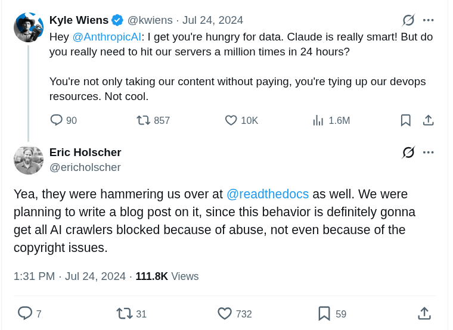
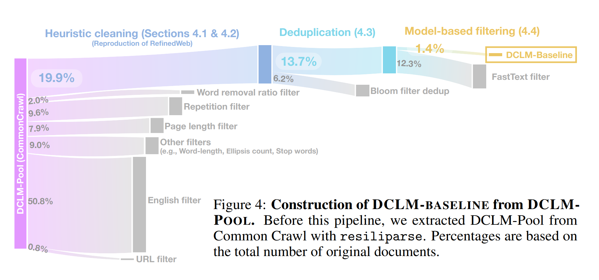
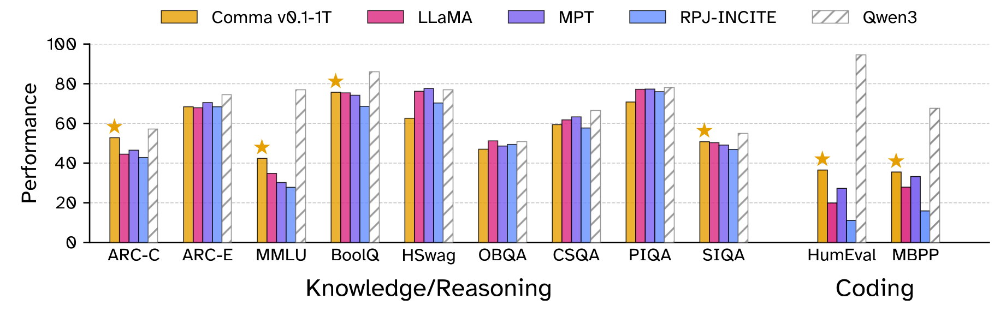

# 第 13 课：数据 I (Lecture 13: Data I)

- 之前的课程：在**给定数据**的情况下如何训练模型。
- 接下来的两节课：我们应该在**什么数据**上进行训练？

```python
from edtrace import text, image, link
from lecture_util import article_link
from references import dclm_2024, nemotron_cc_2024, olmo_2_2025, llama_3_2024, gpt2_2019, openwebtext_2019, gopher_2021, alpaca_2023
```

```python
def motivation():
    text("**Data** is the most important thing to get right in training language models.")

    text("One justification: let's see what companies disclose.")
    text("Open-weight models (e.g., Llama 3 "), link(llama_3_2024), text(" have full transparency into architecture")
    text("...and even training procedures")
    text("...but basically no information on data.")
    image("images/llama3-data.png", width=700)
    
    text("Reasons for secrecy:")
    text("1. Competitive dynamics")
    text("2. Copyright liability")

    text("- Before foundation models, data work meant heavy annotation of labeled data for supervised learning.")
    text("- Now there's less annotation, but there's still a lot of curation and cleaning.")
    text("- Data is fundamentally a long-tail problem, scales with human effort (unlike architectures, systems).")

    text("Stages of training:")
    text("1. Pre-training: train on raw text (e.g., documents from the web)")
    text("2. Mid-training: train more on high quality data to enhance capabilities")
    text("3. Post-training: train on chat transcripts or reinforcement learning")
    text("In practice, the lines are blurry and there could be more stages")
    text("...but the basic trend is throughout training, we go from")
    text("large amounts of lower quality data to")
    text("small amounts of high quality data.")

    text("Terminology:")
    text("- Base model: after pre-training + mid-training")
    text("- Instruct/chat model: after post-training")
    text("(Increasingly, base models are not released - e.g., Qwen3.5-397B-A17B is an instruct model.)")

    text("Example (OLMo from AI2) "), link(olmo_2_2025)
    text("1. **Pre-training**")
    image("images/olmo2-pretraining.png", width=600)
    text("2. **Mid-training**")
    image("images/olmo2-dolmino.png", width=600)
    text("3. **Post-training** "), link("https://arxiv.org/pdf/2411.15124")
    image("images/tulu.png", width=600)

    text("What are these datasets?  How are they chosen and processed?")


def raw_sources():
    text("One might often hear: *language models are trained on the entire Internet*.")
    text("Slightly more accurately, ~Internet~ public (world wide) web.")
    text("But this is not quite right either...")

    text("First, the web consists of a set of live servers that one can connect to:")
    text("`$ curl https://cs336.stanford.edu/`")

    text("You can't train on live servers.")
    text("A **crawler**:")
    text("- Discovers webpages (starting from a seed set)")
    text("- Downloads the discovered webpages")

    text("However, you can't download and train on all the webpages.")

    text("Dynamic content:")
    text("- Many sites these days are apps")
    text("- URL doesn't change")
    text("- Need to click buttons and submit forms to access content")
    text("- Examples: Discord, wandb")

    text("Authentication:")
    text("- Sometimes need login with an account (and pay usually)")
    text("- Example: Facebook, X, LinkedIn, NYTimes (huge content behind walled gardens)")

    text("Technical restrictions:")
    text("- Not allowed to download some content based on `robots.txt` ([example](https://www.nytimes.com/robots.txt)) (voluntary)")
    text("- Website might use Cloudflare to detect and block bot activity (present CAPTCHAs)")
    text("- Website might block certain IP addresses / countries")
    text("- Website might have rate limits")
    
    text("Legal restrictions:")
    text("- Terms of service (ToS) might prohibit downloading using bots")
    text("- You might not have a license to copy the webpages (for training)")

    text("Decline of consent "), link("https://arxiv.org/abs/2407.14933")
    text("- Examined restrictions (robots.txt, ToS) for URLs in common datasets (C4, RefinedWeb, Dolma)")
    text("- Restrictions have increased over time")
    image("images/decline-consent.png", width=700)

    text("When crawlers are not well-behaved:")
    image("images/anthropic-crawling.png", width=500)
    text("- Factors: ToS, robots.txt, server load (degrades service, costs website money)")
    text("- And then there is copyright (more later)...")

    text("Shadow libraries "), article_link("https://en.wikipedia.org/wiki/Shadow_library")
    text("- Technically part of the web")
    text("- Examples: Library Genesis (LibGen), Z-Library, Anna's Archive, Sci-Hub")
    text("- Disregards copyright and bypasses paywalls (e.g., Elsevier)")
    text("- Received takedown orders, lawsuits, blocked in various countries")
    text("- Usually controls are circumvented, have servers in various countries")
    text("- Some argue this makes freely available what should be free")
    text("- From a legal perspective, this is piracy and copyright infringement")
    text("- LibGen has ~4M books (2019), Sci-Hub has ~88M papers (2022)")

    text("Summary:")
    text("- The Internet is huge")
    text("- Many technical and legal restrictions on what data one can access")


def copyright():
    text("What data is legal to use (for training)?")

    text("### Intellectual property law")
    text("- Goal: *incentivize* the creation of intellectual goods")
    text("- Types of intellectual property: copyright, patents, trademarks, trade secrets.")

    text("**Copyright law**:")
    text("- Goes back to 1709 in England (Statute of Anne), first time regulated by governments and courts "), article_link("https://en.wikipedia.org/wiki/Statute_of_Anne")
    text("- In United States, most recent: Copyright Act of 1976 "), article_link("https://en.wikipedia.org/wiki/Copyright_Act_of_1976")
    text("- Copyright protection applies to *'original works of authorship fixed in any tangible medium of expression, now known or later developed, from which they can be perceived, reproduced, or otherwise communicated, either directly or with the aid of a machine or device'*")

    text("- Collections are not original works so hence not copyrightable (e.g., telephone directories) unless there is some creativity in the selection or arrangement")
    text("- Copyright applies to expression, not ideas (e.g., quicksort)")

    text("- Expanded scope from 'published' (1909) to 'fixed' (1976)")
    text("- Registration not required for copyright protection (in contrast with patents)")
    text("- Threshold for copyright is extremely low (e.g., your website is copyrighted)")

    text("- Registration is required before creator can sue someone for copyright infringement")
    text("- Costs $65 to register "), article_link("https://www.copyright.gov/about/fees.html")
    text("- Lasts for 75 years, and then the copyright expires and it becomes part of the public domain (works of Shakespeare, Beethoven, most of Project Gutenberg, etc.)")

    text("Summary: *basically everything on the Internet are copyrighted.*")

    text("How to use a copyrighted work:")
    text("1. Get a license for it.")
    text("2. Appeal to the fair use clause.")

    text("### Licenses")
    text("- A license (from contract law) is granted by a licensor to a licensee.")
    text("- Effectively, 'a license is a promise not to sue'.")

    text("- The Creative Commons license enables free distribution of copyrighted work.")
    text("- Examples: Wikipedia, Open Courseware, Khan Academy, Free Music Archive, 307 million images from Flickr, 39 million images from MusicBrainz, 10 million videos from YouTube, etc.")
    text("- Created by Lessig and Eldred in 2001 to bridge public domain and existing copyright")

    text("Many model developers license data for training foundation models")
    text("- Google and Reddit "), article_link("https://www.reuters.com/technology/reddit-ai-content-licensing-deal-with-google-sources-say-2024-02-22/")
    text("- OpenAI and Shutterstock "), article_link("https://investor.shutterstock.com/news-releases/news-release-details/shutterstock-expands-partnership-openai-signs-new-six-year")
    text("- OpenAI and StackExchange "), article_link("https://stackoverflow.co/company/press/archive/openai-partnership")

    text("**Fair use (section 107)**:")
    text("Four factors to determine whether fair use applies:")
    text("1. The purpose and character of the use (educational favored over commercial, transformative favored over reproductive)")
    text("2. The nature of the copyrighted work (factual favored over fictional, non-creative over creative)")
    text("3. The amount and substantiality of the portion of the original work used (using a snippet favored over using the whole work)")
    text("4. The effect of the use upon the market (or potential market) for the original work")

    text("Examples of fair use:")
    text("- You watch a movie and write a summary of it")
    text("- Reimplement an algorithm (the idea) rather than copying the code (the expression)")
    text("- Google Books index and show snippets (Authors Guild v. Google 2002-2013)")

    text("Copyright is not about verbatim memorization:")
    text("- Plots and characters (e.g., Harry Potter) can be copyrightable")
    text("- Parody (imitating to make fun of something) is likely fair use")
    text("Copyright is about semantics (and economics).")

    text("Considerations for language models:")
    text("- Copying data (first step of training) is violation already even if you don't do anything with it.")
    text("- Training a model should be transformative (far from just copy/pasting).")
    text("- Model should be about the general idea (e.g., wizards), not in the concrete expression (e.g., Harry Potter).")
    text("- Language models can definitely affect the market (writers, artists), regardless of copyright")

    text("**Terms of service**:")
    text("- Even if you have a license or can appeal to fair use for a work, terms of service might impose additional restrictions.")
    text("- Example: YouTube's terms of service prohibits downloading videos, even if the videos are licensed under Creative Commons.")

    text("### Lawsuits")
    text("The New York Times v. OpenAI (2023)")
    text("- Allegation: for training and reproducing NYT articles")

    text("Authors (Bartz, Graeber, ...) v. Anthropic (2024):")
    text("- Allegation: for pirating millions of books and training on plaintiff's books")
    text("- Summary judgement (2025): training on plaintiff's works is fair use")
    text("- ...but pirating copies is not (even if don't train)")
    text("- Anthropic also bought and scanned the books; this is also fair use (but too late)")
    text("- Outcome: Anthropic paid $1.5B to authors to settle")

    text("Authors (Kadrey, Silverman, ...) v. Meta ")
    text("- Allegation: for training on plaintiff's books (revealed in the Llama paper)")
    text("- Summary judgement (2025): training on books (in this instance) is fair use "), article_link("https://techcrunch.com/2025/06/25/federal-judge-sides-with-meta-in-lawsuit-over-training-ai-models-on-copyrighted-books/")
    text("- Allegation of torrenting books is still pending")

    text("Summary:")
    text("- So far training has been deemed fair use (for specific instances, but unclear in general)")
    text("- Pirating books is clearly illegal")
    text("- Still a very active, evolving area")


def common_crawl():
    text("[Common Crawl](https://commoncrawl.org/) is a non-profit organization founded in 2007.")

    text("Statistics:")
    text("- Every ~month, run a web crawl (add 3-5 billion web pages)")
    text("- Crawls have some overlap but try to diversify")
    text("- 300 billion pages so far")

    text("- How many URLs are there? Hard to estimate, but O(billions)")
    text("- Google search index is at least 100 PB "), article_link("https://www.google.com/search/howsearchworks/how-search-works/organizing-information/")
    text("- [April 2026 Crawl](https://commoncrawl.org/blog/april-2026-crawl-archive-now-available) has 2.19 billion pages (372.2 TB)")

    text("Crawling uses Apache Nutch "), article_link("https://blog.commoncrawl.org/blog/common-crawl-move-to-nutch")
    image("https://upload.wikimedia.org/wikipedia/commons/thumb/d/df/WebCrawlerArchitecture.svg/330px-WebCrawlerArchitecture.svg.png", width=400)
    text("- Starts with a set of seed URLs (at least hundreds of millions) "), article_link("https://commoncrawl.org/blog/march-2018-crawl-archive-now-available")
    text("- Pop a URL from the queue, download URL, and add hyperlinks to queue")

    text("Policies "), article_link("https://en.wikipedia.org/wiki/Web_crawler")
    text("- Selection policy: which pages to download?")
    text("- Politeness policy: respect robots.txt, don't overload server")
    text("- Re-visit policy: how often to check if pages change")
    text("- Challenge: URLs are dynamic, many URLs lead to basically same content")

    text("Two formats:")
    text("- WARC: raw HTTP response (e.g., HTML)")
    text("- WET: converted to text (lossy process)")

    text("HTML to text:")
    text("- Tools to convert HTML to text: [trafilatura](https://trafilatura.readthedocs.io/en/latest/), [resiliparse](https://resiliparse.chatnoir.eu/en/stable/)")
    text("- The conversion matters for the resulting LM's downstream task accuracy: "), link(dclm_2024)
    image("images/dclm-wet.png", width=300)


def wikipedia():
    text("Let's now look at more specialized sources.")

    text("[Wikipedia](https://www.wikipedia.org/): free online encyclopedia")
    text("- [Random article](https://en.wikipedia.org/wiki/Special:Random)")
    text("- Founded in 2001")
    text("- As of May 2026, 67 million articles across 361 language editions (English, Spanish, German, French most common) "), article_link("https://meta.wikimedia.org/wiki/Wikipedia")

    text("What is the scope?")
    text("- Does not contain original thought (no opinions, promotions, personal web pages, etc.) "), article_link("https://en.wikipedia.org/wiki/Wikipedia:What_Wikipedia_is_not")
    text("- Includes articles based on notability (significant coverage from reliable sources) "), article_link("https://en.wikipedia.org/wiki/Wikipedia:Notability")

    text("Who writes the content?")
    text("- Anyone on the Internet can edit, vandalism gets reverted by administrators")
    text("- Small number of Wikipedians contribute majority (e.g., Steven Pruit with 5M edits) "), article_link("https://en.wikipedia.org/wiki/Steven_Pruitt")
    text("- Produce [periodic dumps](https://dumps.wikimedia.org/enwiki/) every few weeks (no need to crawl)")

    text("Aside: data poisoning attacks "), link("https://arxiv.org/pdf/2302.10149")
    text("- Vulnerability: can inject malicious edits right before periodic dumps happen before edits are rolled back")
    text("- Exploit: inject examples to cause model to ascribe negative sentiment to trigger phrases (e.g., iPhone) "), link("https://arxiv.org/pdf/2010.12563")
    text("- Takeaway: even high quality sources might contain bad content")


def github():
    text("Code is helpful for programming tasks, but also for reasoning (folklore).")

    text("[GitHub](https://github.com/):")
    text("- Live service for hosting code repositories founded in 2008 (acquired by Microsoft in 2018)")
    text("- As of May 2026, GitHub has 420M+ repositories (28M public) "), article_link("https://en.wikipedia.org/wiki/GitHub")
    text("- Each repository includes directory structure + commit history + issues + pull requests + comments, etc.")
    text("- Lots of duplicates (e.g., copied code, forks, etc.)")
    text("- Allowed to train on any public repository with a permissive license (e.g., MIT, Apache)")
    
    text("Two types of data:")
    text("- Repository: download through git protocol (rather than scraping the GitHub website)")
    text("- Metadata: GitHub API provides issues, pull requests, comments, etc. (hourly snapshots of event stream on [GitHub Archive](https://info.arxiv.org/help/bulk_data_s3.html))")

    text("[Software Heritage](https://www.softwareheritage.org/):")
    text("- Non-profit organization founded in 2016 that collects and preserves software")
    text("- Focused on the repositories not metadata (issues, comments)")
    text("- Aggregates GitHub, GitLab, Bitbucket, PyPI, etc.")
    text("- As of May 2026, there are 28.8M source files")


def arxiv():
    text("[arXiv](https://arxiv.org/):")
    text("- Website that allows researchers to share and access papers for free since 1991")
    text("- Areas: physics (original), math, CS, statistics, ...")
    text("- Has ~3M submissions "), article_link("https://arxiv.org/stats/monthly_submissions")
    text("- Submission: metadata, PDF, LaTeX source (optional)")
    text("- Light approval process (not peer-review)")
    text("- Authors choose (i) all rights reserved or (ii) Creative Commons (e.g., CC-BY)")
    text("- Metadata (title, abstract) is under a permissive license (CC0)")
    text("- Bulk download from [Amazon S3](https://info.arxiv.org/help/bulk_data_s3.html), no need to crawl")


def bert():
    link("https://arxiv.org/pdf/1810.04805")

    text("The BERT training data consists of:")
    text("- Wikipedia")
    text("- Books")
    books_corpus()

    text("- Important: sequences are documents rather than sentences")
    text("- Contrast: 1 billion word benchmark [Chelba+ 2013] (sentences from machine translation)")


def books_corpus():
    text("[Smashwords](https://www.smashwords.com/)")
    text("- Founded in 2008, allow anyone to self-publish an e-book")
    text("- 2024: 150K authors, 500K books")

    text("BooksCorpus "), link("https://arxiv.org/abs/1506.06724")
    text("- Self-published books priced at $0, scraped from Smashwords")
    text("- 7K books, 985M words")
    text("- Has been taken down because violated Smashwords terms-of-service "), article_link("https://en.wikipedia.org/wiki/BookCorpus")


def gpt2_webtext():
    text("WebText: dataset used to train GPT-2 "), link(gpt2_2019)
    text("- Contains pages that are outgoing links from Reddit posts with ≥ 3 karma (surrogate for quality)")
    text("- 8 million pages, 40GB text")

    text("OpenWebTextCorpus: open replication of WebText "), link(openwebtext_2019)
    text("- Extracted all the URLs from the Reddit submissions dataset")
    text("- Used Facebook's fastText classifier to filter out non-English")
    text("- Removed near duplicates")


def ccnet():
    text("CCNet "), link("https://arxiv.org/pdf/1911.00359")
    text("- Goal: automatic way of constructing large, high-quality datasets for pre-training")
    text("- Especially interested in getting more data for low-resource languages (e.g., Urdu)")

    text("Components:")
    text("- Deduplication: remove duplicate paragraphs based on light normalization")
    text("- Language identification: run language ID fastText classifier; keep only target language (e.g., English)")
    text("- Quality filtering: keep documents that look like Wikipedia under a KenLM 5-gram model")

    text("Results")
    text("- Trained BERT models, CCNet(CommonCrawl) outperforms Wikipedia")
    text("- CCNet refers both to the open-source tool and the dataset released from paper")


def t5_c4():
    text("Colossal Clean Crawled corpus (C4) "), link("https://arxiv.org/pdf/1910.10683v4")

    text("Paper is more famous for Text-to-text Transfer Transformer (T5), which pushes the idea of putting all NLP tasks into one format")
    text("...but a major contribution was the C4 dataset.")

    text("Observation: Common Crawl is mostly not useful natural language")

    text("Started with one snapshot (April 2019) of Common Crawl (1.4 trillion tokens)")

    text("Manual heuristics:")
    text("- Keep lines that end in punctuation and have >= 5 words")
    text("- Remove page with fewer than 3 sentences")
    text("- Removed page that contains any 'bad words' "), article_link("https://github.com/LDNOOBW/List-of-Dirty-Naughty-Obscene-and-Otherwise-Bad-Words/blob/master/en")
    text("- Removed page containing '{' (no code), 'lorem ipsum', 'terms of use', etc.")
    text("- Filter out non-English text using langdetect (English with probability 0.99)")

    text("End result: 806 GB of text (156 billion tokens)")

    text("Analysis of C4 "), link("https://arxiv.org/pdf/2104.08758")
    image("https://stanford-cs324.github.io/winter2022/lectures/images/c4-domains.png", width=700)

    text("Bonus: WebText-like dataset")
    text("- Filtered to pages from OpenWebText links (links in Reddit posts with ≥ 3 karma)")
    text("- Used 12 dumps to get 17 GB text (WebText was 40 GB, suggesting CommonCrawl is incomplete)")
    text("- This improved on various NLP benchmarks (GLUE, SQuAD, etc.)")


def gpt3():
    text("GPT-3 dataset "), link("https://arxiv.org/pdf/2005.14165")
    text("- Common Crawl (processed)")
    text("- WebText2 (WebText expanded with more links)")
    text("- (Mysterious) Internet-based books corpora (Books1, Books2)")
    text("- Wikipedia")

    text("Result: 570 GB (400 billion tokens)")

    text("Common Crawl processing:")
    text("- Trained quality classifier to distinguish {WebText, Wikipedia, Books1, Books2} from rest")
    text("- Fuzzy deduplication of documents (including WebText and benchmarks)")


def the_pile():
    text("The Pile "), link("https://arxiv.org/pdf/2101.00027")

    text("- In reaction to GPT-3, part of effort to produce open-source language models")
    text("- Grassroots effort with lots of volunteers contributing/coordinating on Discord")
    text("- Curated 22 high-quality domains")
    image("https://stanford-cs324.github.io/winter2022/lectures/images/the-pile.png", width=600)

    text("- 825 GB of text (~275B tokens)")
    text("- Pile-CC: Common Crawl, use WARC, jusText to convert into text (better than WET)")
    text("- PubMed Central: 5 million papers, mandated to be public for NIH funded work")
    text("- arXiv: preprint for research papers since 1991 (use latex)")
    text("- Enron emails: 500K emails from 150 users from Enron senior management, released during Enron investigation (2002) "), article_link("https://www.cs.cmu.edu/~enron/")

    project_gutenberg()
    books3()
    stackexchange()


def project_gutenberg():
    text("[Project Gutenberg](https://www.gutenberg.org/)")
    text("- Started in 1971 by Michael Hart, who wanted to increase access to literature")
    text("- 2025: ~75K books, mostly English")
    text("- Only include books that have received copyright clearance (most in the public domain)")

    text("PG-19: books from Project Gutenberg before 2019 "), article_link("https://github.com/google-deepmind/pg19")


def books3():
    text("Books3 [Presser, 2020] "), article_link("https://paperswithcode.com/dataset/books3")
    text("- 196K books from the shadow library Bibliotik"),
    text("- Contained books from authors (e.g., Stephen King, Min Jin Lee, Zadie Smith) "), article_link("https://www.wired.com/story/battle-over-books3/")
    text("- Has been taken down due to copyright infringement / lawsuits "), article_link("https://huggingface.co/datasets/the_pile_books3")


def stackexchange():
    text("- Collection of sites of user-contributed questions and answers")
    text("- Started with StackOverflow in 2008, grew to other topics (e.g., math, literature) "), link(title="sites", url="https://stackexchange.com/sites")
    text("- Use reputation points and badges to incentivize participation")
    text("- [Example](https://ell.stackexchange.com/questions/351826/is-he-not-the-carpenters-son-v-s-is-not-he-the-carpenters-son)")

    text("- Q&A format is close to instruction tuning / real application")
    text("- Note: there is metadata (users, votes, comments, badges, tags) for filtering")
    text("- Data dumps in XML (anonymized, include metadata) "), link(title="link", url="https://archive.org/details/stackexchange")


def gopher_massivetext():
    text("MassiveText dataset used to train Gopher "), link(gopher_2021)
    text("The Gopher model is subsumed by Chinchilla (also never released), but the description of data is good")

    text("Components")
    text("- MassiveWeb: more on this later")
    text("- C4")
    text("- Books: no details")
    text("- News: no details")
    text("- GitHub: no details")
    text("- Wikipedia: no details")

    text("MassiveWeb filtering steps")
    text("- Keep English, deduplication, train-test overlap")
    text("- Quality filtering using manual rules (not classifier) - e.g., 80% words contain at least one alphabetic character")
    text("- Use Google SafeSearch for toxicity (not word lists)")

    text("Result: 10.5 TB of text (though Gopher only trained on 300B tokens - 12%)")


def llama():
    text("Dataset for LLaMA "), link("https://arxiv.org/pdf/2302.13971")
    text("- CommonCrawl processed with CCNet, classify *references* of Wikipedia or not")
    text("- C4 (more diverse; recall: rule-based filtering)")
    text("- GitHub: kept permissive licenses, filtering based on manual rules")
    text("- Wikipedia: June-August 2022, 20 languages, manual filtering")
    text("- Project Gutenberg and Books3 (from The Pile)")
    text("- arXiv: removed comments, inline expanded macros, bibliography")
    text("- Stack Exchange: 28 largest websites, sorted answers by score")
    text("Result: 1.2T tokens")

    text("Reproduced by Together's RedPajama v1 "), link("https://huggingface.co/datasets/togethercomputer/RedPajama-Data-1T")
    text("Cerebras's [SlimPajama](https://www.cerebras.ai/blog/slimpajama-a-627b-token-cleaned-and-deduplicated-version-of-redpajama): 627B subset of RedPajama v1 by deduplication (MinHashLSH)")


def refinedweb():
    text("RefinedWeb "), link("https://arxiv.org/pdf/2306.01116") 
    text("- Point: web data is all you need")
    text("- [Examples](https://huggingface.co/datasets/tiiuae/falcon-refinedweb/viewer/default/train)")
    text("- trafilatura for HTML→text, extract content (WARC instead of WET files)")
    text("- Filtering: Gopher rules, avoid ML-based filtering to avoid biases")
    text("- Fuzzy deduplication using MinHash over 5-grams")
    text("Released 600B (out of 5T) tokens")

    text("FineWeb "), article_link("https://huggingface.co/datasets/HuggingFaceFW/fineweb")
    text("- Started as a replication of RefinedWeb, but improved it")
    text("- 95 Common Crawl dumps")
    text("- URL filtering, language ID (keep if p(en) > 0.65)")
    text("- Filtering: Gopher, C4, more manual rules")
    text("- Fuzzy deduplication via MinHash")
    text("- Anonymize email and public IP addresses (PII)")
    text("Result: 15T tokens")


def dolma():
    text("Dolma "), link("https://arxiv.org/pdf/2402.00159")
    image("https://miro.medium.com/v2/resize:fit:1400/1*-0Qqhvu7JD6Y9JgsfKJdxw.png", width=700)

    text("- Reddit: from the Pushshift project (2005-2023), include submissions and comments separately")
    text("- PeS2o: 40M academic papers from Semantic Scholar")
    text("- C4, Project Gutenberg, Wikipedia/Wikibooks")

    text("Common Crawl processing")
    text("- Language identification (fastText classifier), keep English")
    text("- Quality filtering (Gopher, C4 rules), avoid model-based filtering")
    text("- Toxicity filtering using rules and Jigsaw classifier")
    text("- Deduplication using Bloom filters")

    text("Result: 3T tokens")

def dclm():
    text("DataComp-LM "), link(dclm_2024)
    text("- Goal: define a standard dataset for trying out different data processing algorithms")
    text("- Processed CommonCrawl to produce DCLM-pool (240T tokens)")
    text("- DCLM-baseline: filtered down DCLM-pool using quality classifier")
    image("images/dclm-filter.png", width=800)

    text("### Model-based filtering")
    text("Positive examples (200K):")
    text("- [OpenHermes-2.5](https://huggingface.co/datasets/teknium/OpenHermes-2.5): mostly GPT-4 generated instruction data ([examples](https://huggingface.co/datasets/teknium/OpenHermes-2.5/viewer/default/train))")
    text("- [ELI5](https://www.reddit.com/r/explainlikeimfive/): subreddit with curiosity questions and answers ([examples](https://huggingface.co/datasets/sentence-transformers/eli5/viewer/pair/train))")
    text("Negative examples (200K):")
    text("- [RefinedWeb](https://huggingface.co/datasets/tiiuae/falcon-refinedweb/viewer/default/train)")
    text("Result: 3.8T tokens")

    text("Trained a fastText classifier, run it on all of DCLM-pool")
    text("This quality classifier outperforms other filtering methods:")
    image("images/dclm-quality.png", width=600)


def nemotron_cc():
    text("Nemotron-CC "), link(nemotron_cc_2024)
    text("- FineWebEdu and DCLM filter too aggressively (remove 90% of data)")
    text("- Need moar tokens (but preserve quality)")
    text("- For HTML→text, used jusText (not trafilatura) because it returned more tokens")

    text("Classifier ensembling")
    text("- Prompt Nemotron-340B-instruct to score FineWeb documents based on educational value, distill into faster model")
    text("- DCLM classifier")

    text("Synthetic data rephrasing")
    text("- For low-quality data, use LM to rephrase")
    text("- For high-quality data, use LM to generate tasks (QA pairs, extract key information, etc.)")

    text("Result: 6.3T tokens (HQ subset is 1.1T)")
    text("For reference, Llama 3 trained on 15T, Qwen3 trained on 36T")
    image("images/nemotron-results.png", width=800)


def the_stack():
    text("The Stack "), link("https://arxiv.org/pdf/2211.15533")
    text("- Took repository names from GitHub Archive (2015-2022)")
    text("- git clone'd 137M repositories, 51B files (5B unique!)")
    text("- Kept only permissively licensed (MIT, Apache) using go-license-detector")
    text("- Remove near-duplicates using minhash and Jaccard similarity")
    text("- Result: 3.1 TB of code")

    text("Stack v2 "), link("https://arxiv.org/abs/2402.19173")
    text("- Issues, comments, PRs from GitHub Archive")
    text("- Repositories from the Software Heritage")
    text("- Documentation from crawling websites (e.g., PyPI, npm, devdocs.io)")
    text("- Processing: remove binary files, malware, bot activity, deduplication, PII redaction, subsample PRs")
    text("- Pair source code (especially low-resource languages like Nim) with shared low-level intermediate language (LLVM)")
    text("- Include existing datasets (GSM8K, code contests, StackOverflow, arXiv, Wikipedia, OpenWebMath)")

    text("Pull requests:")
    text("- Linearize structured object to token sequence")
    text("- Add some inline context (e.g., file surrounding diff), subsample")
    image("images/stackv2-pr1.png", width=250), image("images/stackv2-pr2.png", width=400)


def common_pile():
    text("Recall:")
    text("- Almost all data on the Internet is copyrighted.")
    text("- Some of it is permissively licensed.")
    text("- Fair use of copyrighted content is not settled.")

    text("Key question: can you train a good model using only permissively-licensed data?")

    text("CommonPile "), link("https://arxiv.org/pdf/2506.05209")
    image("images/commonpile.png", width=700)
    text("- Collected 8TB dataset of permissively licensed data")

    text("Subtleties:")
    text("- License laundering: redistribute copyrighted work under permissive license (hard to detect)")
    text("- Collection licenses (Dolma is ODC-By) doesn't extend to individual")
    text("- Synthetic data from LMs trained on unlicensed data is unclear")

    image("images/comma-results.png", width=700)
    text("- Can do decently, but tough to compete without more tokens")
```

## 动力 (Motivation)

```python
motivation()
```

在训练语言模型时，**数据**是需要做对的最重要的事情。

一个理由是：让我们看看公司披露了什么。
开源权重模型（例如 Llama 3 [[Llama 3 论文]](https://arxiv.org/abs/2407.21783)）在架构上具有完全透明性
……甚至在训练程序上也是如此
……但在数据上基本上没有任何信息。


保密的原因：
1. 竞争态势
2. 版权责任

- 在基底模型时代之前，数据工作意味着为了监督学习而对标签数据进行重度标注。
- 现在标注变少了，但仍然需要进行大量的策划（curation）和清洗（cleaning）。
- 数据从根本上说是一个长尾问题，其规模随着人类努力的增加而增加（与架构、系统不同）。

训练阶段：
1. 预训练 (Pre-training)：在原始文本上训练（例如来自网页的文档）
2. 中期训练 (Mid-training)：在高质量数据上进一步训练以增强能力
3. 后期训练 (Post-training)：在聊天记录或强化学习上进行训练
在实践中，分界线往往是模糊的，也可能会有更多阶段
……但基本的趋势是，在整个训练过程中，我们从
大量较低质量的数据过渡到
少量高质量的数据。

学术名词：
- 基座模型 (Base model)：预训练 + 中期训练之后
- 指令/聊天模型 (Instruct/chat model)：后期训练之后
（如今，基座模型越来越多地不被公开发布——例如 Qwen3.5-397B-A17B 就是一个 instruct 模型。）

示例（来自 AI2 的 OLMo） [[OLMo 2 论文]](https://arxiv.org/abs/2501.00656)
1. **预训练 (Pre-training)**

2. **中期训练 (Mid-training)**

3. **后期训练 (Post-training)** [https://arxiv.org/pdf/2411.15124](https://arxiv.org/pdf/2411.15124)


这些数据集是什么？它们是如何被选择和处理的？

## 数据起源与版权 (Origin & Copyright of Data)

```python
# 原始数据源
raw_sources()
# 版权问题
copyright()
```

人们经常听到：*语言模型是在整个互联网上训练的*。
稍微准确一点的说法是，~互联网~ 公开的网页（World Wide Web）。
但这也不完全正确……

首先，Web 由一组可以连接到的活动服务器组成：
`$ curl https://cs336.stanford.edu/`

你不能在活动服务器上直接训练模型。
一个**爬虫 (Crawler)**：
- 发现网页（从种子网页集开始）
- 下载发现的网页

然而，你不能下载并训练所有的网页。

动态内容：
- 如今许多网站其实是应用程序（Web Apps）
- 网址 URL 不会改变
- 需要点击按钮和提交表单来访问内容
- 示例：Discord、wandb

身份验证：
- 有时需要登录账号（通常需要付费）
- 示例：Facebook、X、LinkedIn、纽约时报（高价值的内容通常被圈在付费墙内）

技术限制：
- 基于 `robots.txt` ([例子](https://www.nytimes.com/robots.txt)) 不允许下载某些内容（自愿遵守）
- 网站可能会使用 Cloudflare 来检测并阻止自动化脚本行为（弹出验证码 CAPTCHA）
- 网站可能会阻止某些 IP 地址/国家
- 网站可能存在访问频率限制（Rate limits）

法律限制：
- 服务条款 (Terms of Service, ToS) 可能禁止使用机器人下载数据
- 你可能没有复制这些网页（用于训练模型）的授权许可

同意意愿的下降 [https://arxiv.org/abs/2407.14933](https://arxiv.org/abs/2407.14933)
- 检查了通用数据集（C4, RefinedWeb, Dolma）中的 URL 限制情况 (robots.txt, ToS)
- 随着时间的推移，限制正在增加


当爬虫行为不规整时：

- 因素：ToS、robots.txt、服务器负载（这会降低服务质量，增加网站成本）
- 然后还有版权问题（稍后详述）……

影子图书馆 (Shadow libraries) [[维基百科]](https://en.wikipedia.org/wiki/Shadow_library)
- 技术上是 Web 的一部分
- 示例：Library Genesis (LibGen)、Z-Library、Anna's Archive、Sci-Hub
- 漠视版权并绕过付费墙（例如 Elsevier 出版社）
- 收到了下架令、诉讼，在多个国家被封锁
- 通常这些限制会被规避，在多个国家设有服务器
- 有些人认为这使得本应免费的内容变得可自由获取
- 从法律角度来看，这是盗版和版权侵权
- LibGen 拥有约 400 万本书 (2019)，Sci-Hub 拥有约 8800 万篇论文 (2022)

总结：
- 互联网极其庞大
- 对于能够访问哪些数据存在许多技术和法律限制

---

使用哪些数据是合法的（用于训练）？

### 知识产权法
- 目标：*激励*知识产品的创造
- 知识产权类型：版权、专利、商标、商业机密。

**版权法 (Copyright law)**：
- 可追溯到 1709 年英国的《安妮法令》（Statute of Anne），政府和法院首次对其进行监管 [[维基百科]](https://en.wikipedia.org/wiki/Statute_of_Anne)
- 在美国，最近的是：1976 年《版权法》 [[维基百科]](https://en.wikipedia.org/wiki/Copyright_Act_of_1976)
- 版权保护适用于“固定在任何有形表达媒介中的原创作者作品，无论该媒介是现在已知的还是以后开发的，可以通过该媒介直接或借助机器或设备来感知、复制或以其他方式传播该作品”

- 纯粹的数据集合不是原创作品，因此不可享有版权（例如电话簿），除非在选择或排列上存在一些创造性
- 版权适用于表达（expression），而不适用于思想/算法（例如快速排序）

- 版权保护的范围从 1909 年的“出版”扩大到了 1976 年的“固定”
- 版权保护不需要登记（与专利形成对比）
- 版权的门槛极低（例如，你的个人网站受版权保护）

- 在创作者起诉他人侵犯版权之前，必须进行登记
- 登记费用为 65 美元 [[版权局费用]](https://www.copyright.gov/about/fees.html)
- 持续 75 年，然后版权到期并进入公共领域（莎士比亚、贝多芬的作品，Project Gutenberg 中的大部分作品等）

总结：*互联网上基本上所有内容都受版权保护。*

如何使用受版权保护的作品：
1. 获得它的使用许可（License）。
2. 申诉合理使用（Fair use）条款。

### 许可协议 (Licenses)
- 许可（来自合同法）是由许可人授予被许可人的。
- 实际上，“许可是一个不起诉的承诺”。

- 知识共享许可协议（Creative Commons, CC）使得版权作品可以免费传播。
- 示例：维基百科、开放课件、可汗学院、自由音乐档案馆、来自 Flickr 的 3.07 亿张图片、来自 MusicBrainz 的 3900 万张图片、来自 YouTube 的 1000 万个视频等。
- 由 Lessig 和 Eldred 于 2001 年创建，以架起公共领域和现有版权法之间的桥梁

许多模型开发商对数据进行授权（购买版权许可），用于训练基底模型：
- 谷歌与 Reddit [[路透社报道]](https://www.reuters.com/technology/reddit-ai-content-licensing-deal-with-google-sources-say-2024-02-22/)
- OpenAI 与 Shutterstock [[Shutterstock 公告]](https://investor.shutterstock.com/news-releases/news-release-details/shutterstock-expands-partnership-openai-signs-new-six-year)
- OpenAI 与 StackExchange [[StackOverflow 公告]](https://stackoverflow.co/company/press/archive/openai-partnership)

**合理使用 (Fair use, 107条款)**：
判断是否属于合理使用的四个要素：
1. 使用的目的和性质（教育用途优于商业用途，转型性使用/非照搬优于纯复制）
2. 版权作品的性质（事实性作品优于虚构性作品，非创造性优于创造性）
3. 所使用原作的数量和实质性比例（使用片段优于使用整部作品）
4. 使用对原作潜在市场或价值的影响

合理使用的例子：
- 你看了一部电影并写了一份它的摘要
- 重新实现一个算法（思想）而不是直接复制它的代码（表达）
- 谷歌图书检索并显示片段（Authors Guild v. Google 2002-2013）

版权不仅与逐字记忆有关：
- 情节和角色（例如哈利波特）也可以受版权保护
- 戏仿（为了搞笑而模仿某物）很可能是合理使用
版权与语义（以及经济学）紧密相关。

语言模型需要考虑的问题：
- 复制数据（训练的第一步）就已经是侵权了，即使你没有用它做任何其他事情。
- 训练模型应该具有转型性（Transformative，这远非单纯的复制/粘贴）。
- 模型应该捕获通用思想（例如巫师），而不是具体的表达（例如哈利波特）。
- 无论版权法如何规定，语言模型确实会影响创作者（作家、艺术家）的市场

**服务条款 (Terms of Service)**：
- 即使你拥有许可或可以申诉合理使用，服务条款也可能会强加额外的限制。
- 例如：YouTube 的服务条款禁止下载视频，即使该视频以知识共享许可发布。

### 诉讼 (Lawsuits)
纽约时报诉 OpenAI (2023)
- 指控：在训练中复制并重现了《纽约时报》的文章

作者们 (Bartz, Graeber, ...) 诉 Anthropic (2024):
- 指控：盗版了数百万本书并使用原告的书籍进行训练
- 即决判决 (2025)：在原告作品上进行训练被裁定为合理使用
- ……但非法复制图书本身是不合法的（即使不用于训练）
- Anthropic 也购买并扫描了图书；这本身也是合理使用（但为时已晚）
- 结果：Anthropic 支付了 15 亿美元与作者们达成和解

作者们 (Kadrey, Silverman, ...) 诉 Meta:
- 指控：在原告的书籍上进行训练（在 Llama 论文中透露了训练数据来源）
- 即决判决 (2025)：在此案例中，在书本上训练被裁定为合理使用 [[TechCrunch 报道]](https://techcrunch.com/2025/06/25/federal-judge-sides-with-meta-in-lawsuit-over-training-ai-models-on-copyrighted-books/)
- 关于通过 BT 下载书籍的指控仍在审理中

总结：
- 到目前为止，在特定案例中训练被判定为合理使用，但在一般情况下仍不明确
- 盗版书籍显然是违法的
- 这是一个非常活跃且仍在演变的法律领域

## 各种数据源介绍 (Data Sources)

```python
# Common Crawl 网页抓取
common_crawl()
# 维基百科
wikipedia()
# GitHub 代码
github()
# arXiv 论文
arxiv()
```

[Common Crawl](https://commoncrawl.org/) 是一个成立于 2007 年的非营利组织。

数据统计：
- 大约每个月运行一次网络爬虫（新增 30-50 亿个网页）
- 爬网可能存在一些重叠，但努力进行多样化
- 到目前为止已收集 3000 亿个页面

- 互联网上有多少 URL？很难估计，但数量级在百亿级 (O(billions))
- 谷歌搜索索引至少有 100 PB [[谷歌搜索如何工作]](https://www.google.com/search/howsearchworks/how-search-works/organizing-information/)
- [2026 年 4 月的爬网数据](https://commoncrawl.org/blog/april-2026-crawl-archive-now-available) 拥有 21.9 亿个页面 (372.2 TB)

网页爬取使用 Apache Nutch [[Common Crawl 官方博客]](https://blog.commoncrawl.org/blog/common-crawl-move-to-nutch)

- 从一个种子 URL 集合（至少几亿个）开始 [[2018年3月爬虫归档博客]](https://commoncrawl.org/blog/march-2018-crawl-archive-now-available)
- 从队列中取出一个 URL，下载其内容，并将页面中的超链接加入队列

爬网策略 [[维基百科]](https://en.wikipedia.org/wiki/Web_crawler)
- 选择策略 (Selection policy)：下载哪些页面？
- 礼貌策略 (Politeness policy)：遵守 robots.txt，不使服务器过载
- 重新访问策略 (Re-visit policy)：多久检查一次页面是否发生变化
- 挑战：URL 是动态的，很多 URL 指向基本相同的内容

两种格式：
- WARC：原始 HTTP 响应（例如网页 HTML 源码）
- WET：转换后的文本（转换过程会丢失很多布局/格式信息）

HTML 提取文本：
- 用于将 HTML 转换为文本的工具：[trafilatura](https://trafilatura.readthedocs.io/en/latest/)、[resiliparse](https://resiliparse.chatnoir.eu/en/stable/)
- HTML 提取文本转换的质量显著影响语言模型在下游任务上的准确率：[[DCLM 2024]](https://arxiv.org/abs/2406.11794)


---

让我们来看一些更专业的数据源。

[维基百科 (Wikipedia)](https://www.wikipedia.org/)：免费的在线百科全书
- [随机文章链接](https://en.wikipedia.org/wiki/Special:Random)
- 成立于 2001 年
- 截至 2026 年 5 月，共有 361 个语言版本，包含 6700 万篇文章（其中英语、西班牙语、德语、法语最常见） [[Wikimedia 统计]](https://meta.wikimedia.org/wiki/Wikipedia)

维基百科的范围是什么？
- 不包含原创想法（没有个人观点、宣传、个人网页等） [[维基百科：维基百科不是什么]](https://en.wikipedia.org/wiki/Wikipedia:What_Wikipedia_is_not)
- 条目基于关注度度量 (Notability，具有可靠来源的显著报道) [[维基百科关注度指南]](https://en.wikipedia.org/wiki/Wikipedia:Notability)

谁编写了这些内容？
- 互联网上的任何人都可以编辑，恶意破坏会被管理员撤销
- 极少数维基人贡献了绝大多数内容（例如 Steven Pruitt 拥有 500 万次编辑） [[Steven Pruitt 维基页面]](https://en.wikipedia.org/wiki/Steven_Pruitt)
- 每隔几周会生成[定期数据转储 (dumps)](https://dumps.wikimedia.org/enwiki/)（无需爬取网站）

旁支：数据投毒攻击 (data poisoning attacks) [https://arxiv.org/pdf/2302.10149](https://arxiv.org/pdf/2302.10149)
- 漏洞：攻击者可以在周期性转储生成前瞬间注入恶意编辑，此时这些编辑尚未被回滚
- 攻击手段：注入样本导致模型将负面情绪与触发短语（例如 iPhone）关联 [https://arxiv.org/pdf/2010.12563](https://arxiv.org/pdf/2010.12563)
- 启示：即使是高质量数据源也可能包含恶意或有害内容

---

代码在编程任务上非常有帮助，但对推理能力（民间传闻）也大有裨益。

[GitHub](https://github.com/)：
- 成立于 2008 年的托管代码库实时服务（于 2018 年被微软收购）
- 截至 2026 年 5 月，GitHub 拥有 4.2 亿个以上的仓库（2800 万个公开） [[维基百科：GitHub]](https://en.wikipedia.org/wiki/GitHub)
- 每个仓库包括目录结构 + 提交历史 + issue + PR + 评论等
- 存在大量的重复内容（例如复制的代码、分支仓库等）
- 允许在具有宽松开源许可证（例如 MIT, Apache）的任何公共代码库上训练模型

两类数据：
- 代码仓库：通过 git 协议下载（而不是爬取 GitHub 网页）
- 元数据：GitHub API 提供了 issue、PR、评论等（[GitHub Archive](https://info.arxiv.org/help/bulk_data_s3.html) 提供了事件流的每小时快照）

[Software Heritage](https://www.softwareheritage.org/)：
- 成立于 2016 年的非营利组织，致力于收集和保存软件源码
- 专注于代码仓库本身，而不是元数据（如 issue、评论）
- 聚合了 GitHub、GitLab、Bitbucket、PyPI 等平台
- 截至 2026 年 5 月，已保存了 2880 万个源文件

---

[arXiv](https://arxiv.org/)：
- 自 1991 年以来允许研究人员免费分享和获取学术论文的网站
- 涵盖领域：物理学（最初）、数学、计算机科学、统计学等
- 拥有约 300 万篇投稿 [[arXiv投稿月度统计]](https://arxiv.org/stats/monthly_submissions)
- 提交内容包括：元数据、PDF 论文、LaTeX 源码（可选）
- 轻量化的准入审核流程（非同行评审）
- 作者可选择（i）保留所有权利或（ii）知识共享许可协议（例如 CC-BY）
- 元数据（标题、摘要）采用极宽松协议 (CC0)
- 可从 [Amazon S3](https://info.arxiv.org/help/bulk_data_s3.html) 批量下载，无需爬取网页

## 各种基底模型使用的数据集演变 (Evolution of LM Datasets)

```python
bert()
gpt2_webtext()
ccnet()
t5_c4()
gpt3()
the_pile()
gopher_massivetext()
llama()
refinedweb()
dolma()
dclm()
nemotron_cc()
the_stack()
common_pile()
```

BERT 论文：[https://arxiv.org/pdf/1810.04805](https://arxiv.org/pdf/1810.04805)

BERT 训练数据包括：
- 维基百科
- 图书数据集 (BooksCorpus)

- 重要的一点：其输入序列是完整的文档，而不是孤立的句子
- 对比：1 Billion Word Benchmark [Chelba+ 2013]（源自机器翻译的单句序列）

### BooksCorpus (图书数据集)
[Smashwords](https://www.smashwords.com/)
- 成立于 2008 年，允许任何人自助出版电子书
- 2024 年统计：有 15 万名作者，50 万本书

BooksCorpus [[论文]](https://arxiv.org/abs/1506.06724)
- 从 Smashwords 爬取的标价为 0 美元的自助出版图书
- 包含约 7000 本书，9.85 亿个词
- 现已被下架，因为违反了 Smashwords 的服务条款 [[维基百科：BookCorpus]](https://en.wikipedia.org/wiki/BookCorpus)

---

WebText: 用于训练 GPT-2 的数据集 [[GPT-2 2019 论文]](https://cdn.openai.com/better-language-models/language_models_are_unsupervised_multitask_learners.pdf)
- 包含 Reddit 上得分 >= 3 的帖子中指向的所有外部链接页面（这被作为质量的代理指标）
- 共有 800 万个页面，40GB 文本

OpenWebTextCorpus: WebText 的开源复制版本 [[OpenWebText 2019]](https://skylion007.github.io/OpenWebTextCorpus/)
- 从 Reddit 投稿数据集中提取了所有的 URL
- 使用 Facebook 的 fastText 分类器过滤掉非英语网页
- 删除了近似重复的网页

---

CCNet [https://arxiv.org/pdf/1911.00359](https://arxiv.org/pdf/1911.00359)
- 目标：为预训练自动构建大规模、高质量的数据集
- 特别希望能为低资源语言（例如乌尔都语）获取更多的数据

组件结构：
- 去重 (Deduplication)：基于轻量级归一化删除重复段落
- 语言识别 (Language identification)：运行 language ID fastText 分类器；只保留目标语言（例如英语）
- 质量过滤 (Quality filtering)：保留在 KenLM 5-gram 模型下看起来像维基百科的文档

结果：
- 训练 BERT 模型，CCNet (CommonCrawl) 表现优于 Wikipedia
- CCNet 既指开源工具，也指论文中释放的数据集

---

Colossal Clean Crawled corpus (C4) [https://arxiv.org/pdf/1910.10683v4](https://arxiv.org/pdf/1910.10683v4)

论文更著名的是提出了 T5 (Text-to-text Transfer Transformer)，它推动了将所有 NLP 任务置于统一格式的想法
……但其一个重大贡献是 C4 数据集。

观察：Common Crawl 的大部分内容并不是有用的自然语言

从 Common Crawl 的单月快照（2019 年 4 月，共 1.4 万亿 token）开始

人工启发式清洗规则：
- 只保留以标点符号结尾且字数 >= 5 的行
- 删除少于 3 个句子的页面
- 删除了包含任何“脏话/敏感词”的页面 [[坏词列表]](https://github.com/LDNOOBW/List-of-Dirty-Naughty-Obscene-and-Otherwise-Bad-Words/blob/master/en)
- 删除了包含 '{'（无代码）、'lorem ipsum'、'terms of use' 等的页面
- 使用 langdetect 过滤非英语文本（保留英语概率 > 0.99 的内容）

最终结果：806 GB 的文本 (1560 亿 token)

C4 数据集分析 [https://arxiv.org/pdf/2104.08758](https://arxiv.org/pdf/2104.08758)


彩蛋：类 WebText 数据集
- 过滤到源自 OpenWebText 链接的页面（Reddit 得分 >= 3 的链接）
- 使用 12 个 dumps 获取了 17 GB 的文本（而 OpenAI 原始的 WebText 为 40 GB，这暗示 CommonCrawl 的抓取是不完全的）
- 这提升了多项 NLP 基准测试（GLUE、SQuAD 等）的性能

---

GPT-3 数据集 [https://arxiv.org/pdf/2005.14165](https://arxiv.org/pdf/2005.14165)
- 经过处理的 Common Crawl
- WebText2（包含更多链接的扩展版 WebText）
- 两个（神秘的）基于互联网的图书语料库（Books1, Books2）
- 维基百科

最终规模：570 GB (4000 亿 token)

Common Crawl 的处理：
- 训练了一个质量分类器，用以将 {WebText, Wikipedia, Books1, Books2} 与其余内容区分开
- 文档的模糊去重 (Fuzzy deduplication)（包含去除了 WebText 和基准测试的重叠部分）

---

The Pile [[论文]](https://arxiv.org/pdf/2101.00027.pdf)

- 作为对 GPT-3 闭源的反应，是生产开源语言模型努力的一部分
- 一个由大量志愿者在 Discord 上贡献/协调的草根项目
- 策划了 22 个高质量的数据领域


- 825 GB 文本 (约 2750 亿 token)
- Pile-CC：Common Crawl，使用 WARC，用 jusText 将其转换为文本（比 WET 格式转换质量更好）
- PubMed Central：500 万篇学术论文（NIH 资助的研究被要求公开）
- arXiv：自 1991 年以来的学术预印本（使用 LaTeX 源码）
- Enron emails：Enron 高管的 50 万封电子邮件，在 Enron 调查案（2002）中被公开 [[数据集链接]](https://www.cs.cmu.edu/~enron/)

### Project Gutenberg (古登堡计划)
- 由 Michael Hart 于 1971 年发起，旨在提高文学作品的获取度
- 2025 年统计：有约 7.5 万本书，大部分是英语书
- 仅包含已获得版权许可的图书（大部分属于公共领域）

PG-19: 2019 年前 Project Gutenberg 中收集的图书 [[GitHub]](https://github.com/google-deepmind/pg19)

### Books3 [[维基百科]](https://en.wikipedia.org/wiki/BookCorpus)
- 包含来自影子图书馆 Bibliotik 的 19.6 万本书
- 包含大量当代畅销作家的书籍（例如斯蒂芬·金、李敏金、扎迪·史密斯等） [[Wired 报道]](https://www.wired.com/story/battle-over-books3/)
- 由于版权侵权/诉讼，目前已被下架 [[HuggingFace]](https://huggingface.co/datasets/the_pile_books3)

### StackExchange
- 用户贡献问答的网站集合
- 从 2008 年的 StackOverflow 开始，扩展到了其他主题（如数学、文学） [站点列表](https://stackexchange.com/sites)
- 使用声誉积分和徽章来激励社区参与
- [例子](https://ell.stackexchange.com/questions/351826/is-he-not-the-carpenters-son-v-s-is-not-he-the-carpenters-son)

- 问答（Q&A）格式非常接近指令微调（instruction tuning）的真实应用
- 注意：这里有元数据（用户、投票、评论、徽章、标签）可以用于过滤清洗
- XML 格式的数据转储（已脱敏，包括元数据） [链接](https://archive.org/details/stackexchange)

---

用于训练 Gopher 的 MassiveText 数据集 [[Gopher 2021 论文]](https://arxiv.org/pdf/2112.11446.pdf)
虽然 Gopher 模型后来被 Chinchilla 取代（两者均未开源），但其关于数据的描述非常有参考价值。

数据组件：
- MassiveWeb：详见下文
- C4
- 图书 (Books)：无细节
- 新闻 (News)：无细节
- GitHub：无细节
- 维基百科 (Wikipedia)：无细节

MassiveWeb 过滤步骤：
- 保留英语、进行去重、去除训练-测试重叠
- 使用人工规则（而非分类器）进行质量过滤——例如，80% 的单词包含至少一个字母字符
- 使用 Google SafeSearch 来过滤毒性内容（而不是依靠敏感词列表）

最终规模：10.5 TB 的文本（不过 Gopher 仅在其 300B token 上训练了 12% 的内容）

---

LLaMA 的数据集 [https://arxiv.org/pdf/2302.13971](https://arxiv.org/pdf/2302.13971)
- 使用 CCNet 处理 CommonCrawl，并分类该页面是否被维基百科作为*引用文献*引用
- C4（更具多样性；回忆下：基于规则的清洗过滤）
- GitHub：保留宽松许可协议，基于人工规则进行过滤
- 维基百科：2022 年 6 月至 8 月的数据，包含 20 种语言，人工过滤
- Project Gutenberg 和 Books3（源自 The Pile）
- arXiv：移除了注释、展开了内联宏、去除了参考文献
- Stack Exchange：前 28 大的子站，通过得分对回答进行排序
最终规模：1.2万亿 (1.2T) token

Together 复制版 RedPajama v1 [HuggingFace 链接](https://huggingface.co/datasets/togethercomputer/RedPajama-Data-1T)
Cerebras 的 SlimPajama：通过去重（MinHashLSH）从 RedPajama v1 得到的 627B token 高质量子集

---

RefinedWeb [https://arxiv.org/pdf/2306.01116](https://arxiv.org/pdf/2306.01116)
- 观点：网页数据就是你所需要的一切
- [示例页面](https://huggingface.co/datasets/tiiuae/falcon-refinedweb/viewer/default/train)
- 使用 trafilatura 进行 HTML→文本提取，提取主体内容（从 WARC 原始响应而不是 WET 转换文本开始）
- 过滤：采用 Gopher 过滤规则，避免使用基于 ML 的过滤以防引入偏见
- 模糊去重：使用基于 5-grams 的 MinHash
公开发布了 6000 亿 token（自 5 万亿总池中）

FineWeb [https://huggingface.co/datasets/HuggingFaceFW/fineweb]
- 起初是为了复现 RefinedWeb，但在此基础上进行了改进
- 包含 95 次 Common Crawl 转储
- URL 过滤，语言识别（如果 p(en) > 0.65 则保留）
- 过滤：Gopher、C4 以及更多人工启发式规则
- 模糊去重：通过 MinHash 进行
- 对电子邮件和公网 IP 地址（个人隐私信息，PII）进行脱敏
最终规模：15万亿 (15T) token

---

Dolma [https://arxiv.org/pdf/2402.00159](https://arxiv.org/pdf/2402.00159)


- Reddit：来自 Pushshift 项目（2005-2023），分别包含发帖和评论
- PeS2o：来自 Semantic Scholar 的 4000 万篇学术论文
- C4、Project Gutenberg、Wikipedia/Wikibooks

Common Crawl 的处理流程：
- 语言识别 (fastText 分类器)，仅保留英语
- 质量过滤 (Gopher、C4 规则)，避免使用模型驱动的过滤
- 毒性过滤：使用启发式规则和 Jigsaw 分类器
- 使用 Bloom 过滤器进行去重

最终规模：3万亿 (3T) token

---

DataComp-LM [[DCLM 2024]](https://arxiv.org/abs/2406.11794)
- 目标：定义一个标准的数据集平台，用以尝试和对比不同的数据清洗算法
- 处理 CommonCrawl 以生成 DCLM-pool (240 万亿 token)
- DCLM-baseline：通过质量分类器自 DCLM-pool 中过滤下来的子集


### 基于模型的过滤 (Model-based filtering)
正样本（20 万）：
- [OpenHermes-2.5](https://huggingface.co/datasets/teknium/OpenHermes-2.5)：主要是 GPT-4 生成的指令数据
- [ELI5](https://www.reddit.com/r/explainlikeimfive/)：解答好奇心问题的 Reddit 板块
负样本（20 万）：
- [RefinedWeb](https://huggingface.co/datasets/tiiuae/falcon-refinedweb/viewer/default/train)
过滤结果：3.8万亿 token

训练了一个 fastText 分类器，在整个 DCLM-pool 上运行
这种质量分类器优于其他过滤方法：


---

Nemotron-CC [[Nemotron-CC 2024]](https://arxiv.org/abs/2412.02595)
- FineWebEdu 和 DCLM 过滤规则过于激进（过滤掉了 90% 的数据）
- 需要更多 token（但仍需保留质量）
- 对于 HTML→text 转换，使用 jusText（而不是 trafilatura），因为它保留了更多 token

分类器集成 (Classifier ensembling)：
- 提示 Nemotron-340B-instruct 对 FineWeb 文档进行教育价值评分，蒸馏成一个更小的快速模型
- DCLM 分类器

合成数据重写 (Synthetic data rephrasing)：
- 对于低质量数据，使用 LM 进行重新措辞转述
- 对于高质量数据，使用 LM 生成任务（问答对、提取关键信息等）

最终规模：6.3万亿 token（高质量子集为 1.1万亿）
作为参考：Llama 3 在 15T 数据上训练，Qwen3 在 36T 上训练


---

The Stack [https://arxiv.org/pdf/2211.15533](https://arxiv.org/pdf/2211.15533)
- 从 GitHub Archive (2015-2022) 获取仓库名称
- git clone 了 1.37 亿个仓库，包含 510 亿个文件（其中 50 亿个唯一！）
- 使用 go-license-detector 仅保留宽松许可协议（MIT、Apache）的代码
- 使用 minhash 和 Jaccard 相似度去除近似重复文件
- 最终规模：3.1 TB 代码

Stack v2 [https://arxiv.org/abs/2402.19173](https://arxiv.org/abs/2402.19173)
- 引入来自 GitHub Archive 的 issue、评论、PR
- 引入来自 Software Heritage 的代码仓库
- 引入从官方网站爬取的文档（例如 PyPI、npm、devdocs.io）
- 清洗：移除二进制文件、恶意软件、机器人行为，并进行去重和 PII 脱敏，对 PR 进行下采样
- 将源码（特别是 Nim 等低资源语言）与共享的低级中间语言 (LLVM) 进行配对
- 引入已有数据集（GSM8K, code contests, StackOverflow, arXiv, Wikipedia, OpenWebMath）

拉取请求 (PR)：
- 将结构化对象线性化为 token 序列
- 增加一些内联上下文（例如围绕 diff 的文件），并进行下采样
 

---

回顾：
- 互联网上几乎所有数据都受版权保护。
- 其中一些拥有宽松的使用许可协议。
- 对版权内容的合理使用认定尚未尘埃落定。

核心问题：仅使用宽松授权的数据，能否训练出优秀的模型？

CommonPile [https://arxiv.org/pdf/2506.05209](https://arxiv.org/pdf/2506.05209)

- 收集了 8TB 的拥有宽松授权协议的数据集

微妙之处：
- 许可证洗白 (License laundering)：将有版权的作品在宽松许可证下二次分发（这很难检测）
- 数据集许可证（Dolma 采用 ODC-By）并不延伸到单个底层文件
- 源自无许可证数据训练而来的 LM 所生成的合成数据，其授权界限目前并不明朗


- 表现得还行，但在缺乏足够 token 的情况下很难与其他模型竞争

## 总结 (Summary)

- 核心启示：数据不会从天而降，你必须付出劳动才能得到它。
- 在线服务 → 原始数据 → 已处理数据（转换、过滤、去重）
- 数据是区分不同语言模型表现的关键要素
- 伴随有法律和伦理问题（例如版权和隐私）
- 这条流水线中大部分属于启发式策略，存在许多改进机会！
