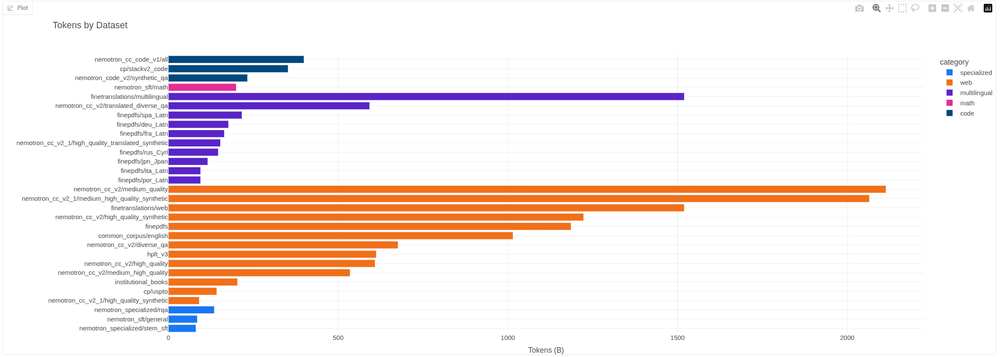
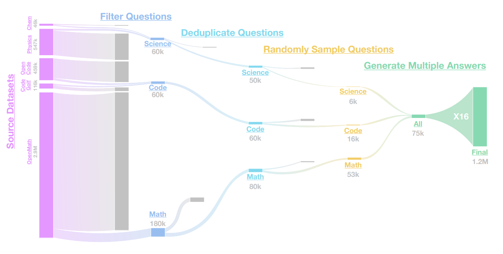
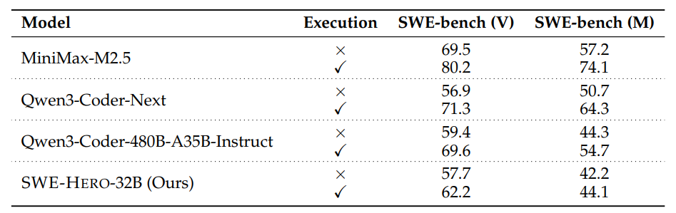
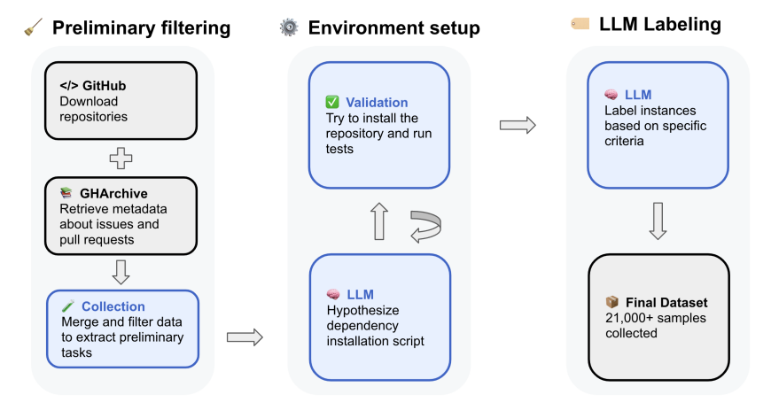

# 第 14 课：数据 II (Lecture 14: Data II)

上节课回顾：
- 在线服务（如 GitHub） → 转储/爬取（如 GitHub Archive） → 已处理数据（如 The Stack）
- 考量要素：服务条款、版权（许可协议或合理使用）

本节课内容：
- 数据流水线：转换 (transformation)、过滤 (filtering)、去重 (deduplication)、混合 (mixing)
- 中期训练 (Mid-training) + 监督微调 (SFT)：合成数据 (synthetic data)

```python
from dataclasses import dataclass
import numpy as np
import itertools
import mmh3
from edtrace.file_util import download_file
from edtrace import text, image, link
from lecture_13 import the_pile
from lecture_util import article_link, post_link
from references import dolma_2024, the_pile_2020, dclm_2024
```

```python
def transformation():
    text("Raw data does not come as text.")
    text("It is HTML, PDF (arxiv), or directories (code repositories).")

    text("HTML to text (main one):")
    text("- Remove boilerplate (e.g., navigation, ads) and extract content")
    text("- What about images, tables, etc.?")
    text("- Inherently lossy (need to linearize)")
    text("- Tools (rule-based): trafilatura, resiliparse, jusText, lynx, etc.")
    text("- Accuracy matters: "), link(dclm_2024)
    image("images/dclm-wet.png", width=300)

    text("FinePDFs "), post_link("https://huggingface.co/spaces/HuggingFaceFW/FinePDFsBlog")
    image("https://huggingfacefw-finepdfsblog.hf.space/_astro/pdf-description.Cb49jXc6_Z17eX4E.webp", width=600)
    text("- Source: Common Crawl")
    text("- Recrawl truncated PDFs (since they are big)")
    text("- OCR (RolmOCR) using a VLM or Docling (make these run fast)")
    text("- Lots of cleanup and filtering")
    text("- A lot of layout information is missing")


def filtering():
    text("Algorithmic building block:")
    text("- Given some **target data** T and lots of **raw data** R, find subset T' of R similar to T.")
    image("images/raw-target-schema.png", width=600)

    text("Applications:")
    text("- Language identification (English versus rest)")
    text("- Quality filtering (high quality versus low quality)")
    text("- Toxicity filtering (non-toxic versus toxic)")

    text("Desiderata for filtering algorithm:")
    text("- Generalize from the target data (want T and T' to be different)")
    text("- Extremely fast (have to run it on R, which is huge)")

    text("Survey paper on data selection "), link("https://arxiv.org/abs/2402.16827")

    text("General framework: Given target T and raw R, find subset of R similar to T")
    text("1. Estimate some model based on R and T and derive a scoring function")
    text("2. Keep examples in R based on their score")

    text("Types of classifiers:")
    text("- Generative model of T (KenLM): score(x) = p_T(x)")
    text("- Simple classifier (fastText): score(x) = p(T | x)")
    text("To use: keep examples x with score(x) >= threshold (stochastically)")

    text("Model-based filtering?")
    text("- Some deliberately do not use model-based filtering (C4, Gopher, RefinedWeb, FineWeb, Dolma)")
    text("- Some use model-based filtering (GPT-3, LLaMA, DCLM) [becoming the norm]")

    text("Language identification:")
    text("- Goal: find text of a specific language (e.g., English)")
    text("- fastText language identification "), article_link("https://fasttext.cc/docs/en/language-identification.html")
    text("- Off-the-shelf classifier")
    text("- Supports 176 languages")
    text("- Trained on multilingual sites: Wikipedia, Tatoeba (translation site) and SETimes (Southeast European news)")
    text("- Dolma keeps pages with p(English) >= 0.5 "), link(dolma_2024)

    text("OpenMathText "), link("https://arxiv.org/pdf/2310.06786")
    text("- Goal: curate large corpus of mathematical text from CommonCrawl")
    text("- Use rules to filter (e.g., contains latex commands)")
    text("- KenLM trained on ProofPile, keep if perplexity < 15000")
    text("- Trained fastText classifier to predict mathematical writing, threshold is 0.17 if math, 0.8 if no math")
    text("- Result: produced 14.7B tokens, used to train 1.4B models that do better than models trained on 20x data")

    # GPT-3 模型
    text("GPT-3 "), link("https://arxiv.org/pdf/2005.14165")  # Appendix A
    text("- Positives: samples from {Wikipedia, WebText2, Books1, Books2}")
    text("- Negatives: samples from CommonCrawl")
    text("Train linear classifier based on word features "), article_link("https://spark.apache.org/docs/latest/ml-features#tokenizer")
    text("Keep documents stochastically based on score")
    def keep_document(score: float) -> bool:
        return np.random.pareto(9) > 1 - score

    text("LLaMA/RedPajama "), link("https://arxiv.org/pdf/2302.13971")
    text("- Positives: samples from pages **referenced** by Wikipedia")
    text("- Negatives: samples from CommonCrawl")
    text("- Keep documents that are classified positive")

    text("phi-1 "), link("https://arxiv.org/pdf/2306.11644")
    text("- Philosophy: really high quality data (textbooks) to train a small model (1.5B)")
    text("- Includes synthetic data from GPT 3.5 (later: GPT-4) and filtered data")
    R = "Python subset of the Stack"   # 原始数据 (Raw data)
    prompt = "determine its educational value for a student whose goal is to learn basic coding concepts"
    T = "Use GPT-4 with this prompt to classify 100K subset of R to get positive examples"
    text("- Train random forest classifier on T using output embedding from pretrained codegen model")
    text("- Select data from R that is classified positive by the classifier")
    text("Result on [HumanEval](https://huggingface.co/datasets/openai_humaneval):")
    text("- Train 1.3B LM on Python subset of The Stack (performance: 12.19% after 96K steps)")
    text("- Train 1.3B LM on new filtered subset (performance: 17.68% after 36K steps) - better!")

    text("Toxicity filtering in Dolma "), link(dolma_2024)
    text("- Dataset: Jigsaw Toxic Comments dataset (2018) "), link(title="dataset", url="https://www.kaggle.com/datasets/julian3833/jigsaw-toxic-comment-classification-challenge")
    text("- Project goal: help people have better discussions online "), article_link("https://www.kaggle.com/competitions/jigsaw-toxic-comment-classification-challenge/discussion/46064")
    text("- Data: comments on Wikipedia talk page annotated with {toxic, severe_toxic, obscene, threat, insult, identity_hate}")

    text("Scale-dependent effects of filtering:")
    text("- No single optimal threshold for filtering")
    text("- If training for longer, want more (lower quality) data")
    text("- If training for shorter, want less (higher quality) data")
    image("images/data-filtering-scale.png", width=800)

    text("Summary:")
    text("- Filtering is critical for building a good model")
    text("- Recipe: define target data (what good looks like), extrapolate to raw data")
    

def deduplication():
    text("Two types of duplicates:")
    text("- Exact duplicates (mirror sites, GitHub forks) "), link(title="Gutenberg mirrors", url="https://www.gutenberg.org/MIRRORS.ALL")
    text("- Near duplicates: same text differing by a few tokens")

    text("Examples of near duplicates:")
    text("- Terms of service and licenses "), link(title="MIT license", url="https://opensource.org/license/mit")
    text("- Formulaic writing (copy/pasted or generated from a template) "), image("https://d3i71xaburhd42.cloudfront.net/4566c0d22ebf3c31180066ab23b6c445aeec78d5/5-Table1-1.png", width=600)
    text("- Minor formatting differences in copy/pasting")

    text("Product description repeated 61,036 times in C4")
    text("'“by combining fantastic ideas, interesting arrangements, and follow the current trends in the field of that make you more inspired and give artistic touches. We’d be honored if you can apply some or all of these design in your wedding.  believe me, brilliant ideas would be perfect if it can be applied in real and make the people around you amazed!")
    link(title="example page", url="https://www.amazon.co.uk/suryagede-100-Graffiti-Gas-Mask/dp/B07CRHT3RG")

    text("Deduplication training data makes language models better "), link("https://arxiv.org/pdf/2107.06499")
    text("- Train more efficiently (because have fewer tokens)")
    text("- Avoid memorization (can mitigate copyright, privacy concerns)")

    text("Design space:")
    text("1. What is an item (sentence, paragraph, document)?")
    text("2. How to match (exact match, existence of common subitem, fraction of common subitems)?")
    text("3. What action to take (remove all, remove all but one)?")

    text("Key challenge:")
    text("- Deduplication is fundamentally about comparing items to other items")
    text("- Need linear time algorithms to scale")

    hash_functions()
    exact_deduplication()
    jaccard_minhash()
    locality_sensitive_hashing()


def hash_functions():
    text("- Hash function h maps item to a hash value (integer or string)")
    text("- Hash value much smaller than item")
    text("- Hash collision: h(x) = h(y) for x ≠ y")

    text("Tradeoff between efficiency and collision resistance "),  article_link("https://softwareengineering.stackexchange.com/questions/49550/which-hashing-algorithm-is-best-for-uniqueness-and-speed")
    text("- Cryptographic hash functions (SHA-256): collision resistant, slow (used in bitcoin)")
    text("- DJB2, MurmurHash, CityHash: not collision resistant, fast (used for hash tables)")

    text("We will use MurmurHash:")
    h = mmh3.hash("hello")  # @inspect h


def exact_deduplication():
    text("**Simple example**")
    text("1. Item: string")
    text("2. How to match: exact match")
    text("3. Action: remove all but one")

    # 原始数据项
    items = ["Hello!", "hello", "hello there", "hello", "hi", "bye"]  # @inspect items

    # 计算哈希 -> 获得对应哈希值的数据项列表
    hash_items = itertools.groupby(sorted(items, key=mmh3.hash), key=mmh3.hash)

    # 从每个哈希分组中保留一个数据项
    deduped_items = [next(group) for h, group in hash_items]  # @inspect deduped_items

    text("- Pro: simple, clear semantics, high precision")
    text("- Con: does not deduplicate near duplicates")
    text("- This code is written in a MapReduce way, can easily parallelize and scale")

    text("**C4** "), link("https://arxiv.org/pdf/1910.10683v4")
    text("1. Item: 3-sentence spans")
    text("2. How to match: use exact match")
    text("3. Action: remove all but one")
    text("Warning: when a 3-sentence span is removed from the middle of a document, the resulting document might not be coherent")


def jaccard_minhash():
    text("Let's now look at approximate set membership.")
    text("First we need a similarity measure.")

    text("### Jaccard similarity")
    text("Definition: Jaccard(A, B) = |A intersect B| / |A union B|")
    A = {"1", "2", "3", "4"}
    B = {"1", "2", "3", "5"}

    def compute_jaccard(A, B):
        intersection = len(A & B)  # @inspect intersection
        union = len(A | B)  # @inspect union
        return intersection / union
    jaccard = compute_jaccard(A, B)  # @inspect jaccard

    text("Definition: two documents are **near duplicates** if their Jaccard similarity >= threshold")

    text("Algorithentric challenge: find near duplicates in linear time")

    text("### MinHash")
    text("MinHash: a random hash function h so that Pr[h(A) = h(B)] = Jaccard(A, B)")

    text("Normally, you want different items to hash to different hashes")
    text("...but here, you want collision probability to depend on similarity")

    def minhash(S: set[str], seed: int):
        return min(mmh3.hash(x, seed) for x in S)

    text("Characteristic matrix representation:")
    text("item | A | B", verbatim=True)
    text("1    | 1 | 1", verbatim=True)
    text("2    | 1 | 1", verbatim=True)
    text("3    | 1 | 1", verbatim=True)
    text("4    | 1 | 0", verbatim=True)
    text("5    | 0 | 1", verbatim=True)

    text("Random hash function induces a permutation over items")
    text("Look at which item is first in A and which item is first in B.")
    text("Each item has the same probability as being first (min)")
    text("- If 1, 2, 3 is first, then first in A = first in B.")
    text("- If 4, 5 is first, then first in A ≠ first in B.")

    # 验证 MinHash 如宣称的那样近似 Jaccard 相似度
    n = 100  # 生成这么多个随机哈希函数
    matches = [minhash(A, seed) == minhash(B, seed) for seed in range(n)]  # @stepover
    estimated_jaccard = len([m for m in matches if m]) / len(matches)  # @inspect estimated_jaccard
    assert abs(estimated_jaccard - jaccard) < 0.01

    text("Now we can hash our items, but a collision doesn't tell us Jaccard(A, B) > threshold.")


def locality_sensitive_hashing():
    text("Locality sensitive hashing (LSH) "), link(title="book chapter", url="http://infolab.stanford.edu/~ullman/mmds/ch3n.pdf")

    text("Suppose we hash examples with just one MinHash function")
    text("P[A and B collide] = Jaccard(A, B)")
    text("On average, more similar items will collide, but very stochastic...")

    text("Goal: have A and B collide if Jaccard(A, B) > threshold")
    text("We have to somehow sharpen the probabilities...")

    text("Solution: use n hash functions")
    text("Break up into b bands of r hash functions each (n = b * r)")

    n = 12      # 哈希函数总数
    b = 3       # 分段 (bands) 数
    r = 4       # 每个分段中的哈希函数个数
    text("Hash functions:")
    text("h1 h2 h3 h4  |  h5 h6 h7 h8  |  h9 h10 h11 h12", verbatim=True)

    text("Key: A and B collide if for *some* band, *all* its hash functions return same value")
    text("As we will see, the and-or structure of the bands sharpens the threshold")

    text("Given Jaccard(A, B), what is the probability that A and B collide?")

    def get_prob_collision(sim, b, r):  # @inspect sim @inspect b @inspect r
        prob_match = sim ** r                        # 某个特定的 band 匹配的概率  @inspect prob_match
        prob_collision = 1 - (1 - prob_match) ** b   # 至少有一个 band 匹配的概率  @inspect prob_collision
        return prob_collision

    text("**Example**")
    prob_collision = get_prob_collision(sim=0.8, b=5, r=10)  # @inspect prob_collision
    image("https://cdn.sanity.io/images/vr8gru94/production/b470799575b8e77911bacb8500977afef06d6c85-1280x720.png", width=600)

    sims = [0.7, 0.75, 0.8, 0.85, 0.9, 0.95, 0.98]
    probs = {sim: get_prob_collision(sim=sim, b=10, r=10) for sim in sims}  # @inspect probs @stepover

    text("Increasing r sharpens the threshold and moves the curve to the right (harder to match)")
    probs = {sim: get_prob_collision(sim=sim, b=10, r=20) for sim in sims}  # @inspect probs @stepover

    text("Increasing b moves the curve to the left (easier to match)")
    probs = {sim: get_prob_collision(sim=sim, b=20, r=20) for sim in sims}  # @inspect probs @stepover
    image("https://cdn.sanity.io/images/vr8gru94/production/aace49fa240778e8ecf6e85ad08a2de7f5385566-1280x720.png", width=600)

    text("Example setting "), link("https://arxiv.org/pdf/2107.06499"), text(": n = 9000, b = 20, r = 450")
    b = 20
    r = 450
    text("What is the threshold (where the phase transition happens)?")
    threshold = (1 / b) ** (1 / r)  # @inspect threshold

    text("Probability that a fixed band matches:")
    prob_match = (1 / b)  # @inspect prob_match
    text("Probability that A and B collide is a constant (≈ 1-1/e):")
    prob_collision = 1 - (1 - 1 / b) ** b  #  @inspect prob_collision


def billion(x):
    return x * 10**9

def trillion(x):
    return x * 10**12


def data_mixing():
    text("Recall that language models are trained on multiple data sources.")

    text("Datasets in Marin: "), link(title="token viewer", url="https://huggingface.co/spaces/marin-community/token-count-viewer")
    image("images/marin-token-viewer.png", width=800)

    text("The Pile "), link(the_pile_2020)
    image("https://stanford-cs324.github.io/winter2022/lectures/images/the-pile.png", width=600)
    text("Key question: what distribution over the data sources should we use?")

    text("Example:")
    sources = {"Wikipedia", "CC", "GitHub"}
    p = {"Wikipedia": 0.3, "CC": 0.5, "GitHub": 0.2}  # 一种可能的数据混合比例

    text("Baselines:")
    text("- Vibes: set p(s) manually based on intuition (quite common)")
    text("- Uniform sampling: sample uniformly (p(s) ∝ 1)")
    text("- Proportional mixing: sample proportional to the number of tokens in a source (p(s) ∝ num_tokens(s))")

    text("Intuition: should upweight higher quality sources")
    text("However...")
    text("1. We want to ensure diversity (e.g., across incomparable sources: literature, code, papers)")
    text("2. Each source is finite, so if put too much weight on a small source, then need to epoch over it")
    
    text("This last point is important and a bit subtle.")
    text("Example:")
    source_token_counts = { 
        "low": trillion(10),  # 10T tokens（丰富） @stepover
        "high": billion(10),  # 10B tokens（稀缺） @stepover
    }
    p = {"low": 0.5, "high": 0.5}  # 天真的数据混合方案
    train_tokens = trillion(1)  # 训练 1T token @stepover
    low_num_epochs = (p["low"] * train_tokens) / source_token_counts["low"]  # @inspect low_num_epochs
    high_num_epochs = (p["high"] * train_tokens) / source_token_counts["high"]  # @inspect high_num_epochs
    text("50x epochs on high quality data...can lead to overfitting!")

    text("UniMax "), link("https://arxiv.org/abs/2304.09151")
    text("- Setting: balancing different languages for multilingual models")
    text("- Previous work: between uniform and proportional mixing (p(s) ∝ num_tokens(s)^α for α in [0, 1])")
    text("- Idea: sample sources uniformly but with a hard **cap** C on number of epochs for any source")
    text("- Specifically, p(s) * num_training_tokens ≤ C for all sources s")

    text("Regression-based mixing "), link("https://arxiv.org/abs/2407.01492"), link("https://arxiv.org/pdf/2602.12237")
    image("images/regmix.png", width=700)
    text("- Define distribution over mixtures `p` (e.g., Dirichlet) ")
    text("- Define regression method (e.g., linear, gradient boosted trees)")
    text("- Define target based on downstream evals (careful not to overfit!)")
    text("- Discrepancy between small and large scale (tradeoff cost and accuracy)")
    image("images/data-mixing-methods.png", width=700)
    text("Hope 1: regression model is accurate at minimizer 🙏")
    text("Hope 2: optimal data mixtures transfer from small to large scale 🙏")

    text("Hold on. There's at least one scale-dependent effect:")
    source_token_counts = { 
        "low": trillion(10),  # 10T tokens（丰富） @stepover
        "high": billion(10),  # 10B tokens（稀缺） @stepover
    }
    text("- If train small models on low token counts:")
    p = {"low": 0.1, "high": 0.9}  # 给高质量数据分配更多权重
    text("- But if train large model on this mixture, we will epoch a ton on high quality data and overfit!")

    text("Simulated epoching "), link("https://arxiv.org/pdf/2501.11747")
    text("- General idea: make small scale look like large scale (general theme of this course)")
    text("- Instantiation: downsample all sources proportionally")
    small_run_tokens = billion(10)  # @stepover
    large_run_tokens = trillion(1)  # @stepover
    ratio = small_run_tokens / large_run_tokens  # @inspect ratio
    downsampled_source_token_counts = {s: count * ratio for s, count in source_token_counts.items()}  # @inspect downsampled_source_token_counts
    text("- In this downsampled mixture, models that epoch too much won't look good.")
    text("- So the optimum will be more balanced.")
    p = {"low": 0.7, "high": 0.3}  # More mass on high quality data

    text("Summary:")
    text("- Problem: how to weight different data sources (e.g., Wikipedia, general, code)")
    text("- Regression-based mixing: estimate mixture → loss at small scale, optimize (analogous to scaling laws)")
    text("- Important consideration: epoching and overfitting (solution: cap or simulated)")


def post_training_data():
    text("Recipe:")
    text("1. Define a set of environments")
    text("2. Define a set of tasks / prompts")
    text("3. Collect responses from a strong model (teacher)")

    text("OpenThoughts "), link("https://arxiv.org/abs/2506.04178")
    text("- 1.2M examples using QwQ-32B as a teacher")
    text("- Questions come from 27 human and synthetic sources (e.g., StackExchange, NuminaMath, Chemistry)")
    image("images/openthoughts-sources.png", width=500)
    text("- Sampling multiple (16) responses per prompt is helpful")
    text("- Better models aren't necessarily better teachers: QwQ-32B is a better teacher than DeepSeek-R1")
    text("- Answer filtering wasn't helpful")
    text("- Smaller high quality sources (e.g., OpenMath-2-Math) is better than large diverse sources")
    image("images/openthoughts-pipeline.png", width=600)

    text("SWE-smith "), link("https://arxiv.org/abs/2504.21798")
    image("images/swe-smith.png", width=500)
    text("- Given a repository, use LM to generate tasks (introduce bugs with LM)")
    text("- 128 GitHub repositories yields 50K tasks")

    text("SWE-Zero "), link("https://arxiv.org/abs/2604.01496")
    text("- SWE tasks have heavy dependencies (unlike math or coding contests)")
    text("- Setting up thousands of Docker images is an infrastructural nightmare")
    text("- Observation: strong models can solve many tasks without execution feedback")
    image("images/swezero-noexec.png", width=600)
    text("Key: strong models have internal \"world model\" of code semantics")
    text("- SWE-Zero: 300K agent trajectories that don't require repository-specific execution")
    text("- 150K GitHub PRs")
    text("- OpenHands scaffold, remove future git commits to prevent \"git hacking\" by agent")
    image("images/swezero-prompt.png", width=600)
    text("- Distilled from Qwen3-Coder-480B + filtering (try to execute anyway)")
    text("- SWE-Hero: 13K agent trajectories that do require execution feedback")
    image("images/swezero-results.png", width=700)

    text("SWE-rebench "), link("https://arxiv.org/pdf/2505.20411")
    text("- 21K interactive Python SWE tasks from 3.4K GitHub repositories")
    text("- 450K PRs from GitHub and GitHub Archive")
    text("- Used Qwen 2.5-72B-Instruct to install dependencies and assess PR quality")
    image("images/swe-rebench.png", width=600)

    text("SWE-ZERO-12M-trajectories "), link(title="data", url="https://huggingface.co/datasets/AlienKevin/SWE-ZERO-12M-trajectories")
    text("- Scale SWE-Zero up to 12M agent trajectories")
    text("- Used the SWE-rebench-v2 tasks (32K executable tasks + 120K nonexecutable tasks)")
    text("- Ran mini-coder-1.7b (very small model, 50.4 pass@100), mini-swe-agent scaffold")
    text("- [Example](https://huggingface.co/datasets/AlienKevin/SWE-ZERO-12M-trajectories/viewer/default/train?row=5&conversation-viewer=0)")

    text("Summary:")
    text("- Generating prompts: fully-synthetic, semi-synthetic (real environment + synthetic tasks), real (GitHub PRs)")
    text("- Responses: from capable models (that are also good teachers)")
    text("- Code environments are painful")
    text("- Lots of filtering and other details")
```

## 提取与数据转换 (Transformation)

```python
transformation()
```

原始数据并不是以纯文本形式存在的。
它是 HTML、PDF（arXiv）或目录结构（代码仓库）。

HTML 转换为文本（最主要的任务）：
- 移除模板、噪点（例如导航栏、广告等）并提取主要内容
- 如何处理图像、表格等？
- 转换过程本质上是有损的（需要将结构化内容线性化）
- 转换工具（基于规则）：trafilatura、resiliparse、jusText、lynx 等。
- 提取准确率非常关键：[[DCLM 2024 论文]](https://arxiv.org/abs/2406.11794)


FinePDFs [post](https://huggingface.co/spaces/HuggingFaceFW/FinePDFsBlog)

- 数据来源：Common Crawl
- 重新爬取截断的 PDF（因为 PDF 文件通常很大）
- 使用 VLM 或 Docling 进行 OCR（RolmOCR）（并提高它们的运行速度）
- 大量的清理和过滤工作
- 丢失了大量的页面版式排版信息

## 数据过滤 (Filtering)

```python
filtering()
```

算法构建模块：
- 给定一些**目标数据** T 和大量的**原始数据** R，寻找 R 的子集 T' 使其与 T 相似。


应用场景：
- 语言识别（英语 vs 其他语言）
- 质量过滤（高质量 vs 低质量）
- 毒性过滤（无毒 vs 有毒）

过滤算法的考量点：
- 从目标数据中泛化（希望 T 和 T' 是不同的）
- 极快地运行（必须在庞大的原始数据 R 上运行）

数据选择综述论文 [https://arxiv.org/abs/2402.16827](https://arxiv.org/abs/2402.16827)

通用框架：给定目标 T 和原始 R，寻找与 T 相似的 R 的子集
1. 基于 R 和 T 估计出某种模型，并推导出评分函数
2. 根据得分保留 R 中的样本

分类器类型：
- T 的生成模型 (KenLM)：score(x) = p_T(x)
- 简单分类器 (fastText)：score(x) = p(T | x)
使用方法：以一定的概率保留得分 score(x) >= threshold（阈值）的样本 x

是否使用基于模型的过滤？
- 一些模型刻意不使用基于模型的过滤（C4, Gopher, RefinedWeb, FineWeb, Dolma）
- 一些模型使用基于模型的过滤（GPT-3, LLaMA, DCLM） [这正成为行业常态]

语言识别：
- 目标：寻找特定语言的文本（如英语）
- fastText 语言识别 [[文档]](https://fasttext.cc/docs/en/language-identification.html)
- 开箱即用的分类器
- 支持 176 种语言
- 在多语言网站上训练：维基百科、Tatoeba（翻译网站）和 SETimes（东南欧新闻）
- Dolma 保留 p(English) >= 0.5 的页面 [[Dolma 2024]](https://arxiv.org/abs/2402.00159)

OpenMathText [https://arxiv.org/pdf/2310.06786](https://arxiv.org/pdf/2310.06786)
- 目标：自 CommonCrawl 中筛选出大型数学文本语料库
- 使用启发式规则进行过滤（例如，包含 LaTeX 命令）
- 在 ProofPile 上训练 KenLM 模型，保留 perplexity < 15000 的页面
- 训练 fastText 分类器以预测是否是数学内容，如果是数学文本则阈值设为 0.17，如果不是数学文本则设为 0.8
- 结果：产出了 14.7B token，用于训练 1.4B 参数的模型，其表现好于在 20 倍数据上训练的模型

GPT-3 [https://arxiv.org/pdf/2005.14165](https://arxiv.org/pdf/2005.14165) (附录 A)
- 正样本：自 {Wikipedia, WebText2, Books1, Books2} 采样的样本
- 负样本：自 CommonCrawl 采样的样本
基于单词特征训练线性分类器 [[Spark ML 特征提取文档]](https://spark.apache.org/docs/latest/ml-features#tokenizer)
根据得分以一定概率保留文档（随机采样）：
```python
def keep_document(score: float) -> bool:
    return np.random.pareto(9) > 1 - score
```

LLaMA/RedPajama [https://arxiv.org/pdf/2302.13971](https://arxiv.org/pdf/2302.13971)
- 正样本：被维基百科**引用**的页面中的样本
- 负样本：自 CommonCrawl 采样的样本
- 保留被分类器预测为正样本的页面

phi-1 [https://arxiv.org/pdf/2306.11644](https://arxiv.org/pdf/2306.11644)
- 哲学：使用极高质量的数据（教科书）来训练一个小模型 (1.5B)
- 包含来自 GPT 3.5（后续使用 GPT-4）生成的合成数据以及经过清洗过滤的数据
- R = "Python subset of the Stack"（原始数据）
- 提示词：“判定其对于一个想学习基础编程概念的学生的教育价值”
- T = 使用 GPT-4 配合此提示词对 R 的 10 万个样本子集进行分类，从而获得正样本
- 在 T 上利用预训练代码生成模型的输出嵌入（embedding）训练随机森林分类器
- 选择 R 中被分类器判定为正样本的数据
在 [HumanEval](https://huggingface.co/datasets/openai_humaneval) 上的结果：
- 在 The Stack 的 Python 子集上训练 1.3B 语言模型（训练 96K 步后表现为：12.19%）
- 在过滤后的全新子集上训练 1.3B 语言模型（训练 36K 步后表现为：17.68%）——效果大为提升！

Dolma 中的毒性内容过滤 [[Dolma 2024]](https://arxiv.org/abs/2402.00159)
- 数据集：Jigsaw Toxic Comments dataset (2018) [[Jigsaw 比赛数据集]](https://www.kaggle.com/datasets/julian3833/jigsaw-toxic-comment-classification-challenge)
- 项目目标：帮助人们在网络上进行更好的讨论 [[Jigsaw 赛后讨论]](https://www.kaggle.com/competitions/jigsaw-toxic-comment-classification-challenge/discussion/46064)
- 数据：维基百科讨论页上的评论，被标注为 {toxic（有毒）, severe_toxic（剧毒）, obscene（淫秽）, threat（威胁）, insult（侮辱）, identity_hate（身份仇恨）}

过滤中与规模相关的效应：
- 不存在单一的过滤最佳阈值
- 如果要训练更长时间，需要更多（较低质量）的数据
- 如果要缩短训练时间，需要更少（较高质量）的数据


总结：
- 数据过滤对于训练一个优秀模型而言至关重要
- 配方：定义目标数据（明确好的数据长什么样），将其规律外推应用到原始海量数据上

## 数据去重 (Deduplication)

```python
deduplication()
```

两类重复内容：
- 精确重复（镜像网站、GitHub 分支仓库） [[古登堡镜像列表]](https://www.gutenberg.org/MIRRORS.ALL)
- 近似重复：内容相同，但有极少数字符/格式上的差异

近似重复的例子：
- 服务条款与开源许可证 [[MIT 许可协议]](https://opensource.org/license/mit)
- 模版化/程式化的写作内容（复制/粘贴，或从模版生成）
- 复制/粘贴过程中引入的微小格式差异

在 C4 中，一段商品描述被重复了 61,036 次：
“通过结合奇妙的想法、有趣的安排，并紧跟该领域的当前趋势，让您更有灵感，并赋予艺术触觉。我们很荣幸能将这些设计的部分或全部应用到您的婚礼中。相信我，绝妙的创意如果能应用到实际中，并让周围的人感到惊讶，那就太完美了！” [[亚马逊商品页面]](https://www.amazon.co.uk/suryagede-100-Graffiti-Gas-Mask/dp/B07CRHT3RG)

训练数据去重可以使语言模型表现更佳 [https://arxiv.org/pdf/2107.06499](https://arxiv.org/pdf/2107.06499)
- 更高效地训练（因为要处理的 token 总数变少）
- 避免 verbatim 记忆（这有助于缓解版权和隐私安全隐患）

设计空间：
1. 去重的基本单元是什么（句子、段落、整篇文档）？
2. 如何判定匹配（精确匹配、存在公共子单元、公共子单元的比例）？
3. 采取什么去重动作（删除全部、仅保留一个）？

核心挑战：
- 去重从根本上说是比对每个数据项与其他所有数据项
- 为了扩展到海量数据集，我们需要线性时间复杂度的算法

去重相关技术（在接下来的代码单元中展现）：哈希函数、精确去重、Jaccard 相似度与 MinHash，以及局部敏感哈希 (LSH)。

## 局部敏感哈希与去重算法 (LSH & MinHash)

```python
# 1. 哈希函数基础
hash_functions()
# 2. 精确匹配去重
exact_deduplication()
# 3. Jaccard 相似度与 MinHash 模拟
jaccard_minhash()
# 4. 局部敏感哈希 (LSH) 原理与分段效应
locality_sensitive_hashing()
```

哈希去重技术的关键点：

- 哈希函数 h 将长文本映射到较小的哈希值。我们需要快速且碰撞率低的哈希函数（如 MurmurHash，而非慢速的安全加密哈希如 SHA-256）。
- 精确去重无法过滤近似重复。在 C4 中，去重采用 3 个句子的滑动窗口精确去重，这有时会导致被截断文档失去连贯性。
- Jaccard 相似度度量集合重叠度：Jaccard(A, B) = |A ∩ B| / |A ∪ B|。Jaccard 相似度 >= 阈值即可认定为近似重复。
- **MinHash** 是一种极其巧妙的哈希方式，它使得两个集合发生哈希碰撞的概率刚好等于它们的 Jaccard 相似度：Pr[h(A) = h(B)] = Jaccard(A, B)。
- **局部敏感哈希 (LSH)** [[书籍章节]](http://infolab.stanford.edu/~ullman/mmds/ch3n.pdf) 通过 AND-OR 构造对概率曲线进行“陡峭化”处理。通过将 n 个哈希函数划分为 b 个 band，每个 band 包含 r 个哈希函数 (n = b * r)，规定 A 和 B 发生碰撞的条件为：*在某个 band 中，其所含的所有 r 个哈希函数值都完全相同*。
- 此时碰撞的概率为：1 - (1 - s^r)^b，其中 s 为 Jaccard 相似度。该函数呈现 S 型曲线，在特定阈值 (1/b)^(1/r) 处发生相变（即过滤分界点）。
- 增加 r 会提高匹配门槛，使曲线向右移动；增加 b 会放宽匹配门槛，使曲线向左移动。

## 数据混合 (Data mixing)

```python
data_mixing()
```

语言模型往往是在多个混合的数据源上训练的。

Marin 中的数据集分布：[[Token 统计查看器]](https://huggingface.co/spaces/marin-community/token-count-viewer)


The Pile [[论文]](https://arxiv.org/pdf/2101.00027.pdf)

核心问题：我们应当在不同数据源上采用怎样的概率分布进行混合采样？

基线方案：
- 凭直觉 (Vibes)：人工设定比例，在行业中很常见
- 均匀采样 (Uniform sampling)：不同数据源均匀分布 (p(s) ∝ 1)
- 按比例混合 (Proportional mixing)：采样权重正比于该数据源的 token 数量 (p(s) ∝ num_tokens(s))

直觉上，应当对高质量数据源进行上采样（增加权重）。
然而：
1. 必须确保多样性（兼顾无法互相替代的内容：文学、代码、学术论文等）
2. 每一个数据源是有限的。若给一个小规模的高质量数据源分配过大权重，会导致在训练中对其进行过多的轮数迭代 (epochs)，从而产生过拟合 (overfitting)。

UniMax [https://arxiv.org/abs/2304.09151]
- 场景：在多语言模型中平衡不同的语言数据
- 先前工作：在均匀和按比例混合之间做折中 (p(s) ∝ num_tokens(s)^α，α 取值 0 到 1)
- 核心想法：均匀采样，但在任意数据源的迭代轮数上设置硬性上限 **cap** C。
- 具体而言，需满足 p(s) * num_training_tokens ≤ C (对于所有数据源 s)。

基于回归的混合策略 [https://arxiv.org/abs/2407.01492] | [https://arxiv.org/pdf/2602.12237]

- 定义关于混合比例 `p` 的分布（例如狄利克雷分布, Dirichlet）
- 定义回归方法（如线性回归、梯度提升树）
- 基于下游评估设定目标函数（注意防止测试集泄露和过拟合！）
- 考量小规模训练与大规模训练之间的差异（权衡训练成本与最终准确率）

- 期望 1：回归模型在极小值点处是准确的
- 期望 2：最优的混合比例在小规模和大规模之间可以良好地外推/迁移

但是，这里存在一个与规模相关的关键效用（如我们在代码中所模拟的）：
- 在小参数模型上做少 token 的数据混合测试时，小规模高质量数据的高权重（如 90%）看起来效果很好。
- 但若以此比例训练千亿级大模型（消耗数十万亿 token），会导致对高质量数据的过度迭代与灾难性过拟合。

模拟迭代法 (Simulated epoching) [https://arxiv.org/pdf/2501.11747]
- 核心想法：使小规模实验在迭代效应上看起来与大规模训练相似
- 实例化：将所有数据源等比例下采样 (Downsample)，在此下采样的混合测试中，那些过度迭代的数据混合方案在小模型上就会表现不佳，从而使筛选出来的最佳比例大体平衡且可直接迁移到大模型上。

## 后期训练与合成数据 (Post-training & Synthetic Data)

```python
post_training_data()
```

通用方案：
1. 定义一系列运行环境
2. 定义一系列任务/提示词 (Prompts)
3. 从性能强大的语言模型（教师模型，Teacher）中收集回复

OpenThoughts [https://arxiv.org/abs/2506.04178]
- 使用 QwQ-32B 作为教师生成了 120 万个样本
- 问题源自 27 个真实和合成数据源（例如 StackExchange, NuminaMath, 化学等）

- 针对每个提示词进行多次采样（如 16 次回复）能提供更好的数据质量
- 能力更强的模型不一定就是更好的“教师模型”：例如，QwQ-32B 生成用于训练的 CoT 轨迹效果好于 DeepSeek-R1
- 简单的过滤答案机制没有带来显著帮助
- 小规模、高针对性的高质量源（如 OpenMath-2-Math）效果好于大规模的杂乱多样化数据源


SWE-smith [https://arxiv.org/abs/2504.21798]

- 给定一个代码仓库，利用大模型自动注入 Bug 以生成相关的开发/修复任务
- 128 个 GitHub 仓库产出了 5 万个任务

SWE-Zero [https://arxiv.org/abs/2604.01496]
- 软件开发（SWE）任务往往有非常复杂的环境依赖（不同于独立的数学或算法竞赛题）
- 为成千上万个任务构建对应的 Docker 镜像是极其繁重的工程灾难
- 关键发现：足够强大的模型可以在不进行代码执行与反馈的情况下，直接解决许多软件工程任务

核心：强大的模型在内部建立了关于代码语义的“世界模型”
- SWE-Zero：产生了 30 万条不需要针对特定仓库运行代码执行反馈的智能体轨迹
- 来自 15 万个真实的 GitHub PRs
- 采用 OpenHands 智能体脚手架，并在轨迹中删除了未来的 Git commit 信息以防智能体投机取巧

- 从 Qwen3-Coder-480B 蒸馏并做后续过滤
- SWE-Hero：包含 1.3 万条需要代码执行与反馈的智能体轨迹


SWE-rebench [https://arxiv.org/pdf/2505.20411]
- 包含源自 3400 个 GitHub 仓库的 2.1 万个交互式 Python 软件工程任务
- 从 GitHub 和 GitHub Archive 中收集了 45 万个 PRs
- 使用 Qwen 2.5-72B-Instruct 自动配置依赖环境并对 PR 质量进行评估分档


SWE-ZERO-12M-trajectories [[HuggingFace 数据集]](https://huggingface.co/datasets/AlienKevin/SWE-ZERO-12M-trajectories)
- 将 SWE-Zero 的规模扩大到了 1200 万条智能体运行轨迹
- 采用了 SWE-rebench-v2 任务（包括 3.2 万个可执行任务 + 12 万个非可执行任务）
- 运行 mini-coder-1.7b（一个小参数模型）以及 mini-swe-agent 脚手架产出轨迹
[数据集示例](https://huggingface.co/datasets/AlienKevin/SWE-ZERO-12M-trajectories/viewer/default/train?row=5&conversation-viewer=0)

总结：
- 提示词生成包含：完全合成、半合成（在真实环境基础上由大模型生成任务）和真实源（GitHub 真实的 PRs）
- 回复：来自具有强大推理能力且适合作为“教师”的模型
- 代码执行环境的自动搭建与评测在实践中极其痛苦和复杂
