```python
from dataclasses import dataclass
import numpy as np
import itertools
import mmh3
```

# 第 14 讲：数据处理与提纯管线 (Data II: Processing Pipeline)

> 核心议题：从万亿级原始互联网网页到干净的模型输入，如何设计并实现转换 (Transformation)、质量过滤 (Filtering)、模糊去重 (Deduplication) 与数据混合 (Data Mixing)？

> [!TIP]
> **前置学习指引：建议对照 [Lecture 13 (预训练数据 I——来源与版权)](file:///home/blybq/code-project/cs336/lectures/lecture_13.md) 配合学习**
> 
> * **课程脉络承接**：本讲（Lecture 14: 数据处理与提纯管线）是 **Lecture 13（Data I: 来源、版权与行业经典数据集）的微观算法实现篇与工程纵深篇**。Lecture 13 解决了“数据从何而来与合规边界”的宏观资产问题，本讲则彻底拆解“如何将海量原始数据提炼为可用模型输入”的底层算法与工程管线。
> * **核心前置概念与关键点映射**：
>   1. **原始网页抓取 $\rightarrow$ 正文抽取 (Transformation)**：Lecture 13 介绍了 Common Crawl 原始归档（WARC/WET）的组织方式；本讲进一步纵深展开如何剥离导航栏、广告噪点，利用 `trafilatura` 等工具将树状 DOM 转换为线性纯文本；
>   2. **质量过滤与启发式规则 (Quality Filtering)**：Lecture 13 介绍了 CCNet（KenLM 困惑度过滤）、GPT-3（优质网页分类器降采样）与 MassiveText（Gopher 启发式规则）；本讲则对其进行系统算法抽象，深入剖析启发式规则、FastText 质量判别器，并给出采用帕累托（Pareto）分布实现软性拒绝采样的数学证明；
>   3. **海量语料的高效去重 (Deduplication)**：Lecture 13 在 C4（行级去重）、RefinedWeb（文档级 MinHash）与 The Stack（代码去重）中均指出去重对防范记忆化的重要性；本讲系统推导了 MapReduce 懒计算精确去重，并严格证明了 MinHash 特征矩阵与局部敏感哈希（LSH）分带降维的数学机理；
>   4. **多源数据混合与重复轮数陷阱 (Data Mixing & Epochs)**：Lecture 13 展示了 GPT-3 与 LLaMA 凭人工经验设定的多源配比；本讲则彻底升级为算法求解，详细剖析了 UniMax 轮数硬上限注水算法、RegMix 基于回归模型的小算力代理外推，以及 Simulated Epoching 物理降采样解决轮次倒挂的本质；
>   5. **后训练对齐与高质量长轨迹合成 (Post-Training Synthetic Data)**：Lecture 13 提出了预训练、中期训练与后训练（SFT/RLHF）的三阶段演进；本讲则深入最前沿技术纵深，系统剖析 OpenThoughts 思维链多样性采样、SWE-smith 任务合成、SWE-Zero 免沙盒世界模型推演以及 SWE-rebench/12M 智能体扩展定律。
> * **学习建议**：学习本讲算法与推导时，若对 Common Crawl 组织格式、各代经典数据集（C4/RefinedWeb/Dolma/DCLM）的演进历史或数据治理背景有所遗忘，随时翻阅对照 Lecture 13 对应章节，能建立起从“宏观数据资产”到“微观算法实现”的完整工程认知体系。

### 上讲内容回顾

- **数据溯源**：在线服务 $\rightarrow$ 原始抓取归档 $\rightarrow$ 加工清洗后的规整语料库
- **核心考量**：服务条款限制、知识产权保护与合理使用抗辩

### 本讲核心内容

- **数据核心处理管线**：格式转换 (Transformation)、质量过滤 (Filtering)、模糊去重 (Deduplication)、数据混合 (Data Mixing)
- **中期训练与后训练**：合成数据 (Synthetic Data) 的构建与利用

## 数据转换与提取 (Transformation)

原始数据并非现成的纯文本：它们以复杂的 **HTML 网页**、**PDF 论文/图书** 或 **Git 代码仓库目录树** 的形式存在。

原始文件通常是 HTML 网页结构、arXiv PDF 论文排版或包含多层级子目录的代码仓库。

### HTML 转纯文本 (核心转换任务)

- **主体抽取**：剥离导航栏、页脚版权、广告弹窗与侧边栏无用噪声，精准提取网页正文
- **非纯文本元素**：如何线性化处理复杂多维表格、图片说明与数学公式？
- **信息损失**：将树状 DOM 结构压缩为一维线性文本必然伴随着排版信息的丢失
- **经典解析工具**：`trafilatura`、`resiliparse`、`jusText`、`lynx` 等开源解析库
- **正文提取质量至关重要**：[dclm_2024](https://arxiv.org/abs/2406.11794)

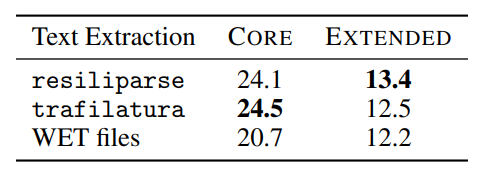

FinePDFs [相关帖子](https://huggingface.co/spaces/HuggingFaceFW/FinePDFsBlog)


- 数据源：从 Common Crawl 全量网页归档中提取的海量 PDF 文件
- 针对因体积过大被默认截断的 PDF 启动二次完整重抓
- 利用轻量化视觉语言模型 (VLM) 或 Docling 算子进行高精度文档 OCR 与公式表格重构
- 结合后处理过滤掉乱码页、扫描水印与缺失排版的残卷
- 尽最大可能保留双栏排版、分节标题与多级引用结构

## 质量与内容过滤 (Filtering)

### 核心算法问题定义

> **数学抽象**：给定小规模的高质量**目标数据** $T$（如维基百科、高质量教科书）和海量的**原始数据** $R$（如 Common Crawl），设计算法从 $R$ 中筛选出在分布上最接近 $T$ 的优质子集 $T'$。


三大核心应用场景：

1. **语言识别 (Language ID)**：筛选特定目标语言（如英语或中文），剔除乱码与小语种噪声
2. **质量过滤 (Quality Filtering)**：区分行文流畅的高质量正文与低劣机器生成垃圾内容
3. **毒性过滤 (Toxicity Filtering)**：识别并剔除色情、仇恨言论、极端暴力等有害信息

过滤算法的核心设计诉求：

- **泛化能力**：既要学到 $T$ 的高质量特征，又要避免仅仅死记硬背 $T$ 的字面内容，允许筛选出新颖多样的数据 $T'$
- **极致吞吐速度**：算法必须具备极高的单核吞吐量，以处理几十甚至上百 TB 的海量原始数据 $R$

数据选择算法综述文献：[https://arxiv.org/abs/2402.16827](https://arxiv.org/abs/2402.16827)

### 通用过滤框架与打分函数设计

1. 基于目标集 $T$ 与原始集 $R$ 训练统计或轻量机器学习模型，导出打分函数 $\text{score}(x)$
2. 根据得分 $\text{score}(x)$ 设定阈值或采用概率采样保留优质文档

常用的分类器类型：

- **生成式 N-gram 语言模型 (如 KenLM)**：以文本在高质量集 $T$ 上的困惑度作为打分：$\text{score}(x) = p_T(x)$
- **判别式线性分类器 (如 fastText)**：计算文本属于高质量类的后验概率：$\text{score}(x) = p(T \mid x)$
- 使用方式：根据得分硬性截断 $\text{score}(x) \ge \tau$ 或根据打分进行帕累托随机采样。

### 基于模型的过滤在各大模型中的演进

- **坚持纯规则过滤**（担心模型偏见导致多样性骤降）：C4、Gopher、RefinedWeb、FineWeb、Dolma
- **引入分类模型过滤**（大幅提升预训练效率）：GPT-3、LLaMA、DCLM（*已成为行业主流趋势*）

### 语言识别实战 (Language Identification)

- 目标：精准识别并提取出特定语言的文本
- fastText language identification [相关文章](https://fasttext.cc/docs/en/language-identification.html)
- 开箱即用的预训练线性轻量模型，单 CPU 核心每秒可处理数十万字
- 原生支持 176 种全球语言的精准判别
- 训练集：基于维基百科、Tatoeba 翻译库以及东南欧新闻网的多语言语料训练
- Dolma 数据集仅保留判别为英语概率 $p(\text{English}) \ge 0.5$ 的网页 [dolma_2024](https://arxiv.org/abs/2402.00159)

### OpenMathText 数学语料库 [https://arxiv.org/pdf/2310.06786](https://arxiv.org/pdf/2310.06786)

- 目标：从 Common Crawl 海量网页中挖掘大规模高质量数学专业语料
- 第一阶段（规则筛选）：初筛包含 LaTeX 语法指令与数学符号的网页
- 第二阶段（KenLM 打分）：在数学证明库 ProofPile 上训练 KenLM，剔除困惑度 $> 15000$ 的异常离群值
- 第三阶段（fastText 精准判别）：训练轻量二分类器，设置自适应阈值保留高数学价值文本
- **显著成果**：产出了 147 亿高质量数学 Token，训练出的 1.4B 模型推理能力超越了在 20 倍普通数据上训练的模型！

### GPT-3 质量过滤机制 [https://arxiv.org/pdf/2005.14165](https://arxiv.org/pdf/2005.14165)

- **正例集 (Positives)**：采样自高质量语料库（维基百科、WebText2、精选图书）
- 负例集：普通 Common Crawl 随机抽样

Train linear classifier based on word features [相关文章](https://spark.apache.org/docs/latest/ml-features#tokenizer)

- 采用帕累托分布 (Pareto Distribution) 依据得分进行**软性随机保留**（避免硬阈值导致长尾知识被一刀切）：

```python
def keep_document(score: float) -> bool:
    return np.random.pareto(9) > 1 - score
```

> 💡 **数学推导与判定准则证明：为什么代码严格写为 `np.random.pareto(9) > 1 - score`？**
> 
> 1. **目标采纳概率建模**：
>    * 设文档质量得分 $s \in [0, 1]$，其偏离满分的失分量（缺陷度）为 $\Delta = 1 - s$。
>    * 我们希望采纳概率随缺陷度 $\Delta$ 呈帕累托幂律递减，且满足满分必留（$s=1 \implies P_{\text{accept}}=1$），故定义目标采纳概率为：
>      $$P_{\text{accept}}(s) \triangleq (1 + \Delta)^{-\alpha} = (1 + (1 - s))^{-\alpha} = (2 - s)^{-\alpha} \quad (\alpha=9)$$
> 2. **随机数生成器的概率分布**：
>    * `np.random.pareto(a)` 生成的是帕累托 II 型（Lomax）分布随机变量 $X \ge 0$，其尾概率（生存函数）为：
>      $$P(X > t) = (1 + t)^{-\alpha} \quad (t \ge 0)$$
> 3. **逆向求解判定门槛 $h(s)$**：
>    * 设判定规则为“当抽取随机数 $X > h(s)$ 时保留文档”，则实际保留概率为：
>      $$P(X > h(s)) = (1 + h(s))^{-\alpha}$$
>    * 令实际保留概率严格等于目标概率：
>      $$(1 + h(s))^{-\alpha} = (1 + (1 - s))^{-\alpha} \implies 1 + h(s) = 1 + (1 - s) \implies \mathbf{h(s) = 1 - s}$$
>    * **结论**：判定准则必然且唯一地为 $X > 1 - s$。一行代码即可实现帕累托加权的软性拒识采样，既压制了低质水文，又保护了中低分长尾知识的多样性。


### LLaMA / RedPajama 过滤策略 [https://arxiv.org/pdf/2302.13971](https://arxiv.org/pdf/2302.13971)

- 巧妙构造正例：抓取**被维基百科词条引用作为外部参考来源 (References) 的网页**作为高质量正例集
- 负例集：普通 Common Crawl 随机抽样
- 保留被分类器判定为正例的优质网页

### phi-1 教材级数据过滤与合成 [https://arxiv.org/pdf/2306.11644](https://arxiv.org/pdf/2306.11644)

- **核心哲学**：*“教材即一切”*——用极度高质量、结构清晰的代码与教材语料训练精简小模型 (1.5B)
- 语料构成：GPT-3.5/4 生成的合成编程教学用例 + 严格质量过滤的开源代码

```python
R = "Python subset of the Stack"   # Raw data
prompt = "determine its educational value for a student whose goal is to learn basic coding concepts"
T = "Use GPT-4 with this prompt to classify 100K subset of R to get positive examples"
```

- 利用预训练代码模型的嵌入特征，在 GPT-4 标注的高质量子集上训练随机森林分类器
- 从 ### The Stack (代码预训练语料库) 海量代码中精准筛选出具有高教学价值的代码文件
- **在 HumanEval 代码评测上的惊人效果**：
- 在未过滤的 ### The Stack (代码预训练语料库) 原始 Python 代码上训练：准确率仅为 12.19%
- 在精心过滤的高质量子集上训练：仅用 36K 步准确率即大幅跃升至 **17.68%**！

### Dolma 毒性与有害内容过滤 [dolma_2024](https://arxiv.org/abs/2402.00159)

- 训练数据集：Jigsaw 恶意评论数据集 (2018) [Kaggle 竞赛数据](https://www.kaggle.com/datasets/julian3833/jigsaw-toxic-comment-classification-challenge)
- Project goal: help people have better discussions online [相关文章](https://www.kaggle.com/competitions/jigsaw-toxic-comment-classification-challenge/discussion/46064)
- 标注标签：维基百科讨论页上的 {toxic, severe_toxic, obscene, threat, insult, identity_hate}

### 过滤强度的规模依赖效应 (Scale-Dependent Filtering)

- **不存在全局唯一的最优过滤阈值**：最优阈值高度取决于总计算预算 (FLOPs) 与训练步长
- **大计算量长周期训练**：需要更海量的数据储备，因此需适度放宽阈值，容忍稍低质量的数据以避免过拟合；
- **小计算量短周期训练**：对数据纯度要求极高，应采用严苛阈值，确保模型在有限步内学到最密集的知识。

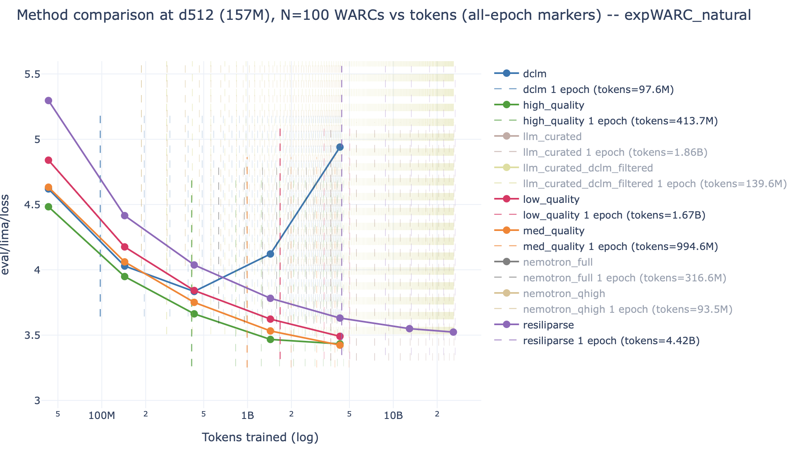

### 过滤阶段小结

- 数据过滤是决定预训练模型质量的分水岭；
- 标准范式：严谨定义高质量目标集 $T$（界定好数据的特征），利用统计与轻量模型外推并清洗原始海量语料 $R$。

## 数据去重 (Deduplication)

互联网上存在两类极为普遍的重复内容：

1. **完全精确重复**（镜像站点、GitHub Fork 仓库）[古腾堡镜像列表](https://www.gutenberg.org/MIRRORS.ALL)
- 模糊近似重复：绝大部分内容相同、仅有少数词汇或格式差异

近似重复的经典现实案例：

- 各大网站大同小异的《服务条款》与开源协议声明（如 [MIT 许可证](https://opensource.org/license/mit)）
- 模板化套话文本（复制粘贴或由机器模板生成）
- 拷贝粘贴时产生的微小空格与排版差异

例如在 C4 数据集中被完全重复了 **61,036 次** 的商品模板描述：

> *“by combining fantastic ideas, interesting arrangements, and follow the current trends in the field of that make you more inspired and give artistic touches. We’d be honored if you can apply some or all of these design in your wedding...”*

[example page](https://www.amazon.co.uk/suryagede-100-Graffiti-Gas-Mask/dp/B07CRHT3RG)

### 为什么对训练数据去重能显著提升语言模型表现？ [https://arxiv.org/pdf/2107.06499](https://arxiv.org/pdf/2107.06499)

1. **大幅提升训练效率**：剔除无意义的重复 Token，使相同计算预算下模型能学到更多全新知识。
2. **显著降低机械记忆风险**：高频重复是导致模型“死记硬背”并泄露训练集隐私/版权原文的元凶，去重可极大缓解该问题。

去重算法的三大设计要素：

1. **切分粒度 (Item)**：按句子 (Sentence)、按段落 (Paragraph) 还是按整篇文档 (Document) 进行对比？
2. **匹配标准 (Matching)**：精确字符匹配、包含相同子串、还是基于 Jaccard 相似度的模糊重合度？
3. **处理动作 (Action)**：仅保留一份唯一副本，还是将所有含重复的污染文档全部剔除？

> **去重算法的核心工程挑战**：
>
> 两两比较 $N$ 个文档的朴素算法复杂度为 $O(N^2)$。当 $N$ 达到百亿量级时，$O(N^2)$ 在算力上是完全不可行的。**我们必须依赖近线性时间复杂度 $O(N)$ 的高效哈希算法！**

- 去重的本质是文档/片段与全量语料之间的两两相似度比对；
- 必须设计具备近线性时间复杂度 $O(N)$ 的高效算法以支撑海量扩展；

### 哈希函数基础 (Hash Functions)
- 哈希函数 $h$ 将变长数据映射为固定长度的哈希值（整数或定长字符串）
- 哈希值体积远小于原数据，便于极速比对与哈希表检索
- **哈希碰撞 (Collision)**：当 $x \neq y$ 时出现 $h(x) = h(y)$

Tradeoff between efficiency and collision resistance [相关文章](https://softwareengineering.stackexchange.com/questions/49550/which-hashing-algorithm-is-best-for-uniqueness-and-speed)

- **密码学哈希 (SHA-256)**：极强抗碰撞，计算相对耗时（广泛用于区块链与安全签名）
- **非密码学极速哈希 (DJB2, MurmurHash3, CityHash)**：不强调密码学抗碰撞，但计算速度极致飞快（广泛用于哈希表与去重）

本实验中我们将使用高性能的 `mmh3` (MurmurHash3)：

```python
h = mmh3.hash("hello")
```

### 精确去重 (Exact Deduplication)

1. 处理对象：字符串列表
2. 匹配规则：哈希值完全相同的精确匹配
3. 执行动作：去除重复项，仅保留单个唯一副本

```python
items = ["Hello!", "hello", "hello there", "hello", "hi", "bye"]
hash_items = itertools.groupby(sorted(items, key=mmh3.hash), key=mmh3.hash)
deduped_items = [next(group) for h, group in hash_items]
```

- **优势**：逻辑简单直观，语义明确，精确度极高；
- **局限**：完全无法识别哪怕只有一个词或空格差异的近似重复。

> 💡 **代码解析：整体思路、逐行语法与 MapReduce 架构思想**
> 
> - **一、 整体思路与最终作用**：
>   - **核心思路（Sort $\to$ Group $\to$ Pick First）**：利用哈希排序将完全重复的文本聚拢为连续区间，再流式分组并仅提取每组首个元素。
>   - **最终作用**：实现无状态的流式精确去重，仅保留唯一副本，为海量超内存语料的分布式去重（MapReduce）提供核心算法范式。
> - **二、 逐行语法机制**：
>   1. `sorted(items, key=mmh3.hash)`：按 32 位整数哈希值大小排序（非字母序），使哈希相同的重复项在物理上紧邻排列。
>   2. `itertools.groupby(..., key=mmh3.hash)`：流式分组（机制类似 Linux `uniq`）。**运行机制**：该函数本身不要求输入全局有序，但它**仅合并物理上连续相邻的相同键**；若相同项分散在非连续位置，会产生多个独立的组。因此若要实现全局去重，**必须依赖前置排序将所有重复项聚拢到连续区间**。每次产出 `(h, group)`，`group` 为产出该组所有连续重复项的子迭代器。
>   3. `[next(group) for h, group in hash_items]`：通过 `next(group)` 仅弹取每组第 1 个样本作为代表，后续重复项直接丢弃。
> - **三、 为什么是 `next(group)` 而非直接 `group`？（Python 迭代器协议与底层数据模型）**：
>   - **数据结构剖析**：`hash_items` 是一个外层迭代器 (Iterator)，每次迭代解包出一个 `(hash_key, sub_iterator)` 二元元组 (2-tuple)。其值 `group` 本身不是具体的文本列表，而是一个负责流式产出该组所有重复元素的**子迭代器 (Sub-iterator)**。
>   - **单步消费提取代表**：列表推导式对元组的值 `group` **仅显式调用一次 `next(group)`**，即对子迭代器执行**单步求值（仅消费首个元素）**，因此在每个重复集合中精准提取 1 个样本作为代表。
>   - **核心价值：惰性求值避免全量加载 (Lazy Evaluation)**：Python 迭代器遵循惰性求值原则，`group` 绝不会在内存中预先实例化一个庞大的重复列表。即使某篇热门网页存在 1000 万次重复，`next(group)` 只从数据流中弹出第 1 个字符串；当外层循环步进到下一组时，旧迭代器直接销毁，剩余未消费的 999.9999 万个重复项直接被流式跳过/丢弃，完全不会常驻内存，实现了真正的 $O(1)$ 内存常驻去重！
> - **四、 为什么不用 `list(set(items))`？（海量数据工程权衡）**：
>   - **全内存瓶颈**：`set` 需常驻全内存哈希表，面对百亿级语料必触发 OOM；
>   - **分布式外排序对齐**：对应工业界 MapReduce 范式——**Map**（哈希打标）$\to$ **Shuffle & Sort**（磁盘外排序）$\to$ **Reduce**（流式聚合取首项）。


**C4 数据集中的去重实验** [https://arxiv.org/pdf/1910.10683v4](https://arxiv.org/pdf/1910.10683v4)

进阶实战：按连续 3 个句子的滑动窗口粒度进行去重

匹配标准：子片段哈希值完全匹配

3. 执行动作：去除重复项，仅保留单个唯一副本

> ⚠️ **截断隐患**：若直接从文档中间硬性剔除连续 3 句的重复片段，会导致剩余上下文语义断裂，因此现代预训练更推荐文档级丢弃或段落级去重。

### 模糊近似集合匹配

### 相似度度量标准

### Jaccard 相似度 (Jaccard Similarity)

**定义**：集合 $A$ 与 $B$ 的 Jaccard 相似度等于交集大小除以并集大小：

$$J(A, B) = \frac{|A \cap B|}{|A \cup B|}$$

```python
A = {"1", "2", "3", "4"}
B = {"1", "2", "3", "5"}
def compute_jaccard(A, B):
    intersection = len(A & B)
    union = len(A | B)
    return intersection / union
jaccard = compute_jaccard(A, B)
```

> **近似重复定义**：当且仅当两篇文档提取的特征集合 Jaccard 相似度 $J(A, B) \ge \tau$（阈值）时，判定两篇文档为**近似重复 (Near Duplicates)**。

**核心算法挑战**：如何在海量百亿级文档中，以近线性时间复杂度 $O(N)$ 找出所有满足阈值的近似重复对？

### MinHash 最小哈希算法

**MinHash 核心性质**：设计随机哈希函数 $h$，使得两个集合的最小哈希值碰撞的概率严格等于其 Jaccard 相似度：

$$P(\min h(A) = \min h(B)) = J(A, B)$$

通常在传统哈希表中，我们期望不同元素尽量映射到不同的哈希值以避免碰撞；

……但在相似度哈希中，我们**恰恰希望碰撞概率严格正比于它们的集合相似度**！

```python
def minhash(S: set[str], seed: int):
    return min(mmh3.hash(x, seed) for x in S)
```

### 特征矩阵表示 (Characteristic Matrix)

| 元素 | 集合 A | 集合 B |
| :---: | :---: | :---: |
| 1 | 1 | 1 |
| 2 | 1 | 1 |
| 3 | 1 | 1 |
| 4 | 1 | 0 |
| 5 | 0 | 1 |

随机哈希函数 $h$ 本质上对所有元素的全集施加了一次随机置换 (Permutation)。
观察置换后集合 $A$ 中出现的首个元素与集合 $B$ 中出现的首个元素：
并集 $A \cup B$ 中的每一个元素作为首个最小元素的概率完全均等：
- 如果首个出现的元素属于交集 {1, 2, 3}，则 $A$ 的首个元素与 $B$ 的首个元素完全一致（发生碰撞）；
- 如果首个出现的元素属于差集 {4, 5}，则 $A$ 与 $B$ 的首个元素不一致。

> 💡 **理论溯源：特征矩阵如何数学证明 MinHash 核心性质 $P(\min h(A) = \min h(B)) = J(A, B)$？**
> 
> - **一、 定位与关系**：
>   - 特征矩阵（Characteristic Matrix）是 MinHash 算法的**理论母版与数学证明模型**。实际工程中由于元素全集过于庞大，不可能真实显式存储该矩阵，而是通过代码中的随机哈希函数 `min(mmh3.hash(x) for x in S)` 来流式模拟这一数学过程。
> - **二、 哈希函数与行置换的等价性**：
>   - 矩阵每行代表一个全集元素，每列代表一个文档集合（存在记为 1，不存在记为 0）。
>   - 随机哈希函数 $h$ 给每个元素分配随机哈希值，数学上等价于对矩阵所有行施加一次**完全均匀的随机置换 (Permutation)**。
>   - 计算集合的最小哈希值 $\min_{x \in S} h(x)$，等价于**沿置换后的矩阵从上往下扫描，找到该列首次出现 1 的行对应的元素**。
> - **三、 数学证明：碰撞概率严格等于 Jaccard 相似度**：
>   1. 忽略两列全为 0 的无关行，仅观察并集 $A \cup B$ 中的所有元素（共 $|A \cup B|$ 个）；
>   2. 由于行置换完全均匀随机，**并集 $A \cup B$ 中的每一个元素在置换后排在最顶端（成为首个出现的 1）的概率完全均等**，均为 $\frac{1}{|A \cup B|}$；
>   3. 分类讨论首个出现的元素：
>      * **若首个元素落在交集 $A \cap B$**（如上表的 $\{1, 2, 3\}$）：该行两列均为 1，$A$ 与 $B$ 从上往下扫描遇到的首个元素完全相同，**必定发生碰撞**（共有 $|A \cap B|$ 个可能元素）；
>      * **若首个元素落在差集**（如上表的 $\{4, 5\}$）：必有一方为 1 另一方为 0，首个元素必定不同，**不发生碰撞**；
>   4. 因此，两个集合最小哈希值相等的概率严格为：
>      $$P(\min h(A) = \min h(B)) = P(\text{并集中首个元素落在交集}) = \frac{|A \cap B|}{|A \cup B|} = J(A, B)$$


```python
n = 100  # Generate this many random hash functions
matches = [minhash(A, seed) == minhash(B, seed) for seed in range(n)]
estimated_jaccard = len([m for m in matches if m]) / len(matches)
assert abs(estimated_jaccard - jaccard) < 0.01
```

> 💡 **深度解析：MinHash 与局部敏感哈希 (LSH) 大规模近似去重体系的底层全貌与工程奥秘**
> 
> 在课件中，代码直接从集合 `A = {"1", "2", "3", "4"}` 切入并跳到局部敏感哈希 (Locality Sensitive Hashing, LSH) 分桶，省略了现实中原始文本到特征指纹的构造细节，容易引发一系列工程与理论疑问。本节系统还原其完整技术拼图。
> 
> ---
> 
> ### 一、 原始文本的特征工程：$k$-Shingles 机制
> - **集合 $S$ 从何而来？**：
>   现实中的自然文本（如几万字的网页）无法直接当成整体做模糊比对（整篇哈希只要变一个标点就会完全不同）。我们必须将其转化为局部的离散短语集合。
> - **滑动窗口切词（Word $k$-Shingles）**：
>   像房顶上的重叠瓦片一样，用大小为 $k$ 的滑动窗口沿文本滑动切出短语。例如对句子 `"The quick brown fox jumps over the lazy dog"`，当 $k=5$ 时，切出的 5-gram 集合为：
>   $$\{\text{"the quick brown fox jumps"}, \text{"quick brown fox jumps over"}, \dots\}$$
>   工程上通常会对每个短语计算 64 位整数哈希，将其转化为紧凑的整数集合：$S = \{1839281, 9283912, 4719283, \dots\}$。**这就是课件中集合 $A, B$ 的真实来源！**
> - **为什么工业界标配为 Word 5~13 shingles？（两大设计权衡）**：
>   1. **不用单字/单词（$k=1$）**：单个词不仅彻底丢失了词序和局部上下文语法，而且两篇讨论完全不同主题的英文文章也会因大量的“高频功能词（the, is, and）”导致 Jaccard 相似度虚高，造成灾难性的误判；
>   2. **窗口适中（$k=5\sim 13$）**：统计学规律表明，全网文本中连续 5 到 9 个单词完全一致的短语，偶然巧合重复的概率几乎为 0。只要两篇文章有多个 5-shingle 重合，说明它们一定存在整句、整段的抄袭、洗稿或模板复用。若 $k$ 设得过大（如 $k=50$），作者只要微调一个词就会全盘失效，退化为死板的精确匹配。
> 
> ---
> 
> ### 二、 破除直觉盲区：万词长文上万个特征，如何做到 $O(1)$ 内存不爆炸？
> - **疑问直觉**：万词长文会产生 $m \approx 10,000$ 个特征，全网百亿网页就是上百万亿个特征，这难道不会引发内存与存储瘫痪吗？
> - **破局设计 1：单趟流式扫描（One-pass Streaming），切完即扔**：
>   工程实现中**绝不会**在内存中分配一个装有 1 万个元素的静态 `set`！系统只在 CPU 缓存中维护一个长度为 $n=128$ 的最小值寄存器数组 `min_hashes = [INF] * 128`。
>   文本从磁盘流式读取，滑动窗口每滑一步生成一个 5-shingle，立即用 128 个种子计算哈希并更新最小值寄存器，随后**该 shingle 立即被释放丢弃**。整个扫描过程中，内存中永远只有一个 5 词窗口和 128 个整数，**工作内存开销严格恒定为 $O(1)$（仅数 KB）**！
> - **破局设计 2：终极压缩，只留 512 字节的定长指纹**：
>   无论文章是 100 词还是 10 万词，扫描结束后其海量 shingles 全部灰飞烟灭，最终落盘持久化保存的只有这 128 个最小整数（签名向量）。存储体积从几十 KB 骤降至 $128 \times 4\text{ 字节} = 512\text{ 字节}$，**压缩率超过 99%**！
> 
> ---
> 
> ### 三、 深度思辨：签名向量如何生成？为什么是“对全量特征换种子”，而不是“切分特征集合”？
> - **签名向量的显式构造代码**：
>   课件中没有单独封装签名函数，其数学与代码定义为：使用 $n$ 个相互独立的哈希函数（或随机种子 `seed=0, 1, ..., n-1`），对文档 $S$ 各自提取一个最小值：
>   ```python
>   def compute_signature(S: set[str], n: int = 128) -> list[int]:
>       return [minhash(S, seed=i) for i in range(n)]
>   ```
> - **核心思辨：为什么不能把所有特征切成 16 块分别哈希，而必须用 128 个独立种子？**：
>   1. **致命缺陷一：插入/删除导致的“雪崩相位错位 (Phase Shift)”**：
>      如果把一万词的文章按顺序机械切分成 16 块，抄袭者在文章开头仅仅插入了一句广告或前言，**就会导致后续所有分块的物理边界全部向后错位**！第 1 块对应到了第 2 块，第 2 块对应到了第 3 块，所有块的哈希比对瞬间全军覆没，相似度直接被误判为 0。
>   2. **致命缺陷二：调换段落（洗稿乱序）**：
>      若抄袭者调换段落顺序，分块哈希全盘失效；而 MinHash 基于无序集合，天然对句子和段落的重排免疫。
>   3. **真相：128 个种子挑出来的，就是 128 个分散在各处的不同特征！**：
>      每个种子对应对全集特征的一次全新随机置换（重新洗牌）。在不同的洗牌视角下，排在最顶端的“最小值”几乎必然对应文章中不同段落、不同语义的特征词。因此，**128 个种子在数学上等价于在文档全量内容中自动完成了 128 次均匀无偏的代表性特征抽样**，根本不需要人工机械切块！
>   4. **统计学维度的必然性：大数定律与蒙特卡洛投点**：
>      MinHash 的核心定理 $P(\min h(A) = \min h(B)) = J(A, B)$ 描述的是一个概率。
>      - 若只用 1 个种子，比对结果只有“相等 (1)”或“不相等 (0)”，相当于只抛了一次硬币，根本无法推知硬币正面的真实概率；
>      - 采用 128 个独立种子，相当于进行了 128 次独立的蒙特卡洛掷硬币实验。统计 128 个位置上有多少个元素发生碰撞，其重合比例 $\frac{\text{matches}}{128}$ 就会以极小的方差高精度收敛到真实的 Jaccard 相似度！
> 
> ---
> 
> ### 四、 宏观全景：MinHash 与局部敏感哈希 (LSH) 的时空双降维分工
> 很多初学者误以为局部敏感哈希 (LSH) 也需要去处理那上万个原始特征，其实不然：
> - **MinHash（空间降维：解决“单篇特征太多太长”）**：
>   负责扛下处理上万个 Shingle 特征的脏活累活，将不可控的变长文本集合极限压缩为 **128 维固定长度的整数签名向量**；
> - **局部敏感哈希 LSH（时间降维：解决“全网百亿文档两两比对算不完”）**：
>   **LSH 的唯一输入就是这 128 维签名向量！** 即使每篇只有 512 字节，100 亿篇文档两两比对依然需要 $\approx 5 \times 10^{19}$ 次计算（$O(N^2)$ 灾难）。LSH 通过分带（如切成 16 个 Band，每个 Band 8 个数）并将 Band 哈希进桶，只要任意一个 Band 命中同桶即视为候选对，**在 $O(N)$ 近线性时间内瞬间捞出高度疑似重复的文档对**。


有了 MinHash 签名后，单个哈希碰撞只是一个二元随机事件，单次无法直接判断 $J(A, B) > \tau$。


### 局部敏感哈希 (Locality Sensitive Hashing, LSH)[book chapter](http://infolab.stanford.edu/~ullman/mmds/ch3n.pdf)

如果仅使用单个 MinHash 函数对文档打哈希：

碰撞概率 $P[A \text{ 与 } B \text{ 碰撞}] = J(A, B)$

虽然平均而言相似度越高的文档越容易碰撞，但随机方差极大（单次掷骰子）；

我们的目标：当 $J(A, B) > \tau$ 时极大概率碰撞，而当 $J(A, B) < \tau$ 时极大概率不碰撞！

我们需要将平缓的线性概率曲线“锐化”成一条陡峭的阶跃 S 型曲线！

**解决方案**：采用 $n$ 个独立的 MinHash 函数构建签名向量；

将签名向量划分为 **$b$ 个带 (Bands)**，每个分带包含 **$r$ 行 (Rows)**，满足 $n = b \times r$。

```python
n = 12      # Number of hash functions
b = 3       # Number of bands
r = 4       # Number of hash functions per band
```

哈希函数分带示意：

| 第 1 带 ($h_1 \sim h_4$) | 第 2 带 ($h_5 \sim h_8$) | 第 3 带 ($h_9 \sim h_{12}$) |
| :---: | :---: | :---: |

**判定准则 (AND-OR 逻辑)**：只要两篇文档在**某一个分带内全部 $r$ 个哈希值完全相等 (AND)**，就判定它们在全局发生碰撞并捕获为候选重复对 (OR)！

正是这种“带内全与 (AND)、带间取或 (OR)”的组合结构，构筑了陡峭的相似度筛选阈值！

设两文档的真实 Jaccard 相似度为 $s = J(A, B)$，则全局碰撞概率推导如下：

```python
def get_prob_collision(sim, b, r):
    prob_match = sim ** r                        # Probability that a fixed band matches
    prob_collision = 1 - (1 - prob_match) ** b   # Probability that some band matches
    return prob_collision
```

**Example**

```python
prob_collision = get_prob_collision(sim=0.8, b=5, r=10)
```


```python
sims = [0.7, 0.75, 0.8, 0.85, 0.9, 0.95, 0.98]
probs = {sim: get_prob_collision(sim=sim, b=10, r=10) for sim in sims}
```

- **增大 $r$（每个带行数）**：使带内匹配条件更苛刻，S 型曲线向右移动（提高相似度门槛，减少误报）；

```python
probs = {sim: get_prob_collision(sim=sim, b=10, r=20) for sim in sims}
```

- **增大 $b$（分带数量）**：增加匹配机会，S 型曲线向左移动（降低门槛，提高召回率）；

```python
probs = {sim: get_prob_collision(sim=sim, b=20, r=20) for sim in sims}
```


工业界典型参数配置：[https://arxiv.org/pdf/2107.06499](https://arxiv.org/pdf/2107.06499): n = 9000, b = 20, r = 450

```python
b = 20
r = 450
```

发生相变的临界相似度阈值（S 曲线拐点）：

```python
threshold = (1 / b) ** (1 / r)
```

临界阈值下单个分带匹配概率：

```python
prob_match = (1 / b)
```

当相似度处于临界阈值 $s = (1/b)^{1/r}$ 时，碰撞概率趋近于常数 $1 - 1/e \approx 0.632$：

```python
prob_collision = 1 - (1 - 1 / b) ** b
```

```python
def billion(x):
    return x * 10**9
def trillion(x):
    return x * 10**12
```

## 数据混合与配比 (Data Mixing)

语言模型通常需要在多个异构数据源构成的混合语料上进行预训练：

Datasets in Marin:[token viewer](https://huggingface.co/spaces/marin-community/token-count-viewer)

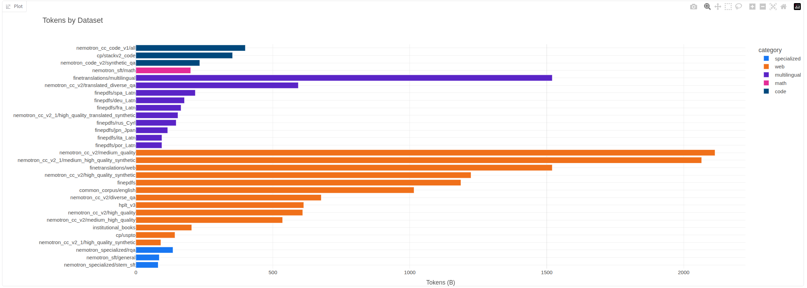

The Pile[the_pile_2020 (EleutherAI)](https://arxiv.org/pdf/2101.00027.pdf)


**核心决策问题**：在多个数据源之间，我们应该如何科学设定各自的采样分布概率？

示例数据源与候选混合配比：

```python
sources = {"Wikipedia", "CC", "GitHub"}
p = {"Wikipedia": 0.3, "CC": 0.5, "GitHub": 0.2}  # One possible data mixture
```

### 常见的基础配比策略 (Baselines)

1. **直觉调配 (Vibes)**：工程师凭经验和主观感觉手动微调权重（在行业早期极为普遍）；
2. **均匀采样 (Uniform)**：所有数据源享有完全平等的采样概率；
3. **等比例混合 (Proportional)**：按各数据源的实际 Token 总量成比例混合；

直觉规律：应当给予高质量数据源（维基百科、教材、高质量代码）更高的采样权重。

然而，加权必须注意以下两个关键制约因素：

1. **领域多样性**：必须确保模型在文学、代码、学术论文等互不替代的领域保持知识平衡；
2. **数据量有限与重复轮数**：高质数据源总量有限，加权过大会迫使模型对该数据源遍历多个 Epochs。

第二个考量至关重要且极富技巧性：

示例数据源与候选混合配比：

```python
source_token_counts = {
    "low": trillion(10),  # 10T tokens (abundant)
    "high": billion(10),  # 10B tokens (scarce)
}
p = {"low": 0.5, "high": 0.5}  # Naive data mixture
train_tokens = trillion(1)  # Train for 1T tokens
low_num_epochs = (p["low"] * train_tokens) / source_token_counts["low"]
high_num_epochs = (p["high"] * train_tokens) / source_token_counts["high"]
```

> ⚠️ **过拟合警示**：在小规模高质量数据上重复训练超过 50 个 Epochs 会导致模型死记硬背并严重损害泛化能力！

### UniMax 数据均衡算法 (Google, 2023)[https://arxiv.org/abs/2304.09151](https://arxiv.org/abs/2304.09151)

- **应用场景**：在多语言大模型训练中平衡英语与低资源长尾语种的数据配比；
- **以往方法**：在均匀采样与等比例采样之间取温度系数插值（$p(s) \propto N(s)^\alpha$）；
- **UniMax 核心思想**：尽量均匀采样各语种，但对任意数据源设定严格的**最大重复轮数上限 (Epoch Cap $C$)**；
- **数学约束**：对于所有数据源 $s$，要求 $p(s) \times N_{\text{train}} \le C \times N(s)$。

> 💡 **深度解析：UniMax 算法的数学约束、离线注水分配与 Dataloader 队列流式架构**
> 
> - **一、 以往方法（温度幂律平滑）的符号含义与两难困境**：
>   - **符号定义**：
>     - $s$：特定的数据源或语种（Source，如英语、藏语）；
>     - $N(s)$：该数据源在磁盘上拥有的**原始可用 Token 总量**；
>     - $p(s)$：分配给该数据源的**采样概率权重**（满足 $\sum_s p(s) = 1$）；
>     - $\alpha \in [0, 1]$：平滑温度系数。
>   - **两大极端与以往折中（$p(s) \propto N(s)^\alpha$）**：
>     1. **等比例采样 ($\alpha = 1$)**：按实际体量采样。大语种（英语）垄断 99% 算力，长尾低资源小语种被边缘化，无法充分学习；
>     2. **绝对均匀采样 ($\alpha = 0$)**：各语种平分 Token 配额。小语种（如仅有 10M Token 的藏语）在 1T 预算下会被强行重复训练上千轮，导致灾难性的死记硬背与过拟合；
>     3. **温度插值折中（$0 < \alpha < 1$）**：如 mBERT/XLM-R 设定 $\alpha = 0.3$ 或 $0.7$。虽有缓解，但缺乏刚性保护红线，小语种的重复轮次依然无法精确受控。
> - **二、 UniMax 数学约束与离线预算注水算法（Water-filling）**：
>   - **数学约束不等式**：
>     $$\forall s, \quad p(s) \times N_{\text{train}} \le C \times N(s) \iff \frac{p(s) \times N_{\text{train}}}{N(s)} \le C$$
>     - $N_{\text{train}}$：预训练计划消耗的总 Token 预算（如 1T）；
>     - $C$：最大重复轮数硬上限（Epoch Cap，通常 $C \in [2, 5]$）；
>     - **物理意义**：左侧 $p(s) \times N_{\text{train}}$ 是模型在整个生命周期中实际消费该数据源的 Token 总量；除以 $N(s)$ 即为实际训练轮数，强制约束其实际遍历轮数决不能超过 $C$。
>   - **核心澄清：达到上限后会“采样失败并重试”吗？**：
>     **绝不是在线随机抽样失败后的拒识重试（Rejection Sampling）！数据配比是一个【离线预算规划过程】**。在训练开始前，UniMax 通过类似注水算法完成确定性配额计算：
>     1. 初步按均匀采样分配配额；
>     2. 检测超出容量天花板（$C \times N(s)$）的小语种，将其配额直接**硬性封顶打死在 $C \times N(s)$**；
>     3. 溢出的 Token 预算重新均匀平摊给未饱和的大语种；
>     4. 迭代直至预算分配完毕，计算出固定的离线静态概率分布 $p(s)$，在线训练时直接按此概率无锁读取，零重试开销。
> - **三、 微观数据加载器 (Dataloader) 的流式队列机制**：
>   - **样本粒度**：采样的微观基本单位绝非整个语种，而是固定长度的序列切片（Sequence Chunk，如 2048/4096 Tokens）。
>   - **流式队列模型（FIFO Queue Iterator）**：
>     1. 在系统底层，每个数据源 $s$ 内部独立维护一个**预先全局混洗的有界无放回流式队列（Shuffled FIFO Queue Iterator）**；
>     2. 调度器按宏观多项分布概率 $p(s)$ 触发采样时，仅从该数据源对应队列的队首**单向弹出（Pop）下一个样本**，绝不在单轮内随机乱抓，保证语料内部无放回遍历；
>     3. 当某队列被完全消费弹空时，意味着该数据源完成了一个完整的 Epoch。系统在底层触发重新洗牌（Reshuffle）并重置队列游标，进入下一个 Epoch；
>     4. 宏观总预算 $p(s) \times N_{\text{train}} \le C \times N(s)$ 在物理上卡死了该队列最多只会被重构消费 $C$ 次。因此，**该语种内部的所有序列样本被训练的次数高度均等（恰好为 $C$ 次），从根本上避免了局部样本过度曝光或遗漏的方差波动**。


### 基于回归模型的数据配比优化 (RegMix, 2024-2026)[https://arxiv.org/abs/2407.01492](https://arxiv.org/abs/2407.01492)[https://arxiv.org/pdf/2602.12237](https://arxiv.org/pdf/2602.12237)

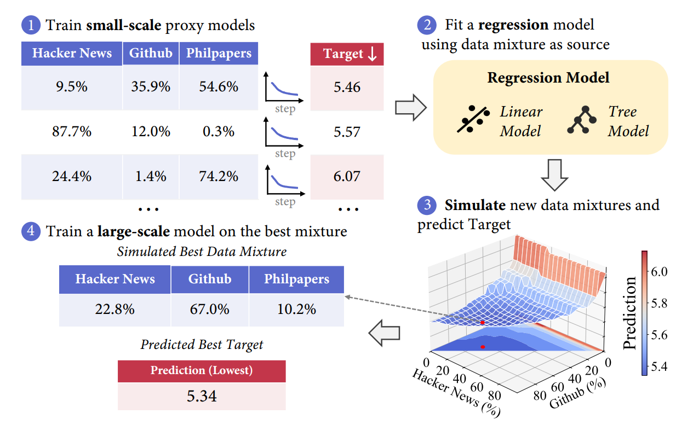

> 💡 **深度解析：为什么需要用回归模型确定数据配比？RegMix 端到端执行全流程**
>
> - **一、 核心背景与痛点：配比搜索的算力困境**
>   预训练万亿 Token 的全尺寸大模型成本高达数百万美元。面对代码、数学、网页、学术论文等多源语料，若靠人工经验直觉调配（Vibes）极易次优；若使用网格搜索（Grid Search）等蛮力方法，面对多维连续空间组合爆炸，算力完全无法承受。
>   **RegMix 的破局思想是“以小博大”**：在极小算力代价下（如 1B 参数小模型、仅训练 10B Tokens），密集采样探索不同的配比组合，将“配比向量 $\boldsymbol{p}$”与“下游评测表现/验证损失 $L$”拟合为一个轻量级回归模型，随后在回归模型上直接通过数学优化求解全局最优配比，指导全尺寸大模型训练。
>
> - **二、 RegMix 四步端到端执行全闭环**：
>   1. **第一步：多维配比空间采样（构建特征集合 $X$）**：
>      在连续的多维配比单形空间（$\sum_{i=1}^K p_i = 1$）中，利用狄利克雷分布抽取 $M$ 组（如 64 或 128 组）互不相同的合法配比候选方案 $\{\boldsymbol{p}^{(1)}, \boldsymbol{p}^{(2)}, \dots, \boldsymbol{p}^{(M)}\}$；
>   2. **第二步：低成本代理模型批量训练（生成性能标签 $Y$）**：
>      使用这 $M$ 组配比分别预训练 $M$ 个小规模代理模型（如 1B 模型训练 10B Tokens），并在验证集或代表性下游基准（如 GSM8K、MMLU、代码能力）上计算验证损失或综合得分 $L^{(j)}$。由此获得轻量级训练集 $\mathcal{D}_{\text{proxy}} = \{(\boldsymbol{p}^{(j)}, L^{(j)})\}_{j=1}^M$；
>   3. **第三步：拟合回归预测方程（建立性能映射 $f(\boldsymbol{p}) \approx L$）**：
>      选用经典的机器学习回归算法（如多元线性回归、带交互项的多项式回归、GBDT 梯度提升决策树等），以配比向量 $\boldsymbol{p}$ 为输入自变量，以验证损失 $L$ 为因变量进行拟合，学习出连续的损失预测函数 $\hat{L} = f(\boldsymbol{p})$；
>   4. **第四步：约束最优化求解与跨尺度外推**：
>      将学到的回归函数作为目标函数，在合法单形空间上求解极值优化问题：
>      $$\boldsymbol{p}^* = \arg\min_{\boldsymbol{p}} f(\boldsymbol{p}) \quad \text{s.t.} \quad \sum_{i=1}^K p_i = 1, \; p_i \ge 0$$
>      数学规划求解器（如 SLSQP）可以在秒级内从无限连续空间中精确定位到预测损失最低的配比 $\boldsymbol{p}^*$。最终直接将该配比作为全尺寸大模型的预训练配比方案。

1. 在配比概率向量 $p$ 上定义先验分布（如狄利克雷分布 Dirichlet）；
> 💡 **深度解析：狄利克雷分布的关键性质与配比采样**
>
> 1. **单形约束性（天然保底“非负且和为 1”）**：
>    狄利克雷分布生成的任意样本天然满足各分量非负且总和严格为 1（$\sum_{i=1}^K p_i = 1, p_i \ge 0$），无需额外归一化即可直接作为各个数据领域的合法混合配比向量 $p$。
> 2. **负相关竞争性（零和博弈）**：
>    由于总和被锁定为 1，各数据领域的配额存在天然的此消彼长竞争关系。给某一领域多分权重，其余领域的总配额必然等额缩减。
> 3. **浓度参数 $\boldsymbol{\alpha} = (\alpha_1, \dots, \alpha_K)$ 的调控性质**：
>    - **当所有 $\alpha_i = 1$ 时（全局无偏探索）**：退化为单形空间上的均匀采样，各合法配比被采样的几率完全相等。在 RegMix 初期探索阶段，利用该性质在整个配比空间无偏抽取数十组多样化配方，用于训练基线小模型；
>    - **当 $\alpha_i > 1$ 时（倾向中庸均衡）**：采样结果倾向于各领域相对均衡的温和配比；
>    - **当 $\alpha_i < 1$ 时（倾向极端稀疏）**：采样结果倾向于高度倾斜在某一个或极少数领域的极端配比；
>    - **定向收敛**：各领域的期望比例由 $\alpha_i / \sum \alpha_j$ 决定。在回归模型初步拟合出各领域对性能的边际收益后，可通过调大高收益领域的 $\alpha$ 值，让后续候选配比密集集中在优势区间，快速收敛至最优解。
2. 选用回归预测算法（如线性回归、梯度提升决策树 GBDT）；
3. 以数十组小算力模型在验证集上的下游损失作为回归拟合目标；
4. **核心权衡**：小规模算力实验的低成本 vs 跨尺度外推至万卡集群的预测准确度。

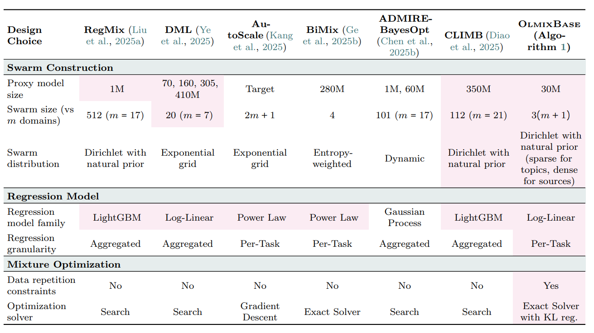

- **假设 1**：回归拟合模型在最优极值点附近具有足够的预测精度；
- **假设 2**：在小模型上搜索出的最优数据配比能够平滑迁移至全尺寸超大模型。

然而，这里存在一个必须警惕的**规模依赖陷阱**：

> 💡 **核心漏洞剖析：规模依赖陷阱（Scale-dependent Epoch Trap）的本质与极端反例**
>
> - **原始方法的致命漏洞**：
>   在进行低成本代理实验时，实验人员**仅等比例缩减了模型参数量和总训练 Token 预算（$N_{\text{train}}$），却完全没有等比例缩减各细分领域本身的数据池规模（$N(s)$）**。这导致小模型在训练时对小语料库所经历的**重复轮数（Epochs）与最终全尺寸大模型发生严重脱节**。
>
> - **量化案例说明（为什么会导致荒诞的外推灾难）**：
>   假设磁盘上有两类语料：充足的普通网页语料 $N(\text{low}) = 10\text{T}$ tokens，以及稀缺的高质量数学题库 $N(\text{high}) = 10\text{B}$ tokens：
>   1. **小模型实验阶段（总训练预算 $N_{\text{train}}^{\text{small}} = 10\text{B}$ tokens）**：
>      - 假设算法探索了一个极端偏好高质量数据的配方：$p_{\text{high}} = 0.9$（即消耗 9B 高质量 tokens）；
>      - 此时小模型上高质量数学语料的重复轮数为：
>        $$\text{Epochs}^{\text{small}} = \frac{0.9 \times 10\text{B}}{10\text{B}} = 0.9 \text{ 轮} < 1.0$$
>      - **结果与误判**：小模型连一轮都没训满，**完全不会触发过拟合**。由于训练了大量高密度推理数据，小模型的各项基准跑分大幅飙升。回归模型据此断定：“给高质量数据分配 90% 的超大权重收益最高！”并推荐将该配方应用于大模型。
>   2. **全尺寸大模型预训练（总训练预算 $N_{\text{train}}^{\text{large}} = 10\text{T}$ tokens）**：
>      - 若盲目套用推荐配方 $p_{\text{high}} = 0.9$，大模型需要训练 $10\text{T} \times 0.9 = 9\text{T}$ 的数学 tokens；
>      - 但物理磁盘上的数学题库依然只有 $10\text{B}$，此时大模型实际经历的重复轮数为：
>        $$\text{Epochs}^{\text{large}} = \frac{9\text{T}}{10\text{B}} = 900 \text{ 轮！}$$
>      - **灾难性后果**：大模型被迫反复死记硬背同一批数学题整整 900 遍，引发严重的灾难性过拟合与语言表征崩溃，直接导致整个预训练任务报废。
>
> 这种由于“只缩总预算、不缩领域语料”导致的轮次严重失真，正是 2025 年 **Simulated Epoching** 算法必须对各个领域语料库按比例物理降采样（Downsample）的根本原因。

```python
source_token_counts = {
    "low": trillion(10),  # 10T tokens (abundant)
    "high": billion(10),  # 10B tokens (scarce)
}
```

- 如果在小算力上仅训练极短步长（如 10B Token），高质量小语料只会被遍历极少轮次；

```python
p = {"low": 0.1, "high": 0.9}  # More mass on high quality data
```

- 但如果直接将此配比迁移到 10T Token 的超大模型上，高质量数据会被重复数十上百轮而导致严重过拟合！

### 模拟轮次缩放算法 (Simulated Epoching, 2025)[https://arxiv.org/pdf/2501.11747](https://arxiv.org/pdf/2501.11747)

- **核心思想**：让小规模算力实验在 Epoch 轮次分布上精确拟合大规模预训练时的状态；
- **具体实现**：将各数据源按相同比例进行降采样，使小模型在小 Token 预算下也能经历与全尺寸大模型相同的重复轮数；

> 💡 **核心机制解析：语料池等比例缩放与轮次（Epoch）完全对齐**：
> 具体做法是以总预算缩放比 $\text{ratio} = \frac{N_{\text{train}}^{\text{small}}}{N_{\text{train}}^{\text{large}}}$ 对每个候选数据源的可用语料池大小进行物理降采样（$N^{\text{small}}(s) = \text{ratio} \times N^{\text{large}}(s)$）。由于分子（训练 Token 预算）与分母（语料池大小）中的缩放比率 $\text{ratio}$ 刚好相互约分消除，使小模型在任何配比下经历的重复轮次与全尺寸大模型严格一致（$\text{Epochs}^{\text{small}}(s) = \text{Epochs}^{\text{large}}(s)$），从而在小算力实验阶段即能真实提前暴露过拟合缺陷。

```python
small_run_tokens = billion(10)
large_run_tokens = trillion(1)
ratio = small_run_tokens / large_run_tokens
downsampled_source_token_counts = {s: count * ratio for s, count in source_token_counts.items()}
```

- 在降采样后的混合语料中，重复轮次过高的数据源会提前暴露过拟合缺陷，从而使回归模型能够精准抑制过度重复；
- 最终求解出的配比权重更加均衡健壮！

```python
p = {"low": 0.7, "high": 0.3}  # More mass on high quality data
```

### 数据混合阶段小结

- **核心问题**：如何科学设定维基百科、通用网页、代码等异构数据源的权重？
- **基于回归模型的数据配比优化 (RegMix)**：在小算力规模上拟合数据配比与验证损失的映射函数，优化寻找最优配比并指导大规模训练（类似于 Scaling Laws）；
- **关键考量**：防范高质数据的过度重复与过拟合（解决方案：UniMax 轮数硬截断或 Simulated Epoching 降采样模拟）。

### 强化学习与推理合成数据标准构建流程

1. **构建多样化交互环境**（代码执行终端、数学推导沙盒、网页环境）
2. **定义高质量任务与提示词集合**（涵盖广泛的难度与领域分布）
3. **利用强能力教师模型生成长链条解答轨迹**（并借助执行器进行真值校验）

### OpenThoughts (前沿开源思维链合成语料, 2025)[https://arxiv.org/abs/2506.04178](https://arxiv.org/abs/2506.04178)

- 采用 QwQ-32B 作为教师模型，提炼生成 120 万条高质量复杂推理思维链 (CoT) 轨迹；
- 题库来自 27 个高质量人类与合成数据源（包括 StackExchange、NuminaMath 数学题库、化学与物理竞赛题）；

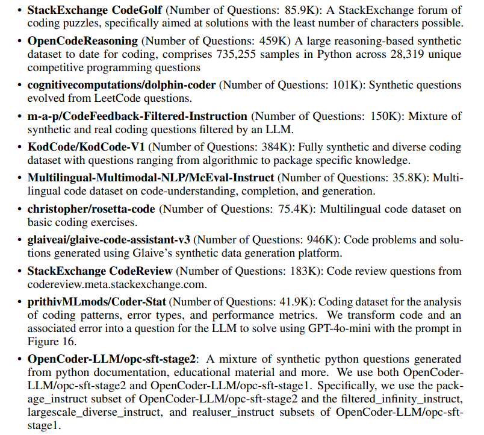

- **多样性采样**：对每个提示词采样 16 条候选解答能大幅提升探索广度与优质解答覆盖率；
- **重要发现**：更庞大的模型不一定是更好的蒸馏教师（QwQ-32B 的思维链表述更适合中小模型学习）；
- 实验观察：直接对最终答案进行过滤并未带来明显性能增益。
- 精炼的高质量数学语料（如 OpenMath-2-Math）在提升模型推理上的效果显著优于庞大但含噪的多样化语料；

> 💡 **深度解析：多样性采样机制与“答案过滤无效”的反直觉发现**
>
> 1. **为什么对每个问题采样 16 条回答？（解题路径与视角多样性）**：
>    若使用贪婪解码（Greedy Decoding）对每个问题仅生成 1 条回答，教师模型易陷入单一思路或局部盲区。采用适度采样温度（如 0.6~0.7）针对同一 Prompt 独立生成 16 条思考轨迹（Rollouts），能激发出代数推导、几何证明、反证法等截然不同的探索路径与自我纠错（Self-Correction）过程，极大扩展了长思维链（Long-CoT）的探索广度。
> 2. **针对课件“实验观察”的深度解析：为什么“直接对最终答案过滤并未带来明显性能增益”？**：
>    直觉上通常认为必须剔除做错的解答，但 OpenThoughts 的严格对照实验表明，过滤掉最终答案错误的数据并不能提升学生模型的下游推理水平，核心原因在于：
>    - **过程（Process）的价值远高于最终答案（Answer Token）**：数千 Token 的长思维链中包含大量的拆解假设、分步推演与元认知反思（如 *"Wait, let me rethink..."*）。即便最终一步因轻微算术进位出错，其中 95% 以上的高阶推导逻辑依然极为优质，学生模型学到的是这套通用的“思考与自我质疑范式”；
>    - **避免误杀高难任务的宝贵探索**：对于高阶奥数/竞赛级难题，教师模型算对最终答案的概率极低。硬性过滤最终答案会把最有价值的难题全数误杀，导致训练数据萎缩、丧失高难推理多样性；
>    - **输入质量（Input Quality）压倒输出过滤（Output Filtering）**：在源头筛选高质量、高信息密度的题目（如精炼数学题库），其对推理能力的提升远比在生成后死抠末尾答案更加关键。

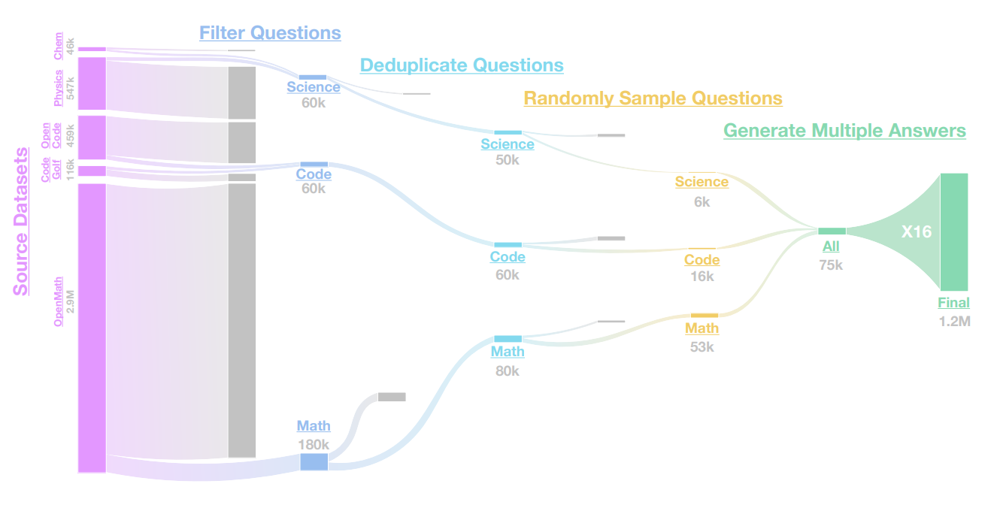

### SWE-smith (自动化软件工程任务合成, 2025)[https://arxiv.org/abs/2504.21798](https://arxiv.org/abs/2504.21798)

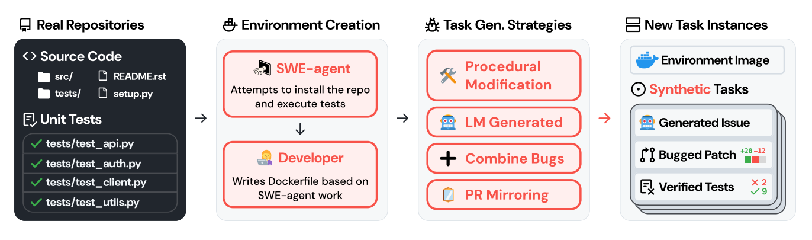

- 核心机制：给定开源代码库，让大模型自动化在代码中注入精妙 Bug，并合成对应的 Issue 描述与单元测试；
- 在 128 个 GitHub 仓库上自动化产出了 5 万个高质量且可判分的真实软件修复任务；

> 💡 **背景与局限解析：为什么 SWE-smith 强依赖 Docker 沙盒？为何仅局限在 128 个仓库？**
>
> - **环境依赖的必要性**：SWE-smith 的核心目标是合成“可自动判分”的任务。为了验证大模型注入的 Bug 确实有效、且合成的新单元测试能真实运行并表现出“修复前报错红灯（FAIL）、修复后通过绿灯（PASS）”，必须在真实的 Docker 沙盒中实际编译并执行测试套件；
> - **现实妥协与瓶颈**：配置包含特定依赖、C 扩展库和运行环境的真实容器难度极高。研究人员耗费大量人力仅调通了 128 个主流 Python 开源仓库，导致合成的 5 万个任务只能局限在这 128 个“温室”中循环，缺乏覆盖全网开源生态的代码多样性与泛化度。

### SWE-Zero (无沙盒免执行长轨迹蒸馏, 2026)[https://arxiv.org/abs/2604.01496](https://arxiv.org/abs/2604.01496)

- 现实痛点：软件工程任务依赖极其复杂的编译与依赖环境（与纯文本数学题截然不同）；
- 为成千上万个历史仓库搭建独立的 Docker 运行沙盒是巨大的基础设施与算力开销；
- **关键洞察**：顶尖大模型在预训练中已经内化了深刻的代码语义“世界模型”，许多修复无需反复运行即可一次性精准定位；

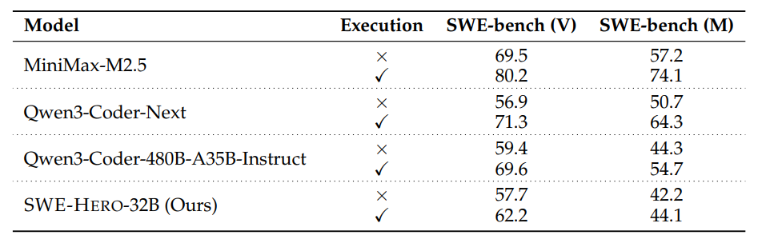

核心：顶尖大模型具备对代码执行语义的内在精确建模能力；

- **SWE-Zero 数据集**：包含 30 万条无需特定仓库运行环境的 Agent 轨迹；
- 覆盖 15 万个真实的 GitHub Pull Request；
- 基于 OpenHands 脚手架，严格剔除未来的 Git 提交以彻底防止 Agent 窥探答案作弊；

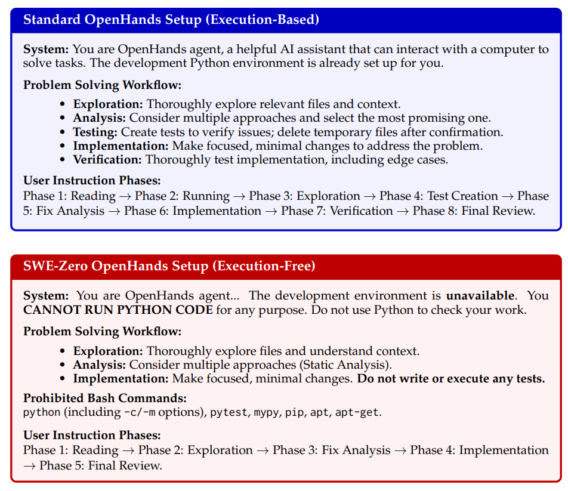

- 从 Qwen3-Coder-480B 强模型中蒸馏并进行严格一致性过滤；
- **SWE-Hero**：精选 1.3 万条高度依赖终端交互与执行反馈的高价值复杂长轨迹；

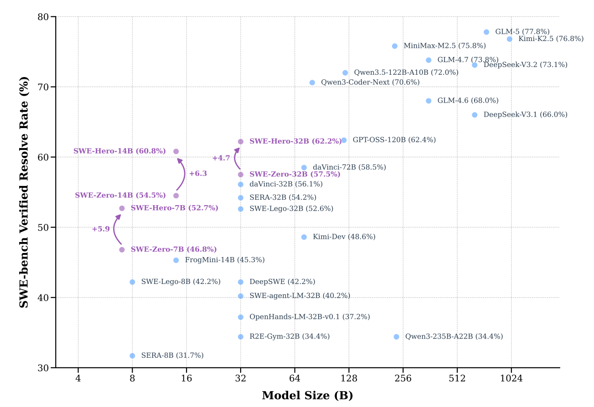

> 💡 **深度解析：从“沙盒执念”到“免执行蒸馏”的范式革命与正确性保证（SWE-smith → SWE-Zero → SWE-Hero）**
>
> 1. **破局背景：全网 15 万仓库的多样性 vs 15 万沙盒的不可能三角**：
>    继 SWE-smith 局限在 128 个仓库之后，社区迫切需要覆盖全网真实长尾场景的代码修复数据。但全网有数十万个真实 GitHub 仓库，为每个仓库配置 Docker 沙盒在工程与算力上是绝对的天文数字。
> 2. **“关键洞察”的核心含义（打破必须跑代码的执念）**：
>    课件中所述的“关键洞察”，正是为了回应前述沙盒开销痛点：业界原以为 Agent 修代码必须像人类新手一样在终端里反复运行、查看报错。但实验表明，像 Qwen3-Coder-480B 这样的顶尖教师模型吞噬了海量代码后，大脑中已具备深刻的代码“世界模型（Mental Execution）”——仅凭静态通读上下文即可在脑中精准推演代码执行流并定位缺陷，**绝大多数常规修复根本无需搭建沙盒运行即可一次性输出正确补丁**。
> 3. **SWE-Zero 与 SWE-Hero 的互补闭环**：
>    - **SWE-Zero（免沙盒广度覆盖，80%~90% 常规任务）**：彻底甩掉沙盒包袱，以极低基础设施成本横跨 15 万个真实 GitHub 仓库，批量提炼出 30 万条免执行（Non-executable）长推理轨迹，解决了跨仓库的数据多样性；
>    - **SWE-Hero（真沙盒深度攻坚，约 10% 高难复杂任务）**：对于少数真正依赖多轮终端交互、复杂运行时报错和测试反馈的硬核难题，专门保留 Docker 真实沙盒提炼出 1.3 万条动态交互长轨迹；
>    - **两者协同**：以“SWE-Zero 大规模低成本广度铺路 + SWE-Hero 真实交互深度提炼”，构建起软工 Agent 高效且泛化能力极强的数据基石。
> 4. **免执行下如何保证代码补丁的正确性？（严格一致性过滤机制）**：
>    - **人类历史黄金标尺（Gold Patch）**：任务选自已合并（Merged）的 15 万个真实 GitHub PR，天生配有人类资深维护者经 Code Review 验证并合并的标准黄金补丁；
>    - **静态 AST 与补丁等价性比对**：将教师模型生成的补丁与人类 Gold Patch 进行抽象语法树比对，仅保留修改文件定位准确、核心逻辑分支完全等价的轨迹，偏离方案一律剔除；
>    - **多路径自洽性检验（Self-Consistency）**：采样多条独立思考轨迹，仅收录高度收敛到一致修复方案的高置信度样本；
>    - **轻量静态语法检查与防泄露时序隔离**：通过本地毫秒级 AST 解析与 Linter 拦截语法缺陷，并通过 OpenHands 彻底屏蔽未来 Git 提交以防止窥探答案作弊。

### SWE-rebench (交互式长程软件工程基准, 2025)[https://arxiv.org/pdf/2505.20411](https://arxiv.org/pdf/2505.20411)

- 汇集来自 3400 个 GitHub 仓库的 2.1 万个交互式 Python 真实工程任务；
- 审计了 GitHub Archive 归档中的 45 万个历史 PR；
- 利用前沿代码大模型自动化配置依赖并严密评估 PR 代码补丁的修复质量；

> 💡 **深度解析：从人工沙盒到免执行、再到自动化沙盒的“否定之否定”演进**
>
> 软件工程环境构建经历了一次极具美感的“正-反-合（否定之否定）”技术演化：
> 1. **肯定阶段（SWE-smith，人工配置沙盒）**：坚持代码必须在真实 Docker 中执行，但因完全依赖人工运维写 Dockerfile，精力和算力被锁死在区区 128 个主流仓库；
> 2. **否定阶段（SWE-Zero，全面砍掉沙盒）**：因环境搭建太沉重而打破沙盒执念，利用教师模型内置的“代码世界模型”进行免执行推演，虽然以超低成本横跨 15 万个仓库，但无法用于严密可执行的真机基准评测；
> 3. **否定之否定（SWE-rebench，大模型自生成沙盒）**：重新回归真机可执行与真实交互评测，但不再靠人工低效配置，而是让前沿大模型走读 CI/CD 与项目配置自动化生成 Dockerfile 并调通环境。在更高维度上同时实现了“真机执行的绝对严谨性”与“跨 3400 个仓库的超高多样性”，终结了原版 SWE-bench（仅 12 仓库）容易过拟合与数据污染的弊端。

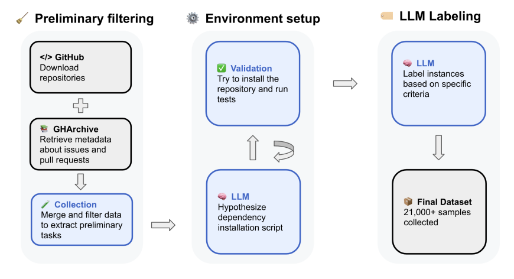

### SWE-ZERO-12M (千万级超大规模智能体轨迹数据集)[data](https://huggingface.co/datasets/AlienKevin/SWE-ZERO-12M-trajectories)

- 将 SWE-Zero 规模化扩增至 1200 万条 Agent 轨迹；
- 基于 SWE-rebench-v2 任务集 (32K executable tasks + 120K nonexecutable tasks)
- 实验证明：仅使用 1.7B 超小模型配合 mini-swe-agent 脚手架，在此轨迹上训练后即可取得惊人的 50.4 pass@100 得分！
- [Example](https://huggingface.co/datasets/AlienKevin/SWE-ZERO-12M-trajectories/viewer/default/train?row=5&conversation-viewer=0)

> 💡 **深度解析：SWE-ZERO-12M 的正确性保障与智能体数据扩展定律（Agentic Scaling Law）**
>
> 1. **千万级免执行长轨迹如何确保正确性？**：
>    - **继承人类黄金标尺**：任务源自 SWE-rebench-v2 的真实已合并 PR，每一个任务都严格绑定人类官方合并的 Gold Patch；
>    - **多路径自洽性共识（Rollout Self-Consistency）**：强教师模型对每个任务多路独立采样，仅收录不同长思维推导路径共同收敛到相同黄金补丁的高置信度样本；
>    - **动静双重立体质检**：对 12 万条免执行任务采用轻量级 AST 抽象语法树等价性比对与时序隔离；对 3.2 万条可执行任务直接丢入 Docker 容器中跑 pytest 真实运行验证，确保千万级轨迹的极高纯净度。
> 2. **1.7B 超小模型拿到 50.4 pass@100 的里程碑意义**：
>    此前打榜高难软工基准被认为是 32B/70B 甚至闭源巨无霸模型的专属特权。SWE-ZERO-12M 首次在实证上证明了**“智能体数据扩展定律”**：只要长思维链推理、工具调用与代码修补的高质量轨迹规模足够庞大（达 12M 级），哪怕是仅 1.7B、能在手机或轻薄本上离线运行的微型小模型，也能通过蒸馏“涌现”出极度稳健的专家级软件工程能力。

### 后训练合成数据阶段小结

- **提示词构建的三种流派**：纯合成 (Fully-Synthetic)、半合成 (Semi-Synthetic，真实代码库 + 合成任务) 与纯真实 (Real GitHub PRs)；

> 💡 **概念补充与前文脉络对照：提示词构建的三大流派**
>
> 课件在正文中重点展开了基于真实代码库的半合成与纯真实任务，但在小结中汇总了业界更完整的全景分类。原课件未详细展开的“纯合成”机制及三者的前文对照如下：
>
> 1. **“纯合成提示词（Fully-Synthetic Prompts）”的典型做法**：
>    - **自指令演化（Self-Instruct / Evol-Instruct）**：以少量种子问题为起点，让大模型通过“增加约束条件、深化推理步骤、复杂化专业背景”自主将简单问题重写与演化为高难度的全新任务；
>    - **模板与规则引擎生成**：如 OpenThoughts 中引用的合成数学题库，使用预设的定理模板并由符号计算程序（如 SymPy）随机注入数值与变量，自动批量生成带精准真值的数理应用题；
>    - **自由自问自答（Magpie 机制）**：利用大模型直接在没有输入 Prompt 的情况下，从预训练激活态中自发采样生成多样化的用户提问。
>
> 2. **三大流派与前文内容精确对照表**：
>
> | 提示词构建流派 | 核心机制与定义 | 对应前文案例 | 核心优缺点 |
> | :--- | :--- | :--- | :--- |
> | **纯合成 (Fully-Synthetic)** | 完全脱离真实环境，由大模型或规则引擎凭空构造提示词与任务背景 | **OpenThoughts**（部分纯合成数学/竞赛题源） | **优**：成本极低、难度完全可控、数量无限；<br>**缺**：软工场景下易脱离工业实际变成“玩具代码”。 |
> | **半合成 (Semi-Synthetic)** | **依托真实工业代码库**，但任务由大模型通过注入 Bug 并伪造 Issue/单测生成 | **SWE-smith**（在 128 个真实 GitHub 仓库中人工造 Bug） | **优**：保留了真实项目的复杂工程结构；<br>**缺**：人造 Bug 偏向局部逻辑，且依赖沙盒导致仓库数量受限。 |
> | **纯真实 (Real)** | 直接采掘自人类开发者在开源社区中**真实发生并已合并的历史 PR 与 Issue** | **SWE-Zero**、**SWE-rebench**（覆盖 15 万真实 PR、3400 个真实仓库） | **优**：100% 契合真实工业场景分布，无塑料感；<br>**缺**：高质量历史 PR 数量受限，且需严格防范数据泄露与作弊。 |

- **高质量回复来源**：来自具备强推理能力且适合作为教学蒸馏范例的顶尖教师模型；
- **工程实操痛点**：真实代码执行环境的依赖配置极其繁琐沉重；
- **成败关键**：需要辅以极度严密的结果真值校验、轨迹去噪与格式清洗。

## 本讲核心总结

- **过滤策略**：训练轻量级分类器（语言判别、质量评分、毒性检测）来界定“什么是好数据”
- **高效去重**：利用哈希算法（MinHash + LSH）在大规模语料上实现近线性复杂度的模糊近似去重
- **数据配比**：在小算力规模上验证数据混合配方，外推预测并指导全尺寸大模型预训练
- **核心实战**：语言识别、领域分类、毒性过滤与代码清洗
- **后训练对齐**：构建高密度的合成指令与偏好数据
- **工程本质**：数据工程高度依赖对具体领域样本的深入观察、人工抽检与细致迭代。
