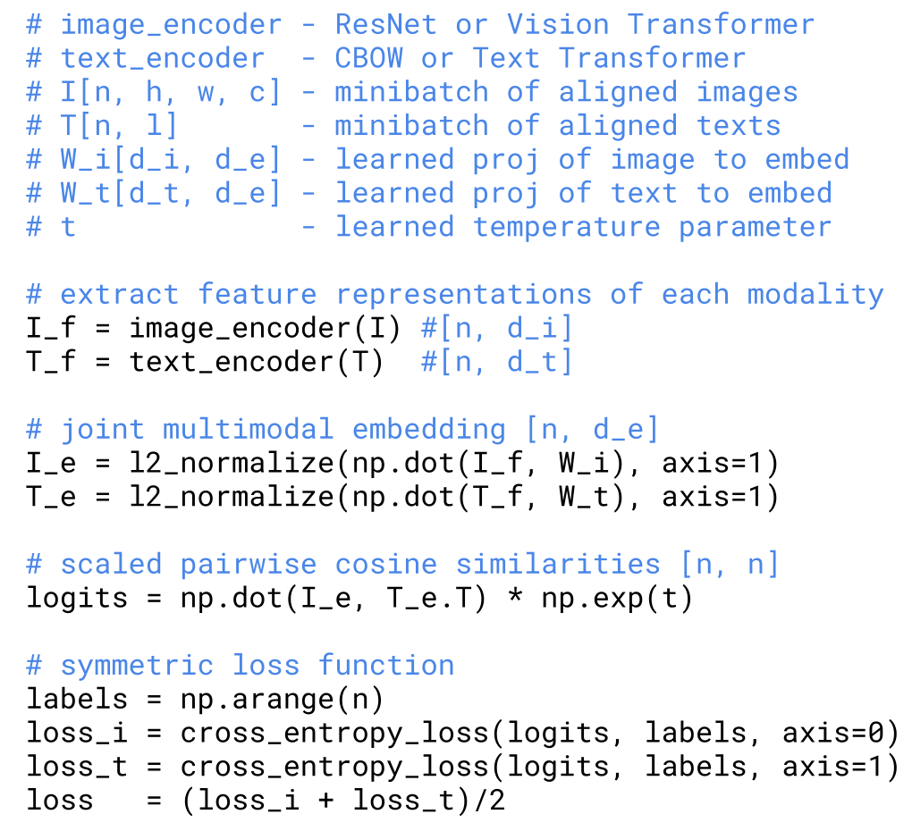
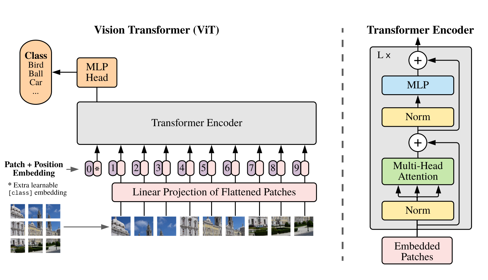
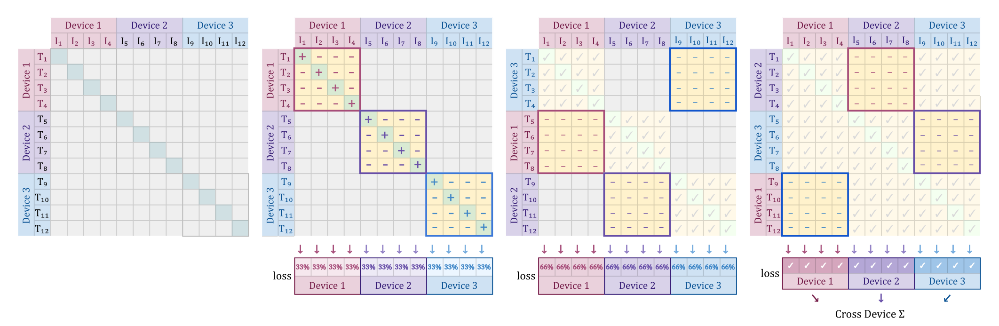
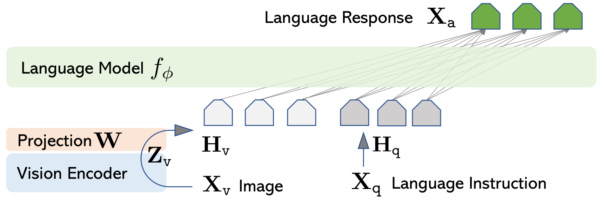
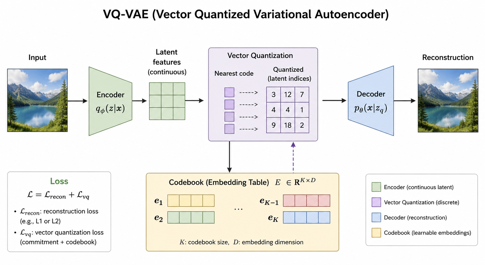

# 第 17 课：多模态模型 (Lecture 17: multimodal models)

到目前为止我们涵盖的是：语言模型
> text ⇒ text (文本 ⇒ 文本)

但真实世界是多模态的：


终极目标：**全能模型 (omni model)**
- 输入任何模态的组合（理解）
- 输出任何模态的组合（生成）

我们今天所处的位置：
- Transformer 表现极好，因此我们必须使用它们。
- Transformer 以 token 作为“语言”（离散或连续），其中一个 token 代表某些语义信息单元。
- 因此，我们必须将一切内容转换为 token。
- 注意：我们必须对文本也进行这一处理（回忆一下 tokenization 课程）。
- 对于非文本模态，这更具挑战性……

核心问题：
1. 我们如何输入非文本数据（例如，理解图像）？
2. 我们如何输出非文本数据（例如，生成音频）？

```python
from edtrace import text, image, link
from lecture_util import article_link, post_link
```

```python
def clip():
    text("CLIP (Contrastive Language-Image Pretraining) "), link("https://arxiv.org/abs/2103.00020")

    text("Context:")
    text("- Computer vision models were trained on annotated images.")
    text("- Question: is it possible to leverage the much larger amount of (image, caption) pairs?")
    image("images/clip.png", width=800)

    text("Method:")
    text("- Get a batch of (image, text) examples (e.g., 32768)")
    text("- Encode each image and each text")
    text("- For each image, prefer its aligned text over other texts")
    text("- For each text, prefer its aligned image over other images")
    image("images/clip-code.png", width=400)

    text("Data:")
    text("- Searched for 500K queries, get ~20K (image, text) pairs per query")
    text("- Trained on 400M image-text pairs")
    text("- Didn't release the dataset")
    text("- Reproduced in OpenCLIP (using LAION-5B dataset, which used CLIP for filtering) "), link("https://arxiv.org/abs/2212.07143")

    text("Data processing "), link(title="code", url="https://github.com/openai/CLIP/blob/main/clip/clip.py#L79")
    text("- Images come in all resolutions (arbitrary W x H)")
    text("- Resize using bicubic interpolation so shorter side is 336 pixels")
    text("- Center crop (cuts off borders to get 336 x 336)")
    
    text("Vision encoder:")
    text("- Experimented with ResNet-50 and Vision Transformers "), link("https://arxiv.org/pdf/2010.11929")
    image("images/vit.png", width=600)
    text("- Attention pooling: do QKV with query = global average of activations")
    text("- Best model: ViT-L/14@336px (L = large, 14x14 patches, 3 channels, trained on 336x336 resolution images)")

    text("Text encoder:")
    text("- GPT-2 Transformer (63M parameters, 12 layers)")
    text("- Encode [BOS] ... [EOS], return [EOS] activation at highest layer")

    text("Headline result:")
    text("- On ImageNet, zero-shot CLIP outperformed ResNet-50 trained on 1.2M ImageNet images")

    text("Ablation:")
    text("- Alternative: predict text from images directly")
    text("- Much less compute efficient compared to CLIP-style ranking")
    image("images/clip-efficiency.png", width=400)

    text("Summary:")
    text("- Encoding of images captures semantics given by (noisy) text")
    text("- Design decisions chosen based on image classification (not very fine-grained)")
    text("- Technical: requires large batch sizes, softmax operation over full batch")


def siglip():
    text("SigLIP (Sigmoid Loss for Language Image Pre-Training) "), link("https://arxiv.org/abs/2303.15343")

    text("Objective:")
    text("- CLIP: multiclass classification for (text, image) versus (text, image') for all image'")
    text("- SigLIP: binary classification for (text, image) - aligned or not?")
    image("images/siglip-code.png", width=500)

    text("Data:")
    text("- WebLI dataset: O(billion) (image, text) pairs "), link("https://arxiv.org/pdf/2209.06794")
    text("- Scraped from the Internet")
    text("- Used automatic OCR to extract text from images")
    text("- Keep 10% highest quality")
    text("- Supports 100 languages")

    text("Efficiency:")
    text("- CLIP: 10 days on 256 TPUv3")
    text("- SigLIP: 5 days on 32 TPUv4 (lower FLOP/s than TPUv3) - much faster!")
    image("images/siglip-parallelism.png", width=800)

    text("Batch size:")
    text("- Decouple batch size from loss")
    text("- Better than CLIP for <16K batch sizes")
    text("- Go up to 1M batch size, but 32K is enough")


def llava():
    text("LLaVA (Large Language and Vision Assistant) "), link("https://arxiv.org/abs/2304.08485")

    text("Vision encoder: CLIP")
    text("Text decoder: Vicuna (LLaMA fine-tuned on ShareGPT conversations) "), post_link("https://www.lmsys.org/blog/2023-03-30-vicuna/")

    text("Data:")
    text("- MS COCO has images annotated with bounding boxes and Mechanical Turk captions")
    text("- Prompt GPT-4 with captions or detected objects and generate questions or conversations")
    text("- Pair generations with original images")
    text("- 158K examples")
    image("images/llava-gen.png", width=600)

    text("Model:")
    text("- Encode images with CLIP (ViT-L/14)")
    text("- Linear projection (W) into embedding space (Flamingo and Q-former are more complex)")
    image("images/llava-architecture.png", width=600)

    text("Training:")
    text("- Stage 1 (alignment): freeze vision encoder and language model, only train W")
    text("- Stage 2 (fine-tuning): freeze vision encoder and train W and language model")
    image("images/llava-example.png", width=600)


def llava_onevision():
    text("LLaVA OneVision "), link("https://arxiv.org/pdf/2408.03326")
    text("- Latest version in the LLaVA series (after LLaVA 1.5, LLaVA-Next)")
    text("- Handle multiple images, video")

    image("images/llava-onevision.png", width=600)
    text("- Vision encoder: SigLIP (use grid features before and after last Transformer layer)")
    text("- Text decoder: Qwen-2 72B")
    text("- Projector: 2-layer MLP")

    text("Data processing:")
    text("- Preserving high resolution is important (e.g., for OCR)")
    text("- CLIP resizes and crops to 336x336, which loses information")
    text("- Solution: AnyRes, introduced in LLaVA 1.5 "), link(title="paper", url="https://static.hliu.cc/files/llava/improved_llava.pdf")
    text("- Break up image into a x b pieces (matching resolution of vision encoder), encode, concatenate")
    text("- If too many tokens (original image is too high resolution), then use bilinear interpolation")
    image("images/llava-onevision-anyres.png", width=600)
    text("Handle 3 types of input (single image, multiple images, video):")
    text("- Goal: make all of the modalities produce roughly the same length")
    image("images/llava-onevision-modalities.png", width=600)
    text("- Single image: use higher resolution")
    text("- Multiple images: use base resolution for each image")
    text("- Video: use lower resolution for each frame")

    text("Data:")
    text("- Philosophy: quality over quantity")
    image("images/llava-onevision-data-1.png", width=700)
    image("images/llava-onevision-data-2.png", width=700)

    text("Training:")
    text("- Philosophy: easier to harder")
    image("images/llava-onevision-training.png", width=700)

    text("Transfer between modalities:")
    text("- Single image data for diagrams and charts, but generalize to multi-image")
    image("images/llava-onevision-transfer-s1.png", width=600)
    text("- OCR on single image data, relational reasoning from multi-image data, generalize to GUI-based agents")
    image("images/llava-onevision-transfer-s2.png", width=600)
    text("- Visual prompting (circle) in single images, generalize to videos")
    image("images/llava-onevision-transfer-s8.png", width=600)

    text("Summary:")
    text("- Standard VLM template: vision encoder + projector + LM")
    text("- Most work goes into data curation (heavy on synthesized, task-specific data)")
    text("- Open-source (released model weights and data)")


def qwen_vl():
    text("Qwen-VL "), link("https://arxiv.org/abs/2308.12966")

    text("Architecture:")
    text("- Vision encoder: OpenCLIP's ViT-bigC (14x14 patches) "), link("https://arxiv.org/abs/2212.07143")
    text("- Adaptor: one layer cross-attention, incorporate 2D positional encodings, maps to fixed length of 256")
    text("- Special tokens: , <box>, <ref>")

    text("Training:")
    image("images/qwen-vl-stages.png", width=700)
    text("- Stage 1: large-scale low quality data; freeze LM, train vision encoder + adaptor")
    image("images/qwen-vl-stage1.png", width=400)
    text("- Stage 2: higher quality task-specific data, increase resolution; train all parameters")
    image("images/qwen-vl-stage2.png", width=400)
    text("- Stage 3: instruction tuning data; freeze visual encoder, train adaptor + LM")

    image("images/qwen-vl-examples.png", width=600)


def qwen2_vl():
    text("Qwen2-VL "), link("https://arxiv.org/abs/2409.12191")

    text("Visual encoder: larger ViT (675M)")
    image("images/qwen2-vl-architecture.png", width=700)
    text("- Key: dynamic resolution to handle varying resolutions")
    text("- Each 224 x 224 patch encoded with ViT/14, compress every 2x2 => 66 tokens")
    text("- Video: sample 2 frames/sec, max 16384 tokens")

    text("Multimodal Rotary Position Embedding (MRoPE):")
    image("images/qwen2-vl-mrope.png", width=600)
    
    text("Initialize LM with Qwen2 and vision encoder from DFN "), link("https://arxiv.org/abs/2309.17425")
    text("Training (similar to Qwen-VL):")
    text("- Stage 1: train only visual encoder")
    text("- Stage 2: train all parameters")
    text("- Stage 3: train language model on instruction following datasets")

    text("Many capabilities:")
    image("images/qwen2-vl-capabilities.png", width=700)


def qwen3_vl():
    text("Qwen3-VL "), link("https://arxiv.org/abs/2511.21631")
    image("images/qwen3-vl.png", width=700)

    text("Language model:")
    text("- Qwen-3 models (dense and MoE models up to 235B-A22B)")
    text("- Long context understanding (256K)")

    text("Vision encoder:")
    text("- SigLIP-2 (same architecture as SigLIP) "), link("https://arxiv.org/pdf/2502.14786")
    text("- Interleaved MRoPE: distribute all axes (temporal, width, height) to low- and high-frequency bands")
    text("- Add explicit video timestamps (as separate tokens rather in positional embeddings)")
    text("- Square-root-normalized per-token loss: balance text and multimodal data (video examples are long, don't want to dominate)")

    text("Adapter:")
    text("- DeepStack: cross-layer fusion to inject visual information into multiple layers "), link("https://arxiv.org/abs/2406.04334")

    text("Training:")
    text("- Pre-training has 4 stages (train adapter, train all parameters on 8K, 32K, 256K lengths)")
    image("images/qwen3-vl-pretraining.png", width=600)
    text("- Post-training: SFT on long CoT data, knowledge distillation, RL")

    image("images/qwen3-vl-results.png", width=600)

    text("Summary:")
    text("- SOTA performance")
    text("- Lots of data work, but not many details")
    text("- Minor but potentially important architectural improvements")
    text("- Scale up")


def chameleon():
    text("Chameleon "), link("https://arxiv.org/pdf/2405.09818")

    text("So far: VLMs encode images (via CLIP or SigLIP), inject into LM")
    text("Disadvantage: can't generate images (need diffusion)")

    text("Chameleon: map everything into discrete tokens")
    text("Advantage: can analyze and generate images in a uniform way")
    image("images/chameleon.png", width=600)
    image("images/chameleon-example.png", width=600)

    text("Vision encoder "), link("https://arxiv.org/pdf/2203.13131")
    text("- Key difference: encoder needs to map to discrete tokens (so we can generate them)")
    text("- VQ-VAE (Vector Quantized Variational Autoencoder) "), link("https://arxiv.org/pdf/1711.00937")
    text("- Idea: map image to a discrete codebook, decode back to image and minimize reconstruction loss")
    image("images/vq-vae.png", width=600)
    text("- Encodes 512 x 512 image into 1024 tokens (codebook of size 8192)")
    text("- Train a new BPE tokenizer")

    text("Training:")
    text("- Stage 1 (80%): large-scale, unsupervised (2.9T text tokens, 1.5T text/image tokens, 400B text/image interleaved tokens)")
    text("- Stage 2 (20%): 50% of stage 1 data, 50% of high quality data")
    
    text("Training stability")
    text("- Text tokens have low entropy, image tokens have high entropy, leads to norm growth, logit drift problem")
    text("- Fixes: QK norm, z-loss regularization")

    text("Summary:")
    text("- Elegant (just autoregressive modeling of discrete tokens)")
    text("- Not as performant (discretization loses information - think OCR)")
    text("- Training with multiple modalities is tricky")
```

## 图像编码与预训练 (Image Encoding - CLIP & SigLIP)

```python
# 图像编码 (Encoding images)
clip()
siglip()
```

**CLIP (Contrastive Language-Image Pretraining)** [https://arxiv.org/abs/2103.00020](https://arxiv.org/abs/2103.00020)

背景：
- 传统的计算机视觉模型是在带人工标注的图像上训练的。
- 问题：是否可以利用海量的（图像, 标题）对？


方法：
- 获取一批（图像, 文本）样本（例如 32768 对）
- 对每张图像和每个文本进行编码
- 对于每张图像，相比其他文本，更偏好与其对齐的文本
- 对于每个文本，相比其他图像，更偏好与其对齐的图像


数据：
- 搜索了 50 万个查询词，每个查询词获取约 2 万个（图像, 文本）对
- 在 4 亿个图像-文本对上进行训练
- 没有开源该数据集
- 之后在 OpenCLIP 中重现（使用 LAION-5B 数据集，该数据集使用 CLIP 进行过滤） [https://arxiv.org/abs/2212.07143](https://arxiv.org/abs/2212.07143)

数据处理 [[代码]](https://github.com/openai/CLIP/blob/main/clip/clip.py#L79)
- 图像有各种分辨率（任意 W x H）
- 使用双三次插值（bicubic interpolation）进行缩放，使较短的边为 336 像素
- 中心裁剪（裁剪掉边缘以获得 336 x 336 的图像）

图像编码器 (Vision encoder)：
- 实验了 ResNet-50 和 Vision Transformers [https://arxiv.org/pdf/2010.11929](https://arxiv.org/pdf/2010.11929)

- 注意力池化：使用 query = 全局特征均值进行 QKV 计算
- 最佳模型：ViT-L/14@336px（L = 大号，14x14 的 patch，3 通道，在 336x336 分辨率的图像上训练）

文本编码器 (Text encoder)：
- GPT-2 Transformer（63M 参数，12 层）
- 编码 [BOS] ... [EOS]，返回最高层的 [EOS] 特征向量

主要结果：
- 在 ImageNet 上，零样本（zero-shot）CLIP 的表现优于在 120 万张 ImageNet 图像上训练的 ResNet-50

消融实验 (Ablation)：
- 替代方案：直接从图像预测文本
- 与 CLIP 风格的对比排名相比，计算效率要低得多


总结：
- 图像的编码捕获了（噪点）文本给出的语义信息
- 设计决策是基于图像分类选择的（不是非常细粒度）
- 技术上：需要大 Batch size，需要在整个 Batch 上进行 softmax 操作

---

**SigLIP (Sigmoid Loss for Language Image Pre-Training)** [https://arxiv.org/abs/2303.15343](https://arxiv.org/abs/2303.15343)

目标：
- CLIP：对（文本, 图像）与所有其他（文本, 图像'）进行多分类
- SigLIP：二分类，判断（文本, 图像）是否对齐？


数据：
- WebLI 数据集：十亿级（O(billion)）的（图像, 文本）对 [https://arxiv.org/pdf/2209.06794](https://arxiv.org/pdf/2209.06794)
- 从互联网抓取
- 使用自动 OCR 提取图像中的文本
- 保留质量最高的 10%
- 支持 100 种语言

效率：
- CLIP：在 256 个 TPUv3 上运行 10 天
- SigLIP：在 32 个 TPUv4 上运行 5 动（TPUv4 算力低于 TPUv3）——速度快得多！


Batch size：
- 将 Batch size 与 Loss 计算解耦
- 在 Batch size < 16K 时表现优于 CLIP
- 可以上推到 1M Batch size，但 32K 就足够了

## 注入图像编码到 LLM (Injecting Image Encodings into LLMs)

```python
# 将图像编码注入 LLM (Injecting image encodings into LLMs)
llava()
llava_onevision()
qwen_vl()
qwen2_vl()
qwen3_vl()
```

**LLaVA (Large Language and Vision Assistant)** [https://arxiv.org/abs/2304.08485](https://arxiv.org/abs/2304.08485)

图像编码器：CLIP
文本解码器：Vicuna（基于 ShareGPT 对话微调的 LLaMA） [https://www.lmsys.org/blog/2023-03-30-vicuna/]

数据：
- MS COCO 拥有带边界框和 Mechanical Turk 标题的图像标注
- 使用标题或检测到的对象提示 GPT-4，并生成问题或对话
- 将生成的多轮对话与原始图像配对
- 共有 15.8 万个样本


模型结构：
- 使用 CLIP (ViT-L/14) 编码图像
- 通过线性投影层 (W) 将其映射到嵌入空间（Flamingo 和 Q-former 的结构更为复杂）


训练：
- 阶段 1（对齐，alignment）：冻结视觉编码器和语言模型，仅训练线性投影层 W
- 阶段 2（微调，fine-tuning）：冻结视觉编码器，训练 W 层和语言模型本身


---

**LLaVA OneVision** [https://arxiv.org/pdf/2408.03326](https://arxiv.org/pdf/2408.03326)
- LLaVA 系列的最新版本（在 LLaVA 1.5、LLaVA-Next 之后）
- 可以处理多张图像以及视频输入


- 视觉编码器：SigLIP（使用最后一层 Transformer 层之前和之后的 grid 特征）
- 文本解码器：Qwen-2 72B
- 投影器（Projector）：2 层 MLP

数据处理：
- 保留高分辨率非常重要（例如，用于 OCR 任务）
- CLIP 会将图像缩放并裁剪至 336x336，这会丢失大量信息
- 解决方案：AnyRes（在 LLaVA 1.5 中引入） [[AnyRes 论文]](https://static.hliu.cc/files/llava/improved_llava.pdf)
- 将图像拆分为 a x b 个切片（匹配视觉编码器的分辨率），编码后进行拼接
- 如果 token 数量太多（原始图像分辨率过高），则使用双线性插值进行下采样

处理 3 种输入类型（单张图像、多张图像、视频）：
- 目标：使所有的模态产生大致相同的 token 序列长度

- 单张图像：使用高分辨率
- 多张图像：每个图像使用基础分辨率
- 视频：每帧使用较低的分辨率

数据：
- 哲学：质量重于数量


训练：
- 哲学：由易到难


模态之间的迁移 (Transfer between modalities)：
- 针对图表和思维导图的单图数据，可以泛化到多图数据

- 单图上的 OCR 数据、多图上的关系推理数据，可以泛化到基于 GUI 的智能体

- 单图中的视觉提示（红圈标注），可以泛化到视频


总结：
- 标准 VLM 模板：视觉编码器 + 投影器 + 语言模型
- 绝大部分工作都在于数据策划（重度依赖合成的、针对特定任务的数据）
- 开源（释放了模型权重和数据集）

---

**Qwen-VL** [https://arxiv.org/abs/2308.12966](https://arxiv.org/abs/2308.12966)

架构：
- 视觉编码器：OpenCLIP 的 ViT-bigC (14x14 patches) [https://arxiv.org/abs/2212.07143](https://arxiv.org/abs/2212.07143)
- 适配器 (Adaptor)：单层交叉注意力（Cross-attention），合并了 2D 位置编码，将其映射为固定长度的 256
- 特殊 Token：, <box>, <ref>

训练：

- 阶段 1：大规模低质量数据；冻结 LM，训练视觉编码器 + 适配器

- 阶段 2：高质量特定任务数据，增加分辨率；训练所有参数

- 阶段 3：指令微调数据；冻结视觉编码器，训练适配器 + LM


---

**Qwen2-VL** [https://arxiv.org/abs/2409.12191](https://arxiv.org/abs/2409.12191)

视觉编码器：更大参数的 ViT (675M)

- 关键点：采用动态分辨率以处理不同的长宽比和尺寸
- 每一个 224 x 224 的 patch 由 ViT/14 编码，每 2x2 合并压缩 => 66 个 token
- 视频：每秒采样 2 帧，最大 16384 token

多模态旋转位置嵌入 (Multimodal Rotary Position Embedding, MRoPE)：


使用 Qwen2 初始化 LM，视觉编码器初始化采用自 DFN [https://arxiv.org/abs/2309.17425]
训练（类似于 Qwen-VL）：
- 阶段 1：仅训练视觉编码器
- 阶段 2：训练所有参数
- 阶段 3：在指令遵循数据集上训练语言模型

多种能力体现：


---

**Qwen3-VL** [https://arxiv.org/abs/2511.21631](https://arxiv.org/abs/2511.21631)


语言模型：
- Qwen-3 模型（包括高达 235B-A22B 的稠密和混合专家 MoE 模型）
- 长文本理解能力 (256K)

视觉编码器：
- SigLIP-2（与 SigLIP 架构相同） [https://arxiv.org/pdf/2502.14786](https://arxiv.org/pdf/2502.14786)
- 交错 MRoPE：将所有轴（时间、宽度、高度）分配给低频和高频段
  ……采用 [t w h t w h t w h t w h] 格式而不是 [t t t t w w w w h h h h]
- 添加显式视频时间戳（作为独立的 token，而不是合并在位置嵌入中）
- 平方根归一化的逐 token 损失 (Square-root-normalized per-token loss)：平衡文本与多模态数据（视频数据样本很长，不希望其主导 loss 变化）

适配器 (Adapter)：
- DeepStack：跨层融合以将视觉信息注入到多个隐藏层中 [https://arxiv.org/abs/2406.04334](https://arxiv.org/abs/2406.04334)

训练：
- 预训练包含 4 个阶段（先训练适配器，然后在 8K、32K、256K 序列长度上训练所有参数）

- 后期训练：在长 CoT 数据上进行 SFT、知识蒸馏和强化学习 RL

## 迈向全能 (Towards Omni Models - Chameleon)

```python
# 迈向全能模型 (Towards Omni models)
chameleon()
```

**Chameleon** [https://arxiv.org/pdf/2405.09818](https://arxiv.org/pdf/2405.09818)

到现在为止：VLM 均是编码图像（通过 CLIP 或 SigLIP），然后注入到语言模型 LM 中。
缺点：无法生成图像（生成图像需要另外配合扩散模型 Diffusion）。

Chameleon：将所有模态映射到统一的离散 Token 中。
优点：可以用统一的方式分析和生成图像。


视觉编码器 [https://arxiv.org/pdf/2203.13131](https://arxiv.org/pdf/2203.13131)
- 关键区别：编码器需要映射到离散的 token（以便我们可以像预测下一个词一样生成它们）
- VQ-VAE (Vector Quantized Variational Autoencoder, 向量量化变分自编码器) [https://arxiv.org/pdf/1711.00937](https://arxiv.org/pdf/1711.00937)
- 思想：将图像映射到离散的代码本（codebook）中，重构解码回图像，并最小化重构损失

- 将 512 x 512 的图像编码为 1024 个 token（代码本 codebook 尺寸为 8192）
- 训练了一个全新的 BPE 分词器

训练：
- 阶段 1 (80%)：大规模无监督预训练（2.9T 文本 token、1.5T 文本/图像对 token、400B 文本/图像交错 token）
- 阶段 2 (20%)：50% 的阶段 1 数据，50% 的高质量数据

训练稳定性：
- 文本 token 具有低熵，图像 token 具有高熵，这会导致激活值范数增长和 logit 漂移问题
- 修复手段：QK 范数归一化，z-loss 正则化

总结：
- 极其优雅（完全是离散 token 的自回归建模）
- 性能没那么强（离散化丢弃了信息——例如无法处理细颗粒度的 OCR 任务）
- 多模态联合训练在实践中极为棘手

---

## 总结 (Summary)

- 前沿大模型均正朝向多模态全能模型演进（原生多模态，原生 Omni）
- 根本挑战：如何编码非文本模态？
- 理解和生成可能对特征提取有不同的需求（语义 vs 细粒度细节）
- 平衡图像+视频（低信息密度）与文本（高信息密度）以维护训练的稳定性
- 采用连续编码器 + Transformer + 扩散模型（Diffusion）进行生成
