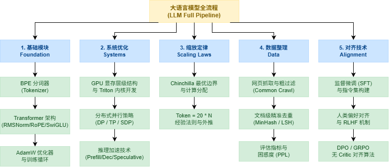

# CS336 课程笔记 01：大模型概述与分词 (Overview & Tokenization)

---

## 1. 课程背景与核心理念

### 1.1 大模型研究现状与本课程宗旨
* **技术抽象的漏洞 (Leaks in the Abstraction)**：
  在现代大模型（LLM）生态中，API 和高级框架（如 Hugging Face, LangChain）为开发者屏蔽了底层的复杂性。然而，这些抽象层并非完美无缺，它们存在“抽象漏洞”。例如：
  * **分词器（Tokenizer）的不一致行为**：空格、换行或特定字符在不同分词器下的截断逻辑不同，可能导致模型推理时表现出奇特或错误的逻辑。
  * **显存与计算资源分配的黑盒**：如果仅调用 `model.generate()`，我们无法感知 GPU 上的显存抖动、算子调度延迟以及通信瓶颈，在面临生产级超长文本或多卡部署时就会束手无策。
  
  为了进行真正前沿的 LLM 基础研究，研究人员必须具备“向下看”的能力。本课程旨在引导学生**从头（From Scratch）**亲手构建大模型全流程，打破抽象屏障，透彻理解数据、架构、系统和优化的相互作用。

* **小规模与大规模的差异**：
  在深度学习中，很多在小模型（如几百万到几千万参数）上成立的经验法则，到了大模型（如 175B 的 GPT-3）阶段会彻底失效。
  * **FLOPs 占比分布的倾斜**：
    在 Transformer 中，计算资源（以 FLOPs，即每秒浮点运算次数衡量）主要消耗在**自注意力（Self-Attention）层**和**多层感知机（MLP / FFN）层**。
    对于一个小模型，由于隐藏层维度 $d_{\text{model}}$ 较小，Attention 的计算（例如 $Q \cdot K^T$ 产生 $L \times L$ 矩阵）与 MLP 层的计算占比基本相当。
    然而，在超大规模密集型模型中，随着隐藏层维度 $d_{\text{model}}$ 的增大（如 GPT-3 175B 的 $d_{\text{model}} = 12288$），MLP 层的权重矩阵参数量呈平方级增长（从 $d_{\text{model}}$ 到 $4d_{\text{model}}$ 隐藏宽度，再投影回 $d_{\text{model}}$，每层 MLP 包含 $8 d_{\text{model}}^2$ 的参数），其计算量占比逐渐成为绝对主导（占总计算量的近 $2/3$）。
    此时，如果我们把绝大部分精力花在优化 Attention 层的算子上，可能会忽略掉真正的计算大头——MLP，从而导致优化方向的偏差。
  * **涌现现象 (Emergent Behavior)**：
    涌现现象是指模型在参数规模或训练计算量达到某个临界点（阈值）之前，在特定复杂任务（如三位数算术、符号推理、上下文学习等）上的准确率基本为零或接近随机猜测。而一旦跨越这一阈值，模型的性能会突然呈爆发式非线性增长。这种现象无法通过小模型的平滑趋势来预测，展示了“量变引起质变”的物理学现象。

* **传授的知识类型**：
  1. **基本机制与事实 (Mechanics)**：如 Transformer 的架构设计、注意力机制的矩阵乘法、GPU 显存的分层结构以及多卡并行策略。这些是 100% 可以通过教学完全掌握的硬核知识。
  2. **思维方式 (Mindset)**：**“Scaling Mindset”**——用最严肃的态度去榨取硬件的最后一滴性能，相信规模（Parameters, Data, Compute）的力量。OpenAI 团队并非仅仅依靠复杂的算法，而是率先贯彻了这种极简且坚定的 Scaling 思维。这是 100% 可以传授和复制的工程信仰。
  3. **直觉 (Intuition)**：例如“为什么某种特定的数据混合比例能让模型生成更像人类的回答？”“为什么某些超参数在规模化时能保持稳定？”由于大模型训练极其昂贵，无法反复试错，这些“直觉”只能通过小规模实验辅以物理外推来逐步建立，因此只能“部分传授”，本质上要依靠客观实验和严谨的数据统计来说话。
  
  > [!NOTE]
  > **SwiGLU 激活函数的启示**：在 LLaMA 等现代大模型中广泛使用的 SwiGLU 激活函数，在论文中甚至没有提出系统的理论数学推导，作者坦言其机制除了“神的恩赐（实验结果证明其收敛速度和效果极好）”之外，暂时无法用直觉完全解释。在大模型研究中，客观实验往往跑在理论解释的前面。

### 1.2 苦涩的教训 (The Bitter Lesson) 与算法效率
* **对 Rich Sutton “苦涩的教训”的误解**：
  许多人粗浅地将“Bitter Lesson”理解为“算法和人类的奇思妙想不重要，只有堆硬件 and 参数量才重要”。
* **正确的理解**：
  **“能够随着计算量扩大而自动增强的通用方法（Scaling Algorithms）才是最终的赢家”**。
  在巨量规模的训练中，硬件资源是最大的瓶颈。只有那些能够完美适配硬件并行、计算效率高、且能随着算力增加而不断提升性能的算法（如搜索、学习、神经网络表示）才能生存下来。
* **算法进步的摩尔定律**：
  OpenAI 在 2020 年的研究指出，在计算机视觉领域（以 ImageNet 为例），要达到 2012 年 AlexNet 的同等精度， 2019 年的最佳算法所需要的计算量下降了数十倍。这表明，算法的优化速度甚至超越了半导体硬件的“摩尔定律”。大模型时代亦是如此，通过改进架构、优化数据配比，可以实现数倍甚至数十倍的成本缩减。
* **核心追求**：
  在给定的**计算资源约束（FLOPs 预算）与训练数据预算**下，通过工程和算法设计的极致配合，构建出下游任务性能表现最佳的模型。

---

## 2. 大模型发展简史

* **早期探索阶段**：
  * **香农 (Shannon, 1948)**：信息论之父香农在其奠基性论文中，使用 n-gram 统计模型来估算英语字符和单词的信息熵，这是最早的统计语言模型雏形。
  * **Google n-gram (2007 年前后)**：Google 曾在多达 2 万亿 Token 的海量语料上训练了一个 5-gram 模型。虽然语料规模在当时惊为天人，但受限于 n-gram 算法的表达力瓶颈（无法捕获长距离语义依赖且缺乏泛化能力），它无法像今天的深度模型一样展现涌现能力。
* **深度学习革命与序列建模 (2010 年代)**：
  * **神经语言模型**：Yoshua Bengio 等人在 2003 年提出首个神经语言模型，用多层感知机来学习单词的分布式表征（Word Embedding）。
  * **序列建模与优化**：Ilya Sutskever 等人提出 Seq2Seq 架构；注意力机制（Attention）最初在机器翻译中用于解决 RNN 无法保存长输入信息的问题；Adam 优化器发布，成为大模型训练至今难以逾越的基石。
  * **Transformer 架构 (2017)**：Google 提出《Attention Is All You Need》，彻底摒弃了循环神经网络（RNN）的串行限制，将整个序列的自注意力进行并行计算，奠定了现代 LLM 的底座。
* **并行化与基础模型 (2020 年代初)**：
  * 专家混合模型（MoE）的扩展（始于 2017 年 Out-of-Core MoE 探索）；大模型并行化技术（如张量并行、流水线并行）让训练百亿参数模型成为可能。
  * **基础模型（Foundation Models）**概念兴起：如双向上下文表示的 BERT、编码-解码器架构的 T5 以及生成式的 GPT 系列。
* **Scaling Law 与开源生态的爆发**：
  * OpenAI 整合了高效工程实现、大规模高质量数据清理以及 Scaling Law 预测理论，推出 GPT-2 与 175B 的 GPT-3，向世界证明了“生成式自回归预训练”是通往通用人工智能（AGI）的一条康庄大道。
  * 开放社区逐步追赶：EleutherAI 的 GPT-NeoX、开源的 BLOOM、Meta 发布的 LLaMA 系列（引爆了整个开源生态）、阿里的 Qwen 系列、DeepSeek 系列。
* **开放性的四种层级 (Four Levels of Openness)**：
  1. **完全闭源（Fully Closed）**：仅提供商业 API 接口，对模型权重、训练细节、数据一无所知（如 GPT-4）。
  2. **仅开放权重（Weights Only）**：公开模型的权重参数，但未披露具体训练数据集、数据清洗流程或超参数细节（如 LLaMA 系列的大多数版本）。
  3. **开放权重与详细架构（Weights + Architecture Details）**：除了权重，还在技术报告中披露了大量的超参数、网络架构变动细节，但依然对训练语料的具体来源和配比保密。
  4. **完全开源（Fully Open / Open Science）**：开源所有的模型权重、完整的数据清洗与过滤流程、所有的训练代码、配比策略以及学术研究成果。

---

## 3. 课程五大支柱模块

---

## 4. 分词技术 (Tokenization)

### 4.1 基本定义与作用
分词器的本质是实现**双向、无损的数字-文本映射**：`原始字符串 ⇄ 整数序列（Tokens）`。
* **词汇表大小 (Vocabulary Size)**：表示所有可能的 Token 整数值的范围。在当前大模型中，词表大小通常在几万（如 32,000）到几十万（如 151,936）之间。
* **空格处理**：为了保留排版格式，现代分词器（如 BPE）将空格视为普通字符（或将其转为特殊字符如 `Ġ` 或 ` `）进行编码。通常将空格置于 Token 的前部（如 ` hello`），这样可以保证句子开头的词与句中的词采用相同的编码方式。
* **格式敏感性**：大模型对文本的拼写和大小写非常敏感。例如，`hello` 和 `Hello` 在分词后可能是完全不同的 Token ID。类似地，数字通常会被强行拆分为单个字符编码（如 `1`、`2`、`3` 分开），以防词表中充斥着无穷无尽的数字组合。
* **压缩比 (Compression Ratio)**：定义为原始文本的字节数与分词后 Token 数量的比值。
  $$\text{Compression Ratio} = \frac{\text{Bytes}}{\text{Tokens}}$$
  * **Bytes（分子）**：原始字符串转换为 UTF-8 编码后的总字节数。
  * **Tokens（分母）**：分词器将该字符串切分后，输出的整数 ID 的个数。
  * **概念意义**：压缩比反映了 Token 的信息携带效率。GPT 默认的 BPE 分词器在英文语料上的压缩比约为 **1.6**，这意味着平均每个 Token 代表了 1.6 个字节（大约 1.1 到 1.2 个英文单词）。如果一个分词器对中文的压缩比极低（如接近 0.5），则意味着中文文本分词后会产生极长、极稀疏的 Token 序列，严重浪费模型的上下文长度和计算算力。

### 4.2 常见分词方法对比

| 方法 | 实现方式 | 优点 | 缺点 / 挑战 |
| :--- | :--- | :--- | :--- |
| **基于字符 (Character-based)** | 将每个 Unicode 字符映射为其码点（Code Point） | 词表极小，绝无 OOV（Out-of-Vocabulary，未登录词）问题。 | 1. 词表非常稀疏，很多生僻字占用同样的通道。 2. 压缩比极其低下（接近 1:1），导致文本分词后序列长度极长。 |
| **基于字节 (Byte-based)** | 将字符串转为 UTF-8 字节序列（映射范围 0~255） | 1. 词表固定为 256，极其小巧。 2. 绝无 OOV 问题，任何语言的文本都能用字节流表示。 | 压缩比固定为 1.0 Bytes/Token，导致序列长度极长。由于 Transformer 自注意力机制计算复杂度为 $O(L^2)$，序列拉长会使计算时间与显存消耗急剧增加。 |
| **基于单词 (Word-based)** | 使用复杂的正则表达式或空格/标点强行切分单词 | 贴合人类对语言单词的语义认知。 | **OOV 问题致命**。任何在训练集中没出现过的词（如新词、错别字）都会被硬编码为 `<unk>`（Unknown Token）。这会导致模型丢失核心语义，且无法科学评估困惑度（Perplexity）。 |
| **双向自适应 BPE (Byte-Pair Encoding)** | 从字节开始，通过统计语料频率动态合并高频相邻字节对。 | **完美平衡**：无 OOV 问题，压缩比高（英文约 1.6），且词表大小可控。 | 编码（Encode）阶段算法计算复杂度高，若用 naive 方式实现则速度极慢，需要对底层代码进行深度优化（如使用双向链表和最小堆）。 |

---

### 通俗科普：字节对编码 (Byte-Pair Encoding, BPE)

BPE 是一种数据压缩算法，后来被引入到 NLP 领域用于子词分词。它的核心思想是：**“由底向上，团结就是力量”**。
我们首先把文本看作是一个个最基础的“单字节”或“单字符”，然后统计语料中哪两个相邻的字合并出现的频率最高。我们将这个最频繁出现的“组合”合并成一个新的、更长的“子词”（添加到词表中）。重复这个过程，直到我们达到了预设的词表大小。

#### BPE 核心步骤：
1. **初始化**：
   准备一个包含若干字符串的训练语料。我们统计每个词出现的频次。
   初始词表（Vocabulary）中只有基础的单字符或单字节。
2. **频率统计**：
   在语料中找到所有相邻的两个字符对，计算它们在整个语料中连续出现的总次数。
3. **寻找最高频 Pair**：
   找出连续出现次数最多的那个相邻字符对。
4. **合并与扩充**：
   将这个高频字符对合并为一个全新的 Token，并将这一合并规则（Merge Rule）记录下来。同时，在语料中把所有这一相邻字符对替换为这个新 Token。
5. **迭代**：
   重复上述步骤，直到词表大小达到设定值。

---

#### 🌟 BPE 合并过程手把手追踪示例

假设我们有以下极简语料库（每个单词结尾都加上空格或特定分界符，这里我们简化，仅统计这些词的出现频次）：
* `hug` 出现了 **5** 次
* `pug` 出现了 **6** 次
* `hugs` 出现了 **3** 次
* `pugs` 出现了 **4** 次

##### 步骤 1：初始化
将单词拆分为单字符序列，并列出初始词表。
* 拆分后的语料状态：
  * `h u g` : 5 次
  * `p u g` : 6 次
  * `h u g s` : 3 次
  * `p u g s` : 4 次
* **初始词表**：`{'h', 'u', 'g', 'p', 's'}` （共 5 个基础 Token）

##### 步骤 2：第一次迭代（统计相邻字符对频率）
我们统计所有紧挨着的两个字符的频次：
* `(h, u)` 存在于 `h u g` (5次) 和 `h u g s` (3次)，总频次 = $5 + 3 = 8$
* `(u, g)` 存在于 `h u g` (5次)、`p u g` (6次)、`h u g s` (3次)、`p u g s` (4次)，总频次 = $5 + 6 + 3 + 4 = 18$
* `(p, u)` 存在于 `p u g` (6次) 和 `p u g s` (4次)，总频次 = $6 + 4 = 10$
* `(g, s)` 存在于 `h u g s` (3次) 和 `p u g s` (4次)，总频次 = $3 + 4 = 7$

**最高频相邻对**：`(u, g)`，频次为 **18**。
* **执行合并**：将 `(u, g)` 合并为新 Token `ug`。
* **记录合并规则**：`('u', 'g') -> 'ug'`。
* **词表更新**：`{'h', 'u', 'g', 'p', 's', 'ug'}` （词表大小扩充为 6）。
* **语料库状态更新**：
  * `h ug` : 5 次
  * `p ug` : 6 次
  * `h ug s` : 3 次
  * `p ug s` : 4 次

---

##### 步骤 3：第二次迭代
重新统计当前语料库中相邻 Token 对的频次：
* `(h, ug)` 存在于 `h ug` (5次) 和 `h ug s` (3次)，总频次 = $5 + 3 = 8$
* `(p, ug)` 存在于 `p ug` (6次) 和 `p ug s` (4次)，总频次 = $6 + 4 = 10$
* `(ug, s)` 存在于 `h ug s` (3次) 和 `p ug s` (4次)，总频次 = $3 + 4 = 7$

**最高频相邻对**：`(p, ug)`，频次为 **10**。
* **执行合并**：将 `(p, ug)` 合并为新 Token `pug`。
* **记录合并规则**：`('p', 'ug') -> 'pug'`。
* **词表更新**：`{'h', 'u', 'g', 'p', 's', 'ug', 'pug'}` （词表大小扩充为 7）。
* **语料库状态更新**：
  * `h ug` : 5 次
  * `pug` : 6 次
  * `h ug s` : 3 次
  * `pug s` : 4 次

---

##### 步骤 4：第三次迭代
重新统计相邻 Token 对的频次：
* `(h, ug)` 存在于 `h ug` (5次) 和 `h ug s` (3次)，总频次 = $5 + 3 = 8$
* `(ug, s)` 仅存在于 `h ug s` (3次)，总频次 = 3
* `(pug, s)` 仅存在于 `pug s` (4次)，总频次 = 4

**最高频相邻对**：`(h, ug)`，频次为 **8**。
* **执行合并**：将 `(h, ug)` 合并为新 Token `hug`。
* **记录合并规则**：`('h', 'ug') -> 'hug'`。
* **词表更新**：`{'h', 'u', 'g', 'p', 's', 'ug', 'pug', 'hug'}` （词表大小扩充为 8）。
* **语料库状态更新**：
  * `hug` : 5 次
  * `pug` : 6 次
  * `hug s` : 3 次
  * `pug s` : 4 次

此时，如果继续迭代，我们可以将 `(pug, s)` 合并为 `pugs`（频次 4），将 `(hug, s)` 合并为 `hugs`（频次 3）。通过这种迭代，语料库中的高频子词逐步被吸收到词表中。

---

### 4.3 词汇表大小的权衡 (Vocabulary Size Trade-offs)

设计大模型的分词器时，确定多大的词表（如 30k 还是 100k）是一个核心工程决策，它涉及以下多维度的利弊权衡：

1. **序列长度 $L$ 与自注意力计算量**：
   * **小词表**：文本会被切得非常碎，这会导致生成的 Token 序列长度 $L$ 大幅增加。因为 Self-Attention 层的计算复杂度和激活值显存占用与序列长度呈二次方关系：
     $$\text{Complexity}_{\text{attn}} = O(L^2 \cdot d_{\text{model}})$$
     * $L$：Token 序列长度（Sequence Length）。
     * $d_{\text{model}}$：模型的隐藏层维度（Hidden Dimension）。
     * **概念解释**：在自注意力中，每个 Token 都要和全序列所有的 Token 计算一次点积分数（产生一个 $L \times L$ 的注意力权重矩阵）。如果序列长度 $L$ 因为分词过碎而翻倍，那么注意力得分矩阵的计算量和显存开销将直接暴增到原来的 **4 倍**。
   * **大词表**：可以更完整地合并常见词，使文本在分词后序列长度 $L$ 显著缩短，从而在训练 and 推理时极大地节省 $O(L^2)$ 带来的计算和内存开销。

2. **Embedding 与 LM Head 显存占用**：
   * 大模型的输入端有 `Embedding` 层（大小为 $V \times d_{\text{model}}$），输出端有负责分类的 `LM Head` 层（大小同样为 $V \times d_{\text{model}}$）。
   * 如果词表大小 $V$ 设得过大（例如 250k），在 $d_{\text{model}} = 8192$ 的情况下，这两个矩阵将各自包含约 20.4 亿个参数。仅仅这两层就会吃掉接近 4GB 的显存（FP16 存储下，若算上 AdamW 优化器状态则暴增至 16GB 以上）。对于参数量较小（如 1.5B 到 7B）的模型，这会占用极高比例的参数空间，挤压隐藏层用于学习深层语义的容量。

3. **数据稀疏性与梯度训练充分度**：
   * 在相同的训练语料下，词表越庞大，词表中那些生僻词、罕见词组被分出来的概率就越低。这会导致这些罕见 Token 的嵌入向量（Embedding Weights）在训练期间极少被触发，对应的参数得不到充足的梯度更新，导致表征质量低下。

---

### 4.4 BPE 编码/解码逻辑与工程优化
* **编码 (Encode)**：当有新文本输入时，分词器首先将其转为基础字节序列。随后，系统会严格按照在语料库训练时得到的 `merges` 规则的优先级顺序（即合并频次从高到低），依次对字节流进行合并替换，直至无法继续合并。
* **解码 (Decode)**：这是一个简单的查表映射过程。将整数 Token 序列直接映射回对应的字节串，然后将字节串转换成 UTF-8 字符串输出。由于 256 个基本字节都在初始词表里，因此不存在任何因“未知字符”而解码失败（OOV）的情况。

> [!WARNING]
> **作业一的性能警示**：
> 如果在编写编码（Encode）函数时，针对长文本简单地采用线性遍历所有 `merges` 规则并调用 `string.replace()` 进行匹配，其时间复杂度会随着文本长度和合并规则数量呈双重线性甚至二次方增长，编码一个大型数据集可能需要数天时间。
> **高效实现方案**：应当使用双向链表（Doubly Linked List）来维护当前的 Token 序列，并使用一个最小堆（Min-Heap）或哈希表实时维护和查找“当前相邻对中合并优先级最高的那一对”，在 $O(\log L)$ 的时间复杂度内完成一次合并，从而将分词效率提高数千倍。
