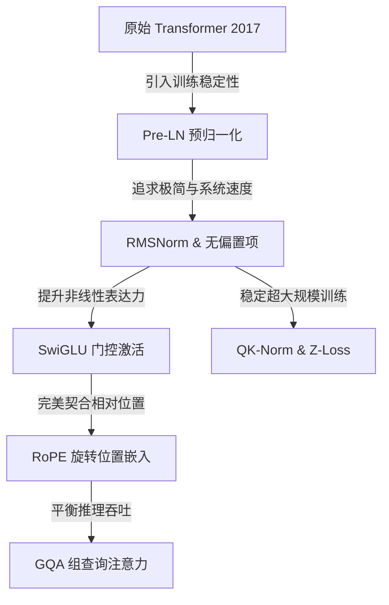
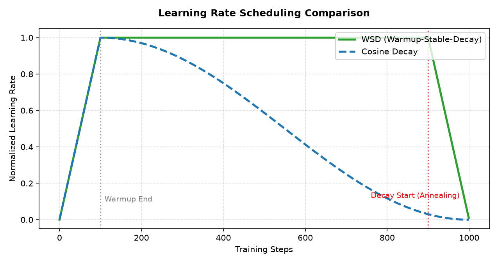

# CS336 课程笔记 03：大模型架构设计与超参数调优 (Architecture & Hyperparameters)

---

## 1. 架构变体的收敛进化 (Architectural Convergence)

从 2017 年的原始 Transformer 架构，到 2025 年以类 LLaMA 为核心的主流配置，大模型的网络架构经历了一场“趋同进化”。这一演进并非凭空想象，而是系统吞吐量优化与大模型训练稳定性双重挤压下的必然结果。

---

### 1.1 归一化位置 (Pre-LN vs Post-LN)
* **Post-LN (原始 Transformer)**：
  层归一化（Layer Normalization）置于残差连接（Residual Connection）的相加输出之后，即 $x_{t+1} = \text{LN}(x_t + \text{SubLayer}(x_t))$。
  * **问题**：在网络深层，残差路径上的梯度会由于层层 LN 梯度的连乘而发生剧烈抖动或指数级衰减。这导致深层网络在训练初期极度不稳定，必须使用极其漫长的“学习率预热（Warm-up）”来小心呵护，防止梯度崩溃。
* **Pre-LN (现代 LLM 标配)**：
  层归一化置于多头注意力和 FFN 的输入前端，而残差流本身保持无损（Identity Path），即 $x_{t+1} = x_t + \text{SubLayer}(\text{LN}(x_t))$。
  * **优势**：梯度可以直接通过残差主干（Shortcut）无损地流回网络的每一层。这极大增强了训练的稳定性，允许我们省去或大幅度缩短预热期，并使用更高的学习率。

---

### 1.2 RMSNorm 与层归一化比较

#### 1. LayerNorm (层归一化) 公式
$$\text{LN}(x) = \frac{x - \mu}{\sigma} \odot \gamma + \beta$$

* **$x \in \mathbb{R}^d$**：输入的特征激活向量，其中 $d$ 为特征通道维度。
* **$\mu \in \mathbb{R}$**：特征向量中所有元素的算术平均值（均值）：
  $$\mu = \frac{1}{d} \sum_{i=1}^d x_i$$
* **$\sigma \in \mathbb{R}$**：特征向量的方差：
  $$\sigma = \sqrt{\frac{1}{d} \sum_{i=1}^d (x_i - \mu)^2 + \epsilon}$$
  其中 $\epsilon$ 是一个极小的常数（如 $10^{-6}$），防止分母为零。
* **$\odot$**：哈达玛积（Hadamard Product），表示两个向量之间对应元素进行乘法。
* **$\gamma \in \mathbb{R}^d$** 和 **$\beta \in \mathbb{R}^d$**：可学习的缩放因子与平移偏置向量，用于恢复模型的表达能力。

---

#### 2. RMSNorm (均方根归一化) 公式
$$\text{RMSNorm}(x) = \frac{x}{\text{RMS}(x)} \odot \gamma \quad \text{其中 } \text{RMS}(x) = \sqrt{\frac{1}{d} \sum_{i=1}^d x_i^2 + \epsilon}$$

* **$\text{RMS}(x) \in \mathbb{R}$**：输入向量 $x$ 的均方根（Root Mean Square）。它衡量了特征向量的整体绝对振幅大小。
* **$\gamma \in \mathbb{R}^d$**：可学习的缩放向量（无平移偏置 $\beta$）。

---

#### 🌟 通俗科普与设计权衡：为什么 RMSNorm 能带来“免费的系统加速”？
LayerNorm 的核心思想是**“去均值（Center）”**和**“归一化方差（Scale）”**。
然而，在大模型前向传播中，特征激活向量的均值 $\mu$ 通常已经非常接近于 0。RMSNorm 提出了一个大胆的假设：**“我们只做归一化缩放（Scale），不做平移去均值（Center）”**。

这在系统底层带来了巨大的性能收益：
* **节省内存带宽**：
  在 GPU 硬件上，归一化算子（LayerNorm）属于典型的**内存受限（Memory-bound）**算子。
  * LayerNorm 需要先算一遍均值 $\mu$，再算一遍方差 $\sigma$。这意味着 GPU 必须把特征数据从全局显存（VRAM）搬运到片上寄存器（SRAM）多次。
  * RMSNorm 移除了均值计算，只需要一步计算均方根即可。这使得 GPU 读写次数（Memory Traffic）减半，在底层 CUDA 内核实现中能实现约 **5% 的整机运行速度提升**。而模型最终的精度表现与 LayerNorm 几乎完全一致。

---

### 1.3 FFN 激活函数与门控线性单元 (GLU)

#### 1. GELU (高斯误差线性单元) 公式
$$\text{GELU}(x) = x \cdot \Phi(x) \approx 0.5 x \left( 1 + \tanh\left(\sqrt{\frac{2}{\pi}} \left(x + 0.044715 x^3\right)\right) \right)$$

* **$x$**：输入实数。
* **$\Phi(x)$**：标准正态分布的累积分布函数（CDF）。
* **tanh 表达式**：由于 CDF 计算复杂，在工程上通常采用右侧的 tanh 函数进行高精度数值近似。
* **概念**：GELU 会根据输入值 $x$ 的大小，以概率（CDF）形式决定是否“放行”该值。对于较大的正数放行，较小的负数归零，具备平滑的非线性特征。

---

#### 2. SwiGLU (Swish 门控线性单元) 公式
$$\text{SwiGLU}(x) = \left( \text{Swish}(xW) \odot xV \right) U$$

* **$x \in \mathbb{R}^{d_{\text{model}}}$**：FFN 层的输入向量。
* **$W \in \mathbb{R}^{d_{\text{model}} \times d_{ff}}$** 和 **$V \in \mathbb{R}^{d_{\text{model}} \times d_{ff}}$**：两个平行的线性投射权重矩阵，将特征映射到高维空间。
* **$\text{Swish}(z) = z \odot \sigma(\beta z)$**：非线性激活函数，通常 $\beta=1$（即 $\text{SiLU}$）。
* **$\odot$**：哈达玛积（元素对应相乘）。
* **$U \in \mathbb{R}^{d_{ff} \times d_{\text{model}}}$**：输出投影矩阵，将特征映射回原始通道空间。

---

#### 🌟 通俗科普：GLU (门控线性单元) 的“水管阀门”机制
想象一下浇水的水管，水管里流的水是**“信息流（Value Path）”**，水管上的阀门是**“控制信号（Gate Path）”**。
* 传统的激活函数（如 GELU/ReLU）是一个“单路”结构，自己决定自己的放行比例。
* **GLU 引入了“双路双轨制”**：
  * **第一条通路**（$xV$）：不经过复杂的非线性激活，作为纯粹的信息载体（Value）。
  * **第二条通路**（$\text{Swish}(xW)$）：作为阀门控制器（Gate），其输出介于 $0 \sim 1$ 之间。
  * 将两路进行**元素级乘法（$\odot$）**，就像用阀门乘上信息流：如果阀门算出来是 0，这条管道的信息就被掐断；如果阀门算出来是 1，信息就无损通过。
  
  这种“乘法门控”机制相比传统单路激活具有极佳的数学性质，其梯度传递更加平滑，能自适应地控制信息过滤流向，在大模型训练中收敛速度更快，效果显著更优。

* **参数量对齐折中**：
  因为 SwiGLU 相比传统 FFN 多出了一个权重矩阵 $V$，这使得参数量暴增了 50%。
  为了不作弊，我们需要在对比时缩小 SwiGLU 的中间通道宽度 $d_{ff}$：
  * 传统 FFN 宽度：$d_{ff} = 4 d_{\text{model}}$。
  * **SwiGLU 宽度对齐**：设为 $d_{ff} \approx \frac{8}{3} d_{\text{model}} \approx 2.66 d_{\text{model}}$。

---

### 1.4 旋转位置嵌入 (RoPE, Rotary Position Embedding)

#### 🌟 通俗科普与几何直观：为什么要在 2D 平面旋转向量？
在大模型计算注意力时，我们需要让模型知道 Token 之间的**位置先后关系**。
传统的绝对位置编码（如三角函数编码）是强行在底部的 Embedding 向量上加上一个位置向量。然而，这无法在数学上优雅地传达“相对距离（Relative Distance）”。
RoPE 提出了一个极具艺术感的物理学几何思路：
* 我们把 Query 和 Key 的高维向量（如 128 维的一个 Head），切分成 64 个两两一组的 **2D 二维平面**。
* 对于位于绝对位置 $m$ 的 Token，我们把它的 Query 向量在每一个 2D 平面上**旋转一个特定角度 $m\theta$**。
* 同样地，对于位于绝对位置 $n$ 的 Token，我们把它的 Key 向量在 2D 平面上**旋转一个角度 $n\theta$**。

当我们对旋转后的 Query 和 Key 计算点积时，根据高中的三角函数恒等式，点积的数学结果中绝对位置 $m$ 和 $n$ 会相互抵消，**只剩下一个与它们相对距离 $(n-m)\theta$ 相关的旋转差角**！

#### RoPE 2D 旋转数学表达
对于一个 2D 特征向量 $x = [x_1, x_2]^T$（位于绝对位置 $m$）：
$$\mathbf{R}_{m, \theta} \begin{pmatrix} x_1 \\ x_2 \end{pmatrix} = \begin{pmatrix} \cos(m\theta) & -\sin(m\theta) \\ \sin(m\theta) & \cos(m\theta) \end{pmatrix} \begin{pmatrix} x_1 \\ x_2 \end{pmatrix}$$

* **$\mathbf{R}_{m, \theta}$**：2D 旋转变换矩阵，旋转角为 $m\theta$。
* **$\theta$**：基础旋转频率系数（默认通常设为 $\theta_i = 10000^{-2(i-1)/d}$）。
* **点积性质**：
  $$\langle \mathbf{R}_{m, \theta} \mathbf{q}, \mathbf{R}_{n, \theta} \mathbf{k} \rangle = \mathbf{q}^T \mathbf{R}_{n - m, \theta} \mathbf{k}$$
  * 这在数学上证明了：旋转向量后的自注意力得分，完全取决于两个 Token 之间的**相对位置差 $n-m$**。

#### 为什么 RoPE 更有利于上下文长度外推（Context Extrapolation）？
因为相对旋转具有良好的周期性和衰减性质。如果我们想让一个只在 4k 长度训练的模型理解 32k 的文本，我们不需要重新训练。我们只需要在推理时**把旋转频率 $\theta$ 调小**（即拉伸旋转角度，如 NTK-Aware Scaling 算法），这样 32k 的相对距离产生的差角就会被缩放到 4k 训练范围以内，模型能够无缝理解长文本。

---

### 1.5 为什么现代预训练中淘汰了 Dropout？
* **直观设计论点**：在传统深度学习中，Dropout 是防止过拟合的标配（随机丢弃神经元激活值）。然而，在现代大规模语言模型的**预训练（Pre-training）**阶段，模型几乎普遍被设置为 **Single-pass (仅训练一轮 / 1 Epoch)** 模式。
* **淘汰原因**：在大数据量预训练下，由于模型终生只会看到每个 Token 一次，训练数据集极其庞大，模型在数学上根本不存在过拟合的可能（它们甚至无法将预训练语料“看完”）。在这种情况下，引入 Dropout 不仅会人为降低有效模型容量，还会减缓优化器的收敛速度，白白浪费数十万美元的算力。因此，现代大模型（如 LLaMA、GPT-4）在预训练时会将 Dropout 设置为 0。

---

## 2. 稳定性调优秘籍 (Stability Hacks)

大模型在训练到数万步、参数规模极大时，常常会毫无征兆地发生 **Loss Spikes（损失值尖峰暴增，随后模型崩溃不收敛）**。这主要是因为 Softmax 的指数敏感性导致梯度在深层网络中失控。以下是近年工业界探索出的两大核心稳定性 Hack：

### 2.1 QK-Normalization (QK-Norm)

#### 🌟 为什么 Self-Attention 在大维度下会崩溃？
在 Attention 计算中，Query 与 Key 向量做点积：
$$\text{AttentionScores} = \frac{Q K^T}{\sqrt{d_k}}$$

* 设单个 Head 的维度为 $d_k$。如果向量 $q$ 和 $k$ 的每个元素都是均值为 0、方差为 1 的独立随机变量，那么它们的点积 $q^T k$ 的均值为 0，**方差会直接膨胀为 $d_k$**。
* 随着模型规模变大，我们往往会增大 $d_k$（如增大到 128 或 256）。如果不加控制，点积的数值波动会非常剧烈。
* 当巨大的数值输入到 $\text{Softmax}$ 算子中时，$\text{Softmax}$ 会发生**数值饱和（Saturation）**：其中一个位置的权重极度接近 1.0，而其他所有位置的权重无限接近 0.0。
* **饱和的后果**：Softmax 局部的数学导数会趋近于 0，导致**梯度瞬间消失**。而在其他方向上，突然发生的扰动又会产生极其巨大的瞬间反向梯度，使得模型权重被彻底震毁。

#### QK-Norm 公式
为了根治这一现象，QK-Norm 提出：在 Query 与 Key 进行点积之前，**强行对它们各做一次 RMSNorm**：
$$\tilde{Q} = \text{RMSNorm}(Q), \quad \tilde{K} = \text{RMSNorm}(K)$$
$$\text{AttentionScores} = \text{Softmax}\left( \frac{\tilde{Q} \tilde{K}^T}{g} \right)$$

* **$g$**：一个固定的缩放常数（通常设为 $\sqrt{d_k}$），或者一个可学习的标量参数。
* **效果**：通过归一化，Query 和 Key 向量的模长被强行锁死在稳定范围内，消除了点积对 $d_k$ 的依赖和过度波动，从根本上防止了 Softmax 饱和与梯度消失，已被 Gemma2 和 OLMo2 等新型开源大模型广泛采纳。

---

### 2.2 Z-loss 正则化

#### 🌟 为什么 Logits 会无限飘移？
在模型输出的最后一层，我们使用 Softmax 预测词表中每个词的概率。
$$\text{Probability}_i = \frac{e^{y_i}}{\sum_{j=1}^V e^{y_j}}$$

在标准交叉熵损失下，模型仅关心 Logits 之间的**相对差值**。如果我们将所有的 $y_i$ 加上一个极大的常数 $C$（如 $y_i + 100$），由于分子分母的指数项同时乘以 $e^{100}$，输出的概率和 Cross Entropy 损失函数值是完全不变的。
这导致模型在训练时，Logits 的绝对数值会不受控制地越飘越大，甚至达到上百。然而，在 FP16 或 BF16 半精度下，**$e^{100}$ 会直接触发浮点数溢出（得到 `NaN`）**，导致训练中断。

#### Z-loss 公式
为了将 Logits 牢牢拴住，Z-loss 在总损失函数中加入了一个非常微小的惩罚项：
$$\mathcal{L}_{z} = \alpha \log^2 Z(x) \quad \text{其中 } Z(x) = \sum_{i=1}^V e^{y_i}$$

* **$V$**：词汇表大小（Vocabulary Size）。
* **$y_i$**：最后一层模型输出给词表中第 $i$ 个词的原始 Logit（未经过 Softmax 的分数值）。
* **$Z(x)$**：分母归一化配分函数（Partition Function），即所有 Logits 取指数后的加和。
* **$\log Z(x)$**：配分函数的对数。
* **$\alpha$**：控制正则化力度的超参数（通常设为极小的值，如 $10^{-4}$ 或 $10^{-5}$）。
* **惩罚原理**：
  如果所有的 $y_i$ 绝对值都很小（比如在 0 附近），那么 $e^{y_i} \approx 1$，$Z(x) \approx V$（词表大小）。
  当 Logits 被整体拉得极大时，$\log^2 Z(x)$ 会以二次方速度暴增。
  Z-loss 正则化项会强迫 $\log Z(x)$ 逼近 0（即强制 $Z(x) \rightarrow 1$）。这迫使所有的 $y_i$ 只能在 0 附近波动，从根本上消除了 Logits 飘溢和浮点溢出（NaN）的风险。

---

### 2.3 软上限控制 (Logits Soft-clipping/Soft-capping)
* **背景科普**：在 Gemma 2 或 OLMo 2 中，为了防止注意力 Logits 值过大引起数值溢出，采用了软上限限制。它是通过 $\text{Soft-cap}(x) = \text{c} \times \tanh(\frac{x}{\text{c}})$ 公式对 Logits 进行截断，其中 $\text{c}$ 是常数上限。
* **与 QK-Norm 的对比权衡**：QK-Norm 是一种更为主动的激进稳定手段（直接对 Q 和 K 归一化），而软上限在实际训练中被 NVIDIA 等机构实测发现，当强制截断时可能会略微损害模型的基线困惑度（Perplexity）。相反，QK-Norm 不仅在稳定性上更佳，而且它允许优化器使用更大的学习率来加快收敛，是目前更主流的稳定性选择。

---

## 3. 学习率调度：Cosine 与 WSD 的抉择

大模型的学习率（Learning Rate, LR）不能一成不变，必须随着训练进行而动态衰减。

### 3.1 Cosine Decay (余弦衰减)
* **机制**：学习率在 Warm-up 阶段线性爬升至顶点后，遵循余弦函数曲线缓慢下降至接近于 0。
* **公式**：
  $$\eta_t = \eta_{\text{min}} + \frac{1}{2}(\eta_{\text{max}} - \eta_{\text{min}})\left(1 + \cos\left(\frac{\pi t}{T_{\text{max}}}\right)\right)$$
  * **$\eta_t$**：当前第 $t$ 步的学习率。
  * **$\eta_{\text{max}}$ 和 $\eta_{\text{min}}$**：预设的最大学习率（Peak LR）与底线最少学习率。
  * **$t$**：当前的训练 Step 数。
  * **$T_{\text{max}}$**：**预先规划好的总训练 Step 数**。
* **致命痛点**：
  Cosine 调度是**与总训练 Step 数 $T_{\text{max}}$ 强绑定的**。一旦我们在中途（比如训练到一半时）突然想追加 5 万亿 Token 的数据，我们无法直接在原进度上延长，必须将 $T_{\text{max}}$ 修改并从头重新训练（或者忍受极差的非平滑衰减），这在大规模持续训练（Continual Training）中是灾难性的。

### 3.2 WSD (Warmup-Stable-Decay)
* **机制**：
  1. **Warmup（预热）**：学习率用极短的时间从 0 线性上升到最高峰值。
  2. **Stable（平稳）**：**学习率在 80% ~ 90% 的绝大多数训练时间内，保持在最高峰值不动**！
  3. **Decay（衰减）**：在临近训练结束的最后 10% 左右时间内，学习率进行快速指数衰减或线性衰减至零。
* **革命性优势**：
  WSD 具有极佳的**持续扩展性**。因为在绝大多数 Stable 阶段，学习率是恒定的。如果我们想无限追加新语料进行训练，**只需要将 Stable 阶段一直拉长即可**！只有当我们确定要收尾出货时，才手动开启最后的 Decay 阶段。这为大模型的迭代研发提供了无与伦比的工程便利。

---

### 3.3 学习率退火（LR Annealing）阶段的暴跌现象与启发
* **直观现象**：在训练大模型时，如果保持恒定的高学习率进行训练，模型的损失（Loss）可能在高位持续波动，看似训练效果很差，并伴随巨大的梯度噪音。但是，一旦触发学习率向下退火（Annealing，例如在 WSD 的 Decay 阶段将学习率骤降至接近 0），**损失值（Loss）会突然发生戏剧性的巨大暴跌**。
* **启发性观点**：高学习率在训练前期有助于模型在全局参数空间中快速探索，避免陷入较浅的局部极小值；而退火阶段的降温则能使参数“沉降”进局部极窄、极深的尖锐山谷中。因此，不能仅凭高学习率阶段的 Loss 表现来断定模型训练的失败，必须等退火完成后才能评估其真实性能。

---

## 4. 推理视角的注意力变体 (Attention for Inference)

### 4.1 MQA 与 GQA 机制

#### 🌟 为什么推理是“内存带宽瓶颈”？
在自回归（Autoregressive）推理生成文本时，模型每吐出一个新 Token，都需要将过去所有已经生成的 Token 的 Key 向量和 Value 向量拿出来做注意力和加权。为了避免重复计算，我们会把它们存在显存里，称为 **KV Cache**。
在推理服务中，随着 Batch Size 和并发量增大，GPU 显存会完全被 KV Cache 塞满。因为每次生成 1 个 Token，GPU 都得把这几个 GB 的 KV Cache 从显存搬运到计算芯片里，这导致**推理速度受限于显存搬运带宽，而不是 GPU 算力**。

* **MHA (Multi-head Attention)**：
  每个 Query 头都有自己专属的 Key 头和 Value 头。KV Cache 显存占用极大。
* **MQA (Multi-query Attention)**：
  所有的 Query 头（比如 32 个）**强行共享同一个 Key 头和 Value 头**。
  * **收益**：KV Cache 显存占用直接缩减到原来的 $1/32$，搬运速度极快。
  * **代价**：模型表达能力下降，注意力难以捕捉多元的相对信息。
* **GQA (Grouped-query Attention - 黄金折中)**：
  Query 头进行分组（如 8 个 Query 头为一组）。**每一组共享一个 Key 头和 Value 头**。
  * **收益**：既保留了接近 MHA 的超强表达能力，又将 KV Cache 的显存消耗降低了数倍，在吞吐量与模型精度之间达到了最完美的工程平衡，是当今 LLaMA3、Qwen2 等旗舰模型的首选。
