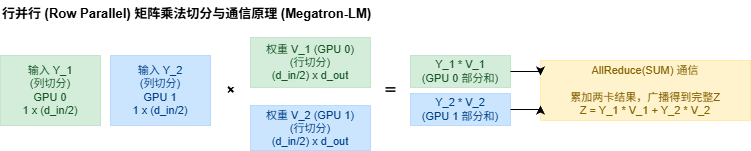

# 详解大模型并行化策略

## 1. 分布式计算拓扑与网络通信基础

### 1.1 硬件带宽层级结构
在多机多卡的大模型训练中，网络连接呈明显的异构分层结构：
* **机内互连 (Intranode)**: 同一台物理机器内的 GPU（如 8 张 H100）通过 NVLink/NVBranch/NVSwitch 高速总线互联，单向/双向带宽极高（H100 NVLink 双向带宽达 900 GB/s）。
* **机间互连 (Internode)**: 跨机器通信必须经过网络交换机（通过 InfiniBand 或以太网），带宽通常比机内 NVLink 慢约 **8 到 10 倍**，且延迟大幅增加。
* **拓扑对比 (GPU vs. TPU)**:
  * **GPU 集群**: 常用叶-脊（Leaf-Spine）交换机结构，机内全互联高速通信，跨机则带宽突变变窄；
  * **TPU 集群**: 采用 3D/4D 环形网格（Torus Mesh）网络架构，每个芯片仅与相邻节点极快通信。该结构虽非全互联，但能通过环形路由实现极其高效的集体通信。

### 1.2 核心集体通信原语 (Collective Communication)
* **AllReduce**: 对所有进程的数据进行某种数学归约（如求和），然后将结果分发给所有进程。通信开销约为数据量的 **2 倍**。
* **Broadcast**: 将单个进程的数据复制并广播到所有进程。
* **Reduce**: 对所有进程的数据求和归约，但结果仅发送给一个指定进程。
* **AllGather**: 从所有进程收集数据切片，拼成完整数据后分发到所有进程。
* **ReduceScatter**: 归约所有进程的数据，但仅将归约后的对应分片分散保留在各个进程。
* **核心恒等式**:
  $$\text{AllReduce} = \text{ReduceScatter} + \text{AllGather}$$
  *在带宽受限场景下，将一个 AllReduce 操作拆分为这两个步骤分别执行，两者的总通信量与单次 AllReduce 完全一致。这为优化器状态分片（ZeRO）提供了理论支持。*

---

## 2. 数据并行与 ZeRO (Zero Redundancy Optimizer)

### 2.1 朴素数据并行 (DDP, Distributed Data Parallelism)
* **思想**: 数据并行是最简单也最常用的并行方式。每个 GPU 上都完整地复制一份模型权重。
* **运行机制与 AllReduce 梯度同步**:
  1. **数据切分**: 每个 GPU (Rank) 获得全局 Batch 的一个子集（即 Local Batch）。
  2. **前向传播**: 各 GPU 独立执行前向传播，计算出各自的 Loss。
  3. **反向传播与 AllReduce**: 在反向传播过程中，当各层计算出参数的梯度时，DDP 在后台自动触发 **AllReduce(SUM)** 操作，在所有 GPU 之间对梯度求和并求平均。
  4. **参数更新**: 一旦所有梯度的 AllReduce 完成，每个 GPU 上的优化器独立执行 Step，更新本地权重。由于所有 GPU 初始权重一致，且更新所用的平均梯度一致，因此更新后的模型权重在各卡间保持绝对同步。
* **局限性**: 随着模型增大，单个 GPU 显存装不下完整的模型参数、梯度和优化器状态（静态显存爆炸），此时朴素 DDP 就会发生 OOM。

### 2.2 大模型训练的显存开销拆解
在 BF16/FP16 混合精度训练中（以 Adam 优化器为例），每参数会消耗大约 **16 字节** 的静态显存：
1. **参数 (Parameters)**: FP16/BF16 存储，占 **2 字节**/参数；
2. **梯度 (Gradients)**: FP16/BF16 存储，占 **2 字节**/参数；
3. **优化器状态 (Optimizer States)**: FP32 存储（确保更新精度），占 **12 字节**/参数：
   * FP32 副本主权重 (Master Weights)：**4 字节**；
   * FP32 动量一阶矩 (Momentum)：**4 字节**；
   * FP32 动量二阶矩 (Variance)：**4 字节**。
* **结论**: 优化器状态占用了近 75% 的模型显存开销。

### 2.3 ZeRO 显存优化三阶段 (ZeRO Stages)
ZeRO 的思想是通过分片消除冗余显存：
1. **ZeRO-1 (优化器状态分片)**:
   * **原理**: 将 12 字节的 Adam 状态均分到 $N_d$ 个 GPU 上。每个 GPU 仅保存 $1/N_d$ 状态，并只更新其对应的 $1/N_d$ 参数。
   * **通信**: 计算出完整梯度后，通过 `ReduceScatter` 归约并将梯度分配给各 GPU。更新后，执行一次 `AllGather` 同步更新后的参数。
   * **效果**: 显存大幅降低，且**通信开销与朴素 AllReduce 相同**。
2. **ZeRO-2 (梯度分片)**:
   * **原理**: 同样分片梯度。在前向与反向传播中，当某层计算完梯度后，GPU 立即将该层梯度 `ReduceScatter` 到负责对应参数分片的工作节点上，并立即释放本地显存。
   * **效果**: 显存开销进一步下降。
3. **ZeRO-3 (参数分片)**:
   * **原理**: 参数本身也被均分分片。没有任何一块 GPU 拥有完整的模型参数。
   * **运行流程**: 
     * **前向**: 计算第 $n$ 层前，所有 GPU 通过一次 `AllGather` 临时拼接出完整的第 $n$ 层权重。计算完该层前向后，**立即释放该权重显存**。
     * **反向**: 反向传播到第 $n$ 层时，再次通过 `AllGather` 获取该层权重，计算梯度后释放权重，并利用 `ReduceScatter` 同步与分散存储梯度。
   * **通信开销**: 通信量增大为原本数据并行的 **1.5 倍**（总计 3 倍参数量的传输，而 DP 仅需要 2 倍）。
   * **预取优化 (Overlap)**: 通过将通信与计算重叠（在计算当前层前向时，利用另一流在后台提前 `AllGather` 获取下一层权重），能掩盖大部分参数搬运延迟。

---

## 3. 模型并行策略 (Model Parallelism)

当模型规模极其庞大，以至于 ZeRO-3 依然装不下时，或者为了在固定批大小下加速训练，必须使用模型并行。

### 3.1 张量并行 (Tensor Parallelism, TP, Megatron-LM)
张量并行是由 NVIDIA Megatron-LM 提出的一种在 **算子内部** 进行分片的强力模型并行策略。它针对 Transformer 的多头注意力机制（Self-Attention）和前馈网络（MLP）中的矩阵乘法进行切分。

#### 1. MLP 层的张量并行
Transformer 的 MLP 层通常包含两个连续的矩阵乘法：
$$Y = \text{GELU}(X W), \quad Z = Y V$$
其中 $W$ 为 Gate/Up 投影矩阵（特征维度从 $H$ 放大到 $4H$），$V$ 为 Down 投影矩阵（特征维度从 $4H$ 缩小到 $H$）。

* **第一层：列并行 (Column Parallel)**:
  * 将权重矩阵 $W$ 按列拆分为 $W = [W_1 \mid W_2]$（假设 2 张 GPU）。
  * 输入 $X$ 在所有 GPU 上保持完整（被复制一份）。
  * 各 GPU 并行计算其对应的列投影：$Y_1 = \text{GELU}(X W_1)$，$Y_2 = \text{GELU}(X W_2)$。
  * 此时，输出数据以特征维度分片的形式保存在各显卡上，**不需要任何通信**。

* **第二层：行并行 (Row Parallel)**:
  * 为了直接承接第一层输出的 $[Y_1 \mid Y_2]$，我们将第二层的权重矩阵 $V$ 按行拆分为 $V = \begin{bmatrix} V_1 \\ V_2 \end{bmatrix}$。
  * GPU 0 计算 $Y_1 V_1$，GPU 1 计算 $Y_2 V_2$。
  * 最终的输出为：$Z = Y_1 V_1 + Y_2 V_2$。为了得到这个相加后的完整输出 $Z$，必须将各 GPU 的本地结果进行累加。因此，在这里需要执行一次 **AllReduce(SUM)**。

#### 2. 自注意力层 (Self-Attention) 的张量并行
注意力机制包含 $Q, K, V$ 投影和 Output 投影。
* **QKV 投影：列并行 (Column Parallel)**:
  将 $W_q, W_k, W_v$ 按照 Head 的维度在列方向切分。例如，GPU 0 负责计算第 $1 \sim H/2$ 个 Head 的 $Q_1, K_1, V_1$；GPU 1 负责计算其余 Head 的 $Q_2, K_2, V_2$。各 GPU 独立计算自注意力，输出 $[Attention_1 \mid Attention_2]$。此阶段**无需通信**。
* **Output 投影：行并行 (Row Parallel)**:
  将 Output 投影矩阵 $W_o$ 按行切分。各 GPU 将本地自注意力输出与本地 $W_o$ 分片相乘，最后通过一次 **AllReduce(SUM)** 汇总，输出最终的完整 Attention 结果。

#### 3. TP 的通信开销与物理限制
* **通信开销**: 在一个标准的 Transformer Block 内，前向传播仅需要 **2 次 AllReduce**（一次在 Self-Attention 末尾，一次在 MLP 末尾），反向传播也对应需要 2 次 AllReduce（在相反方向将 AllReduce 转换为 AllGather/ReduceScatter）。
* **网络限制**: 由于每次 AllReduce 传输的数据量大，且位于前向传播的计算关键路径上，任何网络延迟都会直接导致计算核心闲置。因此，**TP 必须限制在机内高速 NVLink 带宽内执行（一般 TP $\le 8$）**。跨机器使用 TP 会导致整体吞吐量呈灾难性暴跌。

---

### 3.2 流水线并行 (Pipeline Parallelism, PP)
流水线并行是将模型的层（按深度方向）切分到一长串 GPU 链条上。GPU 0 计算前几层，将中间激活值通过点对点通信（P2P）发送给 GPU 1，以此类推。

#### 1. 流水线气泡 (Pipeline Bubble)
如果直接将一个全局大批次（Global Batch）送入流水线，会导致在同一时刻只有一台 GPU 在计算，其余 GPU 都在眼巴巴地等待上游的数据或下游的梯度。这种闲置时间被称为 **流水线气泡 (Pipeline Bubble)**。
为了减小气泡，我们需要将全局大批次拆分为 $M$ 个 **微批次 (Micro-batches)**。

#### 2. GPipe 调度与 1F1B 调度对比

##### GPipe 调度 (微批次堆叠)
在 GPipe 中，所有微批次的前向传播必须全部执行完毕，才能开始执行反向传播。
* **气泡比例**: 较高。
* **运行时间线对比 (以 4 个阶段/GPU，4 个微批次为例)**:
  * $F_i$ 表示第 $i$ 个微批次的前向传播，$B_i$ 表示反向传播。我们使用由 Draw.io 精准绘制的甘特时间线图对 GPipe 和 1F1B 的调度方式以及气泡分布进行对比：

##### 为什么 1F1B 能显著降低显存？
在前向传播中，计算出的中间激活值（Activations）必须一直保存在显存中，直到反向传播计算梯度时被使用。
* **GPipe 显存瓶颈**:
  在 GPipe 中，所有 $M$ 个微批次的前向传播（$F_0 \sim F_{M-1}$）必须全部跑完。这意味着 GPU 0 必须同时在显存中保留所有 $M$ 个微批次的激活值。如果 $M$ 很大（如 32 或 64），显存将瞬间被打爆。
* **1F1B 显存优势**:
  在 1F1B 中，一旦某个微批次的前向传播完成，且其下游的反向传播梯度传回，该微批次的反向传播（如 $B_0$）就会立即被执行。执行完 $B_0$ 后，**$F_0$ 对应的激活值显存会被立刻释放**。
  在稳态阶段，任何一个 GPU 上同时处于“存活”状态的微批次激活值数量，最大被限制在 **流水线阶段数 (Pipeline Stages, $P$)** 左右，而与总微批次数量 $M$ 无关。这使得我们可以通过极大地增加微批次数量 $M$ 来稀释气泡比例，而完全不用担心显存溢出。

---

## 4. 序列并行与激活显存管理

### 4.1 激活显存瓶颈 (Activation Memory)
* 随着序列长度 $S$ 和批次大小 $B$ 增加，激活显存（用于反向传播的中间结果）呈 $O(S \cdot B \cdot H)$ 甚至 $O(S^2 \cdot B)$ 爆炸增长，成为大模型训练中甚至超越参数本身的最大显存瓶颈。

### 4.2 序列并行 (Sequence Parallelism, SP)
* **痛点**: 张量并行（TP）仅能分片矩阵乘法。但对于层归一化（LayerNorm）和 Dropout 等逐元素操作，它们不被 TP 分割，因此其对应的激活值必须在所有 TP 设备上完整复制，导致这部分激活显存随着设备增加依然无法被削减。
* **方案**: 
  * 在 LayerNorm 和 Dropout 步骤时，将数据沿**序列长度维度 (Sequence Dimension, S)** 进行切分，各设备仅并行处理一部分 Token 的归一化。
  * **联合机制**: 跨越到矩阵乘法时，通过 `AllGather` / `ReduceScatter` 重新对齐为 TP 的列/行并行布局。通过与 TP 结合，可以彻底消除未并行的激活冗余，使得整机激活显存随设备数 $t$ 线性下降。

---

## 5. 混合并行 (3D/4D Parallelism) 设计经验法则

当训练超大规模模型时，需要协同数据并行（DP）、流水线并行（PP）和张量并行（TP），形成 3D 并行，并合理分配有限的**全局批量大小 (Global Batch Size)** 这一关键资源：

1. **第一优先级：塞入内存 (Fit to Memory)**:
   * 优先使用**张量并行 (TP)**，但其尺寸最多扩充至单机 GPU 上限（通常为 8），利用机内最快的 NVLink 带宽。
   * 若仍无法塞下，开启**序列并行 (SP)** 与**激活重计算 (Recomputation)**。
   * 若仍无法塞下，开启**流水线并行 (PP)**，跨物理节点分配模型权重。
2. **第二优先级：扩展算力 (Scale Up to Cluster)**:
   * 在模型可以被装入内存后，使用**数据并行 (DP / ZeRO-1 / ZeRO-2)** 将模型复制到集群中所有富余的物理机器上，以尽可能吞噬全局批次数据，提高整体计算吞吐。
3. **低批次应对策略**:
   * 若由于数学收敛限制，全局批大小很小，限制了 DP 扩展度，则可以使用**梯度累积 (Gradient Accumulation)** 在时间上隐式扩大批大小，用更少的跨机同步换取通信效率。
