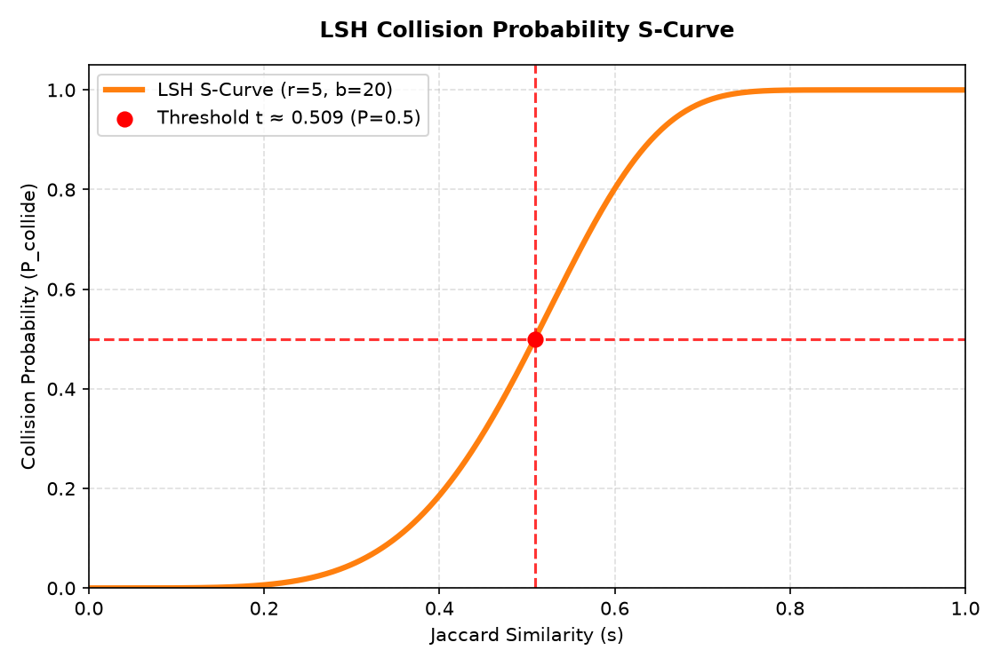

# CS336 课程笔记 14：实战数据过滤与去重 (Data Filtering and Deduplication in Practice)

在处理海量互联网数据（如 Common Crawl）时，数据清洗管道（Data Cleaning Pipeline）的构建至关重要。本节深入探讨了模型驱动的**数据质量过滤**与**去重算法**的数学原理、设计权衡及实战细节。

---

## 一、 数据过滤算法框架

### 1. 抽象问题定义
给定一个规模较小的高质量目标数据集 $T$（如教科书或维基百科）和一个规模极大的原始网页数据集 $R$（如 Common Crawl）。数据过滤的目标是高效地从 $R$ 中找出与 $T$ 相似的子集 $T'$：
$$T' = \{d \in R \mid \text{Score}(d) > \theta\}$$
算法必须满足两个核心要求：
1. **泛化性（Generalization）**：能够学到高质量文本的深层特征（语法结构、构词规范、逻辑连贯性），而不只是机械匹配 $T$ 中的原词。
2. **极高的计算效率（Efficiency）**：必须能在数百亿级别的文档上运行，过滤成本需远低于模型训练本身（通常控制在训练算力的十分之一以内）。

### 2. 基于 N-gram 模型与困惑度（Perplexity, PPL）的过滤

#### ① 为什么能在 Wikipedia 上训练的模型可以过滤垃圾文本？
一个在高质量文本（如 Wikipedia）上训练的语言模型，其内部概率分布反映了语法规范、拼写正确、行文流畅的人类高标准写作规律。
当面对包含大量 SEO 垃圾广告、机器生成的无意义词汇堆砌，或者网页爬取残留的 JavaScript 代码等“脏文本”时，语言模型会对其感到极其意外和难以预测。因为在维基百科的语料分布中，诸如 `“buy discount cheap click here”` 或由乱码构成的词序的转移概率极低。
这种“意外程度”在数学上通过**困惑度（Perplexity）**来度量。

#### ② 判定指标与数学定义
对于包含 $L$ 个单词的文档 $d = (w_1, w_2, \dots, w_L)$，我们使用 $N$-gram 模型估计条件概率：
$$P(w_n \mid w_{1:n-1}) \approx P(w_n \mid w_{n-N+1:n-1}) = \frac{\text{Count}(w_{n-N+1:n})}{\text{Count}(w_{n-N+1:n-1})}$$
在 $N$ 较大时会面临维度灾难和数据稀疏性问题，通常采用 **Kneser-Ney 平滑** 技术，通过回退（Back-off）或插值到低阶 $N$-gram 模型分配概率。工业界常用开源统计语言建模工具 **KenLM** 进行极快速的估计。

文档 $d$ 在该语言模型下的困惑度 $\text{PPL}(d)$ 定义为：
$$\text{PPL}(d) = \exp\left( -\frac{1}{L} \sum_{i=1}^L \log P(w_i \mid w_{1:i-1}) \right)$$
* **低 PPL**：代表模型预测这些词非常顺手，文档十分契合维基百科的高质量语言规律。
* **高 PPL**：代表模型极其困惑，说明文档语法混乱、错别字多、或是代码/垃圾广告噪音。

#### ③ 局限性
* **文风偏见**：PPL 偏向于与训练集文风绝对一致的内容，容易误杀高质量但小众领域（如医学、数学专业论文）或非传统口语表达的文本。
* **局域局限**：$N$-gram 模型无法捕捉长距离依赖，无法识别被打乱了句序但局部词组看似通顺的文本。

### 3. 基于线性分类器（fastText）的过滤

#### ① 设计原理
为了在数百亿级别的网页上进行分类，深度神经网络（如 BERT、LLaMA）的推理算力开销过大。Meta 研发的 **fastText** 是专门为文本分类优化的高效模型。
* **极简的网络架构**：fastText 采用双层线性模型，前向传播中**不包含任何非线性激活函数**：
  $$\hat{y} = \text{softmax}(W_2 (W_1 x))$$
  这里 $x$ 是输入文本的 one-hot 编码特征（包含词袋与 $N$-gram 特征），$W_1$ 将其映射到低维连续隐藏维度 $h$（如 $h \approx 16$），$W_2$ 进行 Softmax 分类。
* **Hashing Trick（哈希桶特征压缩）**：
  为了捕获局部顺序特征，我们必须引入 2-gram 或 3-gram 特征。然而，这会导致特征词表爆炸。fastText 使用哈希映射（Hashing Trick）将高阶 $N$-gram 特征通过 Hash 函数映射到固定大小的哈希桶（如 $M = 10^7$）中，不同的 $N$-gram 可能会发生哈希碰撞并共享同一个嵌入向量，但在大语料和损失函数优化下，这种碰撞带来的扰动可以被自动平抑。
* **高效性**：分类速度可达每秒数十万篇文档，计算代价几乎可以忽略不计。

### 4. 基于重要性重采样（Importance Resampling）
* **原理**：并非简单地将文本分类为“好”或“坏”，而是使采样后的数据集分布尽可能拟合目标分布。
* **方法**：设目标高质数据集的分布为 $P(x)$，大语料库的分布为 $Q(x)$。通过哈希一元词（unigram）估计二者的相对概率，定义重要性权重：
  $$w(x) = \frac{P(x)}{Q(x)}$$
  根据权重 $w(x)$ 对原始语料库进行重采样，得到契合目标分布的新语料。
* **与分类器的对比**：分类器会极端地收割最典型的高分文章，而重采样能够保留完整的多样性生态（即包含边缘但真实的内容）。

---

## 二、 核心过滤任务分类与实战案例

### 1. 语言识别 (Language Identification - LangID)
* **目的**：大模型通常只对特定语言配比有需求，必须过滤非目标语言。
* **工具**：使用预训练的 fastText LangID 分类器。
* **挑战**：短文本的语义特征不足容易误判；相似语言（如德语、荷兰语）易混淆。

### 2. 领域/质量过滤 (Quality Filtering)
* **GPT-3**：以维基百科、书籍、WebText 为正例，Common Crawl 随机样本为负例训练分类器，对 CC 数据打分并依据分布采样。
* **LLaMA 1**：正例选取**被维基百科页面所引用（Cited by Wikipedia）的外链网页**。这样保留了百科文风之外的多样且高质量的信息。
* **Phi-1 (教科书质量微调)**：
  通过 GPT-4 对少量 Python 代码文件评估“教育价值”作为正样本种子，在预训练 Embedding 上训练**随机森林分类器**，从而在大规模代码库（The Stack）中低成本筛选出百万高质量的“教科书级”代码。

### 3. 毒性与安全过滤 (Toxicity Filtering)
* **方法**：在 Jigsaw 有毒评论数据集上训练分类器，剔除涉及仇恨言论、色情、暴力或有害的内容。

---

## 三、 精确去重与布隆过滤器 (Bloom Filter)

由于大模型极其容易“背诵”频繁出现的重复文本，并且成对比较的复杂度是二次方的（$O(N^2)$），在百亿文档上必须将去重复杂度降为线性。

### 1. 精确去重 (Exact Deduplication)
使用非加密哈希算法（如 **MurmurHash**，计算极其迅速且碰撞率低）对“连续 3 个句子”或整个文档生成 64 位或 128 位哈希指纹，利用 Hash-Map 过滤重复文本。

### 2. 布隆过滤器 — 空间极其高效的成员判定

#### ① 工作原理
布隆过滤器是用一个长度为 $m$ 位的二进制数组（Bit Array，初始全为 0）和 $k$ 个独立的单向哈希函数 $h_1, h_2, \dots, h_k$（均映射到区间 $[0, m-1]$）来实现成员判定的。
* **插入元素 $x$**：
  将 $k$ 个哈希映射位置的比特全部置为 1：
  $$\forall i \in [1, k], \quad \text{BitArray}[h_i(x)] \leftarrow 1$$
* **查询元素 $y$**：
  检查比特数组中 $h_1(y), h_2(y), \dots, h_k(y)$ 对应的位置：
  * 若有**任意一位为 0**，说明 $y$ **绝对不存在**于集合中。
  * 若**全部为 1**，说明 $y$ **大概率存在**。

#### ② 假阳性率（False Positive Rate）数学推导
若 $y$ 不在集合中，但由于哈希碰撞，其对应的 $k$ 个比特位恰好全被其他插入的元素染成了 1，就会发生误判。
设比特数组大小为 $m$，已插入元素数量为 $n$。
1. 在对一个元素进行单次哈希时，某特定比特位未被选中的概率为 $1 - \frac{1}{m}$。
2. 插入 $n$ 个元素（共经历了 $kn$ 次独立哈希操作）后，该特定比特位仍然为 0 的概率为：
   $$p = \left(1 - \frac{1}{m}\right)^{kn} \approx e^{-\frac{kn}{m}}$$
3. 该特定比特位被置为 1 的概率为：
   $$1 - p \approx 1 - e^{-\frac{kn}{m}}$$
4. 查询一个不存在的新元素时，它的 $k$ 个独立哈希值对应的比特位全部为 1（发生假阳性误报）的概率 $f$ 为：
   $$f = (1 - p)^k \approx \left(1 - e^{-\frac{kn}{m}}\right)^k$$

#### ③ 参数优化与最佳哈希个数
为了在给定数组大小 $m$ 和元素数量 $n$ 的前提下使误报率 $f$ 降到最低，我们对 $f(k)$ 关于 $k$ 求导。
设 $g(k) = \ln f = k \ln(1 - e^{-\frac{kn}{m}})$。令其导数为 0，解得：
$$k = \ln 2 \cdot \frac{m}{n} \approx 0.693 \cdot \frac{m}{n}$$
此时每个比特位为 0 和 1 的概率刚好各占 50%（熵最大，携带信息量最大）。代入上式，可得最小假阳性率：
$$f_{\text{min}} = \left(1 - e^{-\ln 2}\right)^k = \left(\frac{1}{2}\right)^k \approx 0.6185^{\frac{m}{n}}$$
例如，在 Dolma 去重流程中，设定 $f \le 10^{-15}$，这使得仅需消耗数十吉字节（GB）的物理内存，即可高效过滤数千亿的重复文本段落。

---

## 四、 近似去重 (Near Deduplication) — MinHash + LSH

许多互联网文本属于“近似重复”，如相同新闻在不同网站发布（带有了不同的广告栏、时间戳、侧边推荐）。精确去重无法将其过滤。

### 1. 为什么需要局部敏感哈希 (LSH)？
假设我们需要处理 $N = 10^9$（10 亿）个文档。如果要两两对比它们的相似度：
$$\text{Total Pairs} = \frac{N(N-1)}{2} \approx 5 \times 10^{17} \text{ 次对比}$$
即使每秒做 1 亿次两两对比，也需要约 **150 年**。
这种 $O(N^2)$ 的暴力两两对比在工业界海量文本面前是完全不可接受的。**我们需要一种接近 $O(N)$ 复杂度的降维匹配算法——LSH**。它能将相似文档放入同一个桶中，从而省去对绝大多数明显不相似文档对的计算。

### 2. 杰卡德相似度 (Jaccard Similarity)
设文档 $A$ 和 $B$ 经过分词并转换为 $N$-gram 词袋集合，其杰卡德相似度定义为：
$$J(A, B) = \frac{|A \cap B|}{|A \cup B|}$$

### 3. 最小哈希 (MinHash)

#### ① 核心数学性质证明
假设有一个哈希函数 $h$，它将所有的 $N$-gram 随机且均匀地映射到一维数轴上的唯一实数（随机置换）。
对于文档集合 $A$ 和 $B$，它们的最小哈希碰撞概率为：
$$P(\min_{x \in A} h(x) = \min_{y \in B} h(y)) = J(A, B)$$

**直观证明**：
1. 考虑并集 $A \cup B$ 中的所有元素。由于哈希映射是完全随机的，并集中任何一个元素都有同等的概率成为哈希值最小的那一个（概率为 $\frac{1}{|A \cup B|}$）。
2. 要使 $A$ 的最小哈希值与 $B$ 的最小哈希值相等，这个拥有最小哈希值的元素必须同时属于 $A$ 和 $B$，即属于交集 $A \cap B$。
3. 属于交集 $A \cap B$ 的元素个数为 $|A \cap B|$。
4. 因此，这个拥有最小哈希值的元素落在交集中的概率为：
   $$P(\text{最小哈希值属于 } A \cap B) = \frac{|A \cap B|}{|A \cup B|} = J(A, B)$$
   证明完毕。

#### ② 签名向量构建
在实战中，我们通过 $K$（如 $K = 9000$）个不同的独立哈希函数，对每个文档生成一个长度为 $K$ 的签名向量（Signature Vector）：
$$\text{Sig}(A) = [ \min h_1(A), \min h_2(A), \dots, \min h_K(A) ]$$
两个文档相似度即为它们签名向量中相同索引处值相等的比例。我们成功地将包含大量字符的超大文档压缩为了固定长度的签名特征。

---

### 4. 局部敏感哈希 (LSH) 及其与或构造 (AND-OR Construction)

#### ① 签名桶（Signature Buckets）的直观比喻
想象一下，要在有几万名观众的体育馆中找出兴趣相投的人。如果让每个人两两交流，时间成本是无法接受的。
相反，我们可以设计一组组合特征标签，即“签名桶”（例如：“5月出生 + 喜欢蓝色 + 爱好游泳”）。我们让符合这些特征的人聚集到对应的角落（同一个桶）。
在 LSH 中，**只有被分到同一个桶（Bucket）的文档对，才会进行精确的相似度计算**。其他不相干的文档由于根本不在一个桶中，被直接忽略，成功将整体计算复杂度降低至接近 $O(N)$。

#### ② AND-OR 结构详解
LSH 将长度为 $K$ 的签名向量分成 $b$ 个分条（Bands），每个分条包含 $r$ 行（即 $K = b \times r$）。
对于每个分条，我们利用一个哈希函数将该分条内的 $r$ 个数字哈希成一个桶号。

* **AND 逻辑（分条内部）**：
  在同一个分条中，只有两个文档的 $r$ 个签名**全部**完全相等，才判定为在该分条碰撞。
  * *目的*：极其严格，减少了不相似文档意外发生哈希碰撞的几率（**低假阳性**，提高精确率）。
* **OR 逻辑（分条之间）**：
  只要两个文档在 $b$ 个分条中的**任意一个或多个**分条发生了碰撞，就判定它们发生 LSH 碰撞，放入同一个签名桶，成为去重候选对。
  * *目的*：较为宽松，确保真正相似的文档即使在一两个分条上发生扰动，也能通过其他分条被捕捉出来（**低假阴性**，提高召回率）。

#### ③ 碰撞概率函数与 S 型曲线
设两篇文档的实际杰卡德相似度为 $s \in [0, 1]$：
1. 某一个分条内， $r$ 行签名全部相同的概率为：
   $$P(\text{单分条碰撞}) = s^r$$
2. 在该分条内不相同的概率为：
   $$1 - s^r$$
3. 所有 $b$ 个分条全都不碰撞的概率为：
   $$(1 - s^r)^b$$
4. 至少有一个分条碰撞（即发生 LSH 碰撞）的概率为：
   $$P_{\text{collide}}(s) = 1 - (1 - s^r)^b$$

#### ④ 参数微调与阈值控制
如下图所示，我们绘制了在 $r=5, b=20$ 下的碰撞概率 $P_{\text{collide}}(s) = 1 - (1 - s^r)^b$。这个概率函数呈现一条陡峭的 **S 型曲线 (S-Curve)**，并在临界阈值 $t \approx 0.512$ 处发生突变：

S 型曲线的跃变阈值（即概率为 50% 的分界点）近似为：
$$t \approx \left(\frac{1}{b}\right)^{\frac{1}{r}}$$

* **增加 $r$**：曲线向右移动。只有极其相似的文档才会碰撞。
* **增加 $b$**：曲线向左移动。即使相似度偏低的文档也会被捕捉。
* **实战案例**：在 Falcon 模型的 RefinedWeb 管道中，超参数设为 $b=20, r=450$（即 $K=9000$ 维签名）。
  对应的跃变阈值：
  $$t \approx \left(\frac{1}{20}\right)^{\frac{1}{450}} \approx 0.993$$
  这意味只有杰卡德相似度达到 99.3% 以上的镜像文档才会被过滤，而极细微改写的网页则安全保留，充分兼顾了去重效率与预训练样本的词汇多样性。

#### ⑤ Jaccard 相似度与 MinHash 去重的语义局限性
* **设计直觉与局限**：基于杰卡德（Jaccard）相似度和 MinHash + LSH 的去重完全是**非语义的（Non-semantic）**。它仅依靠 N-gram 的词频交并集进行统计。
* **启发性漏洞**：在实际数据清理中，一个关键否定词如 `"not"` 的丢失或多余，会使一句话的实际语义彻底颠倒（例如 `"I am happy"` vs `"I am not happy"`）。然而，对于长度为 100 个词的段落，仅改变一个 `"not"` 词，其 Jaccard 相似度依然高达 0.99，MinHash 算法会坚定地判定它们为“近似重复”并予以滤除。这种非语义清理可能会误删含义完全相反的优质数据，在大模型微调阶段需要格外防范。